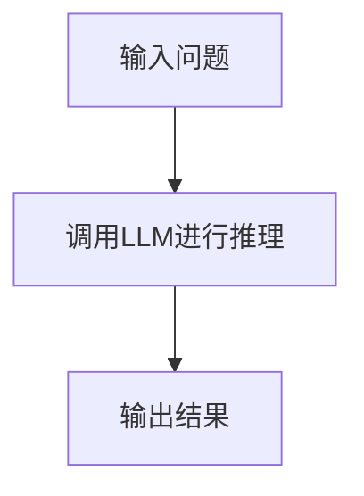

                 


# LLM在AI Agent常识推理中的应用

> 关键词：LLM，AI Agent，常识推理，大语言模型，人工智能

> 摘要：本文探讨了大语言模型（LLM）在AI Agent常识推理中的应用，详细分析了LLM的基本概念、AI Agent的核心功能、常识推理的原理以及LLM在其中的作用。通过数学模型、mermaid流程图和Python代码示例，深入讲解了LLM的训练与微调过程、推理算法、系统架构设计以及实际项目实现，最后总结了最佳实践和未来发展方向。

---

# 第一部分: LLM与AI Agent基础知识

## 第1章: LLM的基本概念

### 1.1 大语言模型的定义与特点
大语言模型（LLM）是一种基于深度学习的自然语言处理模型，通常基于Transformer架构。其特点包括：
- **大规模训练数据**：使用海量文本数据进行预训练，提升模型的泛化能力。
- **上下文理解能力**：能够处理长上下文，理解复杂的语言结构。
- **多任务能力**：通过微调可以适应多种任务，如文本生成、问答系统等。

### 1.2 LLM的核心技术与实现原理
- **预训练**：使用自监督学习方法，如BERT的masked language modeling任务。
- **注意力机制**：通过自注意力机制捕捉文本中的长距离依赖关系。
- **并行计算**：利用并行计算加速模型的训练和推理过程。

### 1.3 LLM的应用领域与发展趋势
- **自然语言处理**：如文本生成、机器翻译、问答系统。
- **人工智能**：通过结合其他技术，如知识图谱，进一步提升推理能力。

## 第2章: AI Agent的基本概念

### 2.1 AI Agent的定义与分类
AI Agent是一种智能体，能够感知环境并采取行动以实现目标。分类包括：
- **简单反射型**：基于规则的简单反应。
- **基于模型的反射型**：利用内部模型进行规划和推理。
- **目标驱动型**：根据目标进行决策和行动。

### 2.2 AI Agent的核心功能与应用场景
- **感知环境**：通过传感器或数据源获取信息。
- **推理与决策**：基于感知信息进行推理，做出决策。
- **执行行动**：通过执行器与环境互动。

### 2.3 LLM在AI Agent中的作用
- **自然语言理解**：帮助AI Agent理解用户输入的自然语言指令。
- **推理与生成**：通过LLM进行常识推理，生成合理的响应或行动计划。

---

# 第二部分: 常识推理的核心概念与联系

## 第3章: 常识推理的基本原理

### 3.1 常识推理的定义与特点
常识推理是指基于常识知识库进行推理，解决日常问题。其特点包括：
- **广泛性**：涉及的知识面广。
- **不确定性**：推理过程涉及概率和模糊性。

### 3.2 LLM在常识推理中的优势
- **大规模知识库**：LLM通过预训练掌握了大量常识知识。
- **上下文理解**：能够处理复杂的上下文关系。

### 3.3 常识推理的数学模型与公式
常识推理可以基于概率论进行建模，常用公式包括：
$$ P(A|B) = \frac{P(B|A)P(A)}{P(B)} $$
其中，$P(A|B)$表示在B条件下A发生的概率。

---

# 第三部分: LLM在常识推理中的算法原理

## 第4章: LLM的训练与微调

### 4.1 LLM的预训练过程
预训练使用自监督学习任务，如：
- **masked language modeling**：随机遮蔽部分单词，预测其原始值。
- **next sentence prediction**：判断两个句子是否是连续的。

### 4.2 LLM的微调技术
微调是将预训练好的模型在特定任务上进行进一步训练。常用方法包括：
- **任务特定微调**：针对常识推理任务，调整模型参数。
- **数据增强**：通过生成更多样化的训练数据，提升模型的泛化能力。

### 4.3 基于LLM的常识推理算法
以下是一个简单的基于LLM的推理算法流程图：



---

# 第四部分: 系统分析与架构设计

## 第5章: AI Agent系统架构设计

### 5.1 系统功能设计
- **输入处理**：接收用户的自然语言指令。
- **推理与决策**：通过LLM进行常识推理，生成行动计划。
- **执行与反馈**：根据决策结果执行操作，并获取反馈。

### 5.2 系统架构图


---

# 第五部分: 项目实战

## 第6章: 实战案例分析

### 6.1 项目环境安装
安装所需的Python库：
```bash
pip install transformers torch
```

### 6.2 核心代码实现
以下是一个简单的基于LLM的推理代码示例：
```python
from transformers import AutoTokenizer, AutoModelForCausalLM

tokenizer = AutoTokenizer.from_pretrained("facebook/bart-large")
model = AutoModelForCausalLM.from_pretrained("facebook/bart-large")

def infer(input_text):
    inputs = tokenizer(input_text, return_tensors="pt")
    outputs = model.generate(inputs.input_ids, max_length=100)
    return tokenizer.decode(outputs[0], skip_special_tokens=True)
```

### 6.3 案例分析
以解决“如何安排会议时间”为例，展示LLM如何通过推理生成合理的行动计划。

---

# 第六部分: 总结与展望

## 6.1 最佳实践
- **数据质量**：确保训练数据的多样性和代表性。
- **模型选择**：根据具体任务选择合适的模型。
- **持续优化**：通过不断迭代优化模型性能。

## 6.2 小结
本文详细探讨了LLM在AI Agent常识推理中的应用，从基本概念到算法原理，再到系统设计和项目实战，为读者提供了全面的视角。

## 6.3 注意事项
- **模型性能**：模型推理速度和资源消耗需要考虑。
- **伦理问题**：确保LLM生成的内容符合伦理规范。

## 6.4 拓展阅读
建议进一步阅读以下内容：
- [《Deep Learning》 - Ian Goodfellow](https://www.deeplearningbook.org/)
- [《Transformer: A Neural Network Model for(Unsupervised) Learning of Contextual Word Representations](https://arxiv.org/abs/1702.01619)

---

通过以上结构，您可以根据需要进一步扩展每个部分的内容，添加更多细节和实例，以完成一篇完整的、详细的博客文章。

