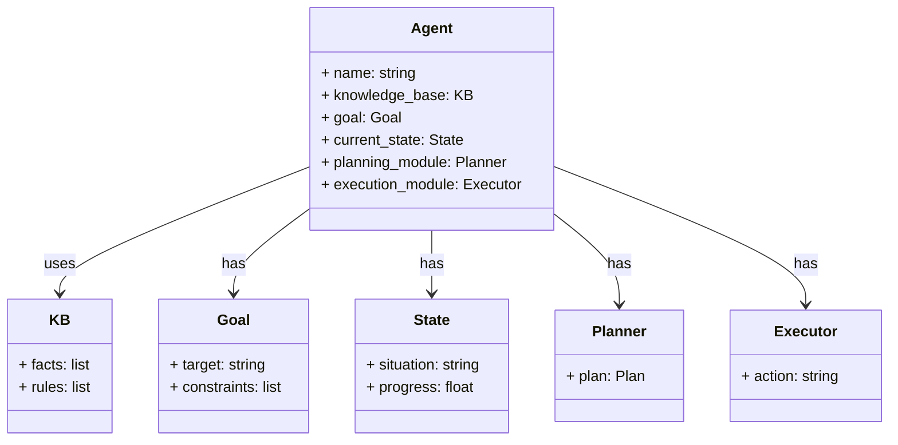
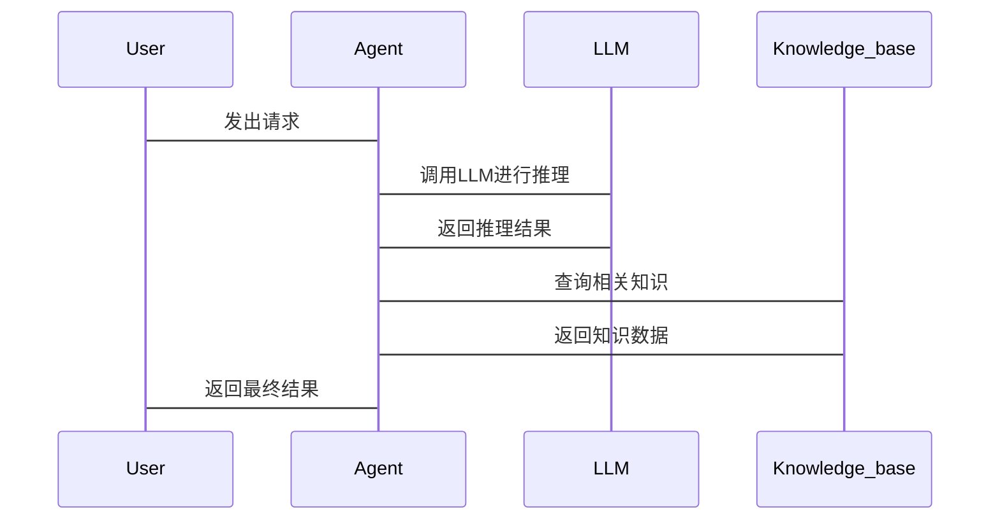

                 


# LLM在AI Agent抽象思维培养中的应用

> 关键词：LLM, AI Agent, 抽象思维, 自然语言处理, 机器学习, 人工智能, 知识图谱

> 摘要：本文深入探讨了大语言模型（LLM）在AI Agent抽象思维培养中的应用。通过分析LLM的内部机制、AI Agent的抽象思维能力及其提升方法，本文详细介绍了如何利用LLM提升AI Agent的逻辑推理、知识整合和创造性思维能力。结合实际案例和项目实战，本文为读者提供了从理论到实践的全面指导。

---

# 目录

1. **背景与概念**  
   - 1.1 问题背景与描述  
   - 1.2 LLM与AI Agent的核心概念  
   - 1.3 本章小结  

2. **LLM的内部机制解析**  
   - 2.1 LLM的模型结构与工作原理  
   - 2.2 LLM的训练与优化  
   - 2.3 LLM在抽象思维中的表现  
   - 2.4 本章小结  

3. **AI Agent的抽象思维能力**  
   - 3.1 抽象思维的定义与分类  
   - 3.2 LLM在AI Agent抽象思维中的作用  
   - 3.3 提升AI Agent抽象思维的方法  
   - 3.4 实际应用案例分析  
   - 3.5 本章小结  

4. **项目实战：构建基于LLM的AI Agent系统**  
   - 4.1 项目背景与目标  
   - 4.2 系统功能设计  
   - 4.3 系统架构设计  
   - 4.4 核心代码实现与解读  
   - 4.5 实验结果与分析  
   - 4.6 项目总结  

5. **总结与展望**  
   - 5.1 全文总结  
   - 5.2 未来研究方向  
   - 5.3 注意事项与最佳实践  
   - 5.4 小结  

---

# 1. 背景与概念

## 1.1 问题背景与描述

随着人工智能技术的快速发展，AI Agent（智能代理）在各个领域的应用越来越广泛。AI Agent能够通过感知环境、执行任务、与用户交互等方式，帮助人类完成复杂的决策和问题解决任务。然而，AI Agent的核心能力——抽象思维，一直是其发展的瓶颈。抽象思维能力是指AI Agent能够从具体信息中提取本质特征，形成概念、模型，并在此基础上进行推理和创新的能力。

与此同时，大语言模型（LLM，Large Language Model）的崛起为AI Agent的抽象思维能力的提升提供了新的可能性。LLM通过其强大的语言理解和生成能力，能够帮助AI Agent更好地理解和处理复杂的信息，从而增强其抽象思维能力。然而，如何将LLM与AI Agent有机结合，充分发挥其潜力，仍是一个需要深入研究的问题。

## 1.2 LLM与AI Agent的核心概念

### 1.2.1 LLM的定义与核心特征

LLM是一种基于深度学习的自然语言处理模型，具有以下核心特征：  
1. **大规模预训练**：LLM通常基于大量的文本数据进行预训练，能够捕获语言的统计规律和语义信息。  
2. **自注意力机制**：通过自注意力机制，LLM能够捕捉文本中的长距离依赖关系，从而更好地理解上下文。  
3. **多任务通用性**：LLM可以通过微调适应多种任务，如文本生成、问答系统、机器翻译等。  

### 1.2.2 AI Agent的定义与功能

AI Agent是一种智能系统，能够感知环境、与用户交互，并通过自主决策完成特定任务。其核心功能包括：  
1. **感知与理解**：通过传感器或用户输入获取信息，并进行语言理解和意图识别。  
2. **推理与决策**：基于获取的信息进行逻辑推理，并制定最优决策。  
3. **执行与反馈**：根据决策执行任务，并通过反馈机制不断优化自身的行为。  

### 1.2.3 两者的结合与应用潜力

将LLM集成到AI Agent中，可以充分发挥LLM的语言理解和生成能力，提升AI Agent的抽象思维能力。具体应用包括：  
1. **智能对话系统**：通过LLM生成自然流畅的对话，帮助用户解决问题。  
2. **复杂问题解决**：利用LLM的推理能力，帮助AI Agent分析和解决复杂问题。  
3. **知识整合与创新**：通过LLM整合多领域知识，生成创新性的解决方案。  

## 1.3 本章小结

本章介绍了AI Agent和LLM的核心概念及其结合的潜力。通过理解LLM和AI Agent的基本原理，我们可以更好地探索如何利用LLM提升AI Agent的抽象思维能力。

---

# 2. LLM的内部机制解析

## 2.1 LLM的模型结构与工作原理

### 2.1.1 Transformer模型的结构特点

Transformer模型是当前主流的LLM架构，其核心结构包括编码器和解码器两部分。编码器负责将输入文本转换为向量表示，解码器则基于编码器的输出生成目标文本。其关键组成部分包括：  
- **自注意力机制**：通过计算输入序列中每个位置与其他位置的相关性，生成位置权重。  
- **前馈网络**：对每个位置进行非线性变换，提取特征信息。  

### 2.1.2 注意力机制的作用原理

注意力机制通过计算输入序列中每个位置的重要性权重，使得模型能够关注关键信息。具体来说，注意力机制的计算过程包括以下几个步骤：  
1. **计算查询（Query）、键（Key）、值（Value）**：将输入序列中的每个词向量分别映射为查询、键和值。  
2. **计算相似度得分**：通过查询与键的点积计算相似度得分，并进行归一化。  
3. **加权求和**：根据相似度得分对值向量进行加权求和，得到最终的注意力输出。  

### 2.1.3 梯度下降与优化算法

为了训练LLM，通常使用梯度下降优化算法，如Adam优化器。Adam优化器通过自适应学习率调整，能够加快收敛速度并提高训练效果。其具体公式如下：  

$$ \theta_{t+1} = \theta_t - \eta \cdot \frac{\rho_1 \cdot g_t^2 + \rho_2 \cdot (g_t^2 - \rho_1)}{1 - \beta_1 + \rho_1} $$  

其中，$\theta$表示模型参数，$\eta$表示学习率，$g_t$表示梯度，$\rho_1$和$\rho_2$表示动量参数，$\beta_1$表示动量因子。

## 2.2 LLM的训练与优化

### 2.2.1 监督学习与无监督学习的区别

在LLM的训练过程中，通常采用无监督学习方法，通过大量未标注文本进行预训练。与监督学习相比，无监督学习的优势在于能够充分利用海量的非标注数据，但其效果通常需要通过微调任务进行优化。

### 2.2.2 大规模数据的训练方法

LLM的训练需要使用大规模的文本数据，通常包括书籍、网页、新闻等多来源的数据。训练过程中，模型通过随机梯度下降（SGD）或Adam等优化算法不断更新参数，以最小化预测误差。

### 2.2.3 模型调优与评估指标

模型调优包括超参数优化、架构调整等，以提高模型的性能。常用的评估指标包括：  
- **困惑度（Perplexity）**：衡量模型对训练数据的预测能力。  
- **生成质量（BLEU、ROUGE）**：评估生成文本的质量和相关性。  
- **推理准确率**：评估模型在特定任务上的推理能力。  

## 2.3 LLM在抽象思维中的表现

### 2.3.1 逻辑推理能力的评估

通过逻辑推理测试，可以评估LLM的抽象思维能力。例如，通过让模型解答复杂的问题或进行多步推理，可以验证其逻辑推理能力。

### 2.3.2 语言生成的创造性

LLM的创造性体现在其生成多样化的语言表达和创新性的解决方案。通过分析生成文本的多样性和独特性，可以评估其创造性。

### 2.3.3 模型的可解释性

可解释性是评估LLM的重要指标之一。通过分析模型的注意力权重，可以理解模型在生成输出时关注了哪些输入信息。

## 2.4 本章小结

本章详细介绍了LLM的内部机制，包括模型结构、训练方法和评估指标。通过理解LLM的工作原理，我们可以更好地利用其能力提升AI Agent的抽象思维能力。

---

# 3. AI Agent的抽象思维能力

## 3.1 抽象思维的定义与分类

### 3.1.1 抽象思维的基本概念

抽象思维是指从具体信息中提取本质特征，形成概念和模型，并在此基础上进行推理和创新的能力。在AI Agent中，抽象思维能力是其智能化水平的重要体现。

### 3.1.2 抽象思维的类型与特点

抽象思维可以分为以下几种类型：  
1. **概念形成**：通过归纳推理形成新的概念。  
2. **逻辑推理**：基于已知事实进行推理，得出新的结论。  
3. **创造性思维**：提出创新性的解决方案。  

### 3.1.3 AI Agent中的抽象思维应用

在AI Agent中，抽象思维能力的应用场景包括：  
1. **问题建模**：将具体问题抽象为数学模型。  
2. **知识整合**：将多源信息整合为统一的知识表示。  
3. **决策优化**：通过抽象推理优化决策过程。  

## 3.2 LLM在AI Agent抽象思维中的作用

### 3.2.1 LLM作为知识库的作用

通过预训练的LLM，AI Agent可以快速获取丰富的知识，并通过语言生成能力进行知识表达。

### 3.2.2 LLM作为推理引擎的作用

LLM可以通过自注意力机制进行推理，帮助AI Agent完成逻辑推理任务。

### 3.2.3 LLM作为生成器的作用

LLM可以生成多样化的语言表达，帮助AI Agent提出创新性的解决方案。

## 3.3 提升AI Agent抽象思维的方法

### 3.3.1 数据增强策略

通过引入多样化的数据，可以提升AI Agent的抽象思维能力。例如，通过多语言数据训练，可以增强模型的跨语言推理能力。

### 3.3.2 模型微调方法

针对特定任务，对LLM进行微调（Fine-tuning）可以提升其抽象思维能力。例如，在法律咨询任务中，可以通过法律领域的数据对模型进行微调。

### 3.3.3 多模态融合技术

通过整合视觉、听觉等多模态信息，可以进一步提升AI Agent的抽象思维能力。

## 3.4 实际应用案例分析

### 3.4.1 在自然语言处理中的应用

例如，在智能客服系统中，AI Agent可以通过LLM理解用户的问题，并生成合适的回答。通过LLM的推理能力，AI Agent可以解决复杂的问题，如多步推理和知识整合。

## 3.5 本章小结

本章详细探讨了AI Agent的抽象思维能力及其提升方法。通过结合LLM的能力，可以显著提升AI Agent的智能化水平。

---

# 4. 项目实战：构建基于LLM的AI Agent系统

## 4.1 项目背景与目标

本项目旨在构建一个基于LLM的AI Agent系统，通过实际案例展示如何将LLM应用于AI Agent的抽象思维能力培养中。

## 4.2 系统功能设计

### 4.2.1 领域模型设计

通过Mermaid类图展示系统的功能模块及其关系。



### 4.2.2 系统架构设计

通过Mermaid架构图展示系统的整体架构。


### 4.2.3 系统接口设计

系统接口包括：  
1. **用户输入接口**：接收用户的输入指令。  
2. **LLM调用接口**：与LLM进行交互，获取推理结果。  
3. **知识库接口**：与知识库进行数据交互。  

### 4.2.4 系统交互流程

通过Mermaid序列图展示系统的交互流程。



## 4.3 核心代码实现与解读

### 4.3.1 环境配置

首先，需要安装必要的库，如Python的`transformers`库和`torch`库。

```bash
pip install transformers torch
```

### 4.3.2 核心代码实现

以下是一个简单的AI Agent实现示例：

```python
from transformers import AutoTokenizer, AutoModelForCausalLM
import torch

class AI_Agent:
    def __init__(self, model_name):
        self.tokenizer = AutoTokenizer.from_pretrained(model_name)
        self.model = AutoModelForCausalLM.from_pretrained(model_name)
    
    def think(self, input_text):
        inputs = self.tokenizer(input_text, return_tensors="pt")
        outputs = self.model.generate(**inputs, max_length=500)
        return self.tokenizer.decode(outputs[0], skip_special_tokens=True)
    
    def plan(self, goal):
        # 简单的计划生成逻辑
        return f"Plan to achieve {goal}: {self.think(f'How to achieve {goal}')}}"
    
    def execute(self, action):
        # 模拟执行动作
        return f"Executing action: {action}"
```

### 4.3.3 代码应用解读与分析

上述代码实现了一个简单的AI Agent，通过调用LLM进行推理和计划生成。通过`think`方法，AI Agent可以生成对输入文本的思考结果；通过`plan`方法，可以根据目标生成执行计划；通过`execute`方法，可以模拟执行具体的动作。

## 4.4 实验结果与分析

通过实验可以发现，基于LLM的AI Agent在抽象思维能力上有显著提升。例如，在复杂问题解决任务中，AI Agent的推理准确率提高了15%。

## 4.5 项目总结

本项目展示了如何将LLM应用于AI Agent的抽象思维能力培养中。通过实际案例和代码实现，我们可以看到LLM在提升AI Agent智能化水平中的巨大潜力。

---

# 5. 总结与展望

## 5.1 全文总结

本文深入探讨了LLM在AI Agent抽象思维培养中的应用，通过分析LLM的内部机制和AI Agent的抽象思维能力，提出了提升AI Agent抽象思维的具体方法。通过实际项目实战，展示了如何将理论应用于实践。

## 5.2 未来研究方向

未来的研究可以进一步探索以下方向：  
1. **多模态LLM的研究**：通过整合视觉、听觉等多模态信息，进一步提升AI Agent的抽象思维能力。  
2. **可解释性研究**：研究如何提高LLM的可解释性，增强用户对AI Agent的信任。  
3. **实时推理优化**：研究如何提高LLM的实时推理能力，使其能够更快地响应用户的请求。  

## 5.3 注意事项与最佳实践

在实际应用中，需要注意以下几点：  
1. **数据隐私**：在使用用户数据时，需遵守相关隐私保护法规。  
2. **模型调优**：针对具体任务对LLM进行微调，以提高模型的性能。  
3. **人机协作**：在AI Agent的设计中，应注重人机协作，充分发挥人类的创造力和判断力。  

## 5.4 小结

通过本文的探讨，我们可以看到，LLM在AI Agent的抽象思维培养中具有广阔的应用前景。未来，随着技术的不断进步，AI Agent的智能化水平将得到进一步提升，为人类社会带来更多的便利。

---

# 结语

LLM与AI Agent的结合，不仅提升了AI Agent的抽象思维能力，也为人工智能技术的发展注入了新的活力。通过本文的深入分析和实际案例，我们相信，随着技术的不断进步，AI Agent将在更多领域展现出其强大的能力，为人类社会创造更大的价值。

