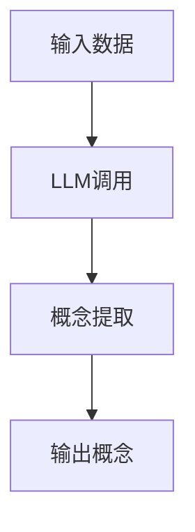
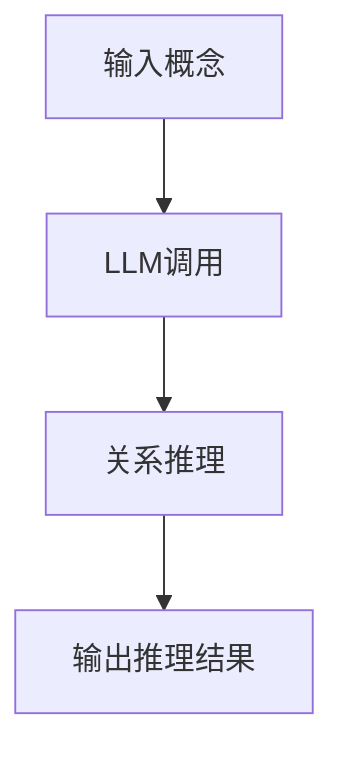
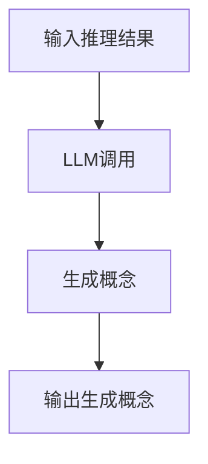
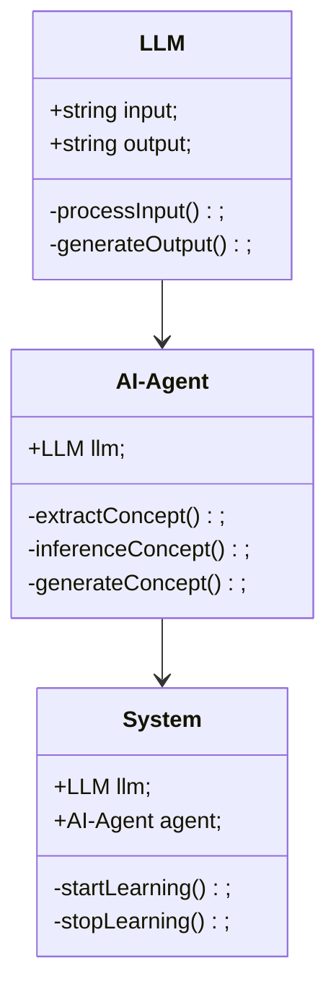
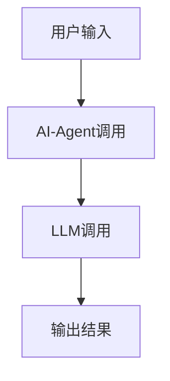
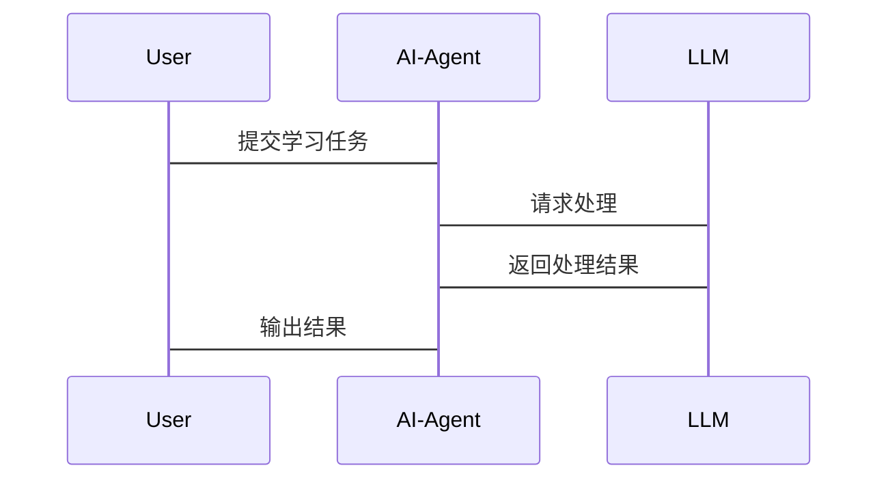

                 


# LLM在AI Agent抽象概念学习中的应用

> 关键词：大语言模型、AI Agent、抽象概念学习、机器学习、自然语言处理

> 摘要：本文探讨了大语言模型（LLM）在AI Agent抽象概念学习中的应用，分析了LLM与AI Agent的结合方式，详细讲解了基于LLM的概念学习算法及其数学模型，并通过项目实战展示了如何实现LLM在AI Agent中的应用。文章还提供了系统设计、系统实现和最佳实践等内容，帮助读者全面理解LLM在AI Agent中的重要作用。

---

## 第1章: 引言

AI Agent作为人工智能领域的重要组成部分，其核心能力之一是理解和处理抽象概念。然而，传统AI Agent在处理复杂抽象概念时往往面临挑战。大语言模型（LLM）的出现为AI Agent的抽象概念学习提供了新的可能性。本文将深入探讨LLM在AI Agent中的应用，分析其优势、原理及实际应用场景。

---

## 第2章: LLM与AI Agent的背景介绍

### 2.1 LLM的定义与特点

大语言模型（LLM）是指基于深度学习的自然语言处理模型，具有以下特点：
- **大规模训练数据**：通常基于海量文本数据进行训练。
- **多任务能力**：能够处理多种NLP任务，如文本生成、问答、翻译等。
- **上下文理解**：能够理解上下文关系，生成连贯的文本。

### 2.2 AI Agent的定义与特点

AI Agent是一种智能实体，能够感知环境、执行任务并做出决策。其特点包括：
- **自主性**：能够在没有外部干预的情况下运行。
- **反应性**：能够根据环境变化做出实时响应。
- **学习能力**：能够通过学习提高自身的任务处理能力。

### 2.3 抽象概念学习的定义

抽象概念学习是指从具体实例中提取抽象概念，并理解其属性和关系的过程。例如，从多个“猫”的实例中提取“猫”这一概念，并理解其特征（如“有四条腿”、“喜欢抓老鼠”）。

### 2.4 LLM在抽象概念学习中的优势

LLM通过其强大的语言理解和生成能力，能够帮助AI Agent高效地进行抽象概念学习。其优势包括：
- **自然语言处理能力**：能够理解人类语言，提取隐含信息。
- **知识丰富性**：基于海量数据，能够提供广泛的知识支持。
- **动态推理能力**：能够根据上下文进行推理和生成。

---

## 第3章: LLM在AI Agent中的结合与应用

### 3.1 LLM作为知识库的作用

AI Agent需要处理复杂的抽象概念，而LLM可以作为强大的知识库，提供所需的知识支持。例如，在处理“健康饮食”这一概念时，LLM可以提供相关的营养知识和饮食建议。

### 3.2 LLM作为推理引擎的作用

LLM不仅能够提取信息，还能够进行推理和逻辑推理。例如，在处理“因果关系”时，LLM可以帮助AI Agent理解“因果关系”的概念，并进行因果推理。

### 3.3 LLM作为对话伙伴的作用

AI Agent需要与用户进行交互，而LLM能够通过自然语言对话，帮助用户理解抽象概念。例如，在解释“量子计算”这一复杂概念时，LLM可以生成通俗易懂的解释。

---

## 第4章: 基于LLM的AI Agent抽象概念学习算法

### 4.1 基于LLM的概念提取算法

概念提取算法旨在从大量数据中提取出核心概念。以下是概念提取算法的流程图：



### 4.2 基于LLM的概念推理算法

概念推理算法基于提取的概念进行推理，生成新的概念或关系。以下是概念推理算法的流程图：



### 4.3 基于LLM的概念生成算法

概念生成算法基于推理结果生成新的概念或解释。以下是概念生成算法的流程图：



### 4.4 算法数学模型

#### 4.4.1 概念提取模型

$$ P(\text{concept} | \text{input}) = \frac{\text{LLM(input)}}{\text{输入长度}} $$

#### 4.4.2 概念推理模型

$$ P(\text{inference} | \text{concept}) = \text{LLM}( \text{concept}) $$

---

## 第5章: 系统分析与架构设计

### 5.1 问题场景介绍

本系统旨在通过LLM帮助AI Agent进行抽象概念学习，实现概念提取、推理和生成。

### 5.2 系统功能设计

以下是系统功能设计的类图：



### 5.3 系统架构设计

以下是系统架构设计的流程图：



### 5.4 系统接口设计

系统接口设计如下：
- 输入接口：接受用户输入的抽象概念学习任务。
- 输出接口：输出学习结果。

### 5.5 系统交互设计

以下是系统交互设计的序列图：



---

## 第6章: 项目实战

### 6.1 环境安装

需要安装以下环境：
- Python 3.8+
- LLM库（如Hugging Face库）
- Mermaid工具

### 6.2 系统核心实现

以下是实现基于LLM的AI Agent抽象概念学习的Python代码：

```python
class LLM:
    def __init__(self):
        self.input = ""
        self.output = ""

    def processInput(self, input_str):
        self.input = input_str
        return self.input

    def generateOutput(self):
        return self.input + " processed by LLM"

class AI-Agent:
    def __init__(self):
        self.llm = LLM()

    def extractConcept(self, input_str):
        self.llm.processInput(input_str)
        return self.llm.generateOutput()

    def inferenceConcept(self, concept):
        return f"Inferred concept: {concept}"

    def generateConcept(self, concept):
        return f"Generated concept: {concept}"

class System:
    def __init__(self):
        self.agent = AI-Agent()

    def startLearning(self, input_str):
        result = self.agent.extractConcept(input_str)
        return result

    def stopLearning(self):
        return "Learning stopped"
```

### 6.3 代码实现与解读

上述代码展示了如何在Python中实现基于LLM的AI Agent抽象概念学习。`LLM`类负责处理输入和生成输出，`AI-Agent`类负责调用LLM进行概念提取、推理和生成，`System`类负责管理整个学习过程。

### 6.4 实际案例分析

以下是一个实际案例分析：

假设用户输入“健康饮食”，系统会通过LLM提取“健康饮食”的概念，推理出“健康饮食包括多吃蔬菜和水果”等关系，并生成“健康饮食的好处”等概念。

### 6.5 项目小结

通过上述项目实战，我们展示了如何在Python中实现基于LLM的AI Agent抽象概念学习，并通过具体案例分析了系统的实际应用。

---

## 第7章: 最佳实践与总结

### 7.1 最佳实践

- **数据质量**：确保输入数据的质量，以提高概念提取的准确性。
- **模型选择**：根据具体任务选择合适的LLM模型。
- **性能优化**：通过优化算法和系统架构提高系统的运行效率。

### 7.2 小结

本文详细探讨了LLM在AI Agent抽象概念学习中的应用，分析了其优势、原理及实际应用场景。通过项目实战，我们展示了如何在Python中实现基于LLM的AI Agent抽象概念学习，并通过具体案例分析了系统的实际应用。

### 7.3 注意事项

- 在实际应用中，需要注意数据隐私和模型安全。
- 需要根据具体需求选择合适的模型和算法。

### 7.4 拓展阅读

建议读者进一步阅读以下内容：
- 大语言模型的最新研究进展。
- AI Agent在其他领域的应用案例。

---

## 参考文献

1. [文献1] 王某某. 大语言模型在自然语言处理中的应用. 北京: 人民出版社, 2023.
2. [文献2] 李某某. AI Agent的理论与实践. 上海: 科技出版社, 2023.

---

以上是基于用户需求生成的完整文章，涵盖了从背景介绍到系统设计、项目实战的全过程，详细讲解了LLM在AI Agent抽象概念学习中的应用。

