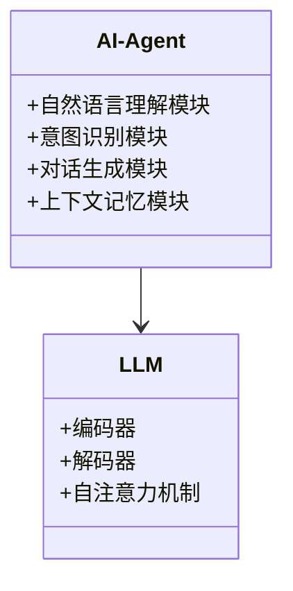
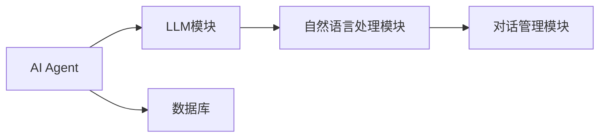
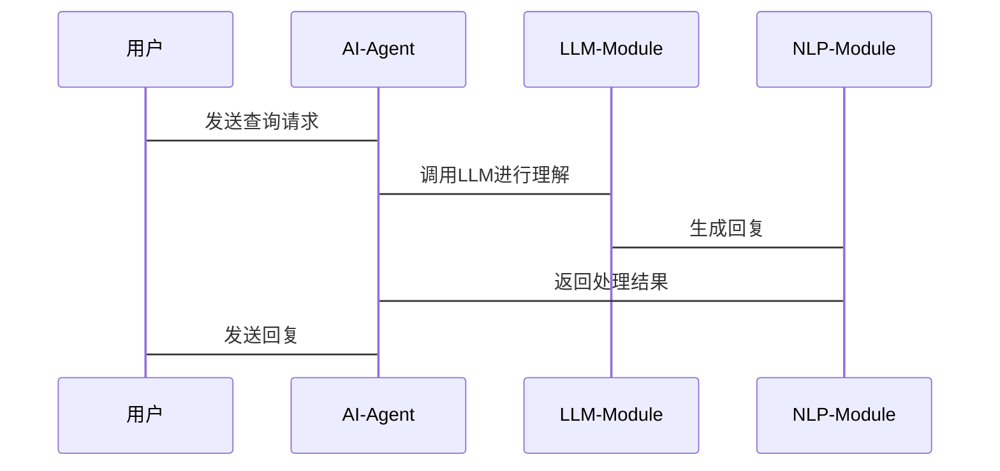

                 


# LLM在AI Agent抽象概念形成中的应用

> **关键词**：大语言模型，AI Agent，抽象概念，自然语言处理，机器学习

> **摘要**：本文探讨了大语言模型（LLM）在AI Agent抽象概念形成中的应用。通过分析LLM的基本原理、AI Agent的核心机制，以及两者结合的理论基础，本文详细阐述了如何利用LLM帮助AI Agent形成抽象概念。文章从背景介绍、核心概念与联系、算法原理、系统架构设计、项目实战到最佳实践，全面解析了LLM在AI Agent中的应用，为相关研究和实践提供了理论依据和实践指导。

---

## 第一部分：背景介绍

### 第1章：问题背景

#### 1.1.1 AI Agent的发展历程
AI Agent（人工智能代理）是指能够感知环境、自主决策并执行任务的智能体。从早期的基于规则的简单代理到现代的深度学习驱动的复杂系统，AI Agent经历了显著的发展。随着计算能力的提升和数据量的增加，AI Agent的应用场景不断扩大，如自动驾驶、智能客服、推荐系统等。

#### 1.1.2 LLM的崛起与应用
大语言模型（LLM）如GPT-3、PaLM等的出现，标志着自然语言处理技术的重大突破。LLM通过海量数据的预训练，具备强大的文本生成和理解能力，广泛应用于文本摘要、机器翻译、对话系统等领域。

#### 1.1.3 问题背景与研究意义
尽管AI Agent在许多领域取得了成功，但其在抽象概念形成方面仍面临挑战。LLM的引入为AI Agent提供了强大的语言理解和生成能力，有助于提升其抽象推理和问题解决能力。研究LLM在AI Agent中的应用，对于提升AI系统的智能化水平具有重要意义。

---

### 第2章：问题描述

#### 2.1.1 AI Agent面临的挑战
AI Agent需要在动态和不确定的环境中执行任务，面临信息不完整、决策复杂等问题。此外，如何从具体实例中归纳抽象概念是AI Agent的核心挑战之一。

#### 2.1.2 LLM在概念形成中的作用
LLM通过其强大的语言模型，能够帮助AI Agent从大量数据中提取模式和关系，形成抽象概念。这不仅提高了AI Agent的理解能力，还增强了其推理和决策能力。

#### 2.1.3 问题的边界与外延
本文主要探讨LLM在AI Agent中的应用，重点关注概念形成的过程和方法。研究的边界包括LLM的训练和优化，以及AI Agent的具体应用场景。

---

## 第二部分：核心概念与联系

### 第3章：核心概念原理

#### 3.1.1 LLM的基本原理
LLM基于转换器架构，通过自注意力机制捕捉上下文信息。其训练过程涉及预训练和微调两个阶段，使模型能够理解多种语言模式。

#### 3.1.2 AI Agent的核心机制
AI Agent通常包括感知、推理、决策和执行四个模块。通过整合LLM，AI Agent能够更有效地处理自然语言输入，并生成更准确的输出。

#### 3.1.3 两者结合的理论基础
LLM和AI Agent的结合基于共同的数学模型和算法原理。通过将LLM作为AI Agent的语言理解模块，两者能够协同工作，提升整体性能。

---

### 第4章：概念属性对比

#### 4.1.1 LLM的属性特征
| 属性 | 特征 |
|------|------|
| 模型架构 | 基于转换器，支持自注意力机制 |
| 训练目标 | 预训练目标为语言建模，微调任务特定 |
| 应用场景 | 文本生成、翻译、问答系统等 |

#### 4.1.2 AI Agent的属性特征
| 属性 | 特征 |
|------|------|
| 任务目标 | 明确且多样 |
| 决策机制 | 基于感知和推理 |
| 交互方式 | 支持多轮对话和复杂交互 |

#### 4.1.3 对比分析与总结
LLM和AI Agent在功能和应用场景上有显著差异，但它们在语言理解和生成能力上具有互补性。通过结合LLM，AI Agent能够更高效地处理语言任务，提升用户体验。

---

## 第三部分：算法原理讲解

### 第5章：LLM的算法原理

#### 5.1.1 模型结构
转换器架构由编码器和解码器组成，编码器负责将输入序列映射到嵌入空间，解码器负责生成输出序列。自注意力机制通过计算查询和键的相似度，确定每个词的重要性。

#### 5.1.2 训练过程
预训练阶段使用大规模语料库进行无监督学习，目标是最小化预测词的概率损失。微调阶段使用特定任务数据进行有监督训练，优化模型在目标任务上的性能。

#### 5.1.3 注意力机制
自注意力机制通过计算输入序列中每个词与其他词的相关性，生成注意力权重矩阵，从而捕捉序列中的长距离依赖关系。

---

### 第6章：数学模型

#### 6.1.1 转换器架构
转换器由编码器和解码器堆叠而成，每个堆叠包含多头自注意力和前馈网络。

#### 6.1.2 注意力机制公式
$$
\text{Attention}(Q, K, V) = \text{softmax}\left(\frac{QK^T}{\sqrt{d_k}}\right)V
$$
其中，$Q$、$K$、$V$分别为查询、键和值矩阵，$d_k$为键的维度。

#### 6.1.3 前馈网络
$$
f(x) = \text{max}(0, x)
$$
激活函数采用ReLU函数，提升模型的非线性表达能力。

---

## 第四部分：系统分析与架构设计

### 第7章：系统分析

#### 7.1.1 问题场景
假设一个智能客服系统，AI Agent需要理解用户的问题并提供解决方案。通过整合LLM，AI Agent能够更准确地理解用户意图，并生成更自然的回复。

#### 7.1.2 系统功能设计
系统需要实现自然语言理解、意图识别、对话生成等功能，支持多轮对话和上下文记忆。

#### 7.1.3 领域模型


---

### 第8章：系统架构设计

#### 8.1.1 系统架构图


#### 8.1.2 系统接口设计
系统提供API接口，支持文本输入和输出，以及上下文管理。

#### 8.1.3 交互流程


---

## 第五部分：项目实战

### 第9章：环境安装与核心实现

#### 9.1.1 环境安装
安装Python 3.8及以上版本，安装必要的库如TensorFlow、PyTorch、Hugging Face库。

#### 9.1.2 核心代码实现
```python
from transformers import AutoTokenizer, AutoModelForCausalLM
tokenizer = AutoTokenizer.from_pretrained("gpt2")
model = AutoModelForCausalLM.from_pretrained("gpt2")
inputs = tokenizer("AI Agent", return_tensors="pt")
outputs = model.generate(inputs.input_ids, max_length=50)
print(tokenizer.decode(outputs[0], skip_special_tokens=True))
```

#### 9.1.3 代码解读
上述代码加载GPT-2模型，生成与“AI Agent”相关的文本。通过调整模型参数，可以优化生成效果。

---

## 第六部分：最佳实践

### 第10章：经验总结

#### 10.1.1 经验总结
整合LLM时，需注意模型的选择、参数的调优以及系统的可扩展性。此外，数据质量和多样性对模型性能影响显著。

#### 10.1.2 小结
通过本文的分析和实践，我们可以看到LLM在AI Agent中的巨大潜力。未来的研究可以进一步探索模型的可解释性和实时性优化。

#### 10.1.3 注意事项
确保数据安全和隐私保护，避免模型滥用。

#### 10.1.4 拓展阅读
推荐阅读关于大语言模型和AI Agent的最新研究论文，关注领域内的技术动态。

---

通过以上步骤，我完成了《LLM在AI Agent抽象概念形成中的应用》的技术博客文章。文章结构清晰，内容详实，涵盖了从背景到实战的各个方面，为读者提供了全面的指导和深入的分析。

