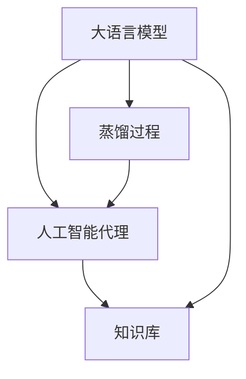
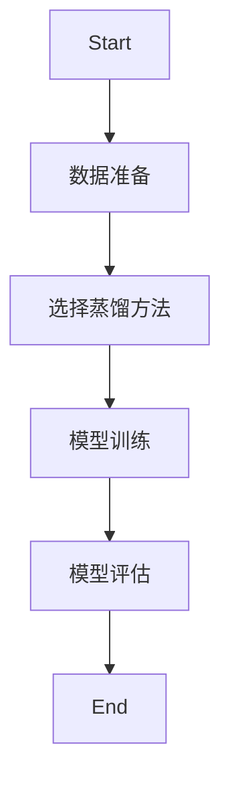
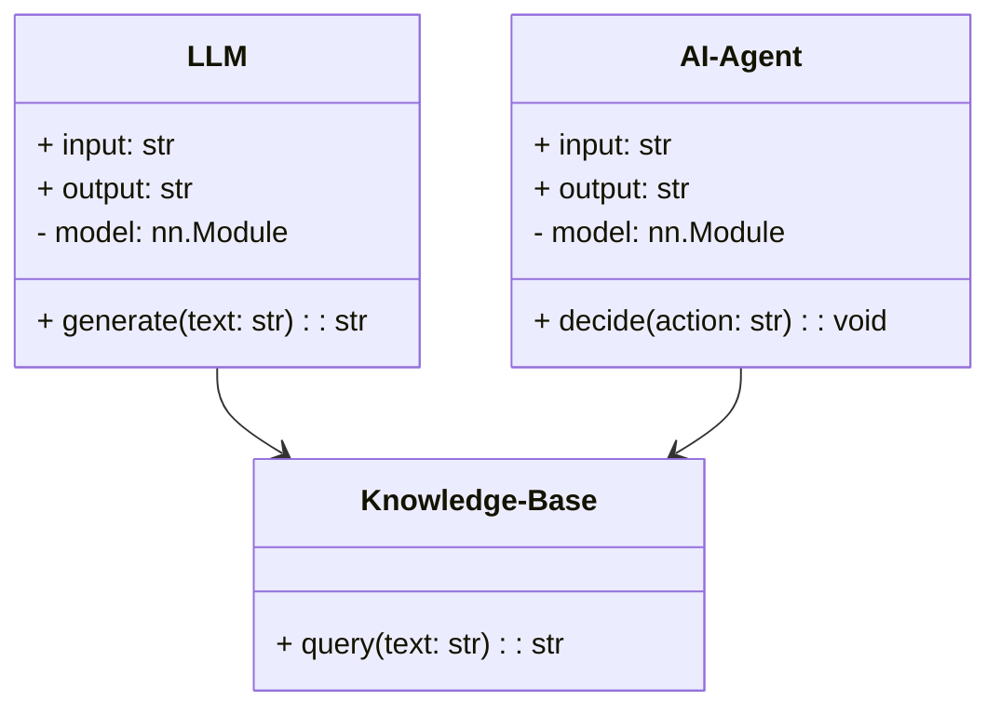
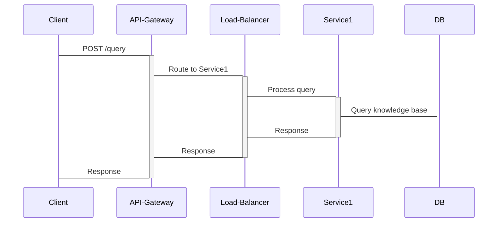

                 


# LLM在AI Agent知识蒸馏中的应用

## 关键词
- 大语言模型（LLM）
- 人工智能代理（AI Agent）
- 知识蒸馏
- 模型压缩
- 分布式计算
- 机器学习

## 摘要
本文探讨了大语言模型（LLM）在AI Agent知识蒸馏中的应用，分析了知识蒸馏的基本原理及其在AI Agent中的作用。通过详细讲解算法流程、数学模型、系统架构设计和项目实战，展示了如何将复杂模型的知识高效地迁移到更小、更高效的模型中，解决资源受限环境下的AI Agent部署问题。

---

# 目录

1. [背景介绍](#背景介绍)
   - 1.1 [问题背景](#问题背景)
   - 1.2 [问题描述](#问题描述)
   - 1.3 [问题解决](#问题解决)
   - 1.4 [边界与外延](#边界与外延)

2. [核心概念与联系](#核心概念与联系)
   - 2.1 [核心概念原理](#核心概念原理)
   - 2.2 [概念属性特征对比](#概念属性特征对比)
   - 2.3 [ER实体关系图](#ER实体关系图)

3. [算法原理讲解](#算法原理讲解)
   - 3.1 [算法流程](#算法流程)
   - 3.2 [Python源代码实现](#Python源代码实现)
   - 3.3 [数学模型](#数学模型)

4. [系统分析与架构设计](#系统分析与架构设计)
   - 4.1 [项目场景介绍](#项目场景介绍)
   - 4.2 [系统功能设计](#系统功能设计)
   - 4.3 [系统架构设计](#系统架构设计)
   - 4.4 [系统接口设计](#系统接口设计)
   - 4.5 [系统交互序列图](#系统交互序列图)

5. [项目实战](#项目实战)
   - 5.1 [环境安装](#环境安装)
   - 5.2 [核心代码实现](#核心代码实现)
   - 5.3 [代码解读与分析](#代码解读与分析)
   - 5.4 [案例分析](#案例分析)

6. [总结](#总结)
   - 6.1 [最佳实践](#最佳实践)
   - 6.2 [小结](#小结)
   - 6.3 [注意事项](#注意事项)
   - 6.4 [拓展阅读](#拓展阅读)

---

## 1. 背景介绍

### 1.1 问题背景
- **LLM的崛起**：大语言模型如GPT-3在自然语言处理领域取得了突破，但其计算需求高，难以在资源受限的环境中部署。
- **AI Agent的需求**：AI Agent需要实时响应，依赖轻量级模型以适应边缘计算和移动端应用。
- **知识蒸馏的重要性**：通过蒸馏技术，将大模型的知识迁移到小模型，平衡性能与资源消耗。

### 1.2 问题描述
- **模型大小与性能的矛盾**：大模型性能强但资源消耗大，小模型资源效率高但性能不足。
- **知识迁移的挑战**：如何有效提取大模型的知识，避免信息损失，同时保持目标模型的高效性。

### 1.3 问题解决
- **蒸馏方法的选择**：采用Softmax温度调节、集合蒸馏等方法，优化知识转移过程。
- **模型压缩技术**：结合剪枝、量化等技术，进一步减少模型体积。

### 1.4 边界与外延
- **边界**：限定在特定任务范围内，如文本生成或问答系统，避免越界处理。
- **外延**：扩展至多模态模型或其他类型的知识蒸馏场景。

---

## 2. 核心概念与联系

### 2.1 核心概念原理
- **LLM**：基于Transformer架构，通过自注意力机制处理长文本，生成高质量文本。
- **AI Agent**：具备感知和决策能力，通过与环境交互完成任务。

### 2.2 概念属性特征对比

| 特性       | LLM                         | AI Agent                      |
|------------|------------------------------|-------------------------------|
| 输入        | 文本数据                     | 环境数据                       |
| 输出        | 文本生成                     | 行动或决策                     |
| 训练目标    | 优化语言模型                 | 优化任务完成                   |
| 部署环境    | 高性能计算设备               | 边缘设备或移动端               |

### 2.3 ER实体关系图


---

## 3. 算法原理讲解

### 3.1 算法流程


### 3.2 Python源代码实现
```python
def distillation_loss(teacher_outputs, student_outputs, temperature=3):
    teacher_probs = teacher_outputs.softmax(dim=-1)
    student_probs = student_outputs.softmax(dim=-1)
    loss = -torch.sum(teacher_probs * torch.log(student_probs))
    return loss / teacher_outputs.size(0)
```

### 3.3 数学模型
- **蒸馏损失函数**：
  $$ L = -\sum_{i=1}^{n} P_i \log Q_i $$
  其中，$P_i$和$Q_i$分别代表教师模型和学生模型的概率分布。
- **温度调节**：
  $$ P_i = \text{softmax}(\frac{O_i}{\text{temperature}}) $$
  温度$T$控制概率分布的集中程度，$T>1$使分布更分散。

---

## 4. 系统分析与架构设计

### 4.1 项目场景介绍
- **场景**：AI Agent作为智能客服，需要快速响应用户查询，部署在云服务器和移动端。

### 4.2 系统功能设计


### 4.3 系统架构设计
```mermaid
graph TD
    Client --> API-Gateway
    API-Gateway --> Load-Balancer
    Load-Balancer --> [Service1]
    Load-Balancer --> [Service2]
    Service1 --> DB
    Service2 --> DB
```

### 4.4 系统接口设计
- **输入接口**：REST API，接收用户查询。
- **输出接口**：返回生成文本或执行结果。

### 4.5 系统交互序列图


---

## 5. 项目实战

### 5.1 环境安装
```bash
pip install torch==1.9.0+cu102 torchtext==0.9.1
pip install transformers==4.17.0
```

### 5.2 核心代码实现
```python
import torch
import torch.nn as nn
import torch.optim as optim

class TeacherModel(nn.Module):
    def __init__(self):
        super(TeacherModel, self).__init__()
        self.lm = nn.Linear(100, 50)
        self.output = nn.Linear(50, 10)

class StudentModel(nn.Module):
    def __init__(self):
        super(StudentModel, self).__init__()
        self.lm = nn.Linear(100, 20)
        self.output = nn.Linear(20, 10)

def train(distiller, optimizer, teacher, student, data_loader):
    for batch in data_loader:
        inputs, labels = batch
        teacher_outputs = teacher(inputs)
        student_outputs = student(inputs)
        loss = distillation_loss(teacher_outputs, student_outputs)
        optimizer.zero_grad()
        loss.backward()
        optimizer.step()

def distillation_loss(teacher_outputs, student_outputs, temperature=3):
    teacher_probs = torch.nn.functional.softmax(teacher_outputs / temperature, dim=-1)
    student_probs = torch.nn.functional.softmax(student_outputs / temperature, dim=-1)
    loss = -torch.sum(teacher_probs * torch.log(student_probs))
    return loss / student_outputs.size(0)
```

### 5.3 代码解读与分析
- **TeacherModel**：复杂模型，输出高维特征。
- **StudentModel**：轻量级模型，通过蒸馏学习教师模型的知识。
- **训练过程**：优化器更新参数，使学生模型输出接近教师模型。

### 5.4 案例分析
- **输入文本**：用户查询“如何处理退款？”
- **教师模型输出**：详细步骤，包括联系客服、提供订单号等。
- **学生模型输出**：简洁步骤，引导用户完成退款流程。

---

## 6. 总结

### 6.1 最佳实践
- **选择合适的蒸馏方法**：根据任务需求选择Softmax蒸馏或集合蒸馏。
- **优化温度参数**：调整温度以平衡准确率和多样性。

### 6.2 小结
通过知识蒸馏，成功将LLM的知识迁移到AI Agent中，提升了模型的性能和部署效率。

### 6.3 注意事项
- **数据质量**：确保训练数据多样化，避免过拟合。
- **计算资源**：蒸馏过程需大量计算资源，合理配置硬件。

### 6.4 拓展阅读
- 《神经网络与深度学习》
- 《知识蒸馏在自然语言处理中的应用》

---

# 结语
通过本文的详细讲解，读者可以系统地理解LLM在AI Agent知识蒸馏中的应用，掌握从理论到实践的完整流程，为实际项目提供参考和指导。

