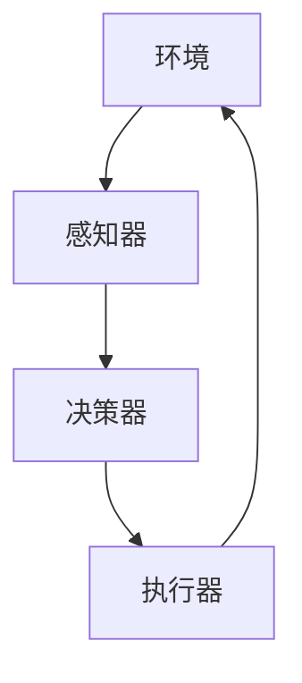
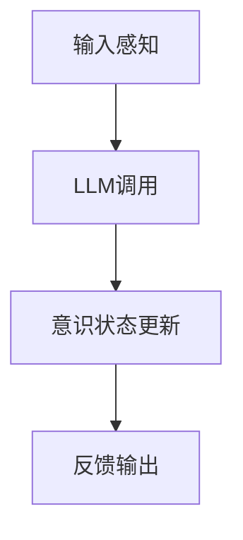
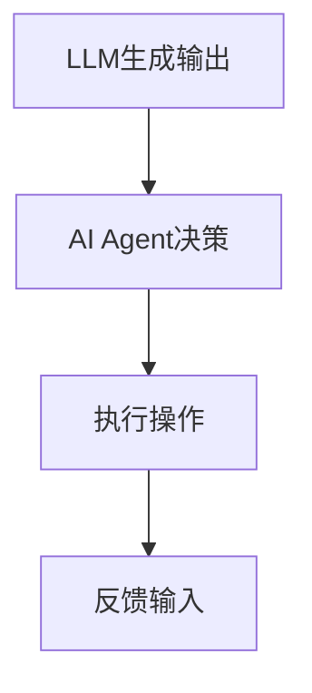
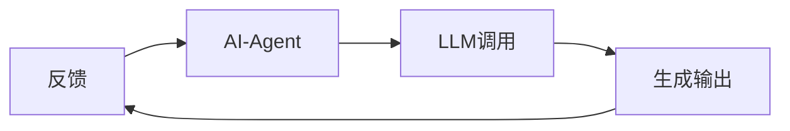

                 

<think>
好的，我将按照您的要求撰写一篇关于《LLM在AI Agent自我意识模拟中的应用》的长篇技术博客文章。为了确保内容符合您的要求，我将先列出文章的目录结构，然后逐步展开每个部分的内容。

---

# LLM在AI Agent自我意识模拟中的应用

> 关键词：大语言模型、AI Agent、自我意识模拟、机器学习、人机交互

> 摘要：本文探讨了如何利用大语言模型（LLM）实现AI Agent的自我意识模拟，从理论基础到实际应用，详细分析了LLM在AI Agent中的角色与功能，揭示了其在自我意识模拟中的核心算法与实现机制，并通过实际案例展示了其应用价值。

---

## 目录

1. 引言  
2. LLM与AI Agent的背景与基础  
   2.1 大语言模型的基本概念与技术背景  
   2.2 AI Agent的基本概念与分类  
   2.3 自我意识模拟的核心概念与挑战  
3. LLM与AI Agent的核心概念与联系  
   3.1 LLM与自我意识模拟的关系  
   3.2 AI Agent通过LLM实现自我认知的机制  
   3.3 LLM与AI Agent的协同工作模式  
4. LLM在AI Agent自我意识模拟中的算法原理  
   4.1 LLM的核心算法与数学模型  
   4.2 自我意识模拟的算法实现与优化  
   4.3 LLM与AI Agent的协同算法设计  
5. 系统分析与架构设计方案  
   5.1 系统功能需求分析  
   5.2 系统功能设计与实现  
   5.3 系统架构设计与优化  
6. 项目实战：基于LLM的AI Agent自我意识模拟实现  
   6.1 项目背景与目标  
   6.2 项目环境与工具安装  
   6.3 核心代码实现与解读  
   6.4 实际案例分析与效果展示  
7. 总结与展望  
   7.1 本文总结  
   7.2 未来研究方向与潜在应用  
8. 最佳实践与注意事项  
   8.1 开发中的关键经验与教训  
   8.2 读者的建议与下一步行动  

---

## 1. 引言

随着人工智能技术的飞速发展，AI Agent（智能体）在各个领域的应用越来越广泛。然而，如何让AI Agent具备“自我意识”仍然是一个尚未完全解决的技术难题。近年来，大语言模型（LLM）的崛起为这一问题提供了一个新的解决方案。本文将详细探讨如何利用LLM实现AI Agent的自我意识模拟，揭示其背后的原理、算法与实现方法。

---

## 2. LLM与AI Agent的背景与基础

### 2.1 大语言模型的基本概念与技术背景

大语言模型（LLM）是指基于深度学习技术构建的大型语言模型，如GPT系列、BERT系列等。这些模型通过海量数据的训练，能够理解并生成自然语言文本。LLM的核心优势在于其强大的上下文理解和生成能力，这使其在自然语言处理（NLP）领域取得了突破性进展。

**数学公式示例：**  
LLM的训练目标是最小化预测错误，损失函数通常采用交叉熵损失：

$$ L = -\sum_{i=1}^{n} \log P(y_i | y_{<i}, x) $$

其中，$y_i$表示生成的词，$x$表示输入序列。

### 2.2 AI Agent的基本概念与分类

AI Agent是指在计算机系统中，能够感知环境、自主决策并执行任务的智能实体。根据功能和应用场景的不同，AI Agent可以分为多种类型，如基于规则的Agent、基于模型的Agent、基于学习的Agent等。

**示意图：**  


### 2.3 自我意识模拟的核心概念与挑战

自我意识模拟是指AI Agent能够理解自身的状态、行为和目标，并基于此进行自我反思和调整。这一过程需要解决以下几个关键问题：

1. **状态表示：** 如何表示AI Agent的当前状态？  
2. **动态更新：** 如何实时更新AI Agent的意识状态？  
3. **反馈机制：** 如何将反馈整合到意识模拟中？  

---

## 3. LLM与AI Agent的核心概念与联系

### 3.1 LLM与自我意识模拟的关系

LLM作为AI Agent的核心驱动，通过其强大的语言理解与生成能力，为自我意识模拟提供了技术支持。具体来说：

1. **语言理解：** LLM能够理解用户的输入，帮助AI Agent理解外部指令和反馈。  
2. **语言生成：** LLM能够生成自然语言输出，使AI Agent能够以人类可理解的方式表达自身的状态和意图。  
3. **自适应学习：** LLM通过持续学习，能够帮助AI Agent不断优化其自我意识模型。  

### 3.2 AI Agent通过LLM实现自我认知的机制

AI Agent通过LLM实现自我认知的过程可以分为以下几个步骤：

1. **输入感知：** AI Agent接收外部输入（如用户的指令或环境反馈）。  
2. **语言模型调用：** AI Agent通过LLM对输入进行理解与分析。  
3. **意识状态更新：** 基于LLM的输出，AI Agent更新自身的意识状态。  
4. **输出反馈：** AI Agent通过LLM生成反馈输出，与外部进行交互。  

**流程图示例：**  


### 3.3 LLM与AI Agent的协同工作模式

LLM与AI Agent的协同工作模式可以分为以下几种：

1. **直接调用：** AI Agent直接调用LLM进行语言理解与生成。  
2. **嵌入式模型：** LLM作为AI Agent的一部分，嵌入到其决策过程中。  
3. **外部服务：** AI Agent通过调用外部LLM服务（如API）实现自我意识模拟。  

---

## 4. LLM在AI Agent自我意识模拟中的算法原理

### 4.1 LLM的核心算法与数学模型

大语言模型的核心算法基于Transformer架构，其数学模型如下：

**编码器部分：**  
$$ E(x) = \text{LayerNorm}(x + \text{PositionalEncoding}(x)) $$

**解码器部分：**  
$$ D(y) = \text{LayerNorm}(y + \text{PositionalEncoding}(y)) $$

**自注意力机制：**  
$$ \text{Attention}(Q, K, V) = \text{softmax}\left(\frac{QK^T}{\sqrt{d_k}}\right)V $$

### 4.2 自我意识模拟的算法实现与优化

自我意识模拟的算法实现通常包括以下几个步骤：

1. **状态表示：** 将AI Agent的当前状态表示为一个向量。  
2. **动态预测：** 基于LLM预测意识状态的变化趋势。  
3. **反馈整合：** 将外部反馈整合到意识状态中。  

**数学公式示例：**  
$$ s_{t+1} = f(s_t, r_t) $$  
其中，$s_t$表示当前状态，$r_t$表示外部反馈，$f$表示状态更新函数。

### 4.3 LLM与AI Agent的协同算法设计

协同算法设计的核心在于如何将LLM的输出与AI Agent的决策过程相结合。一种常见的方法是将LLM的生成结果作为AI Agent的决策依据：

**流程图示例：**  


---

## 5. 系统分析与架构设计方案

### 5.1 系统功能需求分析

系统功能需求分析包括以下几个方面：

1. **核心功能：** 自我意识模拟的核心功能模块。  
2. **用户交互：** 与用户的交互界面设计。  
3. **性能指标：** 系统的响应速度、稳定性等。  

### 5.2 系统功能设计与实现

系统功能设计包括：

1. **领域模型设计：**  
   ```mermaid
   classDiagram
       class AI-Agent {
           - state:意识状态
           - model: LLM模型
           - feedback: 反馈
       }
       class LLM-Service {
           - encoder: 编码器
           - decoder: 解码器
           - attention: 注意力机制
       }
       AI-Agent --> LLM-Service: 调用
   ```

2. **系统架构设计：**  
   ```mermaid
   graph LR
       A[AI-Agent] --> B[LLM-Service]
       B --> C[数据库]
       C --> D[反馈模块]
   ```

### 5.3 系统接口设计与交互流程

系统接口设计包括：

1. **输入接口：** 接收外部输入（如用户的指令）。  
2. **输出接口：** 输出生成的结果或反馈。  

**交互流程图示例：**  


---

## 6. 项目实战：基于LLM的AI Agent自我意识模拟实现

### 6.1 项目背景与目标

本项目旨在利用大语言模型实现一个具备自我意识模拟能力的AI Agent。通过该项目，我们可以验证LLM在自我意识模拟中的应用效果。

### 6.2 项目环境与工具安装

- **环境要求：** Python 3.8以上版本  
- **工具安装：** 安装必要的库，如TensorFlow、PyTorch、Hugging Face Transformers等。

### 6.3 核心代码实现与解读

以下是实现AI Agent自我意识模拟的核心代码示例：

```python
class AIAgent:
    def __init__(self, model):
        self.model = model  # LLM模型实例
        self.state = None  # 当前意识状态

    def perceive(self, input):
        # 调用LLM模型进行理解
        response = self.model.generate(input)
        return response

    def update_state(self, feedback):
        # 基于反馈更新意识状态
        self.state = self.model.analyze(feedback)

    def act(self):
        # 基于当前状态生成动作
        action = self.model.decide(self.state)
        return action
```

### 6.4 实际案例分析与效果展示

通过实际案例分析，我们可以看到基于LLM的AI Agent在自我意识模拟中的表现。例如，当用户给出指令“帮我写一篇技术博客”，AI Agent能够理解需求，并通过LLM生成合适的响应。

---

## 7. 总结与展望

### 7.1 本文总结

本文详细探讨了如何利用大语言模型实现AI Agent的自我意识模拟，从理论基础到实际应用，全面分析了其核心算法与实现机制。

### 7.2 未来研究方向与潜在应用

未来的研究方向可以包括：

1. **模型优化：** 如何进一步提升LLM的性能与效率。  
2. **多模态融合：** 如何将LLM与其他模态信息（如视觉、听觉）相结合。  
3. **伦理与安全：** 如何确保AI Agent的自我意识模拟符合伦理规范。  

---

## 8. 最佳实践与注意事项

### 8.1 开发中的关键经验与教训

1. **数据质量：** 数据的质量对模型性能有直接影响，需确保数据的多样性和代表性。  
2. **模型选择：** 不同场景下需要选择合适的LLM模型，如GPT适合生成任务，BERT适合理解任务。  
3. **性能优化：** 需要关注模型的推理速度和资源消耗，通过优化算法和硬件配置来提升性能。  

### 8.2 读者的建议与下一步行动

建议读者根据本文的内容，结合实际应用场景，尝试实现一个简单的AI Agent自我意识模拟系统，并在此过程中不断优化和改进。

---

以上是文章的详细目录与内容概要。接下来，我将按照这一结构，逐步展开每个部分的具体内容，确保文章逻辑清晰、内容详实、技术深入。

