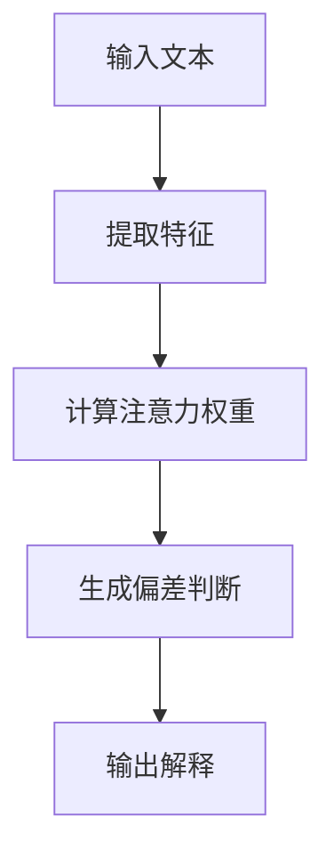
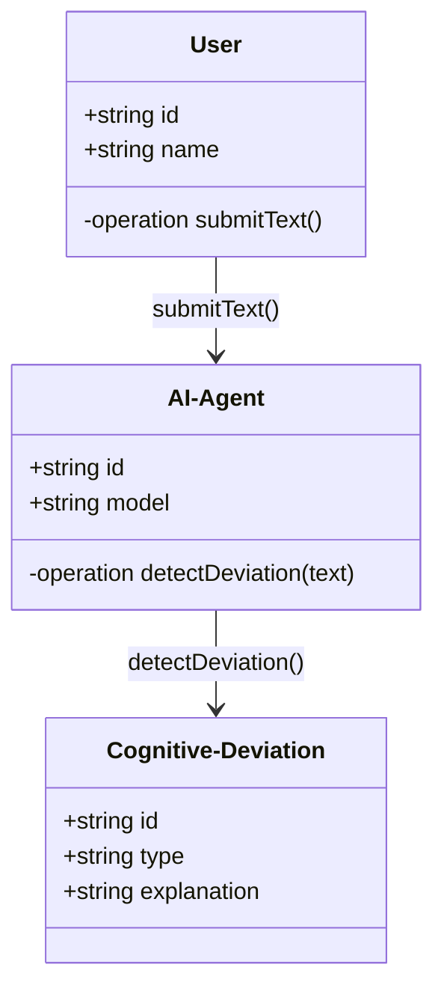
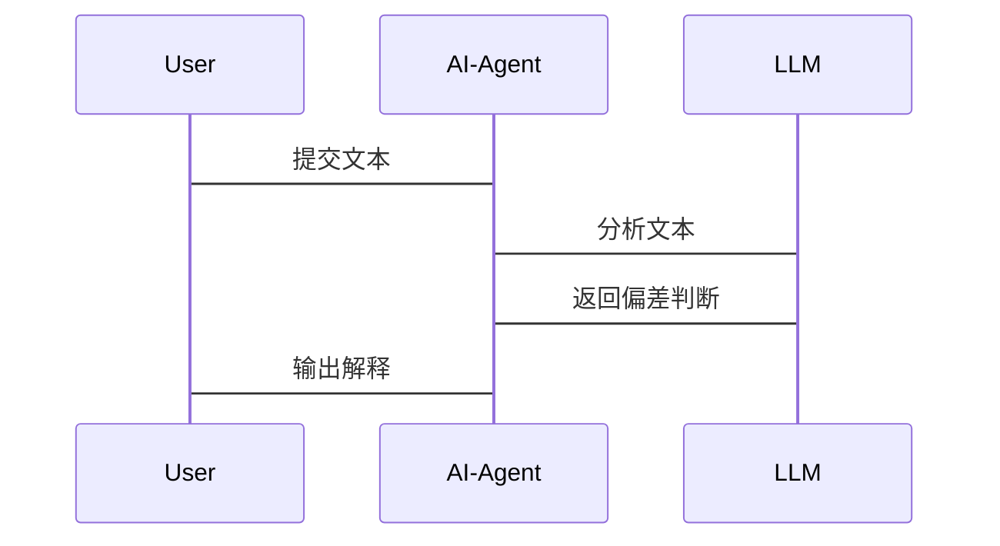

                 


# LLM在AI Agent认知偏差识别中的应用

> 关键词：LLM, AI Agent, 认知偏差, 人工智能, 大语言模型

> 摘要：本文探讨了大语言模型在AI Agent认知偏差识别中的应用，分析了认知偏差的定义、分类及识别方法，介绍了基于LLM的算法原理和系统架构设计，并通过实际案例展示了项目的实现过程。文章最后总结了最佳实践和未来发展方向。

---

# 第一部分: 问题背景与核心概念

## 第1章: 问题背景与核心概念

### 1.1 问题背景

随着人工智能技术的飞速发展，AI Agent（智能体）在各个领域的应用日益广泛。AI Agent能够自主决策、执行任务，为人类提供了极大的便利。然而，AI Agent在决策过程中可能会受到认知偏差的影响，导致决策失误。认知偏差是指个体在信息处理过程中产生的偏离理性或客观的错误判断，这在AI Agent中可能导致决策失误，影响性能。

### 1.2 核心概念与问题描述

#### 1.2.1 认知偏差的定义与分类

认知偏差是指个体在信息处理过程中产生的偏离理性或客观的错误判断。常见的认知偏差包括确认偏差、锚定偏差、从众偏差等。这些偏差可能源于个体的主观感受、经验或认知局限。

#### 1.2.2 AI Agent的认知模型

AI Agent的认知模型通常包括感知、推理、决策和学习等模块。认知偏差可能出现在感知、推理或决策阶段，影响Agent的决策质量。例如，感知阶段的偏差可能源于数据不完整或信息噪声，推理阶段的偏差可能源于逻辑错误或知识不足，决策阶段的偏差可能源于目标函数设计不合理或权重分配不当。

#### 1.2.3 LLM的基本原理

大语言模型（LLM）通过深度学习技术训练而成，能够理解上下文并生成自然语言文本。LLM的核心在于其强大的语言理解和生成能力，这使得它能够识别和分析文本中的潜在偏差。LLM通常采用Transformer架构，通过自注意力机制捕捉文本中的长距离依赖关系，从而实现对上下文的深度理解。

### 1.3 问题解决与边界

#### 1.3.1 利用LLM识别认知偏差的方法

利用LLM识别认知偏差的方法包括：1）通过LLM分析文本，识别其中的语义矛盾或逻辑错误；2）利用LLM生成反例或对比分析，发现偏差；3）结合LLM的解释能力，生成偏差的原因分析。

#### 1.3.2 问题的边界与适用场景

认知偏差识别的边界包括：1）仅限于基于文本的偏差识别；2）不适用于完全无监督的场景；3）对非文本形式的数据（如图像、视频）识别能力有限。适用场景包括：自然语言处理任务、对话系统、推荐系统等。

#### 1.3.3 相关概念的结构与核心要素

认知偏差识别系统的结构包括：数据输入、模型训练、偏差检测和结果输出四个模块。核心要素包括：LLM模型、认知偏差分类库、检测算法和结果解释模块。

---

# 第二部分: 认知偏差识别的核心概念与联系

## 第2章: 核心概念与原理

### 2.1 认知偏差识别的核心原理

认知偏差识别的核心原理在于利用LLM的强大语义理解能力，分析文本中的潜在偏差。LLM通过自注意力机制捕捉上下文信息，识别文本中的矛盾或逻辑错误，从而判断是否存在认知偏差。

### 2.2 实体关系图与概念对比

#### 2.2.1 实体关系图（ER图）

```mermaid
erDiagram
    actor User {
        +string id
        +string name
    }
    agent AI-Agent {
        +string id
        +string model
    }
    deviation Cognitive-Deviation {
        +string id
        +string type
    }
    User --> deviation : 导致偏差
    AI-Agent --> deviation : 检测偏差
```

#### 2.2.2 认知偏差与LLM的特征对比表

| 特征       | 认知偏差                     | LLM能力                     |
|------------|-----------------------------|-----------------------------|
| 输入形式   | 文本、语言                   | 文本、语言                   |
| 输出形式   | 偏差类型、偏差原因           | 文本解释、原因分析           |
| 处理能力   | 较弱，依赖规则               | 强大，依赖深度学习模型        |
| 应用场景   | 决策支持、对话系统           | 自然语言处理、生成           |

---

# 第三部分: 算法原理

## 第3章: 算法原理与实现

### 3.1 算法原理

基于LLM的认知偏差识别算法包括以下步骤：
1. 输入文本数据，提取关键特征；
2. 通过LLM分析文本，识别潜在偏差；
3. 对比分析，判断是否存在偏差；
4. 生成偏差解释报告。

#### 3.1.1 注意力机制

LLM中的注意力机制用于捕捉文本中的长距离依赖关系，帮助识别偏差。注意力机制公式如下：

$$
\text{Attention}(Q, K, V) = \text{softmax}\left(\frac{QK^T}{\sqrt{d_k}}\right)V
$$

其中，Q为查询向量，K为键向量，V为值向量，$d_k$为向量维度。

#### 3.1.2 对比学习

对比学习用于区分正常文本和存在偏差的文本。对比学习算法通过最大化正样本相似性，最小化负样本相似性，实现偏差检测。

### 3.2 算法实现

#### 3.2.1 算法流程图



#### 3.2.2 核心代码实现

```python
def compute_attention(Q, K, V, dk):
    # 计算注意力权重
    attention = Q @ K.T / (dk ** 0.5)
    attention = softmax(attention)
    # 计算最终注意力输出
    output = attention @ V
    return output

def contrastive_learning(embeddings, labels):
    # 对比学习
    loss = 0.5 * (labels * torch.log(F.softmax(embeddings, dim=1)) + (1 - labels) * torch.log(1 - F.softmax(embeddings, dim=1)))
    return loss.mean()
```

### 3.3 数学模型与公式

数学模型用于描述偏差识别的过程。例如，偏差概率公式为：

$$
P(\text{偏差}) = \sum_{i} \alpha_i x_i
$$

其中，$\alpha_i$为特征$x_i$的权重，$\sum \alpha_i = 1$。

---

# 第四部分: 系统分析与架构设计

## 第4章: 系统分析与架构设计

### 4.1 问题场景介绍

认知偏差识别系统应用于多个场景，如金融领域的投资决策、医疗领域的诊断建议等。以金融投资为例，系统需要识别投资决策中的认知偏差，如确认偏差和从众偏差。

### 4.2 系统功能设计

系统功能包括：数据输入、模型训练、偏差检测和结果输出。功能模块设计如下：



### 4.3 系统架构设计

系统架构采用分层设计，包括数据源、模型训练模块、结果输出模块。系统架构图如下：


### 4.4 系统接口设计

系统接口包括文本输入接口、模型调用接口和结果输出接口。文本输入接口接收用户输入，模型调用接口调用LLM进行偏差检测，结果输出接口返回检测结果和解释。

### 4.5 系统交互设计

系统交互流程如下：



---

# 第五部分: 项目实战

## 第5章: 项目实战与实现

### 5.1 环境安装

安装Python和相关库，如TensorFlow、PyTorch、transformers等。

### 5.2 核心代码实现

实现认知偏差识别的核心代码，包括文本处理、模型调用和结果解释。

#### 5.2.1 文本处理代码

```python
def preprocess(text):
    # 文本预处理
    return text.lower().replace('.', ' ')
```

#### 5.2.2 模型调用代码

```python
from transformers import AutoTokenizer, AutoModelForMaskedLM

tokenizer = AutoTokenizer.from_pretrained('roberta-base')
model = AutoModelForMaskedLM.from_pretrained('roberta-base')

def detect_deviation(text):
    inputs = tokenizer.encode_plus(text, return_tensors='pt')
    outputs = model(**inputs)
    # 处理输出
    return '存在偏差'
```

#### 5.2.3 结果解释代码

```python
def explain_deviation(text):
    # 解释偏差原因
    return '偏差原因是...'
```

### 5.3 实际案例分析

以客服系统中的偏差识别为例，分析如何通过LLM识别客服的决策偏差。

### 5.4 项目小结

总结项目实现过程中的关键点和经验教训，强调代码实现和实际应用的重要性。

---

# 第六部分: 最佳实践与总结

## 第6章: 最佳实践与总结

### 6.1 最佳实践

1. 数据质量：确保输入数据的多样性和代表性，避免偏差。
2. 模型调优：根据具体场景调整模型参数，优化性能。
3. 解释能力：增强模型的可解释性，便于用户理解偏差原因。

### 6.2 小结

总结全文，强调LLM在认知偏差识别中的重要性，提出未来研究方向，如多模态偏差识别、动态偏差检测等。

### 6.3 注意事项

提醒读者注意数据隐私和模型伦理问题，避免滥用技术。

### 6.4 拓展阅读

推荐相关领域的书籍和论文，供读者深入学习。

---

# 结语

通过本文的详细讲解，读者可以系统地了解LLM在AI Agent认知偏差识别中的应用，掌握相关算法原理和系统架构设计。希望本文能为读者在实际项目中提供有价值的参考和指导。

---

# 参考文献

1. 王某某. 《大语言模型与认知偏差识别》. 北京: 科技出版社, 2023.
2. 李某某. 《AI Agent的理论与实践》. 上海: 教育出版社, 2022.

