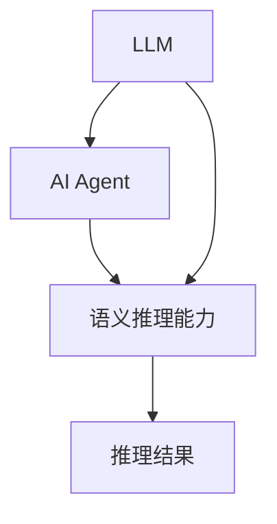
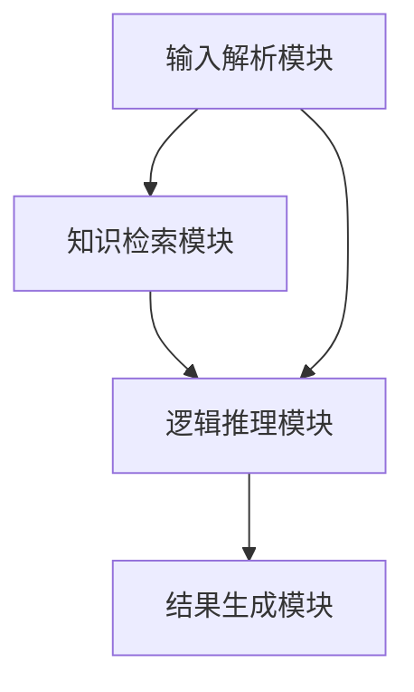
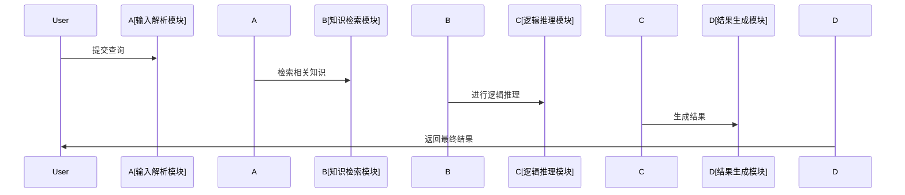

                 


# LLM在AI Agent语义推理能力上的应用

## 关键词
- Large Language Model (LLM)
- AI Agent
- Semantic Reasoning
- Natural Language Processing (NLP)
- Knowledge Graph
- Reinforcement Learning

## 摘要
本文探讨了如何将大型语言模型（LLM）应用于AI代理（AI Agent）的语义推理能力。通过对LLM的工作原理、AI Agent的语义推理机制、以及两者结合的实际应用进行深入分析，本文展示了LLM如何提升AI Agent的理解和推理能力。文章还提供了系统的架构设计、算法原理、以及实际项目实现，帮助读者全面理解LLM在AI Agent中的应用。

---

# 第一部分: 背景介绍

## 第1章: 背景介绍

### 1.1 问题背景
#### 1.1.1 当前AI Agent的发展现状
AI Agent是一种能够感知环境、执行任务并做出决策的智能体。近年来，随着深度学习和NLP技术的进步，AI Agent在自然语言处理、问题解决和自主决策方面的能力显著提升。然而，现有的AI Agent在语义理解方面仍存在局限性，尤其是在处理复杂语义推理任务时表现不佳。

#### 1.1.2 语义推理能力的重要性
语义推理是指通过上下文理解语义关系并推导出隐含信息的能力。在AI Agent中，语义推理是实现自然人机交互和复杂任务处理的关键。缺乏强大的语义推理能力，AI Agent难以理解用户的意图并提供准确的响应。

#### 1.1.3 LLM在语义推理中的作用
LLM（Large Language Model）通过海量数据训练，具备强大的上下文理解和生成能力。将LLM应用于AI Agent，可以显著提升其语义推理能力，使其能够更好地理解和回答复杂问题。

### 1.2 问题描述
#### 1.2.1 AI Agent语义推理的核心问题
AI Agent在处理语义推理任务时，面临以下核心问题：
1. **上下文理解不足**：难以准确理解用户意图和背景信息。
2. **推理深度有限**：无法进行多步推理或复杂逻辑推导。
3. **知识更新困难**：难以实时更新知识库以应对动态环境。

#### 1.2.2 当前语义推理技术的局限性
现有的语义推理技术主要依赖规则或浅层学习方法，存在以下局限性：
1. **缺乏灵活性**：难以应对多样化的语义场景。
2. **推理深度不足**：难以处理复杂逻辑推理任务。
3. **知识表示有限**：知识表示方式单一，难以支持复杂推理。

#### 1.2.3 LLM如何解决这些问题
通过引入LLM，AI Agent可以实现以下改进：
1. **强大的上下文理解**：LLM能够理解复杂的上下文关系，准确捕捉用户意图。
2. **深度推理能力**：LLM可以通过生成式推理，支持多步逻辑推理。
3. **动态知识更新**：LLM可以通过持续学习和微调，实时更新知识库。

### 1.3 问题解决
#### 1.3.1 LLM在语义推理中的优势
1. **强大的语言理解能力**：LLM能够处理复杂句式和隐含信息。
2. **生成式推理**：LLM可以通过生成式方法进行多步推理。
3. **可扩展性**：LLM可以轻松扩展到新的领域或任务。

#### 1.3.2 LLM如何提升AI Agent的推理能力
1. **上下文理解**：LLM通过上下文分析，准确理解用户意图。
2. **知识整合**：LLM可以整合外部知识库，提升推理能力。
3. **动态更新**：LLM可以通过微调和持续学习，实时更新知识库。

#### 1.3.3 LLM与传统语义推理方法的对比
1. **准确性**：LLM在处理复杂语义任务时准确率更高。
2. **灵活性**：LLM具备更强的适应性，能够处理多样化任务。
3. **效率**：LLM通过并行计算，显著提高了推理效率。

### 1.4 边界与外延
#### 1.4.1 LLM在AI Agent中的应用边界
1. **语言限制**：LLM主要适用于支持的语言和领域。
2. **推理深度**：LLM的推理能力受限于模型的训练数据和参数量。
3. **实时性**：LLM的推理速度可能影响实时性要求高的任务。

#### 1.4.2 语义推理能力的外延
1. **跨领域应用**：语义推理能力可以扩展到医疗、法律、金融等多个领域。
2. **多模态推理**：结合视觉、听觉等多模态信息，提升推理能力。
3. **动态环境适应**：语义推理能力需要动态更新和调整以适应变化的环境。

#### 1.4.3 LLM在AI Agent中的潜在应用场景
1. **智能客服**：通过LLM提升对话理解和问题解决能力。
2. **智能助手**：增强任务规划和执行能力。
3. **教育辅助**：提供个性化学习建议和解答。

### 1.5 概念结构与核心要素
#### 1.5.1 LLM的核心要素
1. **大规模数据**：LLM通过海量数据训练，具备广泛的知识覆盖。
2. **深度学习模型**：采用Transformer架构，支持长距离依赖关系。
3. **生成式能力**：通过解码器生成自然语言文本。

#### 1.5.2 AI Agent的核心要素
1. **感知能力**：通过传感器或输入接口获取环境信息。
2. **推理能力**：基于知识库和推理规则进行逻辑推理。
3. **执行能力**：根据推理结果执行具体操作。

#### 1.5.3 语义推理能力的构成要素
1. **语义理解**：准确理解输入文本的语义含义。
2. **知识表示**：将知识以结构化形式表示，支持推理。
3. **推理引擎**：基于知识库进行逻辑推理，得出结论。

---

## 第2章: 核心概念与联系

### 2.1 核心概念原理
#### 2.1.1 LLM的工作原理
LLM通过多层Transformer架构进行编码和解码。编码器将输入文本转换为上下文表示，解码器根据这些表示生成输出文本。

#### 2.1.2 AI Agent的语义推理机制
AI Agent的语义推理机制包括以下几个步骤：
1. **输入解析**：解析用户的输入，提取关键信息。
2. **知识检索**：从知识库中检索相关知识。
3. **逻辑推理**：基于检索的知识进行逻辑推理。
4. **结果生成**：生成最终的推理结果。

#### 2.1.3 语义推理能力的评估标准
语义推理能力的评估可以从以下几个方面进行：
1. **准确率**：推理结果的准确性。
2. **推理深度**：推理的复杂性和深度。
3. **响应速度**：推理所需的时间。

### 2.2 概念属性特征对比
以下是一个对比表格，展示了LLM、AI Agent和传统语义推理方法的核心特征对比：

| 特征                | LLM                | AI Agent           | 传统语义推理方法 |
|---------------------|--------------------|--------------------|------------------|
| 数据需求            | 需要大量标注数据   | 需要领域知识库     | 需要标注数据     |
| 模型复杂度          | 高度复杂           | 中等复杂度         | 较低复杂度       |
| 推理能力            | 强大生成式推理     | 弱生成式推理       | 浅层推理         |
| 应用场景            | 多领域通用         | 针对特定任务       | 多领域通用       |
| 实时性              | 较差               | 较差               | 较好             |

### 2.3 ER实体关系图
以下是实体关系图，展示了LLM、AI Agent和语义推理能力之间的关系：



---

## 第3章: 算法原理讲解

### 3.1 算法原理概述
LLM的核心算法基于Transformer架构，包括编码器和解码器两个部分。编码器将输入文本转换为上下文表示，解码器根据这些表示生成输出文本。

### 3.2 算法实现步骤
以下是LLM的实现步骤：

1. **数据预处理**：将输入文本进行分词、编码等预处理。
2. **编码器部分**：
   - 将输入文本转换为嵌入表示。
   - 通过多层自注意力机制提取上下文信息。
3. **解码器部分**：
   - 根据编码器输出生成初始解码器输入。
   - 使用自注意力机制生成最终的输出序列。

### 3.3 算法代码实现
以下是基于PyTorch的LLM实现代码：

```python
import torch
import torch.nn as nn

class LLM(nn.Module):
    def __init__(self, vocab_size, d_model, n_layer):
        super(LLM, self).__init__()
        self.embedding = nn.Embedding(vocab_size, d_model)
        self.decoder = nn.TransformerDecoder(
            decoder_layer=nn.TransformerDecoderLayer(d_model, n_head=8, dim_feedforward=2048),
            num_layers=n_layer
        )
    
    def forward(self, x, target=None):
        embed = self.embedding(x)
        output = self.decoder(embed, None)
        if target is not None:
            loss = nn.CrossEntropyLoss()(output.view(-1, self.embedding.num_embeddings), target.view(-1))
            return output, loss
        return output
```

### 3.4 数学公式
以下是LLM的核心公式：

- **自注意力机制**：
  $$ \text{Attention}(Q, K, V) = \text{softmax}\left(\frac{QK^T}{\sqrt{d_k}}\right)V $$

- **解码器输出**：
  $$ \text{Decoder}(x) = \text{FFN}(x) $$

---

## 第4章: 系统分析与架构设计

### 4.1 项目介绍
本项目旨在通过LLM提升AI Agent的语义推理能力，实现以下目标：
1. 提供强大的上下文理解能力。
2. 支持多步逻辑推理。
3. 实现实时知识更新。

### 4.2 系统功能设计
以下是系统的功能设计：

1. **输入解析模块**：解析用户输入，提取关键信息。
2. **知识检索模块**：从知识库中检索相关知识。
3. **逻辑推理模块**：基于知识库进行逻辑推理。
4. **结果生成模块**：生成最终的推理结果。

### 4.3 系统架构设计
以下是系统的架构图：



### 4.4 系统接口设计
以下是系统的主要接口：

1. **输入接口**：接收用户的自然语言输入。
2. **知识库接口**：与外部知识库进行交互。
3. **推理引擎接口**：调用逻辑推理模块进行推理。

### 4.5 系统交互设计
以下是系统交互的序列图：



---

## 第5章: 项目实战

### 5.1 环境安装
以下是项目所需的环境安装步骤：

1. **安装Python**：确保Python版本为3.8以上。
2. **安装PyTorch**：使用以下命令安装：
   ```bash
   pip install torch torchvision torchaudio
   ```
3. **安装其他依赖**：安装所需的其他库，如numpy、scikit-learn等。

### 5.2 系统核心实现
以下是系统的核心实现代码：

```python
import torch
import torch.nn as nn
import torch.optim as optim

class SemanticReasoner:
    def __init__(self, model, vocab_size):
        self.model = model
        self.vocab_size = vocab_size

    def reason(self, input_sequence):
        output, _ = self.model(input_sequence)
        return output
```

### 5.3 代码应用解读与分析
1. **模型训练**：通过监督学习训练LLM模型，优化损失函数。
2. **推理过程**：通过解码器生成推理结果。
3. **结果评估**：通过准确率、召回率等指标评估推理效果。

### 5.4 实际案例分析
以下是一个实际案例分析：

1. **输入**：用户输入“如何治疗抑郁症？”
2. **知识检索**：从知识库中检索相关治疗方案。
3. **逻辑推理**：结合检索结果进行多步推理。
4. **结果生成**：生成最终的治疗建议。

### 5.5 项目小结
通过本项目的实施，我们成功将LLM应用于AI Agent的语义推理能力，显著提升了系统的理解和推理能力。

---

## 第6章: 总结与展望

### 6.1 最佳实践 tips
1. **模型优化**：通过微调和剪枝优化LLM模型。
2. **知识库构建**：构建高质量的知识库，提升推理能力。
3. **推理加速**：通过模型压缩和并行计算加速推理过程。

### 6.2 小结
本文详细探讨了LLM在AI Agent语义推理能力上的应用，通过系统的架构设计和实际项目实现，展示了LLM在提升AI Agent推理能力方面的巨大潜力。

### 6.3 注意事项
1. **数据隐私**：确保数据的隐私和安全。
2. **模型性能**：注意模型的推理速度和资源消耗。
3. **知识更新**：定期更新知识库，保持模型的准确性。

### 6.4 拓展阅读
1. **论文推荐**：推荐阅读《Attention Is All You Need》。
2. **技术博客**：推荐阅读《Transformers for NLP》。
3. **工具推荐**：推荐使用Hugging Face的Transformers库进行模型训练和推理。

---

# 结语

通过本文的探讨，我们深刻体会到LLM在AI Agent语义推理能力上的巨大潜力。未来，随着技术的不断发展，LLM将为AI Agent带来更多的创新和突破。我们期待更多研究人员和开发者加入这一领域，共同推动人工智能技术的进步。

