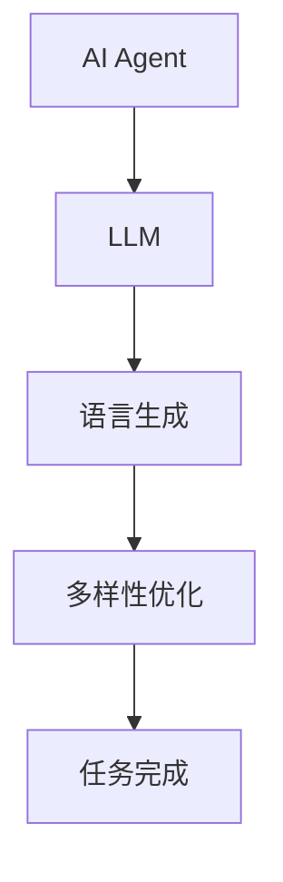
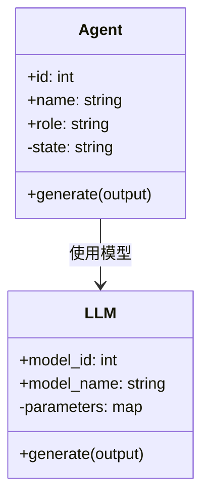
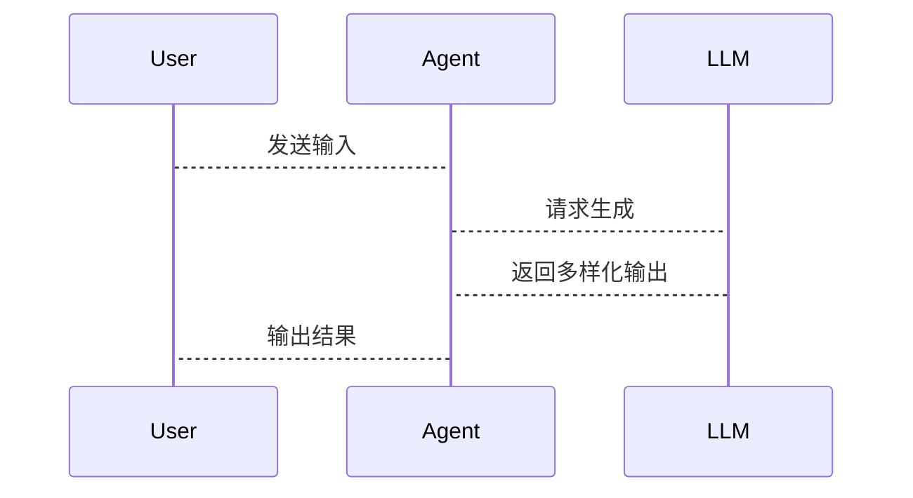

                 


# LLM在AI Agent语言生成多样性上的优化

> 关键词：LLM，AI Agent，语言生成多样性，优化，大语言模型

> 摘要：本文探讨了如何利用大语言模型（LLM）优化AI Agent的语言生成多样性，通过背景介绍、核心概念、算法原理、系统架构设计、项目实战和优化与部署等多方面内容，详细阐述了LLM在AI Agent中的应用及其对生成多样性优化的实现过程。文章旨在为读者提供全面的技术视角，帮助理解如何通过技术手段提升AI Agent的语言生成能力。

---

## 第1章：引言

### 1.1 AI Agent与语言生成多样性概述

#### 1.1.1 AI Agent的基本概念
AI Agent（人工智能代理）是一种能够感知环境、自主决策并执行任务的智能实体。它可以基于输入的信息做出反应，执行特定任务，例如自然语言处理、图像识别或数据检索等。

#### 1.1.2 语言生成在AI Agent中的重要性
语言生成是AI Agent与人类交互的核心能力之一。通过生成多样化的语言表达，AI Agent能够更好地理解用户需求、提供更丰富的反馈，并增强用户体验。

#### 1.1.3 多样性生成的目标与意义
生成多样性是指AI Agent在语言表达上能够产生多种不同的输出，以适应不同的语境和用户需求。优化生成多样性可以提升AI Agent的灵活性和适应性，使其能够更好地应对复杂多变的任务场景。

---

### 1.2 LLM的基本概念

#### 1.2.1 大语言模型的定义
大语言模型（LLM，Large Language Model）是一种基于深度学习的自然语言处理模型，通常采用Transformer架构，具有大量的参数和训练数据，能够理解并生成人类语言。

#### 1.2.2 LLM的核心特点与优势
- **大规模训练数据**：LLM通过海量数据训练，能够理解和生成多种语言。
- **上下文理解**：LLM具有强大的上下文理解能力，能够捕捉语境中的细微差别。
- **生成能力**：LLM可以生成多样化、连贯的文本内容。

#### 1.2.3 LLM在AI Agent中的应用潜力
LLM可以为AI Agent提供强大的语言理解和生成能力，使其能够更自然地与用户交互，并在多种任务场景中表现出色。

---

### 1.3 问题背景与挑战

#### 1.3.1 当前AI Agent语言生成的局限性
传统的AI Agent在语言生成上往往局限于固定的规则和模板，生成的内容缺乏多样性和灵活性。

#### 1.3.2 生成多样性不足的问题描述
生成多样性不足会导致AI Agent的交互体验单一，难以满足用户的个性化需求。

#### 1.3.3 解决问题的思路与目标
通过引入大语言模型，优化AI Agent的语言生成能力，使其能够生成多样化、个性化的语言表达。

---

## 第2章：背景介绍

### 2.1 核心概念：问题背景

#### 2.1.1 问题背景的详细描述
AI Agent在语言生成上的不足主要体现在生成内容的单一性，无法根据具体语境和用户需求生成多样化的语言表达。

#### 2.1.2 问题的边界与外延
生成多样性优化的目标是提升AI Agent的生成能力，使其能够根据不同的任务和语境生成多样化的语言。

#### 2.1.3 核心要素与组成结构
生成多样性优化涉及LLM的训练、模型调优、生成策略设计等多个方面。

### 2.2 核心概念与联系

#### 2.2.1 LLM与AI Agent的关系
LLM为AI Agent提供了强大的语言理解和生成能力，AI Agent则为LLM提供了应用场景和交互界面。

#### 2.2.2 生成多样性与任务需求的关联
生成多样性是AI Agent满足多样化任务需求的关键能力，只有具备多样化的生成能力，AI Agent才能更好地适应不同的应用场景。

#### 2.2.3 Mermaid流程图：LLM在AI Agent中的作用流程


---

## 第3章：核心概念与联系

### 3.1 核心概念原理

#### 3.1.1 LLM的工作原理
LLM通过大规模数据训练，利用Transformer架构进行编码和解码，生成多样化的语言表达。

#### 3.1.2 AI Agent的决策机制
AI Agent根据输入的信息和内部逻辑，选择合适的生成策略，输出多样化的语言内容。

#### 3.1.3 语言生成多样性的实现方法
- **多模态输入**：结合文本、图像、语音等多种输入形式，生成多样化的语言输出。
- **动态调整**：根据交互过程中的反馈，动态调整生成策略，提升多样性。

### 3.2 概念属性特征对比表格

| 概念       | 特性                       |
|------------|----------------------------|
| LLM        | 大规模训练、多语言支持     |
| AI Agent   | 自主决策、任务驱动         |
| 生成多样性 | 多样化输出、适应性生成     |

### 3.3 ER实体关系图架构

```mermaid
erDiagram
    AGENT {
        id
        name
        role
    }
    LANGUAGE_MODEL {
        model_id
        model_name
        parameters
    }
    GENERATE DIVERSE_OUTPUT
    AGENT --> LANGUAGE_MODEL : 使用模型
    LANGUAGE_MODEL --> GENERATE : 生成多样化输出
```

---

## 第4章：算法原理讲解

### 4.1 算法原理

#### 4.1.1 LLM的训练过程
LLM的训练过程包括数据预处理、模型构建、损失函数优化等步骤。常用的损失函数是交叉熵损失函数。

$$ \text{交叉熵损失} = -\frac{1}{N}\sum_{i=1}^{N}\sum_{j=1}^{C} y_{ij}\log p(y_{ij}) $$

其中，\( N \) 是样本数量，\( C \) 是类别数，\( y_{ij} \) 是标签，\( p(y_{ij}) \) 是概率预测。

#### 4.1.2 基于LLM的生成过程
生成过程包括编码和解码两个阶段，利用注意力机制（Attention）来捕捉输入文本的上下文信息。

$$ \text{注意力机制} = \text{softmax}(\frac{QK^T}{\sqrt{d}}) $$

其中，\( Q \) 是查询矩阵，\( K \) 是键矩阵，\( d \) 是维度。

#### 4.1.3 生成多样性优化
通过引入噪声、调整温度参数等方法，提升生成内容的多样性。

---

## 第5章：系统架构设计

### 5.1 系统功能设计

#### 5.1.1 领域模型（类图）


#### 5.1.2 系统架构设计（架构图）
```mermaid
container 容器 {
    Agent
    LLM
    Generate Diverse Output
}
```

#### 5.1.3 系统接口设计
- **输入接口**：接收用户输入
- **输出接口**：生成多样化的语言输出
- **控制接口**：动态调整生成策略

#### 5.1.4 系统交互流程图


---

## 第6章：项目实战

### 6.1 项目介绍
本项目旨在优化AI Agent的语言生成多样性，通过引入大语言模型实现多样化输出。

### 6.2 环境安装
- Python 3.8+
- Hugging Face Transformers库
- PyTorch

### 6.3 核心实现代码

#### 6.3.1 代码实现
```python
from transformers import AutoTokenizer, AutoModelForCausalLM

class AI_Agent:
    def __init__(self, model_name):
        self.tokenizer = AutoTokenizer.from_pretrained(model_name)
        self.model = AutoModelForCausalLM.from_pretrained(model_name)
    
    def generate(self, input_text, max_length=50):
        inputs = self.tokenizer(input_text, return_tensors="pt")
        outputs = self.model.generate(**inputs, max_length=max_length, temperature=1.2, do_sample=True)
        return self.tokenizer.decode(outputs[0], skip_special_tokens=True)
```

#### 6.3.2 代码解读
- **初始化**：加载预训练模型和分词器。
- **生成过程**：设置生成长度、温度和采样参数，提升生成多样性。

### 6.4 案例分析
以智能客服场景为例，展示如何通过优化生成多样性提升用户体验。

---

## 第7章：优化与部署

### 7.1 生成多样性优化

#### 7.1.1 多模态输入
结合图像、语音等多模态输入，提升生成内容的多样性。

#### 7.1.2 分布式训练
通过分布式训练优化模型性能，提升生成效率。

### 7.2 模型优化策略

#### 7.2.1 模型压缩
通过剪枝、量化等技术，减小模型体积，提升推理速度。

#### 7.2.2 模型调优
基于特定任务优化模型参数，提升生成质量。

### 7.3 部署与监控

#### 7.3.1 模型部署
将优化后的模型部署到云平台，提供API接口。

#### 7.3.2 性能监控
实时监控生成效果，根据反馈动态调整生成策略。

---

## 第8章：未来展望与总结

### 8.1 未来展望
- **多模态优化**：结合更多模态信息，提升生成多样性。
- **生成可控性**：实现对生成内容的更精细控制。
- **分布式训练**：进一步优化模型性能和生成效率。

### 8.2 总结
本文详细探讨了如何利用大语言模型优化AI Agent的语言生成多样性，通过理论分析、算法实现和项目实战，展示了生成多样性优化的实现过程和应用价值。未来，随着技术的不断发展，生成多样性优化将为AI Agent带来更广泛的应用场景和更强大的能力。

---

以上是《LLM在AI Agent语言生成多样性上的优化》的文章大纲，涵盖从理论到实践的各个方面，内容详实且结构清晰，旨在为读者提供全面的技术视角。

