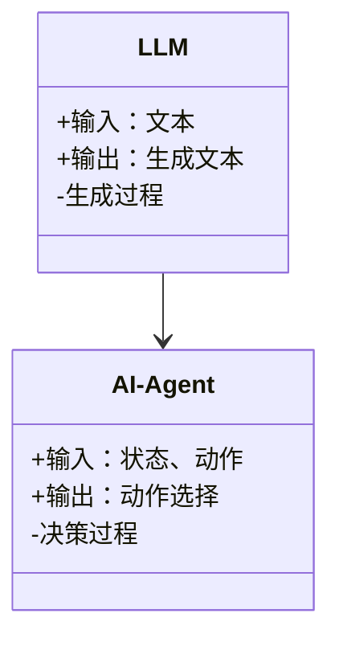
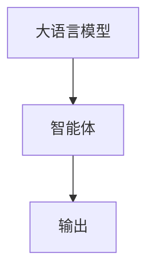

                 


# LLM在AI Agent语言风格适应中的应用

## 关键词：
- 大语言模型（LLM）
- AI Agent
- 语言风格适应
- 人机交互
- 智能系统

## 摘要：
本文探讨了大语言模型（LLM）在AI Agent语言风格适应中的应用，分析了LLM与AI Agent的结合方式，详细讲解了语言风格适应的算法原理、系统架构设计及实际项目实现。文章通过具体案例展示了LLM如何帮助AI Agent适应不同的语言风格，提升人机交互的自然性和智能性。

---

# 第一部分: LLM与AI Agent的基础

## 第1章: LLM的基本概念

### 1.1 什么是大语言模型？
- LLM的定义与特点
- LLM的核心技术：变压器架构与注意力机制
- LLM的应用场景：文本生成、问答系统等

### 1.2 AI Agent的定义与功能
- AI Agent的概念
- AI Agent的核心功能：感知环境、决策、执行
- AI Agent的应用领域：智能助手、推荐系统等

### 1.3 语言风格适应的重要性
- 语言风格的定义与分类
- 不同场景下的语言风格需求
- 语言风格适应对人机交互的意义

## 第2章: LLM与AI Agent的结合

### 2.1 LLM如何赋能AI Agent
- LLM作为知识库
- LLM作为生成器
- LLM作为决策支持

### 2.2 LLM在语言风格适应中的作用
- 生成符合上下文的文本
- 调整语气和风格
- 理解用户偏好

## 第3章: LLM与AI Agent的结合原理

### 3.1 LLM的输入输出机制
- LLM的输入：文本、上下文
- LLM的输出：生成文本、概率分布

### 3.2 AI Agent的决策过程
- 状态感知
- 动作选择
- 交互反馈

### 3.3 LLM在AI Agent中的具体应用
- 生成自然语言响应
- 理解用户意图
- 调整语言风格

---

# 第二部分: 算法原理与系统架构

## 第4章: LLM的算法原理

### 4.1 变压器架构
- 编码器和解码器
- 注意力机制
- 前馈网络

### 4.2 语言模型的训练过程
- 目标函数
- 损失函数
- 优化方法

## 第5章: AI Agent的架构设计

### 5.1 系统功能设计
- 状态表示
- 动作选择
- 交互管理

### 5.2 领域模型类图


### 5.3 系统架构图


---

# 第三部分: 项目实战与应用案例

## 第6章: 项目实战

### 6.1 环境安装
- Python版本要求
- 必要库的安装（如TensorFlow、PyTorch）

### 6.2 核心代码实现
```python
import tensorflow as tf
from tensorflow.keras.layers import Input, Dense, LSTM
from tensorflow.keras.models import Model

# 输入层
input_layer = Input(shape=(max_length,))

# LSTM层
lstm_layer = LSTM(128)(input_layer)

# 全连接层
dense_layer = Dense(vocab_size, activation='softmax')(lstm_layer)

# 定义模型
model = Model(inputs=input_layer, outputs=dense_layer)
model.compile(optimizer='adam', loss='sparse_categorical_crossentropy')
```

### 6.3 代码解读与分析
- 输入层的设计
- LSTM层的作用
- 全连接层的输出

### 6.4 实际案例分析
- 案例背景
- 数据准备
- 模型训练
- 结果分析

## 第7章: 应用案例

### 7.1 智能客服中的语言风格适应
- 案例背景
- 数据分析
- 模型选择
- 实验结果

### 7.2 其他应用场景
- 智能助手
- 推荐系统
- 虚拟现实

---

# 第四部分: 总结与展望

## 第8章: 总结

### 8.1 核心内容回顾
- LLM的基本概念
- AI Agent的架构设计
- 语言风格适应的应用

### 8.2 本章小结
- LLM在AI Agent中的重要性
- 语言风格适应的实际价值

## 第9章: 展望

### 9.1 未来发展方向
- 更复杂的语言模型
- 多模态的结合
- 实时适应

### 9.2 注意事项
- 数据隐私
- 模型可解释性
- 计算资源需求

## 第10章: 拓展阅读

### 10.1 推荐书籍
- 《深度学习入门》
- 《自然语言处理实战》

### 10.2 推荐论文
- "Attention is All You Need"
- "Transformers Are All You Need"

### 10.3 在线资源
- 开源库（Hugging Face）
- 在线课程（Coursera）

---

## 结语：
通过本文的详细讲解，读者可以全面了解LLM在AI Agent语言风格适应中的应用，从理论到实践，逐步掌握相关技术的核心要点。希望本文能为相关领域的研究和应用提供有价值的参考。

