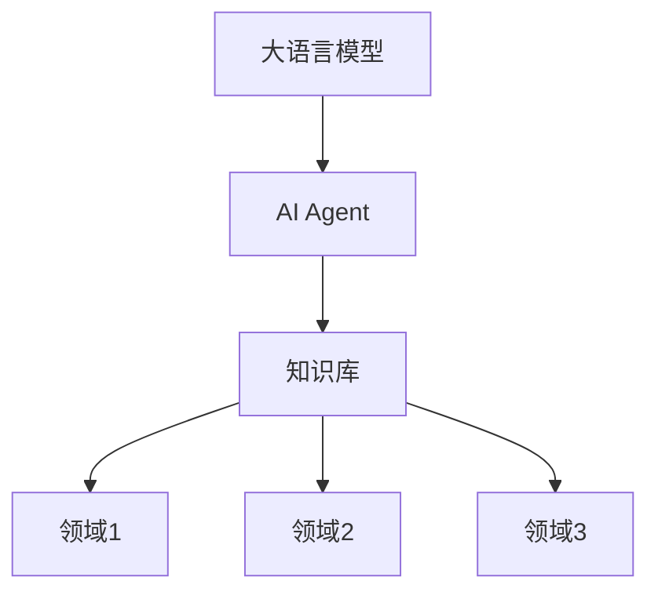
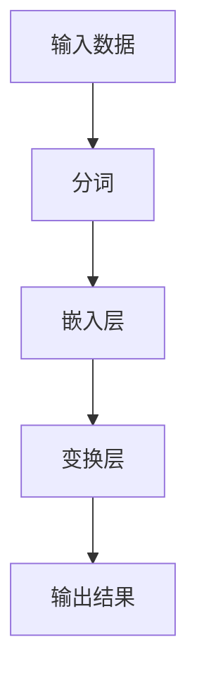
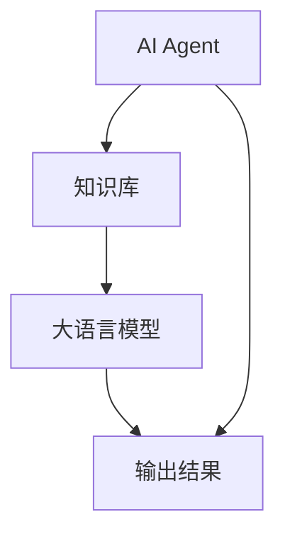
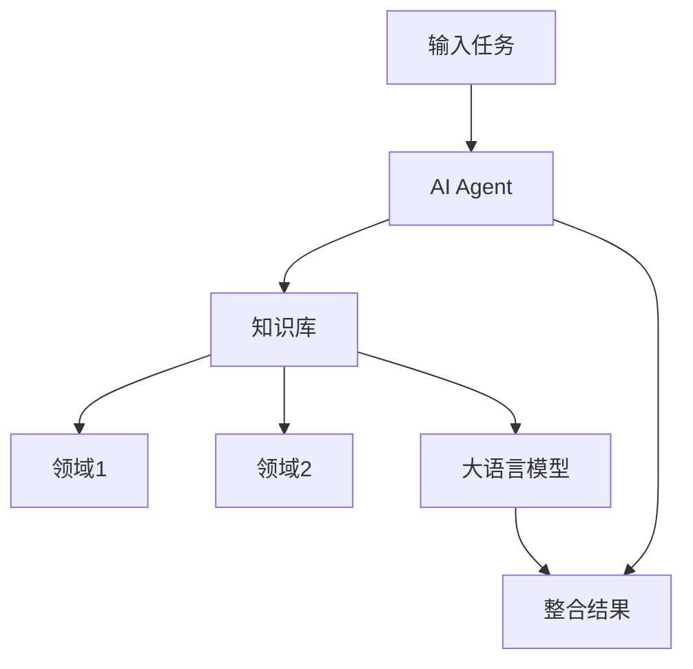
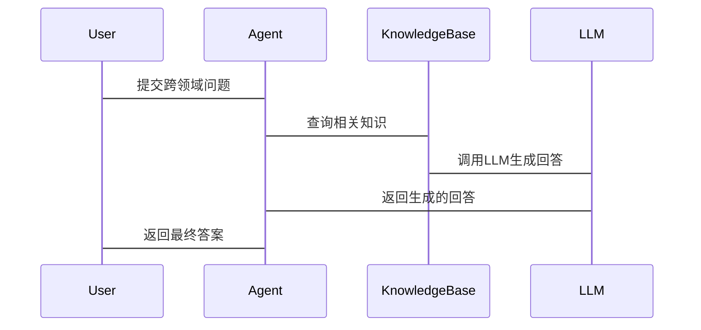

                 


# 目录大纲：《LLM在AI Agent跨领域知识整合中的应用》

---

## 第一部分：背景介绍

### 第1章：AI Agent与LLM的背景与概念

#### 1.1 AI Agent的基本概念
- 1.1.1 AI Agent的定义与分类
  - 定义：AI Agent是一种能够感知环境并采取行动以实现目标的智能体。
  - 分类：基于智能水平分为简单反射型、基于模型的 reactive、目标驱动型、效用驱动型和推理驱动型。

- 1.1.2 AI Agent的核心功能与特点
  - 核心功能：感知、决策、行动、自适应。
  - 特点：自主性、反应性、目标导向、学习能力。

- 1.1.3 AI Agent的应用场景与挑战
  - 场景：智能助手、推荐系统、自动驾驶、机器人控制。
  - 挑战：复杂环境处理、实时决策、多领域知识整合。

#### 1.2 大语言模型（LLM）的概述
- 1.2.1 LLM的定义与发展历程
  - 定义：基于深度学习的自然语言处理模型，具有大规模参数和复杂架构。
  - 发展历程：从词袋模型到Transformer架构，再到当前的大模型发展。

- 1.2.2 LLM的主要技术特点
  - 自然语言理解与生成能力。
  - 多任务学习能力。
  - 模型可解释性与上下文理解。

- 1.2.3 LLM在不同领域的应用案例
  - 问答系统、文本摘要、机器翻译、内容生成。

#### 1.3 AI Agent与LLM的结合
- 1.3.1 LLM在AI Agent中的作用
  - 提供自然语言处理能力，增强任务理解和生成能力。
  - 支持多语言和跨领域知识整合。

- 1.3.2 跨领域知识整合的必要性
  - 单一领域知识的局限性。
  - 跨领域问题的复杂性与多样性。
  - 跨领域整合带来的效率提升和问题解决能力。

- 1.3.3 当前研究与应用的现状
  - 学术研究进展。
  - 产业应用案例。
  - 当前存在的问题与挑战。

---

## 第二部分：核心概念与联系

### 第2章：LLM与AI Agent的核心概念与联系

#### 2.1 核心概念原理
- 2.1.1 LLM的工作原理
  - Transformer架构：编码器和解码器的结构。
  - 注意力机制：如何捕捉输入中的关键信息。
  - 训练过程：基于大量数据的监督学习。

- 2.1.2 AI Agent的任务处理流程
  - 感知环境：接收输入并解析任务。
  - 知识检索：从知识库中获取相关信息。
  - 生成响应：基于LLM生成输出。

- 2.1.3 跨领域知识整合的机制
  - 知识表示：如何表示跨领域的知识。
  - 知识融合：不同领域知识的整合方法。
  - 知识检索：跨领域知识的快速检索。

#### 2.2 核心概念对比分析
- 2.2.1 LLM与传统NLP模型的对比
  - 基于规则的NLP模型 vs 基于深度学习的模型。
  - 单任务处理 vs 多任务学习能力。
  - 模型性能和泛化的差异。

- 2.2.2 AI Agent与传统任务处理系统对比
  - 基于规则的系统 vs 基于学习的系统。
  - 单一任务处理 vs 多任务处理能力。
  - 自适应能力的差异。

- 2.2.3 跨领域知识整合的特点与优势
  - 多领域覆盖：能够处理多种类型的问题。
  - 高度自适应：根据上下文动态调整。
  - 提高决策效率：通过整合知识快速生成解决方案。

#### 2.3 实体关系图


---

## 第三部分：算法原理讲解

### 第3章：LLM的算法原理

#### 3.1 模型训练流程


#### 3.2 AI Agent的任务处理流程


#### 3.3 跨领域知识整合的算法实现


#### 3.4 算法实现代码
```python
import transformers
import torch

# 加载预训练模型
model = transformers.LlamaForCausalInference.from_pretrained('facebook/llama')
tokenizer = transformers.LlamaTokenizer.from_pretrained('facebook/llama')

# 定义输入
input_text = "Please explain quantum computing in simple terms."
inputs = tokenizer(input_text, return_tensors='pt')

# 模型推理
outputs = model.generate(inputs.input_ids, max_length=50)
print(tokenizer.decode(outputs[0], skip_special_tokens=True))
```

#### 3.5 数学模型与公式
- 损失函数：交叉熵损失
  $$ \text{Loss} = -\sum_{i=1}^{n} \text{log}(P(y_i|y_{<i})) $$
- 注意力机制：缩放的点积注意力
  $$ \text{Attention}(Q, K, V) = \text{softmax}\left(\frac{QK^T}{\sqrt{d_k}}\right)V $$
- 优化器：Adam优化器
  $$ \text{Adam}(params, \text{learning\_rate}=1e-3) $$

---

## 第四部分：系统分析与架构设计

### 第4章：LLM与AI Agent的系统架构

#### 4.1 问题场景介绍
- 系统目标：实现一个支持跨领域知识整合的AI Agent。
- 使用场景：用户提出跨领域问题，AI Agent调用不同领域的知识进行整合并生成回答。

#### 4.2 项目介绍
- 项目名称：Multi-Domain AI Agent。
- 开发团队：AI研究团队。
- 项目目标：构建一个能够处理多个领域问题的智能代理。

#### 4.3 系统功能设计
- 知识库管理：存储和管理多领域的知识。
- LLM调用：通过API调用LLM进行自然语言理解和生成。
- 任务处理：解析任务并协调知识库和LLM完成响应生成。

#### 4.4 系统架构设计


#### 4.5 系统接口设计
- 输入接口：接收用户输入的任务或问题。
- 输出接口：返回生成的响应或解决方案。
- 知识库接口：与知识库进行数据交互。

#### 4.6 系统交互流程


---

## 第五部分：项目实战

### 第5章：LLM与AI Agent的项目实战

#### 5.1 环境安装
- Python版本：3.8及以上。
- 安装依赖：使用pip安装transformers库。

#### 5.2 系统核心实现源代码
```python
from transformers import LlamaForCausalInference, LlamaTokenizer

# 加载预训练模型
model = LlamaForCausalInference.from_pretrained('facebook/llama')
tokenizer = LlamaTokenizer.from_pretrained('facebook/llama')

# 定义知识库接口
class KnowledgeBase:
    def __init__(self):
        self.knowledge = {
            'math': {'formulas': '...', 'examples': '...'},
            'coding': {'concepts': '...', 'code_samples': '...'},
            'physics': {'laws': '...', 'theories': '...'}
        }

    def retrieve(self, domain, query):
        return self.knowledge.get(domain, {}).get(query, '')

# 初始化AI Agent
class AI_Agent:
    def __init__(self, model, tokenizer, knowledge_base):
        self.model = model
        self.tokenizer = tokenizer
        self.knowledge_base = knowledge_base

    def process_task(self, task_description):
        # 检索相关知识
        domain = self._identify_domain(task_description)
        knowledge = self.knowledge_base.retrieve(domain, task_description)
        # 调用LLM生成回答
        inputs = self.tokenizer(task_description + knowledge, return_tensors='pt')
        outputs = self.model.generate(inputs.input_ids, max_length=100)
        response = self.tokenizer.decode(outputs[0], skip_special_tokens=True)
        return response

    def _identify_domain(self, task_description):
        # 简单的领域识别逻辑
        if 'math' in task_description.lower():
            return 'math'
        elif 'code' in task_description.lower():
            return 'coding'
        elif 'physics' in task_description.lower():
            return 'physics'
        else:
            return 'general'
```

#### 5.3 代码应用解读与分析
- 知识库接口：实现知识的存储和检索功能。
- AI Agent类：负责任务处理，包括领域识别和LLM调用。
- 处理流程：接收任务描述，识别相关领域，检索知识，调用LLM生成回答。

#### 5.4 实际案例分析
- 案例1：数学问题
  - 输入：解决二次方程的步骤。
  - 输出：详细步骤解释。
- 案例2：编程问题
  - 输入：解释递归的概念。
  - 输出：代码示例和概念解释。
- 案例3：物理问题
  - 输入：牛顿运动定律。
  - 输出：定律描述和应用案例。

#### 5.5 项目小结
- 项目实现的关键点：领域识别、知识检索、LLM调用。
- 系统的优势：能够处理跨领域问题，生成准确且自然的回答。
- 可优化的方面：知识库的扩展性、LLM的调优、系统的响应速度。

---

## 第六部分：最佳实践

### 第6章：LLM与AI Agent的实践总结

#### 6.1 小结
- LLM在AI Agent中的应用价值：提升自然语言处理能力，支持跨领域知识整合。
- 系统设计的关键点：领域识别、知识检索、模型调用。

#### 6.2 注意事项
- 知识库的维护：确保知识的准确性和及时性。
- 模型的选择：根据任务需求选择合适的LLM模型。
- 系统的可扩展性：设计灵活的架构，便于后续功能扩展。

#### 6.3 拓展阅读
- 推荐书籍：《Deep Learning》、《Natural Language Processing with PyTorch》。
- 推荐论文：关注多领域知识整合和大语言模型的最新研究。
- 在线资源：查阅GitHub上的相关项目和Kaggle上的比赛案例。

---

## 第七部分：总结与展望

### 第7章：未来展望与总结

#### 7.1 总结
- 本书系统介绍了LLM在AI Agent跨领域知识整合中的应用。
- 从理论到实践，详细讲解了系统设计、算法实现和项目实战。

#### 7.2 未来展望
- 智能代理的进一步发展：更复杂的任务处理和更自然的交互方式。
- 多模态整合：结合视觉、听觉等多模态信息，提升AI Agent的能力。
- 跨领域知识图谱：构建更强大的知识图谱，支持更复杂的跨领域问题。

---

## 参考文献
- 倒序排列，列出所有参考的书籍、论文、技术文档等。

---

## 附录

### 附录A：术语表
- 解释书中出现的专业术语。

### 附录B：代码仓库
- 提供书中项目代码的GitHub链接。

### 附录C：工具与资源
- 列出常用的NLP工具、框架和数据集。

---

通过以上目录结构，读者可以系统地了解LLM在AI Agent跨领域知识整合中的应用，从理论到实践，逐步深入理解相关技术的核心概念、算法原理和实际应用。

