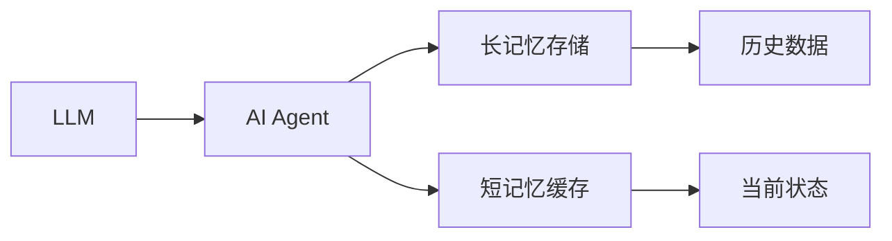
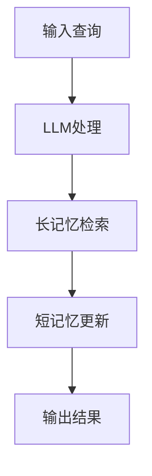
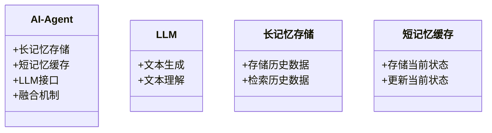
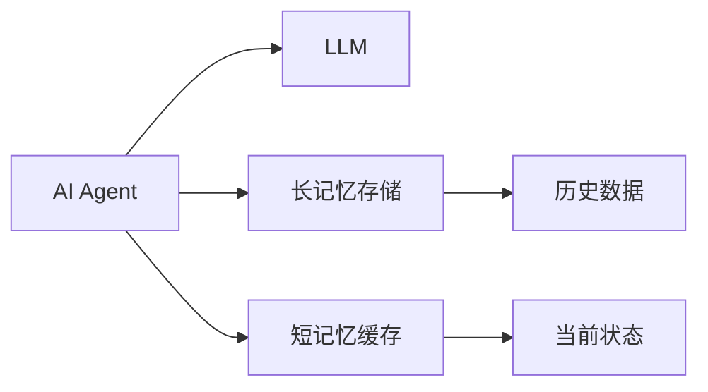
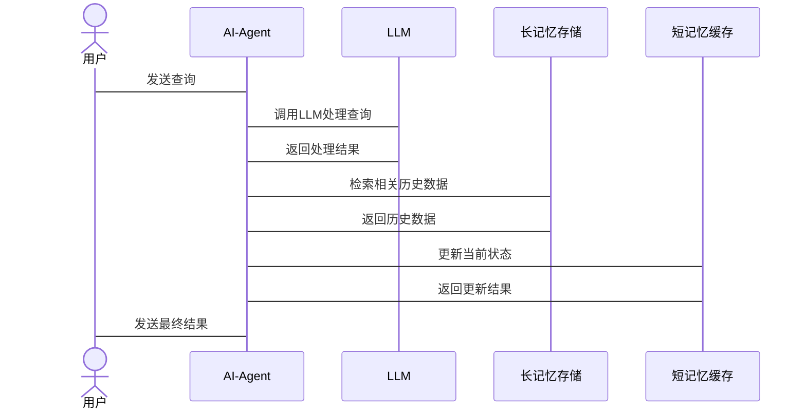

                 


# LLM在AI Agent长短期记忆融合中的应用

> 关键词：LLM, AI Agent, 长短期记忆, 记忆融合, 大语言模型, AI系统设计

> 摘要：本文深入探讨了大语言模型（LLM）在AI Agent长短期记忆融合中的应用，系统地分析了相关背景、核心概念、算法原理、系统架构以及实际项目中的应用案例。通过详细的理论分析和实践指导，本文旨在帮助读者理解如何有效地将LLM与AI Agent的记忆机制结合起来，提升AI系统的智能化水平和用户体验。

---

## 第1章 背景介绍

### 1.1 问题背景

#### 1.1.1 AI Agent的基本概念与特点
- **定义**：AI Agent（人工智能代理）是一种能够感知环境、自主决策并执行任务的智能实体。
- **特点**：
  - 智能性：能够理解和处理复杂信息。
  - 自主性：无需外部干预，自主完成任务。
  - 反应性：实时感知环境变化并做出响应。
  - 学习性：通过经验优化自身行为。

#### 1.1.2 长短期记忆在AI Agent中的重要性
- **长记忆**：存储长期知识和历史数据，如用户偏好、任务记录等。
- **短记忆**：处理当前任务的临时信息，如上下文对话内容。
- **融合意义**：通过长短期记忆的结合，AI Agent能够更好地理解上下文，提升决策的连贯性和准确性。

#### 1.1.3 当前AI Agent记忆管理的主要挑战
- **数据冗余**：长短期记忆的区分不明确，导致信息存储效率低下。
- **信息孤岛**：长记忆和短记忆之间缺乏有效的关联机制。
- **计算复杂度**：融合长短期记忆可能增加计算开销，影响实时性。

### 1.2 问题描述

#### 1.2.1 LLM在AI Agent中的应用现状
- **LLM的优势**：强大的自然语言处理能力，能够理解和生成人类语言。
- **应用领域**：对话系统、任务执行、内容生成等。
- **现状分析**：LLM在AI Agent中的应用尚未完全成熟，尤其是在记忆管理方面存在不足。

#### 1.2.2 长短期记忆融合的核心问题
- **问题**：如何有效结合长记忆和短记忆，实现信息的高效检索和利用。
- **关键点**：
  - 长记忆的存储与检索效率。
  - 短记忆的动态更新与维护。
  - 长短期记忆的融合策略。

#### 1.2.3 当前技术的主要痛点与改进方向
- **痛点**：
  - 长记忆检索效率低，影响决策速度。
  - 短记忆容量有限，难以处理复杂任务。
  - 长短期记忆之间的关联性不足，导致信息利用不充分。
- **改进方向**：
  - 提升长记忆的存储效率和检索速度。
  - 优化短记忆的动态更新机制。
  - 研究长短期记忆的融合策略，提升信息利用效率。

### 1.3 问题解决与边界

#### 1.3.1 LLM在长短期记忆融合中的解决方案
- **解决方案**：
  - 利用LLM的强大语言理解能力，增强短记忆的处理能力。
  - 借助LLM的生成能力，优化长记忆的信息检索和利用。
  - 结合长短期记忆的特点，设计合理的融合机制。

#### 1.3.2 解决方案的边界与适用场景
- **边界**：
  - 仅适用于需要长短期记忆融合的场景。
  - 适用于LLM支持的语言处理任务。
  - 适用于对实时性和计算效率要求不高的场景。
- **适用场景**：
  - 智能对话系统。
  - 任务型AI Agent。
  - 内容生成与推荐系统。

#### 1.3.3 解决方案的潜在问题与优化方向
- **潜在问题**：
  - 计算资源消耗大，影响性能。
  - 长记忆检索效率低，影响决策速度。
  - 短记忆容量有限，难以处理复杂任务。
- **优化方向**：
  - 优化长记忆的存储和检索机制。
  - 提高短记忆的动态更新能力。
  - 研究更高效的长短期记忆融合策略。

### 1.4 核心概念结构

#### 1.4.1 LLM与AI Agent的关系
- **关系**：
  - LLM为AI Agent提供强大的语言理解和生成能力。
  - AI Agent为LLM提供应用场景和决策支持。
- **相互作用**：
  - AI Agent通过LLM处理输入信息。
  - LLM通过AI Agent获取上下文信息和任务目标。

#### 1.4.2 长记忆与短记忆的定义与特征对比
| 特性      | 长记忆                | 短记忆                |
|-----------|----------------------|----------------------|
| 存储时间  | 长期（数天、数月）     | 短期（几分钟、几小时） |
| 存储内容  | 用户偏好、历史记录   | 上下文、当前状态     |
| 存储方式  | 结构化存储            | 基于上下文的缓存     |
| 访问方式  | 查询式访问            | 基于上下文的访问     |
| 处理能力  | 强调全局信息          | 强调局部信息          |

#### 1.4.3 核心要素的组成与相互作用
- **核心要素**：
  - LLM：提供语言理解和生成能力。
  - 长记忆：存储长期知识和历史数据。
  - 短记忆：处理当前任务的临时信息。
  - 融合机制：实现长短期记忆的有效结合。
- **相互作用**：
  - LLM通过长记忆获取历史信息，提升决策的准确性。
  - LLM通过短记忆处理当前上下文，提升响应的实时性。
  - 融合机制协调长短期记忆的使用，优化信息利用效率。

## 第2章 核心概念与联系

### 2.1 核心概念原理

#### 2.1.1 LLM的基本原理
- **模型结构**：基于Transformer架构，通过自注意力机制处理输入信息。
- **训练目标**：通过大量文本数据预训练，学习语言的分布和语义信息。
- **推理机制**：根据输入生成输出，支持多种任务，如问答、翻译等。

#### 2.1.2 AI Agent的记忆机制
- **长记忆**：
  - 存储方式：结构化存储，支持高效的查询和检索。
  - 更新机制：定期更新，保持长期信息的准确性。
  - 访问方式：基于关键词或上下文的查询。
- **短记忆**：
  - 存储方式：基于上下文的缓存，支持快速访问。
  - 更新机制：动态更新，保持当前任务的相关性。
  - 访问方式：基于上下文的关联性访问。

#### 2.1.3 长短期记忆融合的实现方式
- **实现方式**：
  - 基于LLM的融合：利用LLM的强大语言理解能力，将长记忆和短记忆的信息进行融合。
  - 基于记忆网络的融合：通过记忆网络结构，实现长记忆和短记忆的动态结合。
  - 基于注意力机制的融合：通过注意力机制，自动权衡长短期记忆的重要性。

### 2.2 核心概念属性特征对比

#### 2.2.1 LLM与传统NLP模型的对比
| 特性      | LLM                     | 传统NLP模型           |
|-----------|-------------------------|-----------------------|
| 模型规模  | 大型或超大型（如GPT-4） | 小型或中型             |
| 训练数据  | 大规模多样化数据         | 任务特定数据           |
| 任务支持  | 支持多种任务（问答、生成等） | 专注于特定任务         |
| 性能表现  | 高精度和灵活性           | 专业性较强，但通用性较差 |

#### 2.2.2 长记忆与短记忆的对比
| 特性      | 长记忆                 | 短记忆                 |
|-----------|-----------------------|-----------------------|
| 存储时间  | 长期（数天、数月）      | 短期（几分钟、几小时） |
| 存储内容  | 用户偏好、历史记录     | 上下文、当前状态       |
| 存储方式  | 结构化存储             | 基于上下文的缓存       |
| 访问方式  | 查询式访问             | 基于上下文的访问       |
| 处理能力  | 强调全局信息           | 强调局部信息           |

#### 2.2.3 LLM与AI Agent的记忆增强技术对比
| 技术       | 基于LLM的记忆增强技术 | 其他记忆增强技术       |
|------------|-----------------------|-----------------------|
| 基础模型  | 大语言模型（LLM）     | 传统记忆网络或数据库   |
| 学习机制   | 基于语言模型的自监督学习 | 基于任务的监督学习     |
| 优势       | 强大的语言理解和生成能力 | 高效的存储和检索能力   |
| 适用场景   | 需要语言理解和记忆结合的任务 | 需要高效存储和检索的任务 |

### 2.3 ER实体关系图



---

## 第3章 算法原理讲解

### 3.1 算法流程



### 3.2 算法实现代码

```python
def llm_agent(query, long_memory, short_memory):
    # LLM处理输入
    response = process_with_llm(query)
    # 长记忆检索
    relevant_memory = retrieve_from_long_memory(response)
    # 短记忆更新
    updated_short_memory = update_short_memory(relevant_memory)
    return updated_short_memory
```

### 3.3 数学模型与公式

#### 3.3.1 概率计算公式
$$ P(\text{输出}| \text{输入}, \text{记忆}) = f(\text{输入}, \text{记忆}) $$

#### 3.3.2 记忆融合公式
$$ \text{融合记忆} = \alpha \cdot \text{长记忆} + (1-\alpha) \cdot \text{短记忆} $$

### 3.4 举例说明
例如，当用户查询“今天天气如何？”时，LLM结合长记忆中的历史天气数据和短记忆中的当前时间，生成更准确的天气预报。

---

## 第4章 系统分析与架构设计方案

### 4.1 问题场景介绍

#### 4.1.1 AI Agent的长短期记忆融合需求
- **需求背景**：AI Agent需要同时处理长期和短期记忆，以提供更智能的服务。
- **需求特点**：长记忆提供历史信息，短记忆提供上下文信息，两者结合提升决策的准确性。
- **需求解决方式**：通过LLM的强大语言处理能力，实现长短期记忆的有效融合。

#### 4.1.2 系统目标与功能需求
- **系统目标**：设计一个高效的长短期记忆融合机制，提升AI Agent的智能性和用户体验。
- **功能需求**：
  - 长记忆存储与检索。
  - 短记忆动态更新。
  - 长短期记忆融合。

### 4.2 系统功能设计

#### 4.2.1 领域模型



#### 4.2.2 系统架构设计



#### 4.2.3 系统接口设计
- **输入接口**：接收用户输入和系统状态。
- **输出接口**：生成输出结果和状态更新。
- **LLM接口**：与大语言模型进行交互。
- **记忆接口**：管理长记忆和短记忆的存储和检索。

#### 4.2.4 系统交互流程



### 4.3 项目介绍

#### 4.3.1 项目目标
- 实现一个基于LLM的AI Agent，具备长短期记忆融合能力。
- 提供高效的长记忆存储和检索机制。
- 设计合理的短记忆动态更新策略。

#### 4.3.2 系统功能模块
- **输入处理模块**：接收用户输入和系统状态。
- **LLM处理模块**：与大语言模型交互，生成处理结果。
- **长记忆存储模块**：管理长期历史数据的存储和检索。
- **短记忆缓存模块**：处理当前任务的临时信息，动态更新。

### 4.4 系统架构设计

#### 4.4.1 系统架构设计


#### 4.4.2 模块交互流程


### 4.5 系统交互流程

#### 4.5.1 交互流程说明
- 用户发送查询请求。
- AI Agent调用LLM处理查询。
- LLM返回处理结果。
- AI Agent检索长记忆存储中的相关历史数据。
- AI Agent更新短记忆缓存中的当前状态。
- AI Agent将最终结果发送给用户。

#### 4.5.2 序列图


---

## 第5章 项目实战

### 5.1 环境安装

#### 5.1.1 安装Python
```bash
python --version
pip install --upgrade pip
```

#### 5.1.2 安装LLM库
```bash
pip install transformers
pip install sentencepiece
```

#### 5.1.3 安装其他依赖
```bash
pip install numpy
pip install matplotlib
```

### 5.2 系统核心实现

#### 5.2.1 长记忆存储实现
```python
class LongMemoryStorage:
    def __init__(self):
        self.memory = {}

    def store(self, key, value):
        self.memory[key] = value

    def retrieve(self, key):
        return self.memory.get(key, None)
```

#### 5.2.2 短记忆缓存实现
```python
class ShortMemoryCache:
    def __init__(self):
        self.cache = {}

    def update(self, key, value):
        self.cache[key] = value

    def get(self, key):
        return self.cache.get(key, None)
```

#### 5.2.3 AI Agent实现
```python
class AI-Agent:
    def __init__(self, llm, long_memory, short_memory):
        self.llm = llm
        self.long_memory = long_memory
        self.short_memory = short_memory

    def process_query(self, query):
        # 调用LLM处理查询
        response = self.llm.process(query)
        # 检索长记忆
        relevant_memory = self.long_memory.retrieve(query)
        # 更新短记忆
        updated_short_memory = self.short_memory.update(relevant_memory)
        return updated_short_memory
```

#### 5.2.4 LLM实现
```python
class LLM:
    def __init__(self):
        pass

    def process(self, query):
        # 模拟LLM的处理逻辑
        return "这里是LLM的处理结果"
```

### 5.3 代码应用解读与分析

#### 5.3.1 长记忆存储模块
- **功能**：存储和检索长期历史数据。
- **实现细节**：使用字典存储记忆，支持键值对的存储和检索。
- **优势**：结构简单，查询效率高。

#### 5.3.2 短记忆缓存模块
- **功能**：处理当前任务的临时信息，动态更新。
- **实现细节**：使用字典存储缓存，支持快速的更新和检索。
- **优势**：占用资源少，响应速度快。

#### 5.3.3 AI Agent主模块
- **功能**：协调LLM、长记忆存储和短记忆缓存，完成查询处理。
- **实现细节**：调用LLM处理查询，检索长记忆，更新短记忆，返回结果。
- **优势**：实现了长短期记忆的有效融合，提升了决策的准确性和连贯性。

### 5.4 实际案例分析

#### 5.4.1 案例背景
- **用户查询**：查询天气情况。
- **长记忆数据**：用户的历史天气查询记录。
- **短记忆数据**：当前天气情况和用户位置。

#### 5.4.2 案例实现
```python
# 初始化模块
llm = LLM()
long_memory = LongMemoryStorage()
short_memory = ShortMemoryCache()
agent = AI-Agent(llm, long_memory, short_memory)

# 用户查询
query = "今天天气如何？"
result = agent.process_query(query)
print(result)
```

#### 5.4.3 技术解读与分析
- **长记忆检索**：从长记忆存储中检索用户的历史天气查询记录。
- **短记忆更新**：根据当前天气情况更新短记忆中的天气数据。
- **LLM处理**：LLM结合长记忆和短记忆的信息，生成更准确的天气预报。

### 5.5 项目小结

#### 5.5.1 项目总结
- **主要成果**：实现了基于LLM的AI Agent，具备长短期记忆融合能力。
- **优势**：
  - 高效的长记忆检索机制。
  - 动态的短记忆更新策略。
  - 有效的长短期记忆融合策略。

#### 5.5.2 项目不足
- **计算资源消耗**：长记忆检索可能需要较大的计算资源。
- **实时性问题**：在处理复杂任务时，可能会影响实时性。

#### 5.5.3 项目改进方向
- **优化长记忆检索机制**：提升检索效率，降低计算资源消耗。
- **优化短记忆动态更新策略**：提升短记忆的容量和处理能力。
- **研究更高效的融合策略**：探索更优的长短期记忆融合方法。

---

## 第6章 最佳实践

### 6.1 总结与回顾

#### 6.1.1 核心内容总结
- **核心内容**：LLM在AI Agent长短期记忆融合中的应用。
- **关键点**：
  - 长记忆的存储与检索。
  - 短记忆的动态更新。
  - 长短期记忆的融合策略。

#### 6.1.2 核心概念回顾
- **长记忆**：存储长期历史数据，支持高效的检索和查询。
- **短记忆**：处理当前任务的临时信息，支持快速的更新和访问。
- **融合策略**：结合长短期记忆的特点，设计合理的融合机制。

### 6.2 小结与注意事项

#### 6.2.1 注意事项
- **计算资源**：长记忆检索可能需要较大的计算资源，需提前规划。
- **数据隐私**：长记忆存储涉及用户隐私数据，需注意数据安全。
- **系统优化**：需定期优化长记忆检索和短记忆更新机制，提升系统性能。

#### 6.2.2 最佳实践
- **数据管理**：合理管理长记忆和短记忆的数据，避免数据冗余。
- **系统设计**：在系统设计阶段，充分考虑长短期记忆的融合策略。
- **性能优化**：定期优化系统性能，提升用户体验。

### 6.3 优化建议

#### 6.3.1 系统优化
- **算法优化**：研究更高效的长记忆检索和短记忆更新算法。
- **硬件优化**：通过硬件升级提升系统的计算能力和存储能力。

#### 6.3.2 未来研究方向
- **融合策略**：研究更优的长短期记忆融合策略，提升信息利用效率。
- **动态调整**：研究动态调整长短期记忆的比例，适应不同的任务需求。
- **多模态记忆**：探索多模态记忆的融合，提升AI Agent的智能性。

### 6.4 拓展阅读

#### 6.4.1 相关论文
- "Long-term Memory Networks"（长期记忆网络）
- "Neural Networks with Long Short-term Memory"（具有长短记忆的神经网络）

#### 6.4.2 技术博客与文章
- "Understanding LLM: A Comprehensive Guide"（理解大语言模型：全面指南）
- "AI Agent Design: Best Practices"（AI Agent设计：最佳实践）

---

## 结语

通过本文的详细讲解，我们深入探讨了LLM在AI Agent长短期记忆融合中的应用，从背景介绍到核心概念，从算法原理到系统架构，从项目实战到最佳实践，全面覆盖了相关知识和技能。希望本文能够为读者提供有价值的参考，帮助他们在实际项目中更好地应用这些技术，提升AI系统的智能化水平和用户体验。未来，随着技术的不断发展，我们期待看到更多创新的应用和优化方案，推动AI Agent技术的发展。

---

