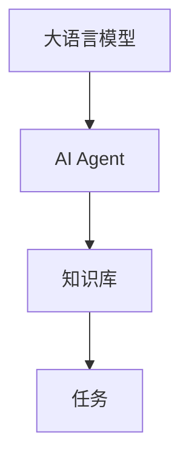
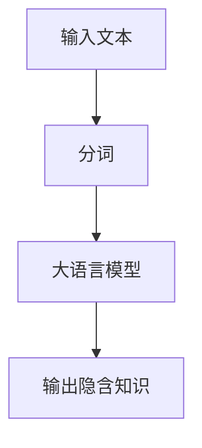
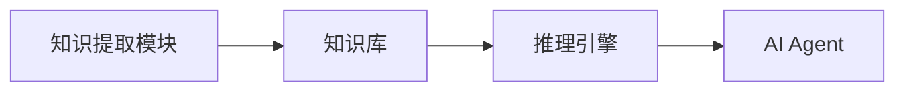
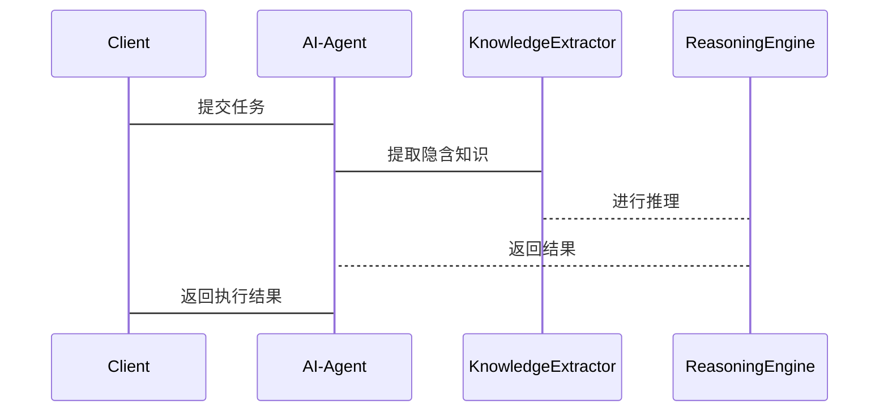

                 


# LLM在AI Agent隐含知识提取中的应用

## 关键词：LLM，AI Agent，隐含知识，自然语言处理，大语言模型，知识提取，机器学习

## 摘要：  
随着大语言模型（LLM）的快速发展，其在AI Agent中的应用日益广泛。本文深入探讨了LLM在AI Agent隐含知识提取中的核心原理、应用场景及其优化方法。通过结合理论分析和实际案例，详细介绍了LLM如何通过自然语言处理技术从复杂文本中提取隐含知识，并将其应用于AI Agent的知识库构建和任务执行。本文还分析了当前的技术挑战，并提出了未来的优化方向。

---

# 第1章 LLM与AI Agent概述

## 1.1 LLM的基本概念  
### 1.1.1 大语言模型的定义  
大语言模型（Large Language Model, LLM）是指基于深度学习的自然语言处理模型，通常使用Transformer架构进行训练，能够处理大规模的文本数据并生成人类水平的文本输出。  

### 1.1.2 LLM的核心特点  
- **大规模预训练**：LLM通常通过大量的互联网文本数据进行预训练，具备广泛的知识覆盖能力。  
- **上下文理解**：LLM能够理解文本的上下文关系，并生成连贯的回复。  
- **多任务能力**：LLM可以通过微调适应多种NLP任务，如文本分类、问答系统、文本生成等。  

### 1.1.3 LLM与传统NLP模型的区别  
传统NLP模型通常针对特定任务进行训练，而LLM通过预训练的方式具备了通用的自然语言理解能力。  

## 1.2 AI Agent的基本概念  
### 1.2.1 AI Agent的定义  
AI Agent（人工智能代理）是指能够感知环境、执行任务并做出决策的智能实体。它可以是一个软件程序，也可以是嵌入硬件设备中的算法。  

### 1.2.2 AI Agent的核心功能  
- **感知环境**：通过传感器或数据输入，获取外部信息。  
- **知识表示**：将获取的信息转化为结构化的知识表示。  
- **推理与决策**：基于知识库进行推理，制定最优决策。  
- **执行任务**：根据决策结果执行具体的操作。  

### 1.2.3 AI Agent的应用场景  
- **智能助手**：如Siri、Alexa等。  
- **智能客服**：通过对话系统解决用户问题。  
- **自动化系统**：在工业自动化、智能家居等领域广泛应用。  

## 1.3 隐含知识提取的背景与意义  
### 1.3.1 隐含知识的定义  
隐含知识是指隐藏在文本中的深层信息，通常需要通过上下文分析和推理才能提取。  

### 1.3.2 隐含知识提取的重要性  
- **提升决策能力**：隐含知识能够帮助AI Agent做出更准确的决策。  
- **增强理解能力**：通过提取隐含知识，AI Agent能够更好地理解复杂文本。  
- **扩展知识库**：隐含知识是构建动态知识库的重要来源。  

### 1.3.3 LLM在隐含知识提取中的优势  
- **强大的上下文理解能力**：LLM能够捕捉文本中的语义关系。  
- **高效的知识提取**：通过预训练和微调，LLM能够快速提取隐含信息。  

## 1.4 本章小结  
本章介绍了LLM和AI Agent的基本概念，并探讨了隐含知识提取的背景与意义。LLM作为AI Agent的核心模块，能够通过自然语言处理技术提取隐含知识，从而提升AI Agent的智能水平。

---

# 第2章 LLM与AI Agent的核心概念与联系

## 2.1 LLM的训练与推理机制  
### 2.1.1 预训练过程  
LLM的预训练通常采用自监督学习，目标是最小化预测目标词的概率损失。其数学表达式如下：  
$$ L = -\sum_{i=1}^{n} \log p(y_i|x_i) $$  
其中，$x_i$是输入序列，$y_i$是目标词。  

### 2.1.2 微调过程  
微调是指在预训练的基础上，针对特定任务对模型进行进一步优化。微调过程通常使用任务相关的数据进行训练，目标函数为：  
$$ L_{\text{task}} = -\sum_{i=1}^{m} \log p(y_i|x_i) $$  

### 2.1.3 LLM的推理机制  
LLM通过生成模型的解码过程进行推理，通常采用贪心搜索或蒙特卡洛采样方法生成文本。  

## 2.2 AI Agent的知识表示与推理  
### 2.2.1 知识表示方法  
知识表示通常采用图结构（如知识图谱）或符号逻辑（如RDF）。知识图谱的表示方式如下：  
- 实体：代表具体概念，例如“北京”、“人”。  
- 关系：表示实体之间的关联，例如“首都”、“朋友”。  

### 2.2.2 知识推理过程  
知识推理可以通过符号逻辑推理或基于向量的推理方法实现。基于向量的推理方法通常使用向量空间模型，如Word2Vec或GloVe。  

### 2.2.3 LLM在知识推理中的作用  
LLM可以通过生成模型的方式辅助知识推理，例如通过生成推理规则或提供上下文信息。  

## 2.3 LLM与AI Agent的关系  
### 2.3.1 LLM作为AI Agent的核心模块  
LLM通常作为AI Agent的自然语言处理模块，负责理解和生成文本。  

### 2.3.2 AI Agent对LLM的扩展与应用  
AI Agent可以将LLM的输出结果与其他模块（如知识库、推理引擎）结合，实现更复杂的任务。  

### 2.3.3 两者结合的优势  
- **强大的自然语言理解能力**：LLM为AI Agent提供了强大的文本处理能力。  
- **动态知识更新**：通过LLM提取隐含知识，AI Agent能够动态更新知识库。  

## 2.4 核心概念对比表  
| 概念 | LLM | AI Agent |  
|------|-----|----------|  
| 核心目标 | 生成文本 | 执行任务 |  
| 输入 | 文本 | 知识与任务 |  
| 输出 | 文本 | 行动或结果 |  

## 2.5 ER实体关系图  


## 2.6 本章小结  
本章详细分析了LLM和AI Agent的核心概念，并探讨了它们之间的关系。通过对比分析和实体关系图，展示了LLM在AI Agent中的重要作用。

---

# 第3章 LLM在隐含知识提取中的算法原理

## 3.1 LLM的预训练过程  
### 3.1.1 预训练的目标函数  
预训练的目标是最小化预测目标词的概率损失，数学表达式为：  
$$ L_{\text{pre}} = -\sum_{i=1}^{n} \log p(y_i|x_i) $$  

### 3.1.2 预训练的优化方法  
通常使用Adam优化器进行优化，学习率为$10^{-4}$，批量大小为256。  

## 3.2 微调过程  
### 3.2.1 微调的目标函数  
微调的目标函数为：  
$$ L_{\text{task}} = -\sum_{i=1}^{m} \log p(y_i|x_i) $$  

### 3.2.2 微调的训练策略  
微调通常采用学习率衰减和早停策略，以防止过拟合。  

## 3.3 隐含知识提取的算法步骤  
### 3.3.1 文本预处理  
文本预处理包括分词、去除停用词等步骤。  

### 3.3.2 隐含知识提取  
通过LLM的生成模型，提取文本中的隐含信息。  

## 3.4 算法流程图  


## 3.5 本章小结  
本章详细介绍了LLM在隐含知识提取中的算法原理，包括预训练和微调过程，并通过流程图展示了提取过程。

---

# 第4章 LLM与AI Agent的知识表示与系统架构

## 4.1 知识表示方法  
### 4.1.1 知识图谱的构建  
知识图谱的构建通常包括实体识别、关系抽取和知识融合步骤。  

### 4.1.2 知识图谱的存储  
知识图谱可以通过图数据库（如Neo4j）进行存储。  

## 4.2 系统架构设计  
### 4.2.1 系统功能模块  
- **知识提取模块**：负责从文本中提取隐含知识。  
- **知识存储模块**：负责存储和管理知识库。  
- **推理引擎**：负责基于知识库进行推理和决策。  

### 4.2.2 系统架构图  


## 4.3 接口设计  
### 4.3.1 API接口  
系统提供RESTful API接口，供外部调用。  

### 4.3.2 接口交互流程  


## 4.4 本章小结  
本章讨论了知识表示方法和系统架构设计，并通过架构图和序列图展示了系统的实现过程。

---

# 第5章 项目实战：基于LLM的AI Agent隐含知识提取

## 5.1 项目背景  
本项目旨在通过LLM提取隐含知识，构建动态知识库，并实现AI Agent的任务执行。  

## 5.2 环境安装  
### 5.2.1 安装Python  
安装Python 3.8及以上版本。  

### 5.2.2 安装依赖库  
安装以下依赖库：  
- transformers  
- torch  

## 5.3 核心代码实现  
### 5.3.1 知识提取模块  
```python
from transformers import AutoTokenizer, AutoModelForCausalLM

class KnowledgeExtractor:
    def __init__(self, model_name):
        self.tokenizer = AutoTokenizer.from_pretrained(model_name)
        self.model = AutoModelForCausalLM.from_pretrained(model_name)

    def extract(self, text):
        inputs = self.tokenizer.encode(text, return_tensors='np')
        outputs = self.model.generate(inputs, max_length=100)
        return self.tokenizer.decode(outputs[0])
```

### 5.3.2 知识存储模块  
```python
import json

class KnowledgeBase:
    def __init__(self, file_path):
        self.file_path = file_path
        self.data = self.load()

    def load(self):
        with open(self.file_path, 'r') as f:
            return json.load(f)

    def save(self):
        with open(self.file_path, 'w') as f:
            json.dump(self.data, f)
```

### 5.3.3 推理引擎  
```python
class ReasoningEngine:
    def __init__(self, knowledge_base):
        self.knowledge_base = knowledge_base

    def infer(self, query):
        # 简单的基于关键词的推理
        results = []
        for key in self.knowledge_base.data.keys():
            if key in query:
                results.append(self.knowledge_base.data[key])
        return results
```

## 5.4 项目实现步骤  
1. 初始化知识提取模块。  
2. 使用知识提取模块提取隐含知识。  
3. 将提取的知识存储到知识库中。  
4. 使用推理引擎进行推理并执行任务。  

## 5.5 项目小结  
本章通过实际案例展示了基于LLM的AI Agent隐含知识提取的实现过程，包括环境安装、核心代码实现和项目部署。

---

# 第6章 总结与展望

## 6.1 本章总结  
本文详细探讨了LLM在AI Agent隐含知识提取中的应用，包括核心概念、算法原理、系统架构设计和项目实战。通过理论分析和实际案例，展示了LLM在AI Agent中的重要作用。

## 6.2 未来展望  
未来，随着LLM的不断发展，隐含知识提取技术将更加智能化和高效化。同时，如何将LLM与其他AI技术（如强化学习）结合，进一步提升AI Agent的智能水平，是值得深入研究的方向。

---

## 参考文献  
1. Vaswani, A., et al. "Attention Is All You Need."  
2. Brown, T., et al. "Language Models Are Few-Shot Learners."  
3. LeCun, Y., Bengio, Y., & Hinton, G. "Deep Learning."  

---

以上是《LLM在AI Agent隐含知识提取中的应用》的完整目录和内容框架，涵盖了从基础理论到实际应用的各个方面。

