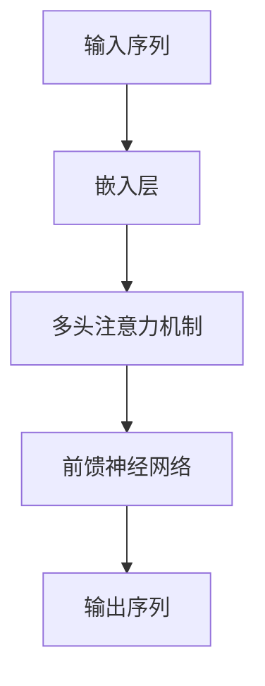
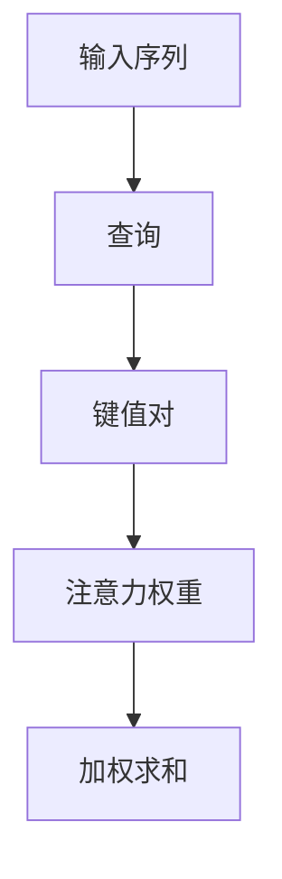
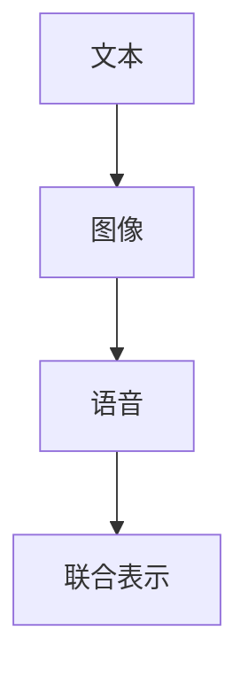
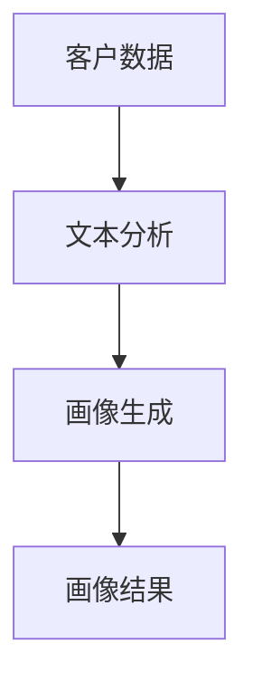
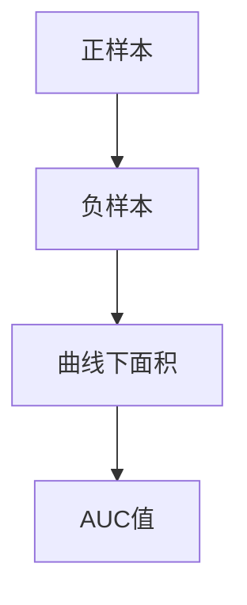
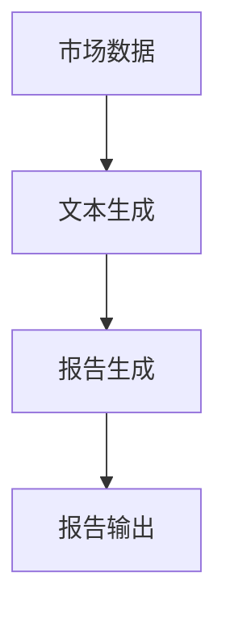

                 


# LLM大模型在金融领域的应用前景与挑战

## 关键词：LLM，大模型，金融，人工智能，自然语言处理

## 摘要：本文探讨了大语言模型（LLM）在金融领域的应用前景与挑战。从智能投顾到风险评估，LLM正在改变金融行业的运作方式。文章详细分析了LLM的核心技术，包括模型架构、训练方法和调优策略，并通过具体案例展示了其在金融中的应用场景。同时，文章也讨论了技术挑战，如数据隐私、模型风险和可解释性问题，并提出了相应的解决方案。

---

# 第1章: LLM大模型的概述

## 1.1 LLM大模型的基本概念

### 1.1.1 大语言模型的定义
大语言模型（LLM）是一种基于深度学习的自然语言处理模型，通常采用Transformer架构，通过大量数据训练而成。LLM能够理解和生成人类语言，具备强大的上下文理解和生成能力。

$$LLM = f_{\theta}(x; \theta)$$

其中，$x$是输入文本，$\theta$是模型参数。

### 1.1.2 LLM的核心技术特点

1. **自注意力机制**：通过计算输入序列中每个词与其他词的相关性，生成位置相关的表示。
2. **并行计算**：采用多头注意力机制，同时关注输入序列的不同部分。
3. **预训练与微调**：通过大量通用数据预训练，再在特定领域数据上进行微调。

### 1.1.3 LLM与传统NLP模型的对比

| 特性       | LLM                     | 传统NLP模型             |
|------------|--------------------------|--------------------------|
| 模型复杂度   | 高，参数量大             | 较低，参数量小           |
| 上下文理解   | 强大，支持长距离依赖     | 较弱，依赖n-gram特征     |
| 应用场景     | 多领域通用               | 专注于特定任务           |

## 1.2 LLM在金融领域的应用潜力

### 1.2.1 金融领域的核心问题与挑战

1. **数据稀疏性**：金融领域的数据通常高度结构化，且部分数据难以获取。
2. **实时性要求**：金融市场对实时性要求高，需要快速生成和处理信息。
3. **可解释性**：金融决策需要可解释性，而LLM的黑箱特性可能影响其应用。

### 1.2.2 LLM在金融中的应用场景概述

1. **智能投顾**：为投资者提供个性化投资建议。
2. **风险评估**：通过分析文本数据评估信用风险。
3. **股票预测**：基于新闻和社交媒体数据预测股价走势。
4. **金融文本生成**：自动生成财务报告和市场分析。

### 1.2.3 LLM对金融行业的影响与价值

1. **提升效率**：自动化处理大量金融数据和文本。
2. **降低成本**：减少人工干预，降低运营成本。
3. **增强决策能力**：通过深度分析提供更精准的决策支持。

## 1.3 本章小结

本章介绍了LLM的基本概念和技术特点，分析了其在金融领域的应用潜力，并探讨了相关挑战。为后续章节的深入分析奠定了基础。

---

# 第2章: LLM大模型的核心技术

## 2.1 大语言模型的架构与训练

### 2.1.1 Transformer模型的结构

Mermaid图展示Transformer模型结构：



### 2.1.2 LLM的训练方法

1. **预训练**：在大规模通用数据上进行无监督训练，目标是生成与真实数据一致的上下文。
2. **微调**：在特定领域数据上进行有监督训练，优化模型在金融任务上的表现。

训练过程的伪代码：

```python
def train_model(model, optimizer, criterion, train_loader, epochs):
    for epoch in range(epochs):
        for batch in train_loader:
            inputs, labels = batch
            outputs = model(inputs)
            loss = criterion(outputs, labels)
            loss.backward()
            optimizer.step()
            model.zero_grad()
```

### 2.1.3 模型的调优策略

1. **参数调整**：调节学习率、批量大小等超参数。
2. **数据增强**：通过数据增强技术增加训练数据的多样性。
3. **模型压缩**：采用模型剪枝、知识蒸馏等技术减少模型规模。

## 2.2 LLM的推理机制

### 2.2.1 解码过程的详细分析

解码过程分为三个阶段：初始化、生成词、计算概率。

伪代码：

```python
def generate_text(model, input_str, max_length):
    input_tensor = tokenize(input_str)
    for i in range(max_length):
        output = model(input_tensor)
        probabilities = softmax(output)
        next_token = sample(probabilities)
        input_tensor = append(next_token)
```

### 2.2.2 注意力机制的作用

注意力机制通过计算输入序列中每个词的重要性，生成位置相关的表示。

Mermaid图展示注意力机制：



### 2.2.3 模型的可解释性问题

为了解决可解释性问题，可以采用以下方法：

1. **注意力可视化**：通过可视化注意力权重，分析模型关注的内容。
2. **生成过程分析**：分析模型生成输出的每一步，了解生成逻辑。

## 2.3 LLM的性能评估与优化

### 2.3.1 评估指标的定义与计算

常用的评估指标包括准确率、召回率、F1值和困惑度（Perplexity）。

公式：
$$F1 = 2 \cdot \frac{precision \cdot recall}{precision + recall}$$

### 2.3.2 模型压缩与轻量化技术

1. **模型剪枝**：去除模型中冗余的参数。
2. **知识蒸馏**：将大模型的知识迁移到小模型。
3. **量化**：将模型参数量化，减少存储空间。

### 2.3.3 多模态能力的增强

通过整合图像、语音等多模态数据，提升模型的综合理解能力。

Mermaid图展示多模态模型：



## 2.4 本章小结

本章详细介绍了LLM的核心技术，包括模型架构、训练方法和推理机制，并探讨了性能评估与优化策略。这些内容为后续章节的应用分析奠定了技术基础。

---

# 第3章: LLM在金融领域的具体应用

## 3.1 智能投顾与财富管理

### 3.1.1 智能投顾的核心功能

智能投顾通过分析用户的需求和市场数据，提供个性化的投资建议。

伪代码：

```python
def get_recommendations(user_profile, market_data):
    user_features = extract_features(user_profile)
    market_features = extract_features(market_data)
    recommendations = model(user_features, market_features)
    return recommendations
```

### 3.1.2 LLM在客户画像中的应用

通过分析客户的文本数据，生成客户画像。

Mermaid图展示客户画像生成流程：



### 3.1.3 投资组合优化的实现

通过分析市场数据和客户偏好，生成最优投资组合。

公式：
$$\text{优化目标} = \min_{w} \sum_{i=1}^{n} w_i^T \Sigma w_i + \lambda \sum_{i=1}^{n} (w_i - w_{i-1})^2$$

其中，$\Sigma$是协方差矩阵，$\lambda$是惩罚系数。

## 3.2 风险评估与信用评分

### 3.2.1 风险评估的基本原理

通过分析文本数据，评估信用风险。

伪代码：

```python
def assess_credit_risk(customer_info):
    features = extract_features(customer_info)
    risk_score = model(features)
    return risk_score
```

### 3.2.2 LLM在信用评分中的应用

通过分析客户的文本数据，生成信用评分。

公式：
$$\text{信用评分} = \beta_0 + \beta_1 x_1 + \beta_2 x_2 + \dots + \beta_n x_n$$

其中，$\beta_i$是模型参数，$x_i$是输入特征。

### 3.2.3 模型的稳定性与准确性

通过交叉验证和AUC曲线评估模型性能。

Mermaid图展示AUC曲线：



## 3.3 股票预测与市场分析

### 3.3.1 股票预测的挑战与方法

股票预测的挑战包括数据噪声和市场波动。

### 3.3.2 LLM在市场情绪分析中的应用

通过分析社交媒体和新闻数据，生成市场情绪指数。

伪代码：

```python
def analyze_market_sentiment(text_data):
    features = extract_features(text_data)
    sentiment = model(features)
    return sentiment
```

### 3.3.3 预测结果的可解释性问题

为了解决可解释性问题，可以采用以下方法：

1. **注意力可视化**：分析模型关注的内容。
2. **生成过程分析**：了解模型的生成逻辑。

## 3.4 金融文本生成与报告撰写

### 3.4.1 金融报告生成的流程

通过分析输入数据，生成结构化的金融报告。

伪代码：

```python
def generate_financial_report(data):
    report = model(data)
    return report
```

### 3.4.2 LLM在市场分析中的应用

通过分析市场数据，生成市场分析报告。

Mermaid图展示报告生成流程：



### 3.4.3 报告的准确性和可读性

通过人工审核和自动化校验，确保报告的准确性和可读性。

---

# 第4章: LLM在金融领域的挑战与解决方案

## 4.1 技术挑战

### 4.1.1 数据隐私问题

通过数据匿名化和联邦学习解决数据隐私问题。

### 4.1.2 模型风险

通过模型监控和风险评估，降低模型风险。

### 4.1.3 可解释性问题

通过注意力可视化和生成过程分析，提升模型的可解释性。

## 4.2 数据隐私问题的解决方案

### 4.2.1 数据匿名化

通过匿名化处理，保护数据隐私。

### 4.2.2 联邦学习

通过联邦学习，分布式训练模型，保护数据隐私。

### 4.2.3 同态加密

通过同态加密技术，实现加密数据的计算。

## 4.3 模型风险管理

### 4.3.1 模型监控

通过实时监控，发现模型性能下降的问题。

### 4.3.2 模型更新

通过定期更新模型，保持模型的准确性。

### 4.3.3 模型评估

通过AUC曲线和F1值，评估模型性能。

## 4.4 可解释性问题的解决方案

### 4.4.1 注意力可视化

通过可视化注意力权重，分析模型关注的内容。

### 4.4.2 生成过程分析

通过分析生成过程，了解模型的生成逻辑。

### 4.4.3 解释性文本生成

通过模型生成解释性文本，帮助用户理解模型决策。

## 4.5 本章小结

本章分析了LLM在金融领域的挑战，并提出了相应的解决方案。这些解决方案包括数据隐私保护、模型风险管理以及可解释性提升。

---

# 第5章: LLM的未来发展趋势

## 5.1 技术发展趋势

### 5.1.1 模型轻量化

通过模型剪枝和量化技术，降低模型规模。

### 5.1.2 多模态能力增强

通过整合图像、语音等多模态数据，提升模型的综合理解能力。

### 5.1.3 实时处理能力提升

通过优化算法和硬件加速，提升模型的实时处理能力。

## 5.2 金融行业的影响

### 5.2.1 智能投顾普及

随着模型性能的提升，智能投顾将更加普及。

### 5.2.2 风险管理优化

通过模型优化，风险管理将更加精准和高效。

### 5.2.3 金融创新加速

LLM将推动金融行业的创新，例如智能合约和自动化交易。

## 5.3 未来研究方向

### 5.3.1 更强的可解释性

通过研究，提升模型的可解释性。

### 5.3.2 更高效的训练方法

通过优化算法，提升模型的训练效率。

### 5.3.3 更广泛的应用场景

探索更多金融应用场景，例如智能合约和金融监管。

## 5.4 本章小结

本章分析了LLM的未来发展趋势，并探讨了其对金融行业的影响。未来，LLM将在金融领域发挥更大的作用。

---

# 结语

LLM大模型正在深刻改变金融行业的运作方式。从智能投顾到风险评估，LLM的应用前景广阔。然而，数据隐私、模型风险和可解释性问题也带来了挑战。通过技术创新和制度保障，我们可以克服这些挑战，推动LLM在金融领域的广泛应用。

---

# 参考文献

（此处可以添加相关参考文献）

---

# 致谢

感谢所有参与本文写作和支持的人员。

