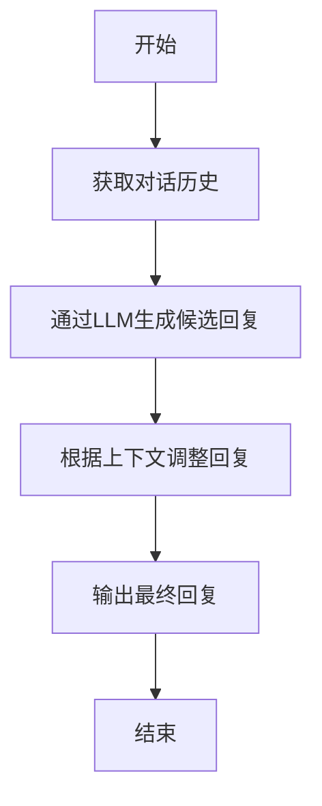
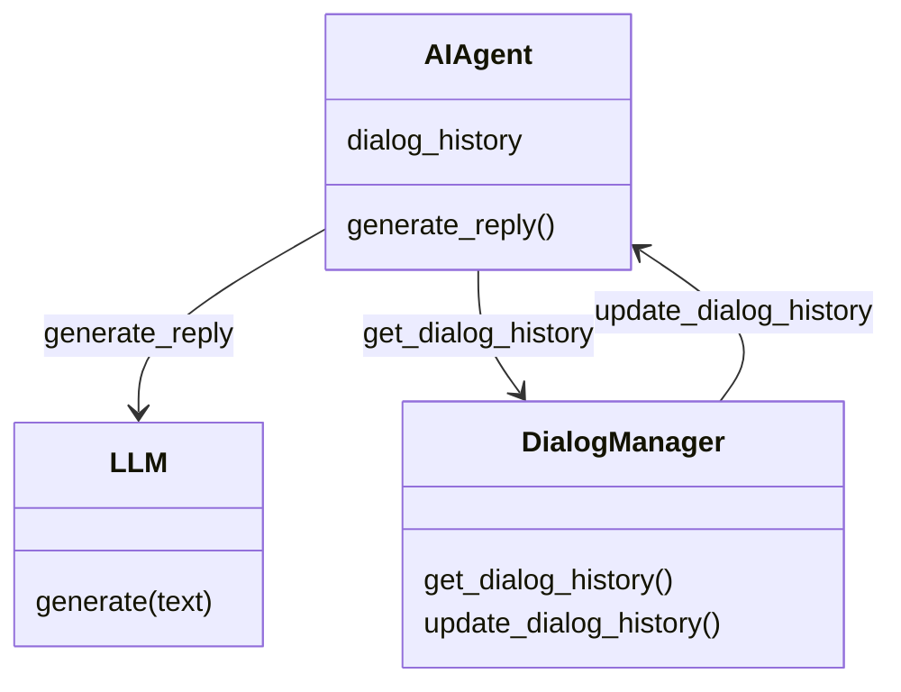
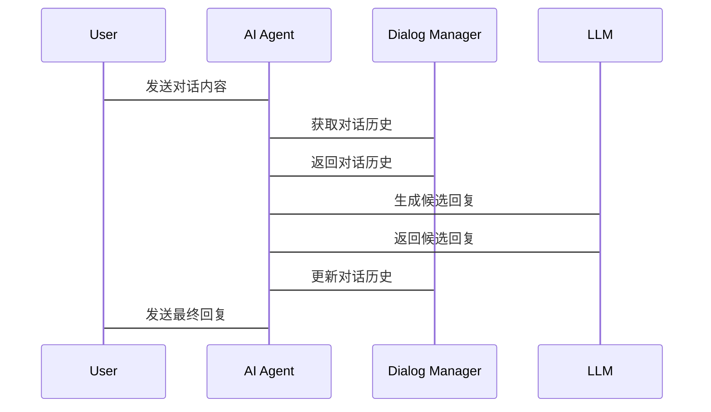

                 


# LLM支持的AI Agent上下文感知对话生成

## 关键词：LLM，AI Agent，上下文感知，对话生成，大语言模型，人工智能代理

## 摘要：  
本文深入探讨了利用大语言模型（LLM）构建支持上下文感知的AI Agent对话生成系统。文章从基础概念、算法原理、系统架构到项目实战，详细分析了如何通过LLM实现上下文感知对话生成，涵盖了核心算法、数学模型、系统设计以及实际案例，为读者提供全面的技术指导。

---

# 第一部分: LLM与AI Agent基础

## 第1章: LLM的基本概念

### 1.1 大语言模型的定义  
大语言模型（Large Language Model, LLM）是指经过大量文本数据训练的深度学习模型，如GPT系列、BERT系列等。这些模型具有强大的文本生成、理解和推理能力。

### 1.2 LLM的核心特点  
- **大规模数据训练**：利用海量文本数据进行训练，提升模型的泛化能力。  
- **生成能力**：能够生成连贯且合理的文本，适用于对话生成、内容创作等多种任务。  
- **上下文理解**：通过上下文分析，生成符合情境的回复。  

### 1.3 LLM与传统NLP模型的区别  
- **传统NLP模型**：依赖特定任务训练，如词性标注、情感分析等。  
- **LLM**：通用性强，能够在多种任务中发挥作用，支持上下文感知对话生成。  

---

## 第2章: AI Agent的基本概念

### 2.1 AI Agent的定义  
AI Agent是能够感知环境、自主决策并执行任务的智能体。它可以在多种场景中与用户交互，提供服务。  

### 2.2 AI Agent的核心功能  
- **感知环境**：通过传感器或输入数据获取环境信息。  
- **决策与推理**：基于感知信息进行推理，制定行动计划。  
- **执行任务**：根据决策结果执行操作，如生成对话回复、控制设备等。  

### 2.3 AI Agent的应用场景  
- **智能客服**：提供个性化服务，解决用户问题。  
- **智能助手**：帮助用户完成日常任务，如日程管理、信息查询。  
- **教育辅助**：提供个性化的学习建议和辅导。  

---

## 第3章: 上下文感知对话生成的必要性

### 3.1 对话生成的基本问题  
- **上下文依赖**：对话内容必须基于历史对话信息。  
- **情境理解**：对话生成需要理解当前对话的情境和用户意图。  
- **一致性与连贯性**：生成的回复必须与上下文一致，确保对话的连贯性。  

### 3.2 上下文感知的重要性  
- **提升用户体验**：上下文感知能够使对话更自然，更贴近真实对话。  
- **增强智能性**：通过理解上下文，AI Agent能够更好地理解用户需求。  

### 3.3 LLM在上下文感知中的作用  
- **历史对话记录**：LLM能够利用对话历史生成连贯的回复。  
- **实时上下文理解**：通过分析当前对话内容，调整生成策略。  

---

# 第二部分: 核心概念与联系

## 第4章: LLM与上下文感知对话生成的关系

### 4.1 LLM在对话生成中的作用  
- **文本生成**：LLM能够生成多样化的文本回复。  
- **上下文理解**：LLM能够分析对话历史，生成符合上下文的回复。  
- **对话管理**：LLM可以辅助AI Agent进行对话流程管理。  

### 4.2 上下文感知对话生成的原理  
- **对话历史**：利用对话历史信息，生成相关的回复。  
- **实时上下文理解**：根据当前对话内容，调整生成策略。  
- **协同工作**：LLM与AI Agent协同，实现上下文感知对话生成。  

### 4.3 LLM与AI Agent的协同工作  
- **LLM作为核心模块**：AI Agent利用LLM进行文本生成和上下文理解。  
- **AI Agent的决策机制**：AI Agent根据LLM生成的回复，调整对话流程。  

### 4.4 核心概念对比表  
| **对比维度** | **LLM**                     | **传统NLP模型**           |
|--------------|-----------------------------|---------------------------|
| **任务通用性** | 高，支持多种任务             | 低，针对特定任务           |
| **数据需求**  | 大规模数据训练               | 较小规模数据               |
| **计算资源**  | 高，需要高性能计算资源         | 较低，普通计算资源           |

### 4.5 实体关系图（ER图）  
```mermaid
erd
    entity LLM {
        id
        模型参数
        训练数据
    }

    entity AI Agent {
        id
        功能模块
        交互接口
    }

    entity 对话历史 {
        id
        对话内容
        时间戳
    }

    LLM --> 对话历史: 生成回复
    AI Agent --> 对话历史: 记录对话
```

---

## 第5章: 基于LLM的上下文感知对话生成算法

### 5.1 算法概述  
基于LLM的上下文感知对话生成算法包括以下步骤：  
1. 获取对话历史。  
2. 通过LLM生成候选回复。  
3. 根据上下文调整回复，确保连贯性。  
4. 输出最终回复。  

### 5.2 算法流程图  


### 5.3 Python代码实现  
```python
def generate_contextual_reply(dialog_history):
    # 获取对话历史
    context = " ".join(dialog_history)
    
    # 通过LLM生成候选回复
    candidate Replies = llm.generate(context)
    
    # 根据上下文调整回复
    adjusted Replies = []
    for reply in candidate Replies:
        if is_contextually_appropriate(reply, dialog_history):
            adjusted Replies.append(reply)
    
    # 输出最终回复
    return adjusted Replies[0]

def is_contextually_appropriate(reply, dialog_history):
    # 检查回复是否与上下文一致
    last_message = dialog_history[-1]
    if last_message in reply:
        return True
    else:
        return False
```

### 5.4 数学模型与公式  
生成回复的概率公式：  
$$ P(w_i | w_{i-1}, ..., w_1) = \frac{P(w_i, w_{i-1}, ..., w_1)}{P(w_{i-1}, ..., w_1)} $$  
其中，$w_i$ 表示第i个词，$P(w_i | w_{i-1}, ..., w_1)$ 是在已知前面词的情况下生成当前词的概率。  

---

## 第6章: 系统分析与架构设计方案

### 6.1 项目背景与介绍  
本项目旨在开发一个支持上下文感知的AI Agent对话系统，利用LLM进行对话生成，提升用户体验。  

### 6.2 系统功能设计  
- **对话管理模块**：负责处理对话历史和上下文。  
- **生成模块**：基于对话历史，生成回复。  
- **调整模块**：根据上下文，调整生成的回复。  

### 6.3 系统架构设计  


### 6.4 系统接口设计  
- **输入接口**：接收用户输入的对话内容。  
- **输出接口**：输出生成的回复。  
- **调用接口**：AI Agent调用LLM生成回复。  

### 6.5 系统交互流程图  


---

## 第7章: 项目实战

### 7.1 环境安装  
- **Python**：安装Python 3.8及以上版本。  
- **库的安装**：安装必要的库，如`transformers`、`torch`等。  

### 7.2 核心实现代码  
```python
from transformers import GPT2LMHeadModel, GPT2Tokenizer

def install_environment():
    import pip
    pip.main(['install', 'transformers', 'torch'])

def main():
    model_name = "gpt2"
    tokenizer = GPT2Tokenizer.from_pretrained(model_name)
    model = GPT2LMHeadModel.from_pretrained(model_name)
    
    dialog_history = ["用户：今天天气怎么样？", 
                      "AI Agent：今天天气很好。"]
    context = " ".join(dialog_history)
    inputs = tokenizer.encode(context + tokenizer.eos_token, return_tensors="pt")
    
    outputs = model.generate(inputs, max_length=50, temperature=0.7)
    reply = tokenizer.decode(outputs[0], skip_special_tokens=True)
    
    print("AI Agent的回复：", reply)

if __name__ == "__main__":
    install_environment()
    main()
```

### 7.3 案例分析与解读  
假设用户输入：“我今天心情不好。”  
对话历史为：  
1. 用户：我今天心情不好。  
2. AI Agent：有什么我可以帮忙的吗？  

通过LLM生成候选回复，如：“你可以和我聊聊你的心情吗？”  
调整回复，确保与上下文一致，最终输出：“你可以和我聊聊你的心情吗？”  

---

## 第8章: 最佳实践、小结与注意事项

### 8.1 最佳实践  
- **模型选择**：选择适合任务的LLM模型，如GPT-3、PaLM等。  
- **上下文管理**：确保对话历史的有效管理和利用。  
- **用户反馈**：收集用户反馈，优化对话生成策略。  

### 8.2 小结  
本文详细介绍了LLM支持的AI Agent上下文感知对话生成的原理、算法、系统架构和实现方法，为读者提供了全面的技术指导。  

### 8.3 注意事项  
- **数据隐私**：确保用户数据的安全和隐私。  
- **计算资源**：合理配置计算资源，确保系统的高效运行。  
- **模型调优**：根据实际需求，对模型进行调优，提升生成效果。  

### 8.4 拓展阅读  
- **《Deep Learning》—— Ian Goodfellow  
- **《Transformer in Action》——博文出版社  
- **《Large Language Models: A Survey》—— arXiv  

---

通过本文的学习，读者可以掌握利用LLM构建支持上下文感知对话生成AI Agent的核心技术，并能够将其应用于实际项目中。

