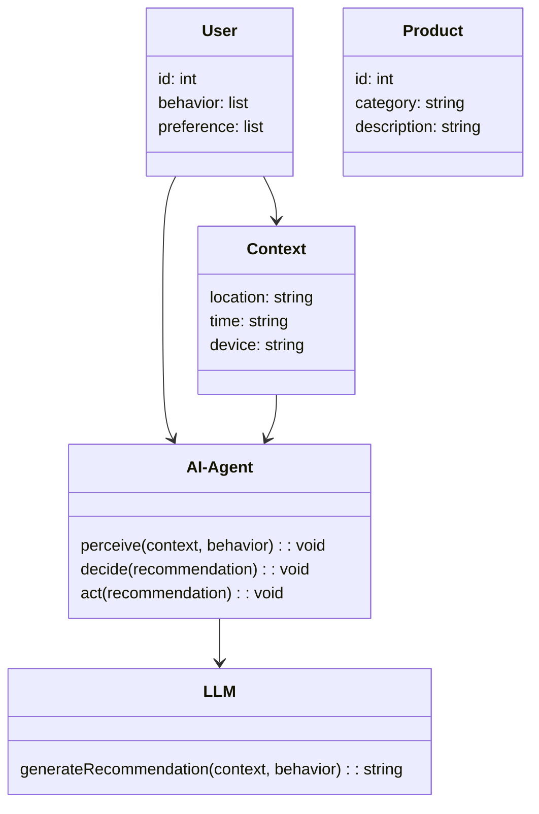
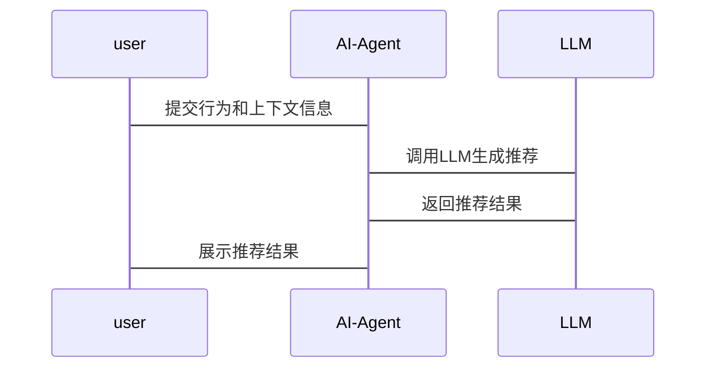

                 


# LLM支持的AI Agent上下文感知推荐技术

## 关键词：
- LLM（Large Language Model）
- AI Agent
- 上下文感知推荐
- 推荐系统
- 机器学习

## 摘要：
本文详细探讨了基于LLM的AI Agent在上下文感知推荐技术中的应用。通过分析上下文感知推荐的背景、核心概念、算法原理、系统架构、项目实战以及最佳实践，本文为读者提供了全面的技术视角。文章不仅解释了LLM和AI Agent的基本原理，还详细阐述了它们在推荐系统中的协同作用，同时通过实例展示了如何将这些技术应用于实际场景中。

---

# 第一部分: LLM支持的AI Agent上下文感知推荐技术背景

## 第1章: 上下文感知推荐技术的背景与问题

### 1.1 问题背景

#### 1.1.1 当前推荐系统的发展现状
推荐系统在电子商务、社交媒体和娱乐等领域发挥着重要作用。传统的推荐系统主要依赖协同过滤和基于内容的推荐方法，这些方法虽然有效，但存在以下局限性：
- **数据稀疏性**：当用户数据较少时，推荐系统的准确性下降。
- **实时性不足**：传统方法难以实时响应用户行为的变化。
- **缺乏上下文感知**：无法有效利用实时的上下文信息（如用户当前的操作、地理位置、时间等）来提升推荐的准确性。

#### 1.1.2 上下文感知推荐技术的提出背景
随着人工智能和大数据技术的发展，推荐系统需要更加智能化和个性化。上下文感知推荐技术通过整合实时的上下文信息，能够更好地理解用户的需求，从而提供更精准的推荐。例如，在电商领域，上下文感知推荐可以根据用户当前的浏览行为和时间推荐相关产品；在社交媒体上，可以根据用户的当前情绪推荐相关内容。

#### 1.1.3 传统推荐系统的局限性
传统推荐系统主要依赖历史数据，难以捕捉用户的实时行为和环境信息。例如，协同过滤方法依赖用户的历史评分数据，而基于内容的推荐方法依赖商品的属性信息。这些方法无法充分利用实时的上下文信息，导致推荐结果的准确性和相关性有限。

### 1.2 问题描述

#### 1.2.1 上下文感知推荐的核心问题
上下文感知推荐的核心问题是如何有效地整合实时的上下文信息，以提升推荐的准确性和相关性。具体来说，以下问题需要解决：
- 如何实时捕捉和处理用户行为、地理位置、时间等上下文信息？
- 如何将这些信息与用户的历史数据和偏好结合起来，以生成个性化推荐？

#### 1.2.2 用户行为与上下文信息的关联性
用户的行为（如点击、收藏、购买）与其所处的上下文环境密切相关。例如，用户在深夜浏览电子产品可能是因为需要购买礼物，而下午浏览可能是因为寻找办公用品。理解这些关联性对于提升推荐的准确性至关重要。

#### 1.2.3 推荐系统的实时性与个性化需求
用户的需求是动态变化的，推荐系统需要具备实时性，能够快速响应用户的行为变化。此外，个性化需求要求推荐系统能够根据用户的实时行为和上下文信息，提供高度个性化的推荐。

### 1.3 问题解决

#### 1.3.1 LLM在推荐系统中的应用优势
大语言模型（LLM）具有强大的自然语言处理能力，能够理解和生成人类语言。在推荐系统中，LLM可以用于分析用户的文本输入（如搜索词、评论）以及上下文信息（如产品描述、用户行为），从而生成更精准的推荐。

#### 1.3.2 AI Agent在上下文感知中的作用
AI Agent（智能代理）能够实时感知用户的行为和环境信息，并通过LLM进行分析和决策。例如，AI Agent可以监测用户的浏览行为，结合上下文信息（如时间、地点、设备类型）生成推荐。

#### 1.3.3 上下文感知推荐的实现路径
实现上下文感知推荐需要以下步骤：
1. **数据采集**：收集用户的行为数据、上下文信息（如时间、地点）以及商品属性数据。
2. **数据处理**：对收集到的数据进行清洗、预处理和特征提取。
3. **模型训练**：利用机器学习算法（如深度学习模型）训练推荐模型。
4. **实时推荐**：根据用户的实时行为和上下文信息，生成个性化推荐。

### 1.4 边界与外延

#### 1.4.1 上下文感知推荐的边界
上下文感知推荐的边界包括：
- **数据范围**：仅考虑用户的实时行为和上下文信息，不涉及用户的历史数据。
- **应用场景**：适用于需要实时推荐的场景，如电商、社交媒体、新闻推荐等。

#### 1.4.2 相关技术的区分与联系
相关技术包括：
- **协同过滤**：基于用户相似性或商品相似性进行推荐。
- **基于内容的推荐**：基于商品属性进行推荐。
- **基于模型的推荐**：利用机器学习模型进行推荐。
- **实时推荐系统**：基于实时数据进行推荐。

上下文感知推荐与这些技术的区别在于其强调实时的上下文信息。

#### 1.4.3 应用场景的限制与扩展
上下文感知推荐的应用场景包括电商、社交媒体、新闻推荐等，但目前还难以应用于需要高度专业化的领域（如医疗、法律咨询）。

---

## 第2章: LLM与AI Agent的核心概念

### 2.1 LLM的基本原理

#### 2.1.1 大语言模型的定义与特点
大语言模型是一种基于深度学习的自然语言处理模型，具有以下特点：
- **大规模训练数据**：通常使用海量文本数据进行训练。
- **多任务学习能力**：能够同时处理多种自然语言处理任务（如文本生成、问答系统）。
- **上下文理解能力**：能够理解文本的上下文关系。

#### 2.1.2 LLM的训练机制与模型结构
大语言模型通常采用自监督学习机制，利用文本的上下文关系进行训练。模型结构包括编码器和解码器，编码器用于理解输入文本，解码器用于生成输出文本。

#### 2.1.3 LLM的输出特性与应用场景
大语言模型的输出具有以下特性：
- **多样性**：能够生成多种不同的文本输出。
- **可解释性**：生成的文本通常具有较高的可读性和逻辑性。

应用场景包括：
- **文本生成**：生成产品描述、新闻报道。
- **问答系统**：回答用户的问题。
- **对话系统**：与用户进行对话交互。

### 2.2 AI Agent的基本原理

#### 2.2.1 AI Agent的定义与分类
AI Agent是一种能够感知环境并采取行动以实现目标的智能实体。根据功能的不同，AI Agent可以分为以下几类：
- **简单反射式Agent**：基于当前感知直接采取行动。
- **基于模型的反射式Agent**：基于内部模型进行推理后采取行动。
- **目标驱动的Agent**：根据目标采取行动。

#### 2.2.2 AI Agent的核心功能与实现方式
AI Agent的核心功能包括：
- **感知环境**：通过传感器或API获取环境信息。
- **推理与决策**：基于感知的信息进行推理并做出决策。
- **执行行动**：根据决策结果采取行动。

#### 2.2.3 AI Agent与传统推荐系统的区别
AI Agent具有更强的自主性和适应性，能够根据环境信息动态调整推荐策略，而传统推荐系统通常基于固定的数据和模型进行推荐。

### 2.3 LLM与AI Agent的关系

#### 2.3.1 LLM作为AI Agent的核心组件
大语言模型可以作为AI Agent的核心组件，用于处理自然语言输入和生成自然语言输出。

#### 2.3.2 AI Agent通过LLM实现上下文感知
AI Agent可以通过调用LLM API，利用模型的上下文理解和生成能力，实现对用户行为和环境信息的感知。

#### 2.3.3 LLM与AI Agent的协同工作流程
1. **感知环境**：AI Agent通过传感器或API获取环境信息（如用户行为、地理位置）。
2. **调用LLM**：AI Agent将环境信息传递给LLM，生成自然语言描述或决策建议。
3. **推理与决策**：AI Agent根据LLM的输出进行推理，做出推荐决策。
4. **执行行动**：AI Agent根据决策结果采取行动（如发送推荐信息）。

---

## 第3章: 上下文感知推荐的核心概念

### 3.1 上下文感知的基本概念

#### 3.1.1 上下文的定义与分类
上下文是指与当前任务相关的环境信息，可以分为：
- **用户上下文**：包括用户的行为、偏好、历史数据等。
- **环境上下文**：包括地理位置、时间、设备类型等。

#### 3.1.2 上下文信息的来源与特征
上下文信息的来源包括：
- **用户输入**：如搜索词、点击行为。
- **环境数据**：如地理位置、时间戳。
- **商品属性**：如商品类别、价格、评价等。

上下文信息的特征包括：
- **实时性**：信息是动态变化的。
- **多样性**：信息类型多样。
- **相关性**：信息与推荐目标相关。

#### 3.1.3 上下文感知的核心目标
上下文感知的核心目标是通过整合实时的上下文信息，提升推荐的准确性和相关性。

### 3.2 推荐系统的核心概念

#### 3.2.1 推荐系统的定义与分类
推荐系统是一种信息过滤系统，能够根据用户的行为和偏好推荐相关的信息或产品。推荐系统可以分为：
- **基于协同过滤的推荐系统**：基于用户相似性进行推荐。
- **基于内容的推荐系统**：基于商品属性进行推荐。
- **基于模型的推荐系统**：基于机器学习模型进行推荐。

#### 3.2.2 推荐系统的评价指标与挑战
推荐系统的评价指标包括：
- **准确率**：推荐结果与用户实际需求的匹配程度。
- **召回率**：推荐结果中包含用户感兴趣内容的比例。
- **覆盖率**：推荐结果覆盖的用户需求范围。

推荐系统的挑战包括：
- **数据稀疏性**：用户数据不足导致推荐准确性下降。
- **实时性要求**：需要快速响应用户行为变化。
- **个性化需求**：需要满足用户的个性化需求。

#### 3.2.3 上下文感知推荐的独特优势
上下文感知推荐的独特优势包括：
- **实时性**：能够快速响应用户的实时行为。
- **个性化**：根据实时的上下文信息提供个性化推荐。
- **精准性**：通过整合上下文信息提升推荐的精准性。

### 3.3 核心概念的联系

#### 3.3.1 LLM与推荐系统的联系
大语言模型可以用于处理用户的自然语言输入，生成推荐结果的描述或解释。

#### 3.3.2 AI Agent与上下文感知的联系
AI Agent可以利用上下文信息进行推理和决策，实现上下文感知推荐。

#### 3.3.3 上下文感知推荐与传统推荐系统的联系
上下文感知推荐在传统推荐系统的的基础上，加入了实时的上下文信息，提升了推荐的精准性和相关性。

---

## 第4章: 算法原理与实现

### 4.1 算法原理

#### 4.1.1 LLM的数学模型
大语言模型通常基于Transformer架构，包括编码器和解码器。编码器将输入文本转换为向量表示，解码器根据编码器的输出生成目标文本。

#### 4.1.2 推荐系统的数学模型
推荐系统的数学模型包括：
- **协同过滤模型**：基于用户相似性或商品相似性进行推荐。
- **基于内容的推荐模型**：基于商品属性进行推荐。
- **深度学习模型**：基于神经网络进行推荐。

#### 4.1.3 上下文感知推荐的数学模型
上下文感知推荐的数学模型可以基于深度学习，结合用户的实时行为和上下文信息进行推荐。

### 4.2 算法实现

#### 4.2.1 数据预处理
- **特征提取**：提取用户的行为、上下文信息和商品属性特征。
- **数据归约**：对数据进行降维处理，减少计算复杂度。

#### 4.2.2 模型训练
- **数据增强**：通过数据增强技术提升模型的泛化能力。
- **超参数优化**：通过网格搜索等方法优化模型的超参数。

#### 4.2.3 模型推理
- **实时推荐**：根据用户的实时行为和上下文信息，生成推荐结果。

### 4.3 代码实现

#### 4.3.1 环境安装
- **Python**：安装必要的Python库（如TensorFlow、PyTorch）。
- **LLM库**：安装大语言模型库（如Hugging Face的Transformers库）。

#### 4.3.2 核心代码
```python
import torch
from transformers import AutoTokenizer, AutoModelForCausalLM

# 加载预训练模型
model_name = "gpt2"
tokenizer = AutoTokenizer.from_pretrained(model_name)
model = AutoModelForCausalLM.from_pretrained(model_name)

# 定义推荐函数
def generate_recommendation(context, max_length=50):
    inputs = tokenizer(context, return_tensors="pt")
    outputs = model.generate(inputs.input_ids, max_length=max_length)
    return tokenizer.decode(outputs[0], skip_special_tokens=True)
```

#### 4.3.3 代码解读
- **模型加载**：加载预训练的大语言模型。
- **推荐函数**：根据输入的上下文生成推荐结果。

### 4.4 实际案例分析

#### 4.4.1 案例背景
假设我们有一个电商推荐系统，用户正在浏览电子产品，我们需要根据用户的实时行为和上下文信息推荐相关产品。

#### 4.4.2 数据处理
- **用户行为**：用户最近浏览了智能手表。
- **上下文信息**：用户所在的地理位置是北京，当前时间是晚上8点。

#### 4.4.3 模型推理
- **输入上下文**：用户的行为和上下文信息。
- **模型输出**：推荐智能手表的详细描述和相关产品。

---

## 第5章: 系统分析与架构设计

### 5.1 系统分析

#### 5.1.1 问题场景介绍
我们设计一个电商推荐系统，用户可以在网站上浏览商品，并根据用户的实时行为和上下文信息推荐相关产品。

#### 5.1.2 系统介绍
系统包括前端和后端，前端展示商品和推荐结果，后端负责处理推荐请求和生成推荐结果。

### 5.2 系统功能设计

#### 5.2.1 领域模型（Mermaid 类图）


#### 5.2.2 系统架构设计（Mermaid 架构图）


#### 5.2.3 系统接口设计
- **API接口**：
  - `GET /recommend?context={context}&behavior={behavior}`：根据上下文和用户行为生成推荐结果。
  - `POST /analyze`：分析用户的实时行为和上下文信息。

#### 5.2.4 系统交互流程（Mermaid 序列图）


### 5.3 系统实现

#### 5.3.1 环境安装
- **Python**：安装必要的Python库（如Flask、TensorFlow）。
- **框架选择**：选择适合的Web框架（如Flask）。

#### 5.3.2 核心代码实现
```python
from flask import Flask, request, jsonify
import torch
from transformers import AutoTokenizer, AutoModelForCausalLM

app = Flask(__name__)

model_name = "gpt2"
tokenizer = AutoTokenizer.from_pretrained(model_name)
model = AutoModelForCausalLM.from_pretrained(model_name)

@app.route('/recommend', methods=['GET'])
def recommend():
    context = request.args.get('context', '')
    behavior = request.args.get('behavior', '')
    inputs = tokenizer(context + behavior, return_tensors="pt")
    outputs = model.generate(inputs.input_ids, max_length=100)
    recommendation = tokenizer.decode(outputs[0], skip_special_tokens=True)
    return jsonify({'recommendation': recommendation})

if __name__ == '__main__':
    app.run(debug=True)
```

#### 5.3.3 代码解读
- **Flask框架**：用于构建Web服务。
- **API接口**：实现推荐功能的API接口。
- **LLM调用**：根据上下文和行为生成推荐结果。

### 5.4 案例分析与优化

#### 5.4.1 案例分析
假设用户的行为是“浏览智能手表”，上下文信息是“北京，晚上8点”。系统会调用LLM生成推荐结果，例如“推荐您一款适合运动的智能手表，价格在1000-2000元之间”。

#### 5.4.2 系统优化
- **性能优化**：优化模型推理速度，减少响应时间。
- **可扩展性**：增加缓存机制，减少重复计算。

---

## 第6章: 项目实战与优化

### 6.1 项目实战

#### 6.1.1 环境安装
```bash
pip install flask transformers torch
```

#### 6.1.2 核心代码实现
```python
from flask import Flask
import torch
from transformers import AutoTokenizer, AutoModelForCausalLM

app = Flask(__name__)

model_name = "gpt2"
tokenizer = AutoTokenizer.from_pretrained(model_name)
model = AutoModelForCausalLM.from_pretrained(model_name)

@app.route('/recommend', methods=['GET'])
def recommend():
    context = request.args.get('context', '')
    behavior = request.args.get('behavior', '')
    inputs = tokenizer(context + behavior, return_tensors="pt")
    outputs = model.generate(inputs.input_ids, max_length=100)
    recommendation = tokenizer.decode(outputs[0], skip_special_tokens=True)
    return recommendation

if __name__ == '__main__':
    app.run(debug=True)
```

#### 6.1.3 代码解读
- **Flask框架**：构建Web服务。
- **API接口**：实现推荐功能的API接口。
- **LLM调用**：根据上下文和行为生成推荐结果。

### 6.2 案例分析

#### 6.2.1 案例背景
用户在电商网站上浏览了智能手表，系统需要根据用户的实时行为和上下文信息推荐相关产品。

#### 6.2.2 数据处理
- **用户行为**：用户浏览了智能手表。
- **上下文信息**：用户所在的地理位置是北京，当前时间是晚上8点。

#### 6.2.3 系统推荐
系统调用LLM生成推荐结果：“推荐您一款适合运动的智能手表，价格在1000-2000元之间。”

### 6.3 项目小结

#### 6.3.1 项目总结
通过本项目的实战，我们实现了基于LLM的AI Agent上下文感知推荐系统，能够根据用户的实时行为和上下文信息生成个性化推荐。

#### 6.3.2 经验总结
- **数据预处理**：需要对数据进行清洗和特征提取。
- **模型调优**：需要对模型进行超参数优化和性能调优。
- **系统优化**：需要对系统进行性能优化和扩展性设计。

---

## 第7章: 最佳实践与未来展望

### 7.1 最佳实践

#### 7.1.1 小结
通过本文的介绍，我们了解了基于LLM的AI Agent上下文感知推荐技术的核心概念和实现方法。

#### 7.1.2 注意事项
- **数据隐私**：需要保护用户的隐私数据。
- **系统稳定性**：需要确保系统的稳定性和可靠性。
- **模型更新**：需要定期更新模型以保持推荐的准确性。

#### 7.1.3 拓展阅读
- **推荐系统文献**：阅读相关推荐系统的学术论文。
- **大语言模型研究**：深入研究大语言模型的工作原理和应用场景。

### 7.2 未来展望

#### 7.2.1 技术发展趋势
未来，上下文感知推荐技术将更加智能化和个性化，基于大语言模型和AI Agent的协同工作，推荐系统将具备更强的实时性和准确性。

#### 7.2.2 应用场景扩展
上下文感知推荐技术将应用于更多领域，如医疗、教育、金融等，提供更加智能化的服务。

#### 7.2.3 挑战与机遇
尽管上下文感知推荐技术面临诸多挑战，但其巨大的潜力和应用前景为研究人员和技术人员提供了广阔的发展空间。

---

## 总结

通过本文的详细介绍，我们全面了解了基于LLM的AI Agent上下文感知推荐技术的核心概念、算法原理、系统架构和实现方法。希望本文能够为读者提供有价值的技术视角和实践指导，助力他们在相关领域的研究和应用中取得成功。

