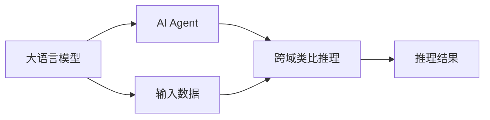
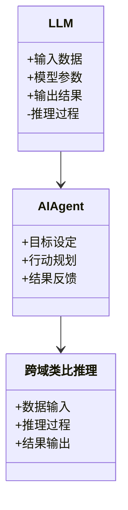

                 


# LLM支持的AI Agent跨域类比推理技术

> 关键词：LLM，AI Agent，跨域类比推理，大语言模型，AI代理

> 摘要：本文深入探讨了大语言模型（LLM）支持的AI Agent在跨域类比推理中的技术实现。通过分析LLM与AI Agent的结合，详细讲解了跨域类比推理的核心原理、算法设计、系统架构及实际应用案例。文章内容涵盖背景介绍、核心概念、算法原理、系统设计、项目实战等，旨在为读者提供全面的技术指导。

---

## 第1章: 背景介绍

### 1.1 问题背景

#### 1.1.1 LLM与AI Agent的结合
大语言模型（LLM）如GPT-4、PaLM等，具备强大的自然语言理解和生成能力，能够处理复杂的上下文信息。AI Agent（智能代理）则是一种能够感知环境、自主决策并执行任务的智能系统。两者的结合为跨域类比推理提供了技术基础。

#### 1.1.2 跨域类比推理的定义
跨域类比推理是指在不同领域之间建立关联，通过比较和映射，将一个领域的知识或经验应用到另一个领域的推理过程。例如，将医疗领域的诊断逻辑类比推理到法律领域的案例分析。

#### 1.1.3 跨域类比推理的应用场景
- **智能客服**：跨领域理解客户需求，提供更精准的服务。
- **智能推荐**：根据用户行为跨领域推荐相关内容。
- **智能监控**：跨领域分析数据，发现潜在问题。

### 1.2 问题描述

#### 1.2.1 跨域类比推理的核心问题
如何在不同领域之间建立有效的映射关系，并通过LLM的强大能力实现跨域推理。

#### 1.2.2 跨域类比推理的技术挑战
- **领域差异性**：不同领域之间的术语、逻辑关系差异较大。
- **数据稀疏性**：跨领域数据往往不足，导致推理效果受限。
- **计算复杂性**：跨域推理需要处理多维度的数据关联。

#### 1.2.3 跨域类比推理的边界与外延
- **边界**：限定于基于LLM的AI Agent，不涉及其他推理方法。
- **外延**：跨领域推理可应用于多个行业，具有广泛的应用潜力。

### 1.3 核心概念与联系

#### 1.3.1 LLM的基本原理
大语言模型通过大量的训练数据学习语言规律，能够生成与上下文相关的文本，并通过微调适应特定任务。

#### 1.3.2 AI Agent的基本原理
AI Agent通过感知环境、分析任务目标，制定行动计划并执行任务，具有自主性和智能性。

#### 1.3.3 跨域类比推理的原理
通过LLM提取领域特征，建立跨域映射关系，利用类比推理技术实现跨领域知识的应用。

---

## 第2章: 核心概念与联系

### 2.1 核心概念原理

#### 2.1.1 LLM的基本原理
大语言模型通过自监督学习和Transformer架构，具备强大的文本理解和生成能力。

#### 2.1.2 AI Agent的基本原理
AI Agent通过状态感知、目标设定、行动规划和结果反馈，实现自主决策和任务执行。

#### 2.1.3 跨域类比推理的原理
跨域类比推理通过特征提取、跨域映射和推理结果生成，将一个领域的知识应用到另一个领域。

### 2.2 核心概念属性对比

| **属性**       | **LLM**                     | **AI Agent**               | **跨域类比推理**       |
|----------------|------------------------------|-----------------------------|------------------------|
| 核心功能       | 语言理解和生成               | 环境感知与任务执行           | 跨领域知识映射         |
| 输入           | 文本数据                     | 环境状态与任务目标           | 多领域数据             |
| 输出           | 文本生成                     | 行动计划与结果反馈           | 推理结果               |
| 技术基础       | Transformer架构               | 状态空间与规划算法           | 特征提取与映射算法     |

### 2.3 ER实体关系图



---

## 第3章: 算法原理讲解

### 3.1 跨域类比推理模型结构


### 3.2 算法实现代码

```python
def cross_domain_mapping(input_data):
    # 特征提取
    features = extract_features(input_data)
    # 跨域映射
    mapped_features = map_domains(features)
    return mapped_features
```

### 3.3 数学模型与公式

#### 3.3.1 特征提取公式
$$ f(x) = \sum_{i=1}^{n} w_i x_i $$

其中，$w_i$ 是第$i$个特征的权重，$x_i$ 是输入数据的特征值。

#### 3.3.2 跨域映射公式
$$ y = f(x) + \delta $$

其中，$\delta$ 是跨域调整量，用于调整特征在不同领域之间的映射关系。

---

## 第4章: 系统分析与架构设计

### 4.1 应用场景介绍

#### 4.1.1 智能客服
通过跨域类比推理，智能客服可以快速理解客户需求，并在多个领域中找到最优解决方案。

#### 4.1.2 智能推荐
基于跨域类比推理，智能推荐系统可以为用户推荐跨领域的内容，提升用户体验。

#### 4.1.3 智能监控
在智能监控领域，跨域类比推理可以帮助系统快速识别和处理跨领域的问题。

### 4.2 系统功能设计



### 4.3 系统架构设计


---

## 第5章: 项目实战

### 5.1 环境安装

```bash
pip install transformers
pip install torch
pip install mermaid
```

### 5.2 核心代码实现

```python
from transformers import AutoTokenizer, AutoModelForCausalLM
import torch

def cross_domain_mapping(input_data):
    # 初始化LLM模型和tokenizer
    model_name = "gpt2-large"
    tokenizer = AutoTokenizer.from_pretrained(model_name)
    model = AutoModelForCausalLM.from_pretrained(model_name)

    # 特征提取
    features = extract_features(input_data)
    # 跨域映射
    mapped_features = map_domains(features)
    return mapped_features

def extract_features(input_data):
    # 示例：提取文本数据中的关键词
    return input_data.split()

def map_domains(features):
    # 示例：将特征映射到目标领域
    return {f: f + "_mapped" for f in features}
```

### 5.3 案例分析

#### 5.3.1 智能客服案例
输入：用户反馈“产品无法正常启动”。
输出：经过跨域类比推理，系统将问题映射到技术支持领域，生成解决方案。

#### 5.3.2 智能推荐案例
输入：用户喜欢科幻小说。
输出：系统将推荐结果映射到电影领域，推荐科幻电影。

### 5.4 项目小结

---

## 第6章: 最佳实践

### 6.1 tips
- 在实际应用中，建议先进行小规模测试，确保跨域映射的有效性。
- 注意数据质量和领域差异，避免因数据不足导致推理错误。

### 6.2 小结
本文详细讲解了LLM支持的AI Agent跨域类比推理技术，从理论到实践，为读者提供了全面的技术指导。

### 6.3 注意事项
- 数据隐私和安全问题需要特别注意。
- 在实际应用中，建议结合具体业务需求，调整算法参数。

### 6.4 拓展阅读
- 《Large Language Models: A Survey》
- 《AI Agents: Theory and Practice》

---

# 结论

本文通过深入分析LLM支持的AI Agent跨域类比推理技术，从理论基础到实际应用，为读者提供了全面的技术指导。通过本文的学习，读者可以掌握跨域类比推理的核心原理、算法设计和系统实现方法，并能够在实际项目中应用这些技术。未来，随着大语言模型和AI Agent技术的不断发展，跨域类比推理将有更广阔的应用前景。

