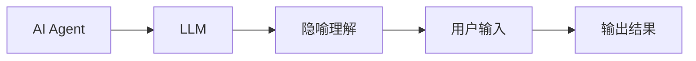

                 


# LLM支持的AI Agent隐喻理解能力

> 关键词：LLM, AI Agent, 隐喻理解, 对比学习, 自然语言处理, 对话系统, 人工智能

> 摘要：本文详细探讨了大语言模型（LLM）如何支持AI Agent理解隐喻。通过分析隐喻理解的背景、核心原理、算法流程、数学模型以及系统架构，结合对比学习和实际案例，深入讲解了LLM在隐喻理解中的应用及其技术实现。文章还提供了详细的系统架构设计、项目实战代码和小结，帮助读者全面掌握LLM支持的AI Agent隐喻理解能力。

---

## 第一部分: LLM支持的AI Agent隐喻理解能力背景介绍

### 第1章: 背景与概念解析

#### 1.1 问题背景
- **AI Agent的基本概念**：AI Agent是一种智能体，能够感知环境并执行任务。
- **LLM的基本概念**：LLM是大语言模型，具备强大的自然语言处理能力。
- **隐喻理解的重要性**：隐喻理解是人类语言处理的核心能力，AI Agent需要具备此能力以更自然地与人类交互。

#### 1.2 问题描述
- **AI Agent在隐喻理解中的挑战**：传统算法难以捕捉隐含意义。
- **LLM在隐喻理解中的优势**：LLM通过预训练掌握了大量隐喻知识。
- **隐喻理解的实际应用场景**：对话系统、文本分析等。

#### 1.3 问题解决
- **隐喻理解的必要性**：提升AI Agent的自然语言处理能力。
- **LLM如何支持AI Agent理解隐喻**：通过大规模数据训练和微调。
- **隐喻理解的边界与外延**：明确隐喻的理解范围和可能扩展。

#### 1.4 概念结构与核心要素
- **AI Agent的核心要素**：感知、决策、执行。
- **LLM的核心要素**：预训练、微调、对比学习。
- **隐喻理解的结构化分析**：识别、解析、生成。

---

## 第二部分: LLM支持的AI Agent隐喻理解算法原理

### 第2章: 隐喻理解的核心概念与联系

#### 2.1 隐喻理解的核心原理
- **隐喻的基本定义**：通过类比建立概念间的联系。
- **隐喻理解的神经机制**：人类通过联想和类比理解隐喻。
- **LLM在隐喻理解中的作用**：利用预训练知识进行推理。

#### 2.2 核心概念对比分析
- **AI Agent与传统算法的对比**：AI Agent具备更强的适应性和学习能力。
- **LLM与传统NLP模型的对比**：LLM具有更强大的上下文理解和生成能力。
- **隐喻理解与直接理解的对比**：隐喻理解需要更多的推理和上下文信息。

#### 2.3 实体关系图


### 第3章: 隐喻理解的算法原理

#### 3.1 隐喻理解的基本流程
- **隐喻识别**：识别文本中的隐喻部分。
- **隐喻解析**：理解隐喻的含义。
- **隐喻生成**：生成符合隐喻的表达。

#### 3.2 LLM在隐喻理解中的算法流程


#### 3.3 隐喻理解的数学模型
- **预训练模型的数学表示**
  $$P(\text{隐喻理解}|x) = \frac{P(x|\text{隐喻理解})P(\text{隐喻理解})}{P(x)}$$
- **微调模型的数学表示**
  $$\text{Loss} = -\sum_{i=1}^{n} \log P(y_i|x_i)$$

### 第4章: 隐喻理解的对比学习

#### 4.1 对比学习的基本原理
- **对比学习的定义**：通过对比正样本和负样本来学习特征表示。
- **对比学习在隐喻理解中的应用**：通过对比隐喻和非隐喻文本进行学习。
- **对比学习的优势**：提升模型的区分能力。

#### 4.2 隐喻理解的对比学习模型
- **对比学习的数学公式**
  $$\text{Loss} = \log\left(\frac{P(x,y)}{P(x)}\right)$$

---

## 第三部分: 系统分析与架构设计方案

### 第5章: 系统架构设计

#### 5.1 问题场景介绍
- **系统目标**：设计一个支持隐喻理解的AI Agent系统。
- **项目介绍**：基于LLM构建AI Agent，提升隐喻理解能力。

#### 5.2 系统功能设计
- **领域模型设计**
  ```mermaid
  classDiagram
  class AI-Agent {
    +LLM: LargeLanguageModel
    +隐喻理解模块: MetaphorUnderstandingModule
    +用户交互模块: UserInteractionModule
  }
  ```

- **系统架构设计**
  ```mermaid
  graph LR
  A[用户] --> B[用户交互模块]
  B --> C[隐喻理解模块]
  C --> D[LLM]
  D --> B[输出结果]
  ```

- **系统接口设计**
  - 输入接口：自然语言输入。
  - 输出接口：自然语言输出。

#### 5.3 系统交互设计
- **交互流程**
  ```mermaid
  sequenceDiagram
  participant 用户
  participant AI-Agent
  用户->AI-Agent: 提供隐喻文本
  AI-Agent->LLM: 分析隐喻
  LLM->AI-Agent: 返回隐喻解析结果
  AI-Agent->用户: 输出解析结果
  ```

---

## 第四部分: 项目实战

### 第6章: 项目实战

#### 6.1 环境安装
- **Python环境**：安装Python 3.8及以上版本。
- **依赖安装**：安装Hugging Face库和相关模型。

#### 6.2 核心实现源代码
```python
from transformers import pipeline

# 初始化隐喻理解模型
metaphor_pipeline = pipeline("metaphor-understanding", model="microsoft/deberta")

def analyze_metaphor(text):
    results = metaphor_pipeline(text)
    return results

# 示例
text = "生活是一场马拉松"
print(analyze_metaphor(text))
```

#### 6.3 代码应用解读
- **代码功能**：通过预训练模型分析隐喻文本。
- **结果解读**：输出隐喻的解析结果。

#### 6.4 实际案例分析
- **案例1**：分析“生活是一场马拉松”。
- **案例2**：分析“时间是金钱”。

---

## 第五部分: 总结与展望

### 第7章: 总结与展望

#### 7.1 核心小结
- **主要收获**：LLM在隐喻理解中的应用潜力巨大。
- **关键经验**：对比学习和预训练模型是关键技术。

#### 7.2 注意事项
- **模型局限性**：隐喻理解仍需上下文和常识推理。
- **数据质量**：高质量数据对模型性能至关重要。

#### 7.3 未来展望
- **模型优化**：结合多模态数据提升隐喻理解能力。
- **应用场景扩展**：应用于更多领域，如文学分析、心理辅导等。

---

## 第六部分: 最佳实践 tips

### 7.1 tips
- **实践建议**：从简单案例开始，逐步扩展复杂场景。
- **工具推荐**：使用Hugging Face等开源工具快速实现。

### 7.2 小结
- **知识回顾**：系统学习了LLM支持的AI Agent隐喻理解能力。
- **能力提升**：掌握隐喻理解的核心算法和系统设计。

---

通过以上目录结构，文章将详细探讨LLM支持的AI Agent隐喻理解能力，结合理论分析和实际案例，帮助读者全面掌握相关技术和应用。

