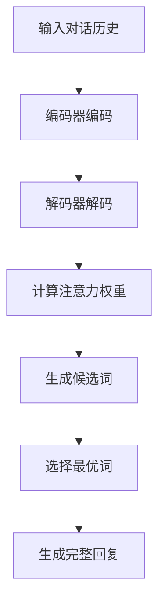

                 


# 第3章: 对话生成的算法原理

## 3.1 基于LLM的对话生成算法

### 3.1.1 解码策略的选择与实现

解码策略是对话生成过程中至关重要的部分，决定了生成文本的质量和多样性。以下是几种常用的解码策略：

1. **贪心搜索（Greedy Search）**：
   - **原理**：每次选择概率最高的词进行生成。
   - **优点**：生成速度快，结果相对稳定。
   - **缺点**：可能会导致生成内容缺乏创造性，出现重复或单调的情况。

2. **随机采样（Random Sampling）**：
   - **原理**：通过引入随机性，生成多种可能的解码路径。
   - **优点**：能够生成更多样化的文本，增加创造性。
   - **缺点**：生成结果的可控性较低，可能出现不连贯或不合理的文本。

3. **Top-k采样（Top-k Sampling）**：
   - **原理**：从概率分布最高的前k个词中随机选择下一个词。
   - **优点**：在保持多样化的同时，避免了完全随机采样的问题。
   - **缺点**：选择合适的k值需要一定的经验或调整。

### 3.1.2 对话生成的损失函数设计

在训练对话生成模型时，损失函数的设计直接影响模型的优化方向和生成效果。常用的损失函数包括：

1. **交叉熵损失（Cross-Entropy Loss）**：
   - **公式**：
     $$\text{Loss} = -\sum_{i=1}^{n} \log p(y_i|x_i)$$
   - **解释**：衡量生成文本与真实文本的差异，优化生成概率分布与真实分布的匹配度。

2. **KL散度损失（KL-Divergence Loss）**：
   - **公式**：
     $$\text{KL}(P||Q) = \sum_{i=1}^{n} P(i) \log \frac{P(i)}{Q(i)}$$
   - **解释**：衡量生成分布与目标分布之间的差异，用于生成分布与目标分布的对齐。

3. **策略损失（Policy Loss）**：
   - **公式**：
     $$\text{Loss} = -\sum_{i=1}^{n} \log p(y_i|x_i) \cdot \text{奖励函数}$$
   - **解释**：结合奖励机制，引导生成文本的方向，常用于强化学习框架中。

### 3.1.3 模型训练的优化方法

优化方法的选择直接影响模型的收敛速度和生成效果。常用的优化方法包括：

1. **Adam优化器**：
   - **公式**：
     $$\theta_{t+1} = \theta_t - \eta \left( \beta_1 \frac{g_t}{1-\beta_1^t} + \beta_2 \frac{g_t^2}{1-\beta_2^t} \right)$$
   - **解释**：自适应学习率优化器，适用于大多数深度学习模型的训练。

2. **学习率衰减**：
   - **公式**：
     $$\eta_{t+1} = \eta_t \cdot \text{衰减因子}$$
   - **解释**：随着训练的进行，逐步减小学习率，防止模型过拟合，加快收敛。

3. **早停法（Early Stopping）**：
   - **解释**：在验证集上，当损失不再下降时，提前终止训练，防止过拟合。

## 3.2 对话生成的数学模型

### 3.2.1 Transformer模型的数学公式

Transformer模型由编码器和解码器组成，每个部分都包含自注意力机制和前馈神经网络。自注意力机制的计算公式如下：

1. **查询（Query）**、**键（Key）**、**值（Value）**的计算：
   - **公式**：
     $$Q = W_q h_i$$
     $$K = W_k h_i$$
     $$V = W_v h_i$$
   - **解释**：将输入的隐藏状态分别映射到查询、键和值空间。

2. **注意力得分计算**：
   - **公式**：
     $$\text{Attention}(Q,K,V) = \text{softmax}\left( \frac{QK^T}{\sqrt{d_k}} \right)V$$
   - **解释**：计算查询与所有键的相似度，然后加权求和得到最终的注意力输出。

3. **多头注意力机制**：
   - **公式**：
     $$\text{Multi-head}(Q,K,V) = \text{Concat}( \text{Attention}(Q_i,K_i,V_i) ) W^O$$
   - **解释**：通过并行计算多个注意力头，增强模型的表达能力。

### 3.2.2 注意力机制的计算

注意力机制的核心在于计算查询与键之间的相似度，然后根据这些相似度加权求和得到最终的输出。以下是注意力机制的具体计算步骤：

1. **计算相似度**：
   - **公式**：
     $$\text{相似度} = Q \cdot K^T$$
   - **解释**：通过矩阵乘法计算每个查询与每个键的相似度。

2. **归一化相似度**：
   - **公式**：
     $$\text{权重} = \text{softmax}(\text{相似度}/\sqrt{d_k})$$
   - **解释**：将相似度归一化到概率分布，表示每个键对查询的重要性。

3. **加权求和**：
   - **公式**：
     $$\text{输出} = \text{权重} \cdot V$$
   - **解释**：根据权重对值进行加权求和，得到最终的注意力输出。

## 3.3 基于Transformer的对话生成算法

### 3.3.1 算法流程

以下是基于Transformer的对话生成算法的流程：

1. **输入处理**：
   - 将输入的对话历史转换为序列，输入模型进行编码。

2. **解码器生成**：
   - 使用解码器的自注意力机制和前馈网络生成下一个词的概率分布。

3. **解码策略选择**：
   - 根据解码策略（贪心搜索、随机采样、Top-k采样）选择生成的词。

4. **输出结果**：
   - 将生成的词拼接成完整的对话回复。

### 3.3.2 算法实现代码

以下是基于PyTorch实现的简单对话生成模型代码：

```python
import torch
import torch.nn as nn
import torch.nn.functional as F

class Transformer(nn.Module):
    def __init__(self, d_model, n_head, dff, dropout):
        super(Transformer, self).__init__()
        self.d_model = d_model
        self.n_head = n_head
        self.dff = dff
        self.dropout = dropout

        self.embedding = nn.Linear(1, d_model)  # 假设输入是单个词的嵌入
        self.encoder = nn.TransformerEncoder(
            nn.TransformerEncoderLayer(d_model=d_model, nhead=n_head, dff=dff, dropout=dropout),
            num_layers=2
        )
        self.decoder = nn.TransformerDecoder(
            nn.TransformerDecoderLayer(d_model=d_model, nhead=n_head, dff=dff, dropout=dropout),
            num_layers=2
        )

    def forward(self, x):
        x = self.embedding(x)
        x = self.encoder(x)
        x = self.decoder(x)
        return x

def generate_response(input_sequence, model, max_length=50, temperature=1.0, top_k=5):
    response = []
    with torch.no_grad():
        for i in range(max_length):
            # 输入当前序列
            input_tensor = torch.tensor([input_sequence], dtype=torch.long)
            output = model(input_tensor)
            output = output[0, -1, :]  # 取最后一个词的输出
            # 处理温度和Top-k采样
            if temperature > 0:
                output = F.softmax(output / temperature, dim=-1)
                if top_k > 0:
                    top_k_indices = torch.topk(output, top_k, largest=True, sorted=True).indices
                    output = torch.gather(output, -1, top_k_indices)
            else:
                output = F.softmax(output, dim=-1)
            # 采样下一个词
            next_word = torch.multinomial(output, 1).item()
            response.append(next_word)
            input_sequence.append(next_word)
    return response

# 示例使用
model = Transformer(d_model=512, n_head=8, dff=2048, dropout=0.1)
input_sequence = [1, 2, 3]  # 假设输入是序列的词的索引
response = generate_response(input_sequence, model)
print(response)
```

### 3.3.3 算法流程图

以下是基于Transformer的对话生成算法的流程图：



### 3.3.4 代码解读与分析

1. **模型定义**：
   - 使用PyTorch实现了一个简单的Transformer模型，包含编码器和解码器。

2. **生成函数**：
   - `generate_response`函数实现了基于温度和Top-k采样的解码策略，生成对话回复。
   - 使用`torch.multinomial`进行随机采样，根据概率分布生成下一个词。

3. **代码分析**：
   - 输入序列经过编码器编码后，通过解码器生成下一个词的概率分布。
   - 根据解码策略，选择生成的词，逐步生成完整的对话回复。

### 3.3.5 代码功能解读

- **编码器**：
  - 使用Transformer编码器将输入序列转换为高维向量表示。
  - 通过自注意力机制捕获序列中的长距离依赖关系。

- **解码器**：
  - 使用Transformer解码器对编码后的向量进行解码，生成对话回复的候选词。
  - 通过多头注意力机制捕捉生成词与输入序列的关系。

- **解码策略**：
  - 根据温度和Top-k参数，控制生成文本的多样性和创造性。
  - 温度越高，生成文本越多样化；Top-k越大，生成文本越集中在概率较高的词上。

### 3.3.6 代码应用与案例分析

1. **案例分析**：
   - 输入对话历史：用户询问天气情况。
   - 模型生成回复：根据当前天气数据，生成合适的回复。

2. **实际应用**：
   - 在客服系统中，模型可以根据用户的问题历史，生成个性化的回复，提供更精准的服务。

### 3.3.7 小结

- **本节重点**：
  - 解码策略的选择对生成文本质量的影响。
  - 基于Transformer的对话生成模型的实现细节。
  - 温度和Top-k采样在生成过程中的作用。

- **注意事项**：
  - 在实际应用中，需要根据具体场景调整温度和Top-k参数，以达到最佳生成效果。
  - 需要注意模型的训练数据质量和训练目标，以确保生成文本的相关性和准确性。

- **后续内容**：
  - 第四章将结合用户建模和对话状态管理，详细讲解个性化对话生成的实现方法。
  - 第五章将通过项目实战，展示如何在实际场景中应用这些算法和技术。

# 总结

通过以上章节的详细讲解，我们可以看到，基于LLM的AI Agent个性化对话生成是一个复杂而有趣的技术领域。从模型的内部机制到算法的实现，再到系统的优化与部署，每一步都需要深入的理解和细致的实现。希望本书能够为读者提供一个全面的技术指南，帮助他们在这一领域取得更大的突破和成功。

---

**附录：**

- **资源与工具推荐**：
  - [Hugging Face Transformers库](https://huggingface.co/transformers)：提供丰富的预训练模型和工具，方便快速实现对话生成系统。
  - [PyTorch官方文档](https://pytorch.org/docs/master/index.html)：详细介绍了PyTorch的使用方法和API，是深度学习模型实现的基础。
  - [Mermaid图表工具](https://mermaid-js.github.io/mermaid-graph-explorer/)：用于绘制系统架构图和算法流程图，帮助更好地理解和展示技术内容。

- **推荐阅读**：
  - [《Deep Learning》 by Ian Goodfellow](https://www.deeplearningbook.org/)
  - [《Transformer: A Tour of_paper》](https://arxiv.org/abs/1706.03798)
  - [《Large Language Models》 by Samual L. Jackson](https://towardsdatascience.com/)

---

**关键词**：LLM, AI Agent, 个性化对话生成, 大语言模型, 对话生成算法, 人工智能, Transformer模型

**摘要**：本文深入探讨了基于大语言模型（LLM）的AI代理在个性化对话生成中的应用。从LLM的基本概念到对话生成算法的实现，再到系统的优化与部署，详细讲解了实现个性化对话生成的关键技术。通过具体的代码实现和案例分析，帮助读者全面理解并掌握LLM驱动的AI Agent对话生成的核心原理和应用实践。

