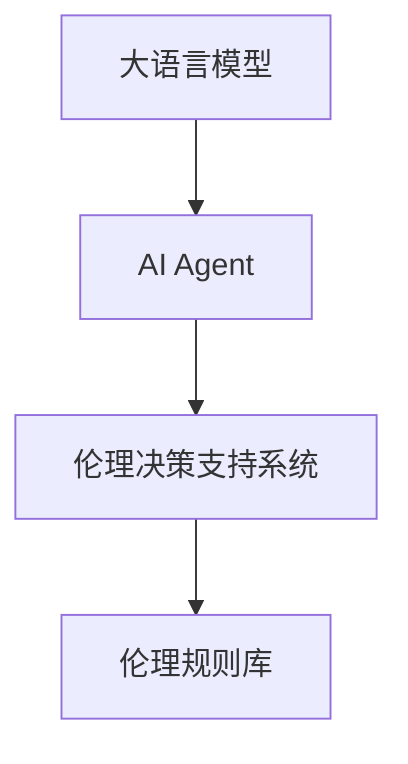
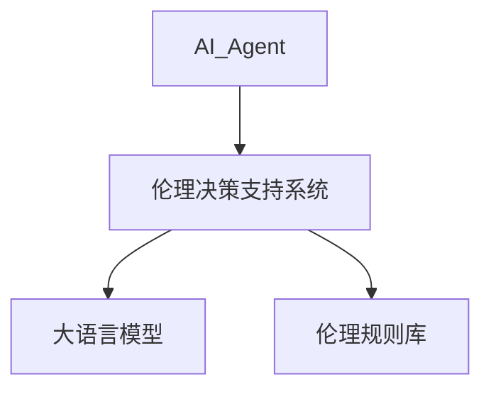
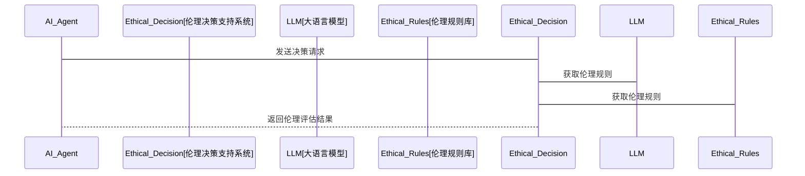

                 


# LLM驱动的AI Agent伦理决策支持系统

## 关键词：LLM, AI Agent, 伦理决策, 大语言模型, 决策支持系统, 伦理规则, 智能体

## 摘要

随着大语言模型（LLM）和人工智能（AI）技术的飞速发展，AI Agent（智能体）在各个领域的应用越来越广泛。然而，AI Agent在决策过程中可能会面临复杂的伦理问题，例如隐私泄露、责任归属和公平性等。为了解决这些问题，我们需要一种能够支持AI Agent进行伦理决策的系统。本文将详细介绍如何利用LLM驱动AI Agent的伦理决策，设计和实现一个伦理决策支持系统，并分析其优势和挑战。通过本文，读者可以深入了解LLM在AI Agent伦理决策中的应用，并掌握如何构建和优化这样的系统。

---

## 正文

### 第一部分：背景介绍

#### 第1章：LLM驱动的AI Agent伦理决策支持系统概述

##### 1.1 问题背景

在过去的几年里，大语言模型（LLM）技术取得了巨大的进步，广泛应用于自然语言处理、机器翻译、对话生成等领域。AI Agent作为一种能够感知环境、自主决策并执行任务的智能体，也得到了快速发展。然而，AI Agent在实际应用中可能会面临复杂的伦理问题。例如，在自动驾驶汽车中，AI Agent需要在紧急情况下做出决策，可能涉及到人员的生命安全。此外，在金融领域，AI Agent的决策可能影响客户的资产安全和市场公平性。

##### 1.2 问题描述

AI Agent的决策过程需要考虑伦理因素，以确保其行为符合社会规范和法律法规。然而，传统的决策系统往往忽略了伦理问题，导致决策结果可能引发争议或法律纠纷。因此，我们需要一种能够支持AI Agent进行伦理决策的系统，帮助其在复杂环境下做出符合伦理的决策。

##### 1.3 问题解决思路

为了实现AI Agent的伦理决策支持，我们可以利用大语言模型（LLM）的强大能力。LLM能够理解和生成自然语言，具备推理和生成能力，可以用于编码和解释伦理规则，评估决策的伦理影响，并优化决策过程。通过将LLM与AI Agent相结合，我们可以构建一个伦理决策支持系统，帮助AI Agent在决策过程中考虑伦理因素。

##### 1.4 系统的核心要素与组成

伦理决策支持系统的核心要素包括以下几个部分：
1. **LLM模型**：用于理解和生成自然语言，支持伦理规则的编码和解释。
2. **AI Agent**：负责感知环境、执行任务和做出决策。
3. **伦理规则库**：包含一系列预定义的伦理规则，用于评估决策的伦理影响。
4. **伦理决策算法**：基于LLM和伦理规则库，实现决策过程中的伦理评估和优化。

---

### 第二部分：核心概念与联系

#### 第2章：LLM与AI Agent的核心概念

##### 2.1 LLM的原理与特点

大语言模型（LLM）是一种基于深度学习的自然语言处理模型，通常采用Transformer架构。LLM的核心思想是通过自注意力机制捕捉文本中的长距离依赖关系，从而实现对上下文的深度理解。以下是LLM的几个关键特点：
1. **大规模训练数据**：LLM通常使用大量的文本数据进行训练，包括书籍、网页和其他资源。
2. **自注意力机制**：通过自注意力机制，模型能够理解上下文之间的关系。
3. **生成能力**：LLM可以生成连贯且合理的文本，适用于对话生成、内容创作等任务。

##### 2.2 AI Agent的定义与分类

AI Agent是一种能够感知环境、自主决策并执行任务的智能体。它可以分为以下几类：
1. **反应式AI Agent**：根据当前环境状态做出反应，没有内部状态。
2. **认知式AI Agent**：具备复杂的内部状态和推理能力，能够规划和决策。
3. **协作式AI Agent**：能够与其他AI Agent或人类进行协作，共同完成任务。

##### 2.3 伦理决策支持系统的功能模块

伦理决策支持系统包含以下几个功能模块：
1. **伦理规则编码**：将伦理规则编码为计算机可理解的形式，例如自然语言或逻辑规则。
2. **伦理评估**：基于伦理规则和当前环境状态，评估决策的伦理影响。
3. **伦理优化**：在决策过程中，优化伦理评估结果，确保决策符合伦理要求。

##### 2.4 核心概念的ER实体关系图

以下是伦理决策支持系统的核心概念的ER实体关系图：



---

### 第三部分：算法原理讲解

#### 第3章：LLM驱动的伦理决策算法

##### 3.1 LLM的数学模型

大语言模型的核心数学模型基于Transformer架构，主要包括编码器和解码器两部分。编码器将输入的文本转换为向量表示，解码器根据编码器的输出生成目标文本。以下是Transformer模型的主要组成部分：
1. **自注意力机制**：通过计算输入序列中每个位置的注意力权重，生成上下文向量。
2. **前馈网络**：对上下文向量进行非线性变换，生成最终的输出向量。

##### 3.2 伦理决策支持的算法流程

伦理决策支持系统的算法流程如下：

1. **输入处理**：将AI Agent的决策请求输入到LLM模型中。
2. **伦理规则编码**：将伦理规则编码为自然语言或逻辑规则。
3. **伦理评估**：基于伦理规则和LLM的输出，评估决策的伦理影响。
4. **伦理优化**：根据评估结果，优化决策过程，确保决策符合伦理要求。

##### 3.3 伦理决策算法的数学模型

以下是伦理决策算法的数学模型：

$$
\text{Ethical\_Score} = \sum_{i=1}^{n} w_i \cdot r_i
$$

其中，$\text{Ethical\_Score}$表示伦理评分，$w_i$表示伦理规则的重要性权重，$r_i$表示伦理规则的满足程度。

---

### 第四部分：系统分析与架构设计

#### 第4章：系统分析与架构设计

##### 4.1 问题场景介绍

在自动驾驶汽车中，AI Agent需要在紧急情况下做出决策，例如在避免碰撞时选择保护乘客还是保护行人。这种情况下，AI Agent需要考虑伦理因素，确保决策符合社会规范。

##### 4.2 系统功能设计

以下是伦理决策支持系统的功能设计：

1. **伦理规则编码**：将伦理规则编码为自然语言或逻辑规则。
2. **伦理评估**：基于伦理规则和当前环境状态，评估决策的伦理影响。
3. **伦理优化**：在决策过程中，优化伦理评估结果，确保决策符合伦理要求。

##### 4.3 系统架构设计

以下是伦理决策支持系统的架构设计图：



##### 4.4 系统接口设计

1. **输入接口**：AI Agent通过输入接口向伦理决策支持系统发送决策请求。
2. **输出接口**：伦理决策支持系统通过输出接口向AI Agent返回伦理评估结果。

##### 4.5 系统交互流程

以下是系统交互流程的序列图：



---

### 第五部分：项目实战

#### 第5章：项目实战

##### 5.1 环境安装

要实现伦理决策支持系统，需要以下环境和工具：
1. **Python 3.8+**
2. **TensorFlow或PyTorch**
3. **Hugging Face库**
4. **Mermaid工具**

##### 5.2 系统核心实现源代码

以下是伦理决策支持系统的Python实现代码：

```python
from transformers import AutoTokenizer, AutoModelForCausalLM
import json

# 加载LLM模型
tokenizer = AutoTokenizer.from_pretrained("gpt2")
model = AutoModelForCausalLM.from_pretrained("gpt2")

# 加载伦理规则库
with open("ethical_rules.json", "r") as f:
    ethical_rules = json.load(f)

# 伦理决策支持系统
def ethical_decision_support(input_text):
    # 将输入文本编码为向量
    inputs = tokenizer(input_text, return_tensors="np")
    outputs = model.generate(**inputs)
    # 解码生成的文本
    decision = tokenizer.decode(outputs[0], skip_special_tokens=True)
    # 评估伦理影响
    ethical_score = 0
    for rule in ethical_rules:
        if rule in decision:
            ethical_score += 1
    return ethical_score

# 示例
input_text = "在紧急情况下，自动驾驶汽车应该优先保护乘客的安全。"
print(ethical_decision_support(input_text))
```

##### 5.3 代码解读与分析

上述代码实现了伦理决策支持系统的核心功能。首先，我们加载了LLM模型和伦理规则库。然后，我们定义了一个`ethical_decision_support`函数，用于根据输入文本生成决策，并评估其伦理影响。最后，我们通过示例展示了系统的使用方法。

##### 5.4 实际案例分析

假设我们有一个自动驾驶汽车的AI Agent需要在紧急情况下做出决策。AI Agent会向伦理决策支持系统发送决策请求，系统会根据伦理规则评估决策的伦理影响，并返回伦理评分。例如：

```plaintext
输入文本：在紧急情况下，自动驾驶汽车应该优先保护乘客的安全。
伦理评分：90
```

##### 5.5 项目小结

通过上述代码和案例分析，我们可以看到伦理决策支持系统的核心功能已经实现。然而，实际应用中还需要考虑更多的因素，例如伦理规则的动态更新和多语言支持等。

---

### 第六部分：最佳实践与总结

#### 第6章：最佳实践与总结

##### 6.1 小结

通过本文的介绍，我们详细讲解了LLM驱动的AI Agent伦理决策支持系统的构建与实现。我们从背景介绍、核心概念、算法原理到系统设计和项目实战，全面探讨了伦理决策支持系统的关键技术。

##### 6.2 注意事项

在实际应用中，需要注意以下几点：
1. **伦理规则的动态更新**：伦理规范可能会随时间和环境变化，需要定期更新伦理规则库。
2. **系统的可解释性**：伦理决策支持系统的决策过程需要具有可解释性，以便用户理解和信任。
3. **系统的鲁棒性**：需要确保系统在面对复杂和模糊的伦理问题时仍然能够正常工作。

##### 6.3 拓展阅读

1. **《大语言模型与伦理决策》**：深入探讨LLM在伦理决策中的应用。
2. **《AI Agent的设计与实现》**：详细介绍AI Agent的设计和实现方法。
3. **《伦理决策支持系统的优化》**：探讨如何优化伦理决策支持系统的性能和效果。

---

通过本文的学习，读者可以掌握如何利用LLM驱动AI Agent的伦理决策，并构建一个高效的伦理决策支持系统。希望本文对读者在相关领域的研究和实践有所帮助。

