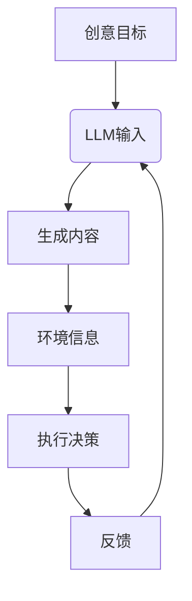
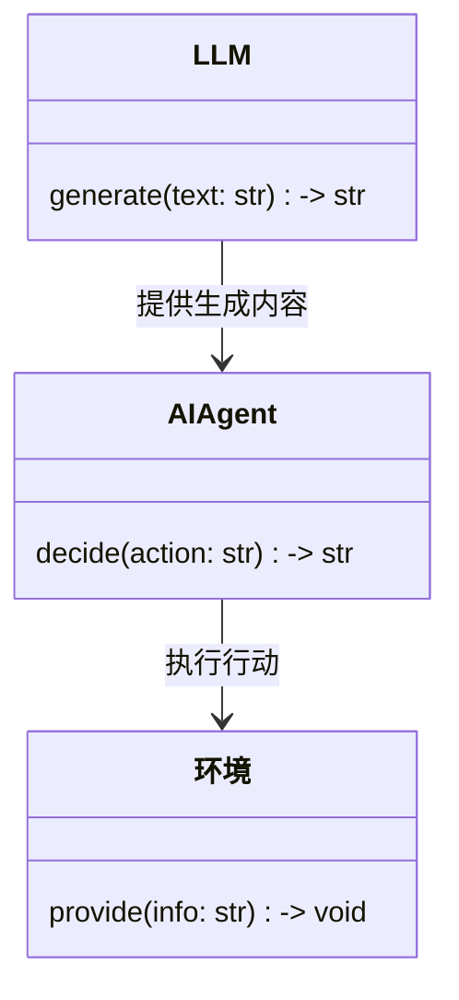
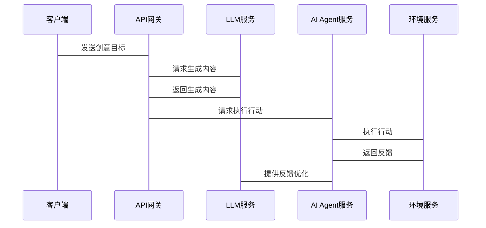

                 


# LLM驱动的AI Agent创意生成系统

**关键词**：LLM、AI Agent、创意生成、自然语言处理、人工智能、系统设计

**摘要**：本文探讨了LLM（大语言模型）驱动的AI Agent（智能代理）在创意生成中的应用。通过分析系统背景、核心概念、算法原理、系统架构、项目实战及总结，展示了如何利用LLM的强大能力，结合AI Agent的智能决策，实现高效的创意生成。

---

# 第一部分: LLM驱动的AI Agent创意生成系统背景与概述

## 第1章: LLM驱动的AI Agent创意生成系统概述

### 1.1 问题背景与描述

#### 1.1.1 创意生成的挑战与需求
创意生成在多个领域（如设计、写作、编程）中至关重要。传统方法依赖手动创作，效率低下且成本高昂。现代技术，如大语言模型（LLM），为自动化创意生成提供了新思路。然而，LLM本身无法直接转化为行动，需借助AI Agent进行决策和执行。

#### 1.1.2 LLM在创意生成中的作用
LLM擅长文本生成，能辅助创作，但缺乏上下文理解和执行能力。AI Agent则通过环境交互，将LLM的生成内容转化为具体行动，提升创意生成的效率和质量。

#### 1.1.3 AI Agent在创意生成中的角色
AI Agent作为中介，连接LLM和实际应用。它负责接收LLM的生成内容，分析环境信息，制定执行策略，并实时调整行动，确保创意生成过程高效且符合预期。

### 1.2 问题解决与边界

#### 1.2.1 创意生成问题的解决思路
LLM驱动的AI Agent系统通过结合生成能力和智能决策，解决了传统创意生成效率低、缺乏执行能力的问题。

#### 1.2.2 系统边界与外延
系统专注于创意生成，边界包括输入创意目标、输出具体行动。外延涉及LLM的训练和优化，以及AI Agent的决策逻辑。

#### 1.2.3 核心要素与组成结构
系统由LLM模块、AI Agent模块、环境交互模块组成。核心要素包括创意目标、生成策略、反馈机制。

### 1.3 核心概念与联系

#### 1.3.1 LLM与AI Agent的关系
LLM提供生成能力，AI Agent负责执行。两者通过接口交互，协同工作。

#### 1.3.2 ER实体关系图
以下是核心概念的ER图：

```mermaid
er
  entity LLM {
    大语言模型
    属性：模型参数、训练数据
  }

  entity AI Agent {
    智能代理
    属性：决策逻辑、执行能力
  }

  relationship 创意生成 {
    LLM -> AI Agent: 提供生成内容
    AI Agent -> 环境: 执行创意
  }
```

---

# 第二部分: 核心概念与原理

## 第2章: LLM驱动的AI Agent核心原理

### 2.1 核心概念原理

#### 2.1.1 LLM的基本原理
LLM通过监督微调和强化学习优化生成内容。其核心是概率生成模型，输出符合上下文的文本。

#### 2.1.2 AI Agent的基本原理
AI Agent接收输入，分析环境，制定策略，执行动作，并根据反馈调整行为。

#### 2.1.3 LLM驱动AI Agent的机制
LLM提供生成内容，AI Agent将其转化为具体行动，通过反馈循环优化系统。

### 2.2 核心概念对比表

| **特性**       | **LLM**                     | **AI Agent**                |
|----------------|-----------------------------|-----------------------------|
| **核心功能**    | 文本生成                   | 决策与执行                 |
| **输入**        | 创意目标                   | 环境信息                   |
| **输出**        | 文本内容                   | 具体行动                   |
| **优势**        | 高效生成                   | 智能决策                   |
| **局限性**       | 缺乏执行能力               | 需依赖生成内容             |

### 2.3 ER实体关系图

```mermaid
er
  entity 创意目标 {
    属性：目标类型、创意范围
  }

  entity 生成内容 {
    属性：文本内容、生成时间
  }

  entity 执行行动 {
    属性：行动类型、执行结果
  }

  relationship 生成过程 {
    创意目标 -> LLM: 提供输入
    LLM -> AI Agent: 生成内容
    AI Agent -> 执行行动: 执行
  }
```

---

# 第三部分: 算法原理与实现

## 第3章: LLM驱动的AI Agent算法原理

### 3.1 算法原理概述

#### 3.1.1 LLM的训练与优化
LLM通过监督微调和强化学习优化生成质量。训练目标是最小化生成内容与预期的差异。

#### 3.1.2 AI Agent的决策与执行
AI Agent基于生成内容和环境信息，选择最优行动。决策过程考虑生成内容的质量和环境的约束。

#### 3.1.3 LLM与AI Agent的协同机制
协同机制确保生成内容与执行行动一致。通过反馈优化生成策略和执行逻辑。

### 3.2 算法流程图



### 3.3 数学模型与公式

#### 3.3.1 LLM的损失函数
$$ \text{损失函数} = -\sum_{i=1}^{n} \log p(x_i) $$

#### 3.3.2 AI Agent的决策模型
$$ \text{决策概率} = \frac{\exp(\theta \cdot x)}{\sum_{j} \exp(\theta \cdot x_j)} $$

#### 3.3.3 协同机制的数学表达
$$ \text{协同权重} = \alpha \cdot \text{LLM输出} + (1-\alpha) \cdot \text{AI Agent输出} $$

### 3.4 举例说明

#### 3.4.1 LLM训练案例
训练一个LLM生成创意文案，使用监督微调优化生成质量。

#### 3.4.2 AI Agent决策案例
AI Agent根据生成文案，决定在社交媒体上发布，并实时调整发布时间和策略。

---

# 第四部分: 系统分析与架构设计

## 第4章: LLM驱动的AI Agent系统分析与架构设计

### 4.1 问题场景介绍
系统在创意生成中面临环境复杂和生成内容多样性的挑战，需通过高效的架构设计解决。

### 4.2 系统功能设计

#### 4.2.1 领域模型类图



### 4.3 系统架构设计

#### 4.3.1 系统架构图


### 4.4 系统交互设计

#### 4.4.1 序列图



---

# 第五部分: 项目实战

## 第5章: LLM驱动的AI Agent项目实战

### 5.1 环境搭建

#### 5.1.1 安装Python和依赖
```bash
pip install transformers
pip install torch
pip install sentencepiece
```

### 5.2 核心实现

#### 5.2.1 LLM接口实现
```python
class LLM:
    def generate(self, prompt: str) -> str:
        # 实现生成逻辑
        pass
```

#### 5.2.2 AI Agent实现
```python
class AI_Agent:
    def decide(self, content: str, environment: dict) -> str:
        # 实现决策逻辑
        pass
```

### 5.3 代码应用与解读

#### 5.3.1 生成过程
```python
llm = LLM()
agent = AI_Agent()
prompt = "写一篇科技博客文章"
content = llm.generate(prompt)
action = agent.decide(content, environment)
```

#### 5.3.2 具体案例
案例：生成科技博客文章，AI Agent决定发布在LinkedIn并优化发布时间。

### 5.4 项目小结
项目展示了LLM与AI Agent协同工作的潜力，实现了高效的创意生成和执行。

---

# 第六部分: 最佳实践与总结

## 第6章: 最佳实践与总结

### 6.1 最佳实践 tips
- 定期优化LLM模型
- 提供多样化的环境信息
- 及时收集反馈优化系统

### 6.2 小结
本文详细探讨了LLM驱动的AI Agent在创意生成中的应用，展示了系统的架构和实现方法。

### 6.3 注意事项
- 数据安全和隐私保护
- 系统的可扩展性
- 反馈机制的及时性

### 6.4 拓展阅读
推荐阅读关于大语言模型和AI Agent的最新研究论文，关注技术发展动态。

---

# 结语

通过本文的探讨，我们深入理解了LLM驱动的AI Agent创意生成系统的原理和实现。未来，随着技术进步，系统将更加高效和智能，为创意生成带来更多的可能性。

