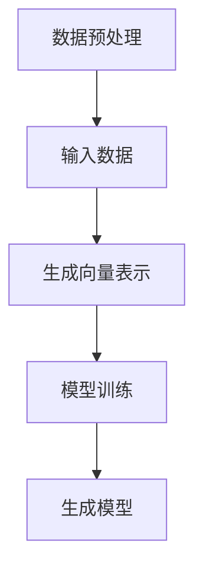
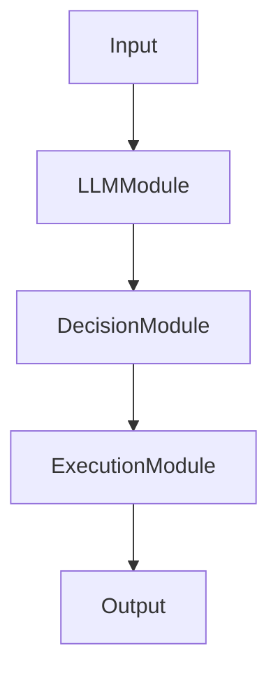

                 


# LLM驱动的AI Agent创新产品设计

## 关键词：LLM, AI Agent, 大语言模型, 智能体, 人工智能, 创新设计

## 摘要：本文详细探讨了如何利用大语言模型（LLM）驱动AI Agent的创新设计，从核心概念到算法实现，再到系统架构和项目实战，全面解析了LLM与AI Agent的结合方式，展示了如何通过技术创新提升AI Agent的功能和应用潜力。

---

# 第1章：背景介绍

## 1.1 问题背景

### 1.1.1 当前AI技术的发展趋势
近年来，人工智能技术快速发展，尤其是大语言模型（LLM）的崛起，为AI Agent的创新设计提供了强大的技术支持。LLM能够理解和生成自然语言，具备强大的上下文理解和推理能力，这使得AI Agent在处理复杂任务时更加智能化和人性化。

### 1.1.2 LLM的崛起与应用现状
大语言模型如GPT-3、GPT-4等，通过海量数据的训练，具备了强大的文本生成和理解能力。这些模型在自然语言处理、对话生成、内容创作等领域得到了广泛应用。LLM的出现，使得AI Agent能够更好地理解和回应用户的复杂需求。

### 1.1.3 AI Agent的概念与应用领域
AI Agent是一种能够自主执行任务的智能体，广泛应用于智能助手、自动化控制、机器人等领域。AI Agent通过感知环境、分析信息、执行任务，为用户提供高效、智能的服务。

## 1.2 问题描述

### 1.2.1 LLM驱动AI Agent的核心问题
传统AI Agent的局限性在于其语言处理能力有限，难以应对复杂的自然语言理解和生成任务。而LLM的引入，弥补了这一不足，使得AI Agent能够更好地理解和处理用户的语言指令。

### 1.2.2 AI Agent面临的挑战与痛点
1. **理解能力不足**：传统AI Agent难以处理复杂的语言指令，导致用户体验不佳。
2. **任务执行效率低**：在处理复杂任务时，AI Agent的效率较低，影响用户体验。
3. **缺乏个性化服务**：AI Agent难以根据用户的具体需求提供个性化的服务。

### 1.2.3 LLM与AI Agent的结合方式
通过将LLM与AI Agent结合，可以充分发挥LLM的语言处理能力，提升AI Agent的理解和生成能力，使其能够更好地执行复杂任务。

## 1.3 问题解决

### 1.3.1 LLM如何赋能AI Agent
1. **提升语言理解能力**：通过LLM的强大语言处理能力，AI Agent能够更准确地理解用户的指令。
2. **增强生成能力**：LLM的生成能力使得AI Agent能够生成更自然、更符合用户需求的文本。
3. **支持复杂任务执行**：通过LLM的推理能力，AI Agent能够执行更复杂的任务，如多轮对话、任务分解等。

### 1.3.2 AI Agent的创新设计思路
1. **模块化设计**：将AI Agent的功能模块化，便于扩展和维护。
2. **人机协作**：通过LLM的支持，实现人机协作，提升任务执行效率。
3. **个性化服务**：根据用户需求，提供个性化的服务，提升用户体验。

### 1.3.3 LLM驱动AI Agent的实现路径
1. **模型集成**：将LLM集成到AI Agent中，提升其语言处理能力。
2. **任务分解**：通过LLM对任务进行分解，优化任务执行流程。
3. **持续学习**：利用LLM的持续学习能力，不断提升AI Agent的能力。

## 1.4 边界与外延

### 1.4.1 LLM驱动AI Agent的边界条件
1. **模型能力限制**：LLM的能力决定了AI Agent的表现，因此需要考虑模型的训练数据和参数量。
2. **计算资源限制**：LLM的运行需要强大的计算资源，这可能限制AI Agent的应用场景。

### 1.4.2 AI Agent的外延与扩展
1. **多模态能力**：未来的AI Agent将不仅仅依赖于语言，还将结合视觉、听觉等多种模态信息，提升其感知能力。
2. **跨平台支持**：AI Agent将支持更多的平台和设备，提升其应用场景的广泛性。

### 1.4.3 LLM与AI Agent的协同关系
1. **协同工作**：LLM与AI Agent协同工作，共同完成复杂任务。
2. **相互促进**：通过AI Agent的应用，不断优化LLM的性能，提升其适应性。

## 1.5 核心要素组成

### 1.5.1 LLM的核心要素
1. **模型架构**：如Transformer、BERT等，决定了模型的处理能力。
2. **训练数据**：数据的质量和多样性直接影响模型的性能。
3. **计算能力**：强大的计算资源是训练和运行LLM的前提。

### 1.5.2 AI Agent的核心要素
1. **感知能力**：包括语言理解、视觉感知等。
2. **决策能力**：包括任务分解、策略选择等。
3. **执行能力**：包括动作执行、反馈处理等。

### 1.5.3 LLM与AI Agent的结合要素
1. **接口设计**：确保LLM与AI Agent之间能够高效交互。
2. **协同机制**：制定明确的协同流程，确保两者能够有效合作。

---

# 第2章：核心概念与联系

## 2.1 核心概念原理

### 2.1.1 LLM的工作原理
1. **输入处理**：将用户输入的文本转化为模型可以处理的向量表示。
2. **生成过程**：通过解码器生成响应文本。
3. **反馈机制**：根据用户反馈不断优化生成结果。

### 2.1.2 AI Agent的工作原理
1. **感知环境**：通过传感器或API获取环境信息。
2. **分析决策**：根据获取的信息进行分析和决策。
3. **执行任务**：根据决策结果执行具体任务。

## 2.2 概念属性特征对比

| 特性       | LLM                     | AI Agent                 |
|------------|--------------------------|--------------------------|
| 输入形式   | 文本、语言                | 环境信息、用户指令        |
| 输出形式   | 文本、语言                | 动作、反馈                |
| 核心能力   | 语言理解与生成           | 任务执行与决策           |
| 应用场景   | 自然语言处理、内容生成   | 智能助手、自动化控制      |

## 2.3 ER实体关系图架构

```mermaid
erd
    图表标题：LLM与AI Agent的关系图

    实体：LLM, AI Agent, 任务, 用户

    LLM --> 生成文本
    AI Agent --> 执行任务
    用户 --> 发出指令
    生成文本 --> 执行任务
    发出指令 --> 生成文本
```

---

# 第3章：算法原理讲解

## 3.1 LLM的算法实现

### 3.1.1 模型训练过程

1. **监督微调**：在特定任务上进行微调，提升模型的适应性。
2. **强化学习**：通过与环境的交互，不断优化模型的生成策略。

### 3.1.2 模型训练流程



### 3.1.3 代码实现

```python
import torch
import torch.nn as nn

class LLMModel(nn.Module):
    def __init__(self, vocab_size):
        super(LLMModel, self).__init__()
        self.embedding = nn.Embedding(vocab_size, 512)
        self.transformer = nn.Transformer(512, 64, 6)
        self.output = nn.Linear(512, vocab_size)

    def forward(self, input):
        embed = self.embedding(input)
        output = self.transformer(embed)
        output = self.output(output)
        return output
```

## 3.2 AI Agent的算法实现

### 3.2.1 任务分解算法

1. **任务分解**：将复杂任务分解为多个子任务。
2. **子任务分配**：将子任务分配给不同的模块或服务进行处理。

### 3.2.2 对话管理算法

1. **对话生成**：基于LLM生成自然的对话回应。
2. **上下文跟踪**：跟踪对话上下文，确保生成的回应连贯一致。

### 3.2.3 推理与决策算法

1. **推理引擎**：基于LLM进行推理，生成决策方案。
2. **决策优化**：通过优化算法，选择最优的决策方案。

---

# 第4章：系统分析与架构设计

## 4.1 系统架构设计

### 4.1.1 模块划分

- **输入模块**：接收用户的输入指令。
- **LLM模块**：负责语言模型的调用和生成。
- **决策模块**：根据LLM的生成结果进行任务分解和决策。
- **执行模块**：执行具体的任务，并返回结果。

### 4.1.2 系统架构图



## 4.2 系统交互流程

### 4.2.1 用户输入

- 用户通过输入模块发送指令。
- 输入模块将指令传递给LLM模块。

### 4.2.2 LLM生成

- LLM模块生成响应文本，并将结果传递给决策模块。

### 4.2.3 任务执行

- 决策模块根据生成的文本进行任务分解，并将任务分配给执行模块。
- 执行模块执行任务，并将结果返回给用户。

---

# 第5章：项目实战

## 5.1 环境安装

```bash
pip install transformers
pip install torch
pip install mermaid
```

## 5.2 系统核心实现

### 5.2.1 LLM模块实现

```python
from transformers import AutoModelForCausalLM, AutoTokenizer

model_name = "gpt2"
tokenizer = AutoTokenizer.from_pretrained(model_name)
model = AutoModelForCausalLM.from_pretrained(model_name)
```

### 5.2.2 AI Agent实现

```python
class AIAssistant:
    def __init__(self, model, tokenizer):
        self.model = model
        self.tokenizer = tokenizer

    def generate_response(self, input_text):
        inputs = self.tokenizer.encode(input_text, return_tensors="pt")
        outputs = self.model.generate(inputs, max_length=50)
        response = self.tokenizer.decode(outputs[0], skip_special_tokens=True)
        return response
```

## 5.3 案例分析

### 5.3.1 多轮对话案例

```python
assistant = AIAssistant(model, tokenizer)
print("User:", "今天天气怎么样？")
response = assistant.generate_response("今天天气怎么样？")
print("AI:", response)
```

---

# 第6章：最佳实践与总结

## 6.1 小结

通过将LLM与AI Agent结合，可以显著提升AI Agent的语言处理能力和任务执行效率。本文详细介绍了LLM驱动的AI Agent的设计思路、算法实现和系统架构，并通过项目实战展示了其应用潜力。

## 6.2 注意事项

1. **数据安全**：在实际应用中，需要确保数据的安全性和隐私性。
2. **计算资源**：运行LLM需要强大的计算资源，需要考虑硬件配置。
3. **模型优化**：根据具体需求，对模型进行优化，提升性能和效率。

## 6.3 未来展望

随着技术的不断进步，未来的AI Agent将具备更强的智能性和适应性。通过与更多模态技术的结合，AI Agent将能够提供更全面、更智能的服务，进一步推动人工智能技术的发展。

---

# 总结

本文系统地介绍了LLM驱动的AI Agent的设计与实现，从理论到实践，全面解析了其创新设计和应用潜力。通过本文的指导，读者可以深入了解如何利用大语言模型提升AI Agent的功能和性能，为未来的创新设计提供重要的参考和借鉴。

