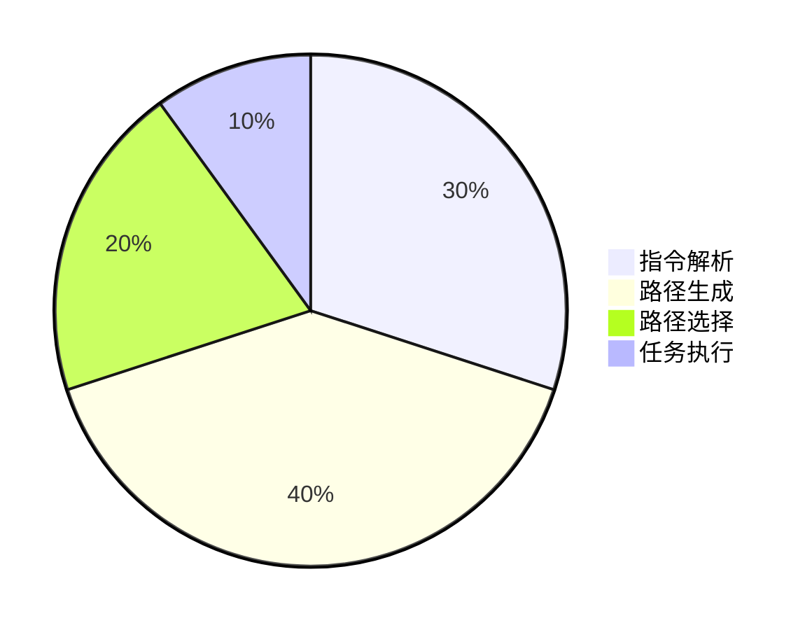
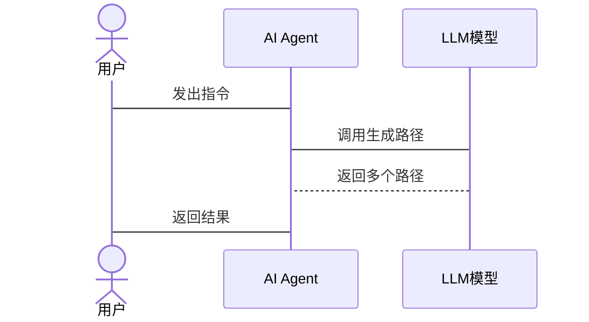

                 


# LLM驱动的AI Agent创新思维发散技术

## 关键词
- LLM（Large Language Model）
- AI Agent（人工智能代理）
- 创新思维发散技术
- 算法原理
- 系统架构
- 实战案例
- 数学模型

## 摘要
随着人工智能技术的飞速发展，大语言模型（LLM）在驱动AI代理（AI Agent）方面展现出巨大的潜力。本文将详细探讨如何利用LLM技术来实现AI Agent的创新思维发散，通过背景分析、核心概念阐述、算法原理讲解、系统架构设计以及实际案例分析，为读者提供全面的技术指导。

---

## 第一部分：LLM驱动的AI Agent背景与概述

### 第1章：LLM驱动的AI Agent概述

#### 1.1 问题背景
- **当前AI技术的发展现状**：近年来，AI技术在各个领域取得了显著进展，尤其是在自然语言处理（NLP）方面，大语言模型（如GPT系列）表现出强大的生成能力和理解能力。
- **LLM在AI Agent中的作用**：AI Agent需要具备理解、推理和生成的能力，而LLM恰好提供了这些能力，使其能够执行复杂的任务。
- **创新思维发散技术的必要性**：AI Agent需要在多种场景下进行创新思考，而传统的基于规则的方法难以应对复杂的动态环境，因此需要引入创新的思维发散技术。

#### 1.2 问题描述
- **LLM驱动AI Agent的核心问题**：如何利用LLM的强大能力，使AI Agent能够进行创新性思考。
- **创新思维发散技术的挑战**：如何设计算法，使AI Agent能够在多种场景下灵活地发散思维，生成多样化的解决方案。
- **现有技术的局限性**：传统的AI Agent大多依赖于规则引擎或简单的机器学习模型，难以应对复杂的创新性任务。

#### 1.3 问题解决
- **LLM驱动AI Agent的解决方案**：通过将LLM与AI Agent结合，利用其强大的生成能力和理解能力，实现创新性思考。
- **创新思维发散技术的实现路径**：通过设计特定的输入格式和输出处理机制，使LLM能够引导AI Agent进行创新性思考。
- **技术实现的可行性分析**：LLM已经在多个领域展现出强大的能力，将其应用到AI Agent的设计中是可行的。

#### 1.4 边界与外延
- **技术边界**：本文主要关注LLM驱动的AI Agent在创新思维发散技术方面的应用，不涉及其在具体业务中的应用。
- **应用场景的外延**：虽然本文主要讨论通用的创新思维发散技术，但这些技术可以扩展到多个具体领域，如创意写作、问题解决等。
- **技术与伦理的平衡**：在实现创新思维发散技术的同时，需要考虑伦理问题，确保生成的内容符合社会规范。

#### 1.5 核心概念与要素
- **LLM的定义与特征**：大语言模型是一种基于深度学习的NLP模型，具有强大的生成和理解能力。
- **AI Agent的核心要素**：AI Agent是一个能够感知环境、执行任务并做出决策的智能体。
- **创新思维发散技术的关键点**：通过特定的算法设计，使AI Agent能够在多种场景下灵活地进行创新性思考。

---

## 第二部分：核心概念与联系

### 第2章：LLM与AI Agent的核心概念

#### 2.1 核心概念原理
- **LLM的基本原理**：大语言模型通过大量的数据训练，掌握了语言的规律和上下文的理解能力，能够生成与输入相关的文本。
- **AI Agent的工作机制**：AI Agent通过感知环境、理解任务目标，利用内部算法进行决策和行动，以实现目标。
- **创新思维发散技术的数学模型**：创新思维发散技术可以通过概率论和统计学方法，结合LLM的生成能力，实现多样化的思考路径。

#### 2.2 概念属性特征对比
| 特性          | LLM                          | AI Agent                      |
|---------------|------------------------------|-------------------------------|
| 核心能力      | 自然语言处理与生成            | 环境感知、决策与行动          |
| 输入输出      | 文本输入，文本输出            | 多种形式的输入，多种形式的输出 |
| 适应性        | 基于训练数据的固定模式         | 可根据环境动态调整             |
| 创新性        | 依赖于训练数据中的模式         | 可通过算法设计实现创新性思考   |

#### 2.3 ER实体关系图
```mermaid
er
  actor: 用户
  agent: AI Agent
  model: LLM模型
  action: 行动
  result: 结果
  actor --> action: 下达指令
  action --> agent: 执行
  agent --> model: 调用
  model --> result: 生成
  result --> actor: 返回结果
```

---

## 第三部分：算法原理讲解

### 第3章：LLM驱动的AI Agent算法原理

#### 3.1 算法流程
```mermaid
graph TD
    A[开始] --> B[输入用户指令
    B --> C[解析指令]
    C --> D[生成多个思考路径]
    D --> E[选择最优路径]
    E --> F[执行任务]
    F --> G[返回结果]
    G --> H[结束]
```

#### 3.2 算法实现
- **步骤1：输入用户指令**：用户向AI Agent发送指令，例如“生成一个创新的营销策略”。
- **步骤2：解析指令**：AI Agent将指令解析为具体的任务目标和要求。
- **步骤3：生成多个思考路径**：利用LLM生成多种可能的思考路径，例如不同的营销策略。
- **步骤4：选择最优路径**：基于一定的评价标准，选择最优的思考路径。
- **步骤5：执行任务**：根据选择的最优路径，执行具体的任务。
- **步骤6：返回结果**：将任务执行结果返回给用户。

#### 3.3 数学模型与公式
- **概率分布模型**：在生成多个思考路径时，可以利用概率分布模型，计算每个路径的可能性。
  $$ P(\text{路径} i) = \frac{\exp(-\text{成本}(i))}{\sum_{j} \exp(-\text{成本}(j))} $$
- **损失函数**：在训练模型时，可以使用交叉熵损失函数来优化模型参数。
  $$ \mathcal{L} = -\sum_{i} y_i \log p(y_i) $$

---

## 第四部分：系统分析与架构设计

### 第4章：系统架构设计

#### 4.1 项目背景
- **项目目标**：开发一个基于LLM的AI Agent，使其能够进行创新性思考。
- **项目范围**：主要关注算法设计和系统架构，不涉及具体业务逻辑的实现。

#### 4.2 系统功能设计
- **功能模块1：指令解析**：解析用户的输入指令，提取任务目标和要求。
- **功能模块2：路径生成**：利用LLM生成多个思考路径。
- **功能模块3：路径选择**：基于评价标准选择最优路径。
- **功能模块4：任务执行**：根据选择的最优路径执行任务。

#### 4.3 系统架构图


#### 4.4 接口设计
- **输入接口**：接收用户的指令输入。
- **输出接口**：返回任务执行结果。
- **内部接口**：模块之间的通信接口，例如路径生成模块与路径选择模块之间的接口。

#### 4.5 交互流程


---

## 第五部分：项目实战

### 第5章：项目实战

#### 5.1 环境安装
- **安装Python**：确保系统中安装了Python 3.8或更高版本。
- **安装依赖库**：安装必要的依赖库，例如`transformers`和`llm-engine`。

#### 5.2 核心代码实现
```python
from transformers import pipeline

# 初始化LLM模型
llm = pipeline('text-generation', model='gpt2')

def generate_paths(prompt):
    # 生成多个思考路径
    paths = llm(prompt, max_length=50, num_return_sequences=5)
    return paths

def select_optimal_path(paths):
    # 选择最优路径
    optimal_path = max(paths, key=lambda x: x['score'])
    return optimal_path['generated_text']

# 示例用法
prompt = "生成一个创新的营销策略"
paths = generate_paths(prompt)
optimal_path = select_optimal_path(paths)
print(optimal_path)
```

#### 5.3 代码应用解读
- **generate_paths函数**：该函数接收一个提示（prompt），调用LLM生成多个思考路径。
- **select_optimal_path函数**：该函数从生成的路径中选择最优的路径，基于评分标准。
- **示例用法**：通过给定提示，生成多个营销策略，并选择最优的一个。

#### 5.4 案例分析
- **案例1：营销策略生成**：用户输入“生成一个创新的营销策略”，AI Agent生成多个策略，选择最优的一个并执行。
- **案例2：问题解决**：用户输入“解决某个技术问题”，AI Agent生成多个解决方案，选择最优的一个并执行。

#### 5.5 项目小结
- **总结**：通过本文的介绍，读者可以了解到如何利用LLM驱动AI Agent进行创新性思考，并通过实际案例分析掌握具体实现方法。

---

## 第六部分：总结与展望

### 第6章：总结与展望

#### 6.1 最佳实践 tips
- **合理设计输入格式**：确保输入指令清晰明确，以便LLM能够准确生成所需的思考路径。
- **优化路径选择算法**：根据具体场景调整路径选择算法，以提高选择的准确性。
- **关注伦理问题**：在实现创新思维发散技术时，需要关注伦理问题，确保生成的内容符合社会规范。

#### 6.2 小结
- **核心内容回顾**：本文详细介绍了LLM驱动的AI Agent创新思维发散技术，包括背景、核心概念、算法原理、系统架构设计和实际案例分析。
- **主要收获**：通过本文的学习，读者可以掌握如何利用LLM技术实现AI Agent的创新性思考。

#### 6.3 注意事项
- **数据质量**：生成的思考路径质量依赖于训练数据的质量，需确保数据的多样性和代表性。
- **模型选择**：根据具体需求选择合适的LLM模型，以获得最佳效果。

#### 6.4 拓展阅读
- **推荐书籍**：《Deep Learning》、《Pattern Recognition and Machine Learning》
- **推荐论文**：相关领域的最新研究论文，如《Attention Is All You Need》

---

通过以上内容，读者可以系统地了解LLM驱动的AI Agent创新思维发散技术的核心内容和技术实现方法。希望本文能够为相关领域的研究和实践提供有价值的参考。

