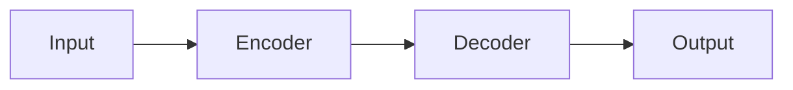
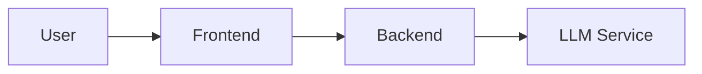
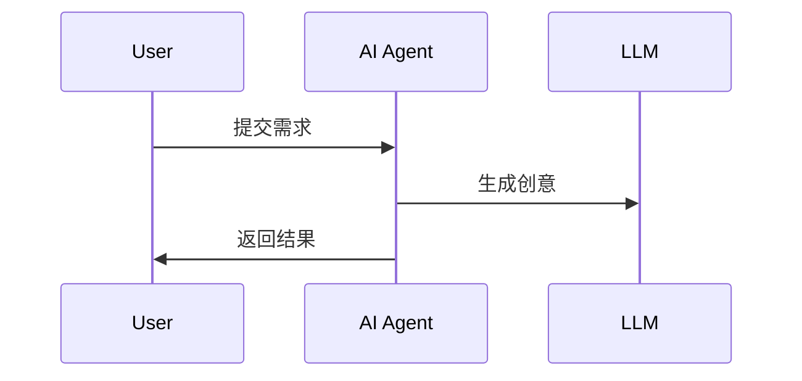

                 


# LLM驱动的AI Agent创新思维训练方法

> 关键词：LLM, AI Agent, 创新思维, 人机协作, 生成式模型, 创新训练, 技术实现

> 摘要：本文详细探讨了利用大语言模型（LLM）驱动的人工智能代理（AI Agent）在创新思维训练中的应用方法。通过分析LLM与AI Agent的结合方式，揭示其在创新思维中的核心作用，结合算法原理和系统架构设计，提供了一套完整的创新思维训练方法。本文不仅介绍了理论基础，还通过实际案例和项目实现，展示了如何将这些技术应用于实际场景中，为读者提供了丰富的实践指导。

---

## 第一章：LLM与AI Agent的背景与概念

### 1.1 LLM与AI Agent的定义与特点

#### 1.1.1 大语言模型（LLM）的定义
大语言模型（Large Language Model，LLM）是指基于深度学习技术构建的、具有大规模参数的自然语言处理模型。LLM通过大量文本数据的预训练，能够理解和生成人类语言，具有广泛的应用场景，如文本生成、机器翻译、问答系统等。

**数学公式：**  
LLM的训练目标可以表示为最小化生成概率的负对数似然：
$$ \mathcal{L} = -\log P(x_1, x_2, ..., x_n) $$

其中，$x_i$ 表示输入序列中的第 $i$ 个元素。

#### 1.1.2 AI Agent的核心特点
AI Agent（人工智能代理）是一种智能系统，能够感知环境、执行任务并做出决策。AI Agent的核心特点包括：
1. **自主性**：能够在没有外部干预的情况下自主运行。
2. **反应性**：能够实时感知环境变化并做出响应。
3. **目标导向**：具有明确的目标，并根据目标进行决策。
4. **学习能力**：能够通过经验改进自身的性能。

#### 1.1.3 LLM与AI Agent的结合方式
LLM与AI Agent的结合主要体现在以下几个方面：
1. **LLM作为知识库**：AI Agent利用LLM的强大语言理解能力，快速获取和处理信息。
2. **LLM作为生成引擎**：AI Agent通过LLM生成自然语言文本，如回答问题、创作内容等。
3. **LLM作为决策支持**：AI Agent利用LLM进行分析和推理，辅助做出决策。

### 1.2 LLM驱动AI Agent的创新思维

#### 1.2.1 创新思维的定义与重要性
创新思维是指在解决问题时，能够突破常规思维模式，提出新颖、独特的解决方案。创新思维在现代社会中具有重要意义，尤其是在快速变化的技术和商业环境中。

#### 1.2.2 LLM在创新思维中的作用
LLM通过生成多样化的想法、提供多角度的分析，帮助人类拓展思维边界，激发创新灵感。

#### 1.2.3 AI Agent如何辅助创新思维的实现
AI Agent通过与用户的交互，结合LLM的能力，提供个性化的创新思维训练方案，帮助用户提升创造力。

### 1.3 LLM与AI Agent的应用场景

#### 1.3.1 教育领域的创新思维训练
在教育领域，LLM驱动的AI Agent可以用于学生创新能力的培养，例如通过对话式交互提供创意写作、问题解决等训练。

#### 1.3.2 企业中的创新思维培养
在企业中，AI Agent可以帮助员工进行创新思维训练，促进新产品开发、业务模式创新等。

#### 1.3.3 创新思维在个人成长中的应用
对于个人而言，AI Agent可以作为日常思维训练的工具，帮助个人提升解决问题的能力。

---

## 第二章：LLM与AI Agent的核心概念与原理

### 2.1 LLM的核心概念与原理

#### 2.1.1 生成式模型的基本原理
生成式模型通过概率分布生成新的数据。LLM使用自回归或变压器架构生成文本。

**数学公式：**  
自回归生成模型的目标函数可以表示为：
$$ P(x_1, x_2, ..., x_n) = \prod_{i=1}^n P(x_i|x_{<i}) $$

#### 2.1.2 LLM的训练过程
LLM的训练通常包括预训练和微调两个阶段。预训练使用大规模数据进行无监督学习，微调针对特定任务进行有监督优化。

#### 2.1.3 LLM的输出机制
LLM通过概率生成机制输出文本，通常采用贪心算法或随机采样方法。

### 2.2 AI Agent的核心概念与原理

#### 2.2.1 AI Agent的定义与分类
AI Agent根据智能水平可以分为反应式和认知式两类。反应式AI Agent基于当前感知做出反应，认知式AI Agent具有复杂的目标和推理能力。

#### 2.2.2 AI Agent的行为决策机制
AI Agent通过感知环境、分析目标、选择动作来实现行为决策。决策过程通常涉及状态空间、动作空间和奖励函数。

**数学公式：**  
强化学习的目标是最大化累积奖励：
$$ J = \mathbb{E}[\sum_{t=1}^T r_t] $$

其中，$r_t$ 是第 $t$ 步的奖励。

#### 2.2.3 AI Agent的交互方式
AI Agent可以通过文本、语音、视觉等多种方式与用户交互，提供服务。

### 2.3 LLM与AI Agent的结合原理

#### 2.3.1 LLM作为AI Agent的核心模块
LLM作为AI Agent的语言处理核心，负责理解和生成文本。

#### 2.3.2 AI Agent如何调用LLM进行创新思维
AI Agent通过解析用户需求，调用LLM生成创意解决方案。

#### 2.3.3 LLM与AI Agent的协同工作流程
1. 用户输入需求。
2. AI Agent解析需求。
3. LLM生成创新方案。
4. AI Agent优化方案并反馈给用户。

---

## 第三章：LLM驱动的AI Agent创新思维训练的算法原理

### 3.1 LLM的训练算法

#### 3.1.1 预训练过程
预训练使用大规模数据，采用自监督学习，优化模型的表示能力。

**Python代码示例：**
```python
import torch
def loss_function(outputs, targets):
    return torch.nn.CrossEntropyLoss()(outputs, targets)
```

#### 3.1.2 微调过程
微调针对特定任务进行优化，通常使用小规模标注数据。

**数学公式：**  
微调的目标函数为：
$$ \mathcal{L}_{\text{total}} = \mathcal{L}_{\text{pretrain}} + \lambda \mathcal{L}_{\text{task}} $$

其中，$\lambda$ 是平衡系数。

### 3.2 生成式模型的算法实现

#### 3.2.1 变压器架构
生成式模型通常采用变压器架构，包括编码器和解码器。

**Mermaid图示：**


#### 3.2.2 概率生成机制
模型通过计算条件概率生成文本序列。

**数学公式：**  
生成概率为：
$$ P(x_1, x_2, ..., x_n) = \prod_{i=1}^n P(x_i|x_{<i}) $$

### 3.3 创新思维的生成过程

#### 3.3.1 创意生成算法
创意生成算法通过多轮对话优化生成结果。

**Python代码示例：**
```python
def generate创意(text, model):
    for _ in range(5):  # 迭代次数
        response = model.generate(text)
        text += response
    return text
```

#### 3.3.2 创新评估指标
创新性评估指标包括多样性、新颖性和相关性。

**数学公式：**  
多样性评估可以使用熵值：
$$ H = -\sum_{i=1}^n P_i \log P_i $$

---

## 第四章：系统分析与架构设计方案

### 4.1 系统架构设计

#### 4.1.1 系统功能设计
系统功能包括需求解析、创意生成、结果优化和反馈学习。

**Mermaid图示：**
```mermaid
classDiagram
    class LLM:
        - parameters
        - generate(text)
    class AI Agent:
        - parse_request()
        - get_creative_output(llm)
        - optimize_output(llm)
    class User:
        - input_request
        - receive_output
```

#### 4.1.2 系统架构设计
系统架构采用模块化设计，包括前端交互、后端处理和模型服务。

**Mermaid图示：**


#### 4.1.3 系统接口设计
系统接口包括用户输入、模型调用和结果返回。

#### 4.1.4 系统交互设计
系统交互流程包括用户请求、需求解析、创意生成和结果反馈。

**Mermaid图示：**


---

## 第五章：项目实战

### 5.1 环境安装

#### 5.1.1 安装依赖
安装Python、TensorFlow、Keras等依赖库。

**代码示例：**
```bash
pip install tensorflow==2.5.0 keras==2.5.0
```

#### 5.1.2 安装LLM模型
使用Hugging Face库下载预训练模型。

**代码示例：**
```bash
pip install transformers
```

### 5.2 核心代码实现

#### 5.2.1 LLM模型实现
实现一个简单的生成式模型。

**Python代码示例：**
```python
import torch
class SimpleLLM(torch.nn.Module):
    def __init__(self):
        super().__init__()
        self.lm = torch.nn.Linear(100, 50)
    def forward(self, input):
        return self.lm(input)
```

#### 5.2.2 AI Agent实现
实现AI Agent的交互逻辑。

**Python代码示例：**
```python
class AI-Agent:
    def __init__(self, model):
        self.model = model
    def generate_creative(self, text):
        return self.model.generate(text)
```

### 5.3 案例分析与项目总结

#### 5.3.1 案例分析
通过实际案例展示AI Agent如何利用LLM进行创新思维训练。

#### 5.3.2 项目总结
总结项目实现过程中的经验和教训，提出改进建议。

---

## 第六章：总结与展望

### 6.1 本章总结
回顾文章的主要内容，强调LLM与AI Agent结合在创新思维训练中的重要性。

### 6.2 未来展望
探讨技术的发展方向，提出未来可能的研究热点。

### 6.3 最佳实践 Tips
提供一些实用的建议，帮助读者更好地应用这些技术。

---

通过以上结构，文章详细探讨了LLM驱动的AI Agent创新思维训练方法，结合理论分析和实际案例，为读者提供了一个全面的视角。

