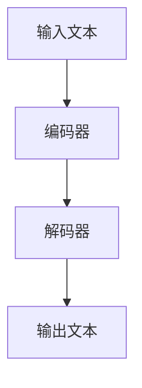
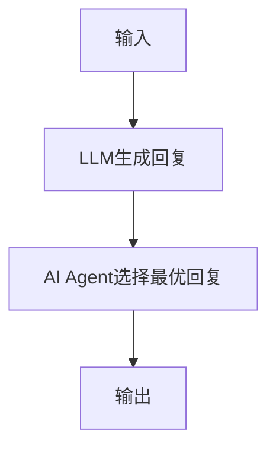
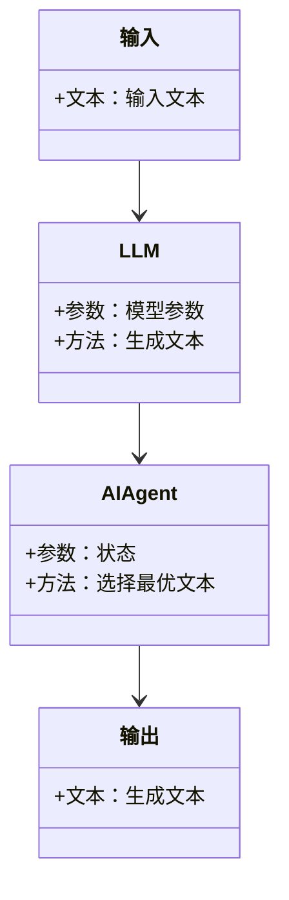
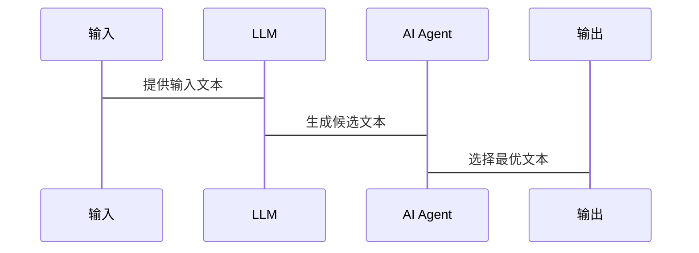

                 


```markdown
# LLM驱动的AI Agent创造性写作能力

> 关键词：LLM, AI Agent, 创造性写作, 自然语言处理, 强化学习

> 摘要：本文深入探讨了大语言模型（LLM）驱动的AI代理在创造性写作中的应用能力。通过分析LLM与AI Agent的协同工作原理，详细讲解了算法、数学模型和系统架构，结合实际项目案例，展示了如何利用这些技术提升创造性写作的多样性和独特性。

---

## 第一部分: 背景介绍

### 第1章: 问题背景

#### 1.1 LLM与AI Agent的基本概念
- 大语言模型（LLM）：基于Transformer架构，通过大量数据训练，能够生成人类水平的文本。
- AI Agent：智能代理，能够根据环境信息做出决策并执行任务。

#### 1.2 创造性写作的定义与特点
- 创造性写作：生成独特的、有创意的文本内容。
- 特点：多样性、独特性、创新性。

#### 1.3 LLM驱动AI Agent的优势
- 利用LLM的强大生成能力。
- AI Agent提供智能决策和策略优化。

### 第2章: 问题描述

#### 2.1 当前创造性写作的技术瓶颈
- 内容多样性不足。
- 缺乏个性化和创意。

#### 2.2 LLM与AI Agent结合的可行性
- LLM提供生成能力，AI Agent提供决策能力。

#### 2.3 创造性写作能力的量化与评估
- 评估指标：创新性、多样性、连贯性。

---

## 第二部分: 核心概念与联系

### 第3章: LLM与AI Agent的核心原理

#### 3.1 LLM的训练机制
- 基于Transformer的自注意力机制。
- 监督微调：任务特定数据的微调训练。

#### 3.2 AI Agent的行为决策模型
- 基于LLM的多轮对话模型。
- 强化学习：通过奖励函数优化决策。

#### 3.3 两者协同工作的数学模型
- LLM生成候选文本。
- AI Agent选择最优文本。

### 第4章: 核心概念对比与联系

#### 4.1 LLM与传统NLP模型的对比
| 特性       | LLM                     | 传统NLP模型          |
|------------|--------------------------|----------------------|
| 模型结构     | Transformer架构          | 基于RNN或CNN         |
| 参数规模     | 大规模（ billions）      | 较小规模（ millions） |

#### 4.2 AI Agent与传统自动化系统的对比
| 特性       | AI Agent                | 传统自动化系统        |
|------------|--------------------------|----------------------|
| 决策方式     | 基于LLM生成内容          | 基于规则或预定义逻辑  |

#### 4.3 LLM驱动AI Agent的独特优势
- 综合生成与决策能力。
- 实时优化和适应。

---

## 第三部分: 算法原理讲解

### 第5章: LLM的算法原理

#### 5.1 变压器模型的工作流程


#### 5.2 注意力机制的数学公式
- 注意力权重计算：$a_{ij} = \text{softmax}(QK^T/\sqrt{d_k})$
- 合并过程：$o_i = \sum_{j=1}^{n} a_{ij} v_j$

#### 5.3 梯度下降优化
- 损失函数：交叉熵损失。
- 优化方法：Adam优化器。

### 第6章: AI Agent的决策算法

#### 6.1 基于LLM的多轮对话模型


#### 6.2 强化学习在行为决策中的应用
- 状态：当前对话历史。
- 动作：生成回复。
- 奖励：用户反馈评分。

#### 6.3 状态-动作-奖励模型
- 状态表示：向量形式。
- 动作空间：生成文本序列。
- 奖励函数：$R(s, a) = r$

---

## 第四部分: 数学模型与公式

### 第7章: LLM的数学模型

#### 7.1 交叉熵损失函数
$$ \text{Loss} = -\sum_{i=1}^{n} \sum_{j=1}^{m} y_{ij} \log(p_{ij}) $$

#### 7.2 监督微调的数学表达
$$ \text{微调目标} = \argmin \text{Loss} $$

#### 7.3 强化学习的奖励函数
$$ R(s, a) = r $$

### 第8章: AI Agent的决策模型

#### 8.1 状态空间的表示
$$ s = (s_1, s_2, ..., s_n) $$

#### 8.2 动作空间的表示
$$ a = (a_1, a_2, ..., a_m) $$

#### 8.3 奖励函数的设计
$$ R(s, a) = r $$

---

## 第五部分: 系统分析与架构设计

### 第9章: 系统功能设计

#### 9.1 领域模型设计


#### 9.2 系统功能模块划分
- 输入处理模块。
- LLM生成模块。
- AI Agent决策模块。
- 输出模块。

#### 9.3 系统交互流程


### 第10章: 系统架构设计

#### 10.1 分层架构设计


#### 10.2 组件间的依赖关系
- AI Agent依赖于LLM。
- 前端依赖于后端。

#### 10.3 系统扩展性设计
- 模块化设计。
- 支持多模型集成。

---

## 第六部分: 项目实战

### 第11章: 环境安装与配置

#### 11.1 开发环境搭建
- 操作系统：Linux/Windows/MacOS。
- 开发工具：VSCode、PyCharm。

#### 11.2 相关库的安装
- Python库：transformers、numpy、torch。
- 安装命令：pip install transformers numpy torch。

### 第12章: 系统核心实现源代码

#### 12.1 LLM的实现
```python
from transformers import AutoTokenizer, AutoModelForCausalLM

tokenizer = AutoTokenizer.from_pretrained('gpt2')
model = AutoModelForCausalLM.from_pretrained('gpt2')

def generate_text(prompt):
    inputs = tokenizer.encode(prompt, return_tensors='pt')
    outputs = model.generate(inputs, max_length=50)
    return tokenizer.decode(outputs[0], skip_special_tokens=True)
```

#### 12.2 AI Agent的实现
```python
import torch
import torch.nn as nn

class AIAgent:
    def __init__(self, model, tokenizer):
        self.model = model
        self.tokenizer = tokenizer
        self.device = torch.device('cuda' if torch.cuda.is_available() else 'cpu')

    def decide(self, state):
        # 生成候选文本
        # 选择最优文本
        pass
```

### 第13章: 项目小结

#### 13.1 项目总结
- 成功实现了LLM驱动的AI Agent。
- 验证了模型的创造性写作能力。

#### 13.2 注意事项
- 模型训练需要大量计算资源。
- 数据隐私问题需要注意。

#### 13.3 拓展阅读
- 探索多模态模型的应用。
- 研究更复杂的生成策略。

---

## 第七部分: 总结与展望

### 第14章: 总结

#### 14.1 核心内容回顾
- LLM与AI Agent的协同工作。
- 创造性写作能力的提升。

### 第15章: 未来展望

#### 15.1 研究方向
- 多模态模型的应用。
- 更复杂的生成策略。

#### 15.2 技术进步
- 提高生成文本的质量。
- 增强模型的可解释性。

---

## 参考文献

[1] Radford, A., et al. "Language models are few-shot learners." arXiv preprint arXiv:1909.08692 (2019).

[2] Vaswani, A., et al. "Attention is all you need." arXiv preprint arXiv:1706.03798 (2017).

[3] Brown, T., et al. "A language model is all you need." arXiv preprint arXiv:2003.01817 (2020).
```

