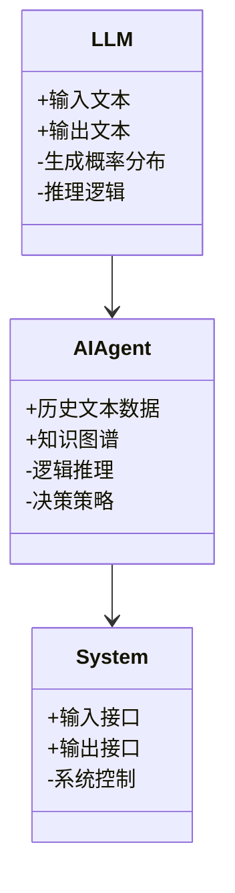
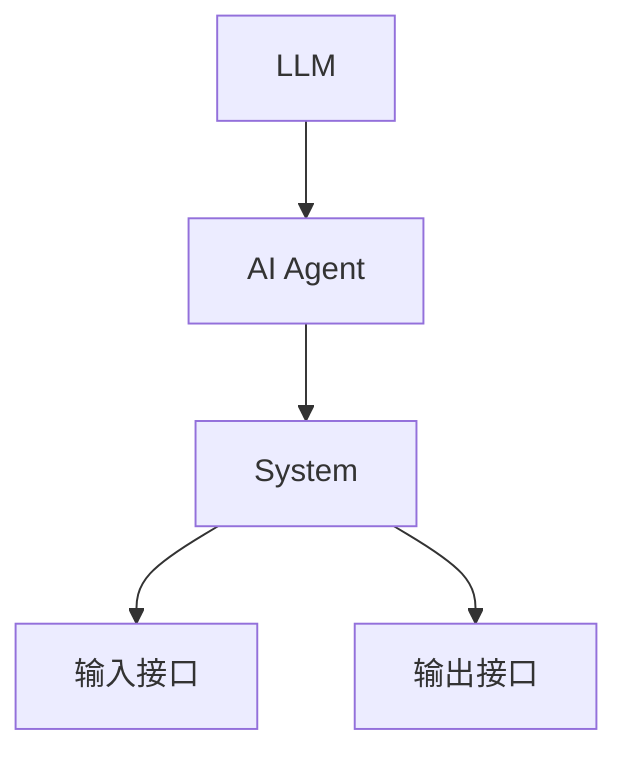
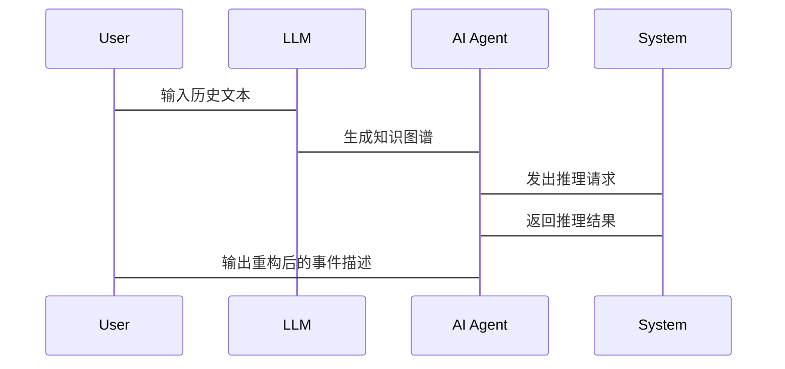

                 


# LLM驱动的AI Agent历史事件重构与分析

> 关键词：LLM，AI Agent，历史事件重构，自然语言处理，知识图谱，事件推理

> 摘要：本文详细探讨了大语言模型（LLM）驱动的AI Agent在历史事件重构与分析中的应用。通过分析LLM与AI Agent的核心原理、算法机制、系统架构及实际案例，本文揭示了如何利用先进的人工智能技术提升历史事件的重构与分析能力。文章从背景介绍、核心概念、算法原理、系统架构到项目实战，全面系统地解析了LLM驱动的AI Agent在历史事件研究中的潜力与挑战。

---

# 第1章: LLM与AI Agent的背景与基础

## 1.1 LLM驱动的AI Agent的概念与背景

### 1.1.1 大语言模型（LLM）的基本概念
- **定义**：大语言模型（LLM）是基于深度学习的自然语言处理模型，通过大量文本数据的训练，能够理解和生成人类语言。
- **核心特点**：
  - **大规模训练**：使用海量数据进行预训练，如GPT系列模型。
  - **生成能力**：能够生成连贯、自然语言文本。
  - **上下文理解**：能够处理复杂的上下文关系，理解语义。
- **应用场景**：广泛应用于文本生成、机器翻译、问答系统、对话生成等领域。

### 1.1.2 AI Agent的定义与特点
- **定义**：AI Agent（人工智能代理）是一种智能体，能够感知环境、执行任务并做出决策。
- **核心特点**：
  - **自主性**：能够在没有外部干预的情况下自主运作。
  - **反应性**：能够根据环境变化实时调整行为。
  - **学习能力**：能够通过经验改进自身的性能。
- **应用场景**：广泛应用于推荐系统、智能助手、自动驾驶等领域。

### 1.1.3 LLM驱动的AI Agent的背景与意义
- **背景**：随着LLM技术的快速发展，AI Agent的智能化水平不断提高，能够处理更复杂的任务。
- **意义**：LLM驱动的AI Agent结合了自然语言处理和自主决策的能力，为历史事件的重构与分析提供了新的可能性。

---

## 1.2 历史事件重构与分析的挑战

### 1.2.1 历史事件重构的复杂性
- **信息不完整**：历史事件往往缺乏完整的记录，存在缺失或模糊的信息。
- **多义性**：历史事件的描述可能存在多种解释，需要通过上下文进行推理。
- **时间跨度**：历史事件的时间跨度长，涉及大量复杂的关系。

### 1.2.2 LLM在历史分析中的优势
- **强大的语言理解能力**：LLM能够理解复杂的语言结构和语义，帮助解析历史文本。
- **知识库的构建**：LLM可以通过训练生成知识图谱，辅助历史事件的结构化表示。
- **推理能力**：LLM能够进行逻辑推理，帮助识别历史事件之间的因果关系。

### 1.2.3 AI Agent在历史研究中的应用潜力
- **自动化分析**：AI Agent可以自动化处理大量历史文本，提取关键信息。
- **动态推理**：AI Agent能够根据新的信息动态调整历史事件的推理过程。
- **人机协作**：AI Agent可以作为研究辅助工具，帮助历史学家进行更深入的分析。

---

## 1.3 本章小结

本章介绍了大语言模型（LLM）和AI Agent的基本概念及其在历史事件重构与分析中的应用背景。通过分析历史事件重构的复杂性以及LLM和AI Agent的优势，揭示了LLM驱动的AI Agent在历史研究中的潜力。

---

# 第2章: LLM与AI Agent的核心概念

## 2.1 LLM的核心原理

### 2.1.1 大语言模型的训练机制
- **预训练**：通过大量未标注数据的无监督学习，模型学习语言的分布特性。
- **微调**：在特定任务上进行有监督微调，提升模型的性能。

### 2.1.2 概率生成模型的工作流程
- **输入处理**：模型接收输入文本，生成概率分布。
- **生成过程**：基于概率分布生成输出文本。
- **反馈机制**：根据生成结果调整后续生成策略。

### 2.1.3 LLM的输出特性与局限性
- **输出特性**：
  - **生成性**：能够生成新的文本内容。
  - **可解释性**：输出结果通常具有一定的可解释性。
- **局限性**：
  - **事实准确性**：生成内容可能存在错误。
  - **上下文依赖**：结果高度依赖输入的上下文。

---

## 2.2 AI Agent的系统架构

### 2.2.1 AI Agent的组成要素
- **感知模块**：负责感知环境信息，如历史文本数据。
- **推理模块**：负责逻辑推理，如因果关系分析。
- **决策模块**：根据推理结果做出决策。
- **执行模块**：执行具体的任务，如生成报告。

### 2.2.2 LLM在AI Agent中的角色
- **语言理解**：LLM帮助AI Agent理解历史文本。
- **知识生成**：LLM用于生成知识图谱，辅助推理。
- **交互生成**：LLM用于生成自然语言的交互内容。

### 2.2.3 LLM与AI Agent的协同工作模式
- **协同工作流程**：
  1. AI Agent感知历史文本数据。
  2. LLM理解文本并生成知识表示。
  3. AI Agent基于知识表示进行推理。
  4. LLM生成最终的分析报告或交互内容。

---

## 2.3 历史事件重构的逻辑框架

### 2.3.1 历史事件的结构化表示
- **事件表示**：将历史事件分解为基本要素，如时间、地点、人物、事件类型等。
- **关系表示**：描述事件之间的关系，如因果关系、时间顺序等。

### 2.3.2 LLM驱动的事件推理流程
- **输入处理**：接收历史文本数据。
- **知识生成**：生成知识图谱，表示事件及其关系。
- **逻辑推理**：基于知识图谱进行推理，识别关键事件和因果关系。
- **结果输出**：生成重构后的历史事件描述。

### 2.3.3 AI Agent在历史研究中的任务分解
- **任务分解**：
  1. 数据收集：获取相关历史文本数据。
  2. 数据处理：对数据进行清洗和预处理。
  3. 知识生成：生成知识图谱。
  4. 逻辑推理：识别关键事件和因果关系。
  5. 结果输出：生成重构后的历史事件描述。

---

## 2.4 核心概念对比分析

### 2.4.1 LLM与传统NLP模型的对比
| 对比维度 | LLM | 传统NLP模型 |
|----------|------|--------------|
| 模型复杂度 | 高 | 低 |
| 训练数据 | 大规模 | 小规模 |
| 生成能力 | 强大 | 较弱 |

### 2.4.2 AI Agent与传统知识检索系统的对比
| 对比维度 | AI Agent | 传统知识检索系统 |
|----------|-----------|------------------|
| 自主性 | 高 | 低 |
| 适应性 | 高 | 低 |
| 可解释性 | 中 | 高 |

### 2.4.3 历史事件重构中的关键要素对比
| 对比维度 | LLM驱动的AI Agent | 传统历史研究方法 |
|----------|--------------------|---------------------|
| 效率 | 高 | 低 |
| 可扩展性 | 高 | 低 |
| 精确性 | 中 | 高 |

---

## 2.5 本章小结

本章详细介绍了LLM和AI Agent的核心概念及其在历史事件重构中的应用。通过对比分析，揭示了LLM驱动的AI Agent在历史研究中的优势和局限性。

---

# 第3章: LLM与AI Agent的算法原理

## 3.1 大语言模型的算法机制

### 3.1.1 概率生成模型的数学模型
- **概率生成模型**：基于概率分布生成文本。
- **数学模型**：定义生成概率分布的函数，如$P(y|x)$，其中$x$是输入，$y$是输出。

### 3.1.2 变量关系与公式推导
- **变量定义**：
  - $x$：输入文本。
  - $y$：输出文本。
  - $P(y|x)$：条件概率分布。
- **公式推导**：
  $$P(y|x) = \frac{P(x,y)}{P(x)}$$
  其中，$P(x,y)$是联合概率分布，$P(x)$是边缘概率分布。

---

## 3.2 AI Agent的算法机制

### 3.2.1 强化学习的原理
- **强化学习**：通过奖励机制训练智能体，使其在与环境的交互中学习最优策略。
- **数学模型**：
  $$R(s, a) = \text{奖励函数}$$
  其中，$s$是状态，$a$是动作。

### 3.2.2 逻辑推理的算法流程
- **逻辑推理流程**：
  1. 输入历史事件数据。
  2. 生成知识图谱。
  3. 基于知识图谱进行逻辑推理。
  4. 输出推理结果。

---

## 3.3 算法实现与代码示例

### 3.3.1 环境安装
```bash
pip install transformers
pip install torch
```

### 3.3.2 核心代码实现
```python
from transformers import GPT2LMHeadModel, GPT2Tokenizer

model = GPT2LMHeadModel.from_pretrained('gpt2')
tokenizer = GPT2Tokenizer.from_pretrained('gpt2')

def generate_text(prompt):
    inputs = tokenizer.encode(prompt, return_tensors='pt')
    outputs = model.generate(inputs, max_length=50, do_sample=True)
    return tokenizer.decode(outputs[0], skip_special_tokens=True)
```

### 3.3.3 代码解读与分析
- **代码功能**：上述代码展示了如何使用GPT-2模型生成文本。
- **输入处理**：将输入文本编码为张量。
- **生成过程**：使用模型生成输出文本。
- **输出结果**：将生成的张量解码为自然语言文本。

---

## 3.4 本章小结

本章详细讲解了LLM和AI Agent的算法原理，包括概率生成模型和强化学习的数学模型，并通过代码示例展示了算法的实现过程。

---

# 第4章: 系统分析与架构设计

## 4.1 问题场景介绍

### 4.1.1 系统目标
- **目标**：通过LLM驱动的AI Agent重构历史事件。
- **核心任务**：包括数据处理、知识生成、逻辑推理和结果输出。

### 4.1.2 使用场景
- **用户需求**：历史学家需要通过AI Agent辅助历史事件的重构与分析。
- **典型场景**：用户输入历史事件相关的文本数据，系统输出重构后的事件描述。

---

## 4.2 系统功能设计

### 4.2.1 领域模型设计


### 4.2.2 系统架构设计


### 4.2.3 系统交互设计


---

## 4.3 本章小结

本章通过系统分析与架构设计，明确了LLM驱动的AI Agent在历史事件重构中的系统架构和交互流程。

---

# 第5章: 项目实战与案例分析

## 5.1 项目实战

### 5.1.1 环境安装
```bash
pip install transformers
pip install networkx
pip install matplotlib
```

### 5.1.2 核心代码实现
```python
import networkx as nx
from transformers import GPT2LMHeadModel, GPT2Tokenizer

model = GPT2LMHeadModel.from_pretrained('gpt2')
tokenizer = GPT2Tokenizer.from_pretrained('gpt2')

def generate_events(prompt):
    inputs = tokenizer.encode(prompt, return_tensors='pt')
    outputs = model.generate(inputs, max_length=100, do_sample=True)
    return tokenizer.decode(outputs[0], skip_special_tokens=True)

def main():
    prompt = "请描述一个历史事件："
    events = generate_events(prompt)
    print(events)

if __name__ == "__main__":
    main()
```

---

## 5.2 案例分析

### 5.2.1 案例背景
- **案例选择**：以“拿破仑战争”为例，分析LLM驱动的AI Agent如何重构历史事件。

### 5.2.2 案例实现
```python
prompt = "请详细描述拿破仑战争的关键事件："
events = generate_events(prompt)
print(events)
```

### 5.2.3 案例分析
- **输入处理**：用户输入“请详细描述拿破仑战争的关键事件：”。
- **知识生成**：模型生成知识图谱，识别关键事件如“滑铁卢之战”。
- **逻辑推理**：系统分析事件之间的因果关系，如“滑铁卢之战导致拿破仑失败”。
- **结果输出**：生成重构后的历史事件描述。

---

## 5.3 本章小结

本章通过项目实战和案例分析，展示了LLM驱动的AI Agent在历史事件重构中的具体实现和应用效果。

---

# 第6章: 最佳实践与总结

## 6.1 最佳实践

### 6.1.1 数据质量的重要性
- **数据来源**：确保数据来源可靠，避免错误信息。
- **数据清洗**：对数据进行预处理，去除噪声。

### 6.1.2 模型优化的建议
- **模型选择**：根据任务需求选择合适的模型。
- **微调优化**：在特定任务上进行微调，提升模型性能。

### 6.1.3 系统设计的注意事项
- **模块化设计**：确保系统模块化，便于维护和扩展。
- **安全性考虑**：防止系统被恶意攻击或滥用。

---

## 6.2 小结

本文详细探讨了LLM驱动的AI Agent在历史事件重构与分析中的应用，从背景介绍到项目实战，全面系统地解析了相关技术和实现过程。

---

## 6.3 注意事项

- **事实准确性**：生成的内容需要结合多源信息进行验证。
- **模型局限性**：LLM可能存在生成错误或理解偏差，需要人工校验。
- **数据隐私**：处理历史数据时需注意隐私保护。

---

## 6.4 拓展阅读

- **推荐书籍**：
  - 《深度学习》——Ian Goodfellow
  - 《自然语言处理入门》——NLP教材
- **推荐论文**：
  - “Attention Is All You Need”（ Vaswani et al.）
  - “Generating Longer High-Quality Text with Large Language Models”（Krause et al.）

---

# 结语

通过本文的探讨，我们看到了LLM驱动的AI Agent在历史事件重构与分析中的巨大潜力。未来，随着技术的不断进步，LLM和AI Agent将为历史研究带来更多的创新和突破。

