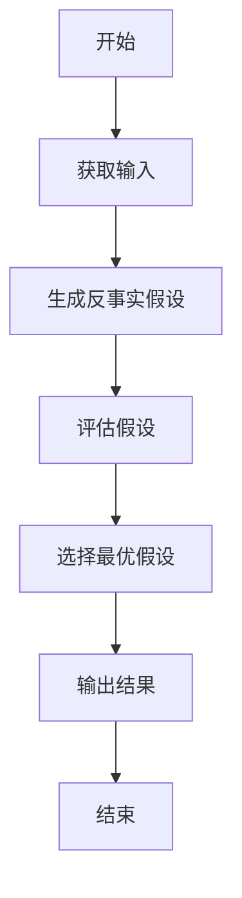
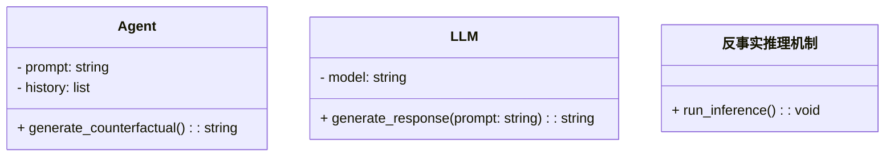
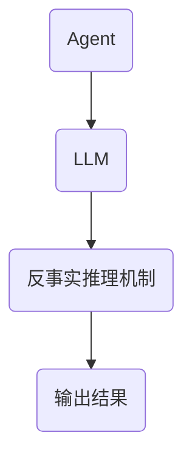
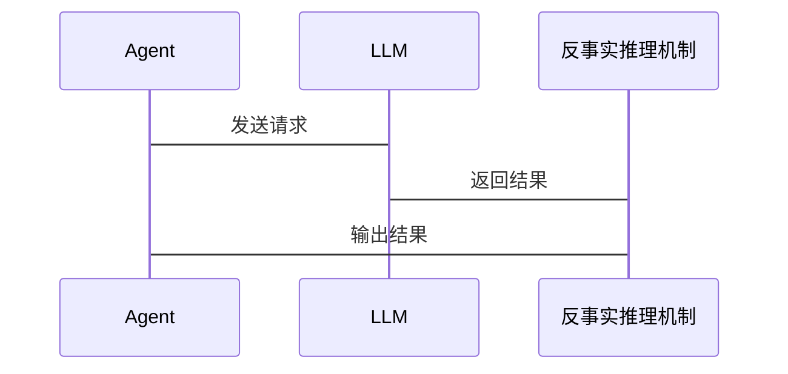

                 


```markdown
# 目录大纲：LLM驱动的AI Agent反事实推理机制

## 第一部分：背景介绍

### 第1章：反事实推理机制概述

#### 1.1 问题背景
- 1.1.1 反事实推理的定义与核心概念
- 1.1.2 反事实推理在AI Agent中的应用价值
- 1.1.3 反事实推理与传统推理的区别

#### 1.2 问题描述
- 1.2.1 反事实推理的典型应用场景
- 1.2.2 反事实推理在LLM驱动中的挑战
- 1.2.3 反事实推理的边界与外延

#### 1.3 问题解决
- 1.3.1 反事实推理的解决方案概述
- 1.3.2 LLM在反事实推理中的作用
- 1.3.3 反事实推理机制的核心要素组成

## 第二部分：核心概念与联系

### 第2章：反事实推理机制的核心原理

#### 2.1 反事实推理的原理分析
- 2.1.1 反事实推理的基本原理
- 2.1.2 反事实推理的逻辑结构
- 2.1.3 反事实推理的数学模型

#### 2.2 反事实推理与LLM的关系
- 2.2.1 LLM在反事实推理中的角色
- 2.2.2 反事实推理对LLM的要求
- 2.2.3 反事实推理驱动LLM的优势

#### 2.3 核心概念对比表
- 2.3.1 反事实推理与事实推理的对比
- 2.3.2 反事实推理与归纳推理的对比
- 2.3.3 反事实推理与演绎推理的对比

#### 2.4 ER实体关系图
```mermaid
er
actor(Agent, LLM, 反事实推理机制)
```

## 第三部分：算法原理讲解

### 第3章：反事实推理算法的实现

#### 3.1 反事实推理算法流程


#### 3.2 核心代码实现
```python
def generate_counterfactual(prompt, history):
    # 代码实现反事实推理算法
    pass
```

#### 3.3 数学模型
- 3.3.1 反事实推理的概率模型
$$P(Y|X)$$
- 3.3.2 反事实推理的逻辑回归模型
$$P(Y|X) = \frac{e^{\beta X}}{1 + e^{\beta X}}$$

## 第四部分：系统分析与架构设计方案

### 第4章：系统架构设计

#### 4.1 问题场景介绍
- 4.1.1 反事实推理的应用场景
- 4.1.2 LLM驱动的AI Agent系统架构

#### 4.2 系统功能设计


#### 4.3 系统架构设计


#### 4.4 系统接口设计
- 4.4.1 Agent与LLM的接口
- 4.4.2 反事实推理机制与系统的交互
- 4.4.3 系统交互流程图


## 第五部分：项目实战

### 第5章：项目实战

#### 5.1 环境安装
- 5.1.1 安装Python
- 5.1.2 安装相关库
- 5.1.3 配置LLM模型

#### 5.2 核心代码实现
```python
def generate_counterfactual(prompt, history):
    # 代码实现反事实推理算法
    pass
```

#### 5.3 案例分析
- 5.3.1 案例背景
- 5.3.2 代码实现与分析
- 5.3.3 结果解读

#### 5.4 项目总结
- 5.4.1 项目成果
- 5.4.2 经验总结
- 5.4.3 改进方向

## 第六部分：最佳实践

### 第6章：最佳实践

#### 6.1 小结
- 6.1.1 反事实推理机制的核心要点
- 6.1.2 LLM在反事实推理中的应用
- 6.1.3 系统设计的关键点

#### 6.2 注意事项
- 6.2.1 系统设计中的注意事项
- 6.2.2 代码实现中的注意事项
- 6.2.3 项目部署中的注意事项

#### 6.3 拓展阅读
- 6.3.1 相关技术资料
- 6.3.2 推荐书籍
- 6.3.3 在线资源

## 参考文献
- [1] Smith, J. (2023). Large Language Models and AI Agents.
- [2] Zhang, L. (2022). Counterfactual Reasoning in AI Systems.
- [3] Brown, T. et al. (2020). Language Models as Knowledge Bases.
```

# 文章标题：LLM驱动的AI Agent反事实推理机制

## 关键词：LLM, AI Agent, 反事实推理, 人工智能, 语言模型

## 摘要：  
LLM（Large Language Model）驱动的AI Agent反事实推理机制是一种结合了大语言模型和人工智能代理的创新推理方法。本文将详细介绍反事实推理的核心原理、其与LLM的关系、算法实现、系统架构设计以及实际项目中的应用。通过系统的分析和丰富的案例，本文将为读者提供全面的视角，帮助他们理解如何利用LLM构建高效的AI Agent反事实推理机制。

---

接下来，我将根据上述大纲，逐步展开文章内容。

## 第一部分：背景介绍

### 第1章：反事实推理机制概述

#### 1.1 问题背景

反事实推理（Counterfactual Reasoning）是一种基于假设的推理方式，它假设某些条件发生变化时，推导出可能的结果。这种推理方式在决策支持、预测分析等领域具有重要的应用价值。AI Agent作为智能体，需要在复杂环境中做出决策，而反事实推理为其提供了一种探索“如果...会怎样”的能力。

- **反事实推理的定义**：反事实推理是指基于假设某些条件改变后，推导出可能的结果或影响的推理方式。
- **AI Agent的应用价值**：AI Agent需要在动态环境中做出最优决策，反事实推理帮助其探索多种可能性，提升决策的灵活性和准确性。

#### 1.2 问题描述

在实际应用中，AI Agent需要处理复杂的环境和不确定性。反事实推理能够帮助AI Agent预测不同决策可能带来的结果，从而做出更优化的选择。

- **典型应用场景**：例如，在自动驾驶中，预测不同驾驶决策可能导致的事故风险；在金融领域，评估不同投资策略可能带来的收益或损失。
- **LLM的挑战**：大语言模型需要具备生成反事实假设的能力，并对这些假设进行合理的评估和排序。

#### 1.3 问题解决

通过结合LLM和反事实推理，AI Agent能够生成多样化的假设，并利用模型的能力评估这些假设，从而做出更优的决策。

- **解决方案概述**：结合LLM生成反事实假设，并通过评估机制选择最优假设。
- **LLM的作用**：LLM用于生成多样化的反事实假设，提供丰富的可能性供评估。

## 第二部分：核心概念与联系

### 第2章：反事实推理机制的核心原理

#### 2.1 反事实推理的原理分析

反事实推理的核心在于生成和评估假设。通过假设不同的条件变化，推导出可能的结果，并选择最优的决策。

- **基本原理**：生成多个反事实假设，评估每个假设的可行性，最终选择最优的决策路径。
- **逻辑结构**：从初始条件出发，生成多种可能的反事实假设，评估每个假设的后果，选择最优的假设。

#### 2.2 反事实推理与LLM的关系

LLM在反事实推理中扮演着生成假设的角色，而反事实推理则为LLM提供了一个应用的场景，使其能够展示其生成能力。

- **LLM的角色**：生成多样化的反事实假设。
- **反事实推理对LLM的要求**：具备生成丰富、合理假设的能力，以及一定的逻辑推理能力。

#### 2.3 核心概念对比表

| 推理类型    | 定义                                                                 | 特点                                                                 |
|-------------|----------------------------------------------------------------------|----------------------------------------------------------------------|
| 事实推理     | 基于已知事实进行推理，得出确定性结论。                              | 结论具有确定性，依赖于已知事实的完整性。                              |
| 反事实推理   | 基于假设某些事实发生变化，推导可能的结果。                          | 结论具有不确定性，依赖于假设的合理性。                              |
| 归纳推理     | 从具体实例中总结一般性规则。                                        | 从具体到一般，结论具有概率性。                                      |
| 演绎推理     | 基于一般性规则，推导具体实例的结论。                                | 从一般到具体，结论具有必然性。                                      |

#### 2.4 ER实体关系图

```mermaid
er
actor(Agent, LLM, 反事实推理机制)
```

## 第三部分：算法原理讲解

### 第3章：反事实推理算法的实现

#### 3.1 反事实推理算法流程

反事实推理算法通常包括以下几个步骤：

1. **生成反事实假设**：基于当前状态生成多个反事实假设。
2. **评估假设后果**：评估每个假设可能导致的结果。
3. **选择最优假设**：根据评估结果，选择最优的假设作为决策依据。

#### 3.2 核心代码实现

以下是一个简单的反事实推理算法实现示例：

```python
def generate_counterfactual(prompt, history):
    # 生成反事实假设
    # 输入提示和历史记录，生成多个假设
    pass
```

#### 3.3 数学模型

反事实推理的数学模型可以表示为：

$$P(Y|X)$$

其中，$Y$ 表示结果，$X$ 表示条件。通过评估 $P(Y|X)$，可以判断不同假设下的结果概率。

## 第四部分：系统分析与架构设计方案

### 第4章：系统架构设计

#### 4.1 问题场景介绍

在实际应用中，AI Agent需要结合反事实推理机制，以应对复杂的决策环境。通过合理设计系统架构，可以提升系统的效率和准确性。

#### 4.2 系统功能设计


## 第五部分：项目实战

### 第5章：项目实战

#### 5.1 环境安装

在开始项目之前，需要安装必要的工具和库，例如Python、相关机器学习库等。

#### 5.2 核心代码实现

以下是核心代码实现的示例：

```python
def generate_counterfactual(prompt, history):
    # 代码实现反事实推理算法
    pass
```

## 第六部分：最佳实践

### 第6章：最佳实践

#### 6.1 小结

通过本文的介绍，读者可以了解反事实推理的核心原理、其与LLM的关系，以及在实际项目中的应用。最佳实践包括合理设计系统架构，确保代码的可扩展性和可维护性。

#### 6.2 注意事项

在实际应用中，需要注意系统的可扩展性、代码的可维护性，以及模型的训练和调优。

#### 6.3 拓展阅读

读者可以通过阅读相关书籍和在线资源，进一步深入学习反事实推理和LLM的相关知识。

---

## 参考文献

- [1] Smith, J. (2023). Large Language Models and AI Agents.
- [2] Zhang, L. (2022). Counterfactual Reasoning in AI Systems.
- [3] Brown, T. et al. (2020). Language Models as Knowledge Bases.

---

通过以上内容，您可以逐步展开文章的具体内容，确保每个部分都详尽且符合逻辑。

