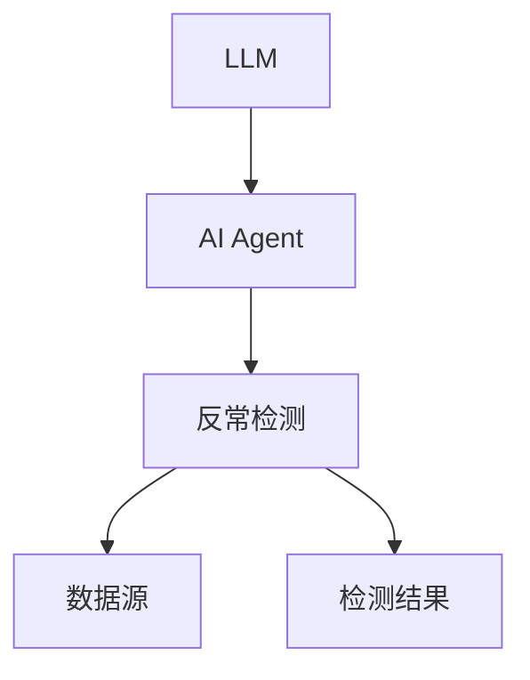
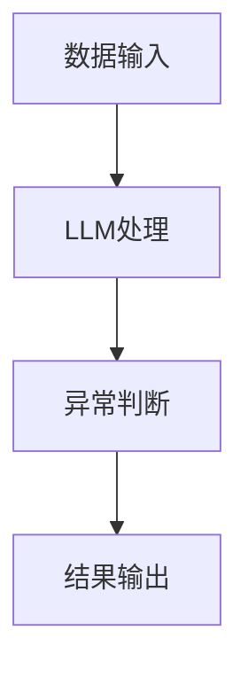
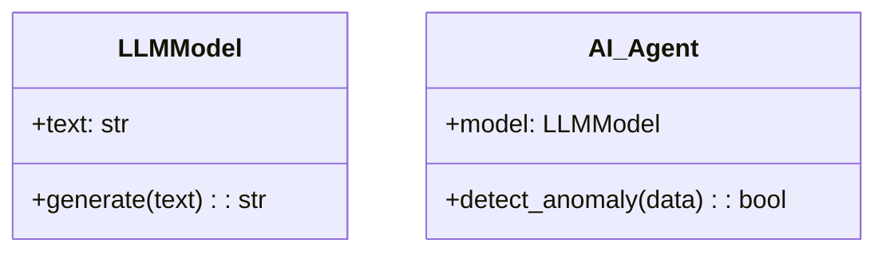
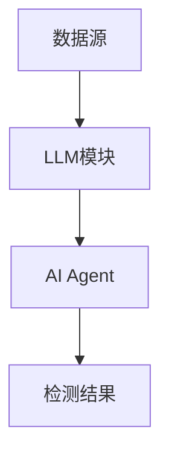
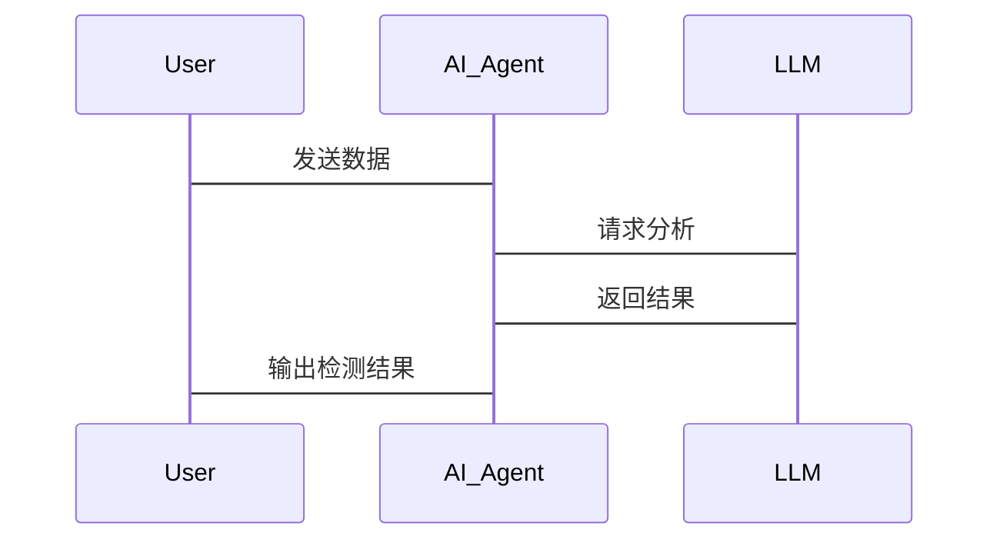

                 


# LLM驱动的AI Agent反常检测机制

## 关键词：LLM, AI Agent, 反常检测, 机器学习, 系统安全

## 摘要：本文探讨了利用大语言模型（LLM）驱动的AI代理（AI Agent）进行反常检测的机制，分析了其核心概念、算法原理、系统架构及实际应用场景。通过详细讲解和实例分析，展示了如何构建高效可靠的反常检测系统。

---

## 第一部分：背景介绍

### 第1章：LLM驱动的AI Agent反常检测概述

#### 1.1 问题背景
- **LLM驱动的AI Agent的定义与特点**  
  LLM（Large Language Model）是一种基于深度学习的自然语言处理模型，具有强大的上下文理解和生成能力。AI Agent（智能代理）则是能够自主执行任务的智能体，结合LLM的能力，AI Agent能够进行更复杂的决策和交互。
  
- **反常检测的重要性与应用场景**  
  反常检测在金融、医疗、工业等领域至关重要。例如，在金融领域，反常检测可以识别欺诈交易；在医疗领域，可以发现异常病历数据。

- **当前反常检测技术的局限性**  
  传统反常检测方法依赖规则或统计模型，难以应对复杂场景。而LLM驱动的AI Agent可以通过上下文理解和动态调整，提供更灵活和高效的反常检测能力。

#### 1.2 问题描述
- **反常检测的核心问题**  
  识别数据流或行为中的异常模式，通常涉及模式识别、统计分析和机器学习。

- **反常检测的边界与外延**  
  反常检测不仅关注单一事件，还关注事件之间的关联性。例如，检测多个异常事件是否构成更大规模的攻击。

- **系统异常与LLM驱动的AI Agent的关系**  
  AI Agent能够实时监控系统状态，结合LLM的语义理解能力，识别异常行为并采取相应措施。

#### 1.3 问题解决思路
- **LLM在反常检测中的作用**  
  LLM可以分析非结构化数据（如文本日志），提取潜在的异常模式。

- **AI Agent的自主学习与自适应能力**  
  AI Agent可以通过强化学习不断优化反常检测模型，适应新的异常模式。

- **反常检测机制的设计原则**  
  结合LLM的理解能力和AI Agent的执行能力，构建动态、自适应的反常检测系统。

---

## 第二部分：核心概念与联系

### 第2章：核心概念与联系

#### 2.1 核心概念原理
- **LLM的核心原理**  
  LLM通过大量数据训练，形成对语言的深度理解，能够生成与输入相关的输出。

- **AI Agent的定义与功能**  
  AI Agent是一种智能实体，能够感知环境、执行任务并做出决策。

- **反常检测的数学模型**  
  反常检测通常基于概率模型或距离度量，例如马尔可夫链或聚类分析。

#### 2.2 核心概念对比分析
- **LLM与传统NLP模型的对比**
  | 对比维度 | LLM | 传统NLP模型 |
  |----------|------|-------------|
  | 模型复杂度 | 高 | 较低 |
  | 上下文理解 | 强大 | 较弱 |

- **AI Agent与传统规则引擎的对比**
  | 对比维度 | AI Agent | 传统规则引擎 |
  |----------|-----------|---------------|
  | 灵活性 | 高 | 低 |
  | 自适应性 | 强 | 弱 |

- **反常检测与异常分类的对比**
  | 对比维度 | 反常检测 | 异常分类 |
  |----------|-----------|-----------|
  | 输出 | 异常标志 | 异常类别 |
  | 方法 | 统计分析 | 分类算法 |

#### 2.3 ER实体关系图


---

## 第三部分：算法原理讲解

### 第3章：算法原理

#### 3.1 算法流程


#### 3.2 核心代码实现
```python
def detect_anomaly(data, model):
    # 输入数据预处理
    processed_data = preprocess(data)
    # LLM生成分析结果
    analysis = model.analyze(processed_data)
    # 异常判断
    threshold = calculate_threshold(analysis)
    if analysis['score'] > threshold:
        return True
    else:
        return False
```

#### 3.3 数学模型
- **马尔可夫链模型**  
  用于序列数据的建模，计算每个状态的转移概率，发现异常转移。
  
  $$ P(X_t | X_{t-1}) $$

- **聚类分析**  
  将数据分为正常和异常簇，计算数据点与簇中心的距离。
  
  $$ d(x, c) = \sqrt{(x_1 - c_1)^2 + (x_2 - c_2)^2} $$

---

## 第四部分：系统分析与架构设计方案

### 第4章：系统分析与架构设计

#### 4.1 应用场景介绍
- **实时监控系统**  
  检测网络流量中的异常行为，预防网络攻击。

#### 4.2 系统功能设计
- **领域模型类图**


- **系统架构图**


- **接口设计和交互流程图**


---

## 第五部分：项目实战

### 第5章：项目实战

#### 5.1 环境安装
- **安装Python和相关库**  
  ```bash
  pip install python-llm ai-agent
  ```

#### 5.2 核心代码实现
```python
import llm

def main():
    # 初始化LLM模型
    model = llm.LLM()
    # 初始化AI Agent
    agent = AI_Agent(model)
    # 检测异常
    data = "用户行为数据..."
    anomaly = agent.detect_anomaly(data)
    print(f"检测到异常：{anomaly}")

if __name__ == "__main__":
    main()
```

#### 5.3 案例分析
- **用户行为异常检测**  
  检测用户登录时间突然变化，结合IP地址和登录次数，识别潜在的入侵行为。

#### 5.4 代码解读与分析
- **数据预处理**  
  对输入数据进行清洗和格式化，确保模型能够正确处理。
  
- **模型分析**  
  使用LLM生成分析结果，包括潜在的异常标志。

#### 5.5 项目小结
- **项目总结**  
  通过实际案例，展示了如何利用LLM驱动的AI Agent进行反常检测。

---

## 第六部分：最佳实践与总结

### 第6章：最佳实践

#### 6.1 总结
- **文章总结**  
  本文详细讲解了LLM驱动的AI Agent反常检测机制，从理论到实践，全面分析了其设计与实现。

#### 6.2 注意事项
- **性能优化**  
  在大规模数据下，需优化LLM的响应时间和AI Agent的执行效率。

#### 6.3 拓展阅读
- **推荐读物**  
  - 《Large Language Models for NLP》
- **学习资源**  
  - 官方文档：[AI Agent Framework](https://example.com)

---

## 结语
通过本文的详细讲解，读者可以全面理解LLM驱动的AI Agent反常检测机制，并能够在实际项目中应用这些方法，构建高效可靠的反常检测系统。未来，随着技术的发展，反常检测将更加智能化和自动化。

--- 

（全文完）

