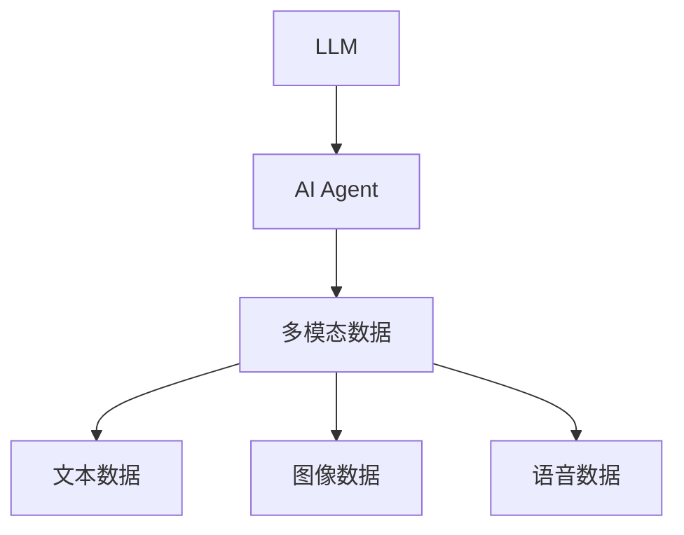
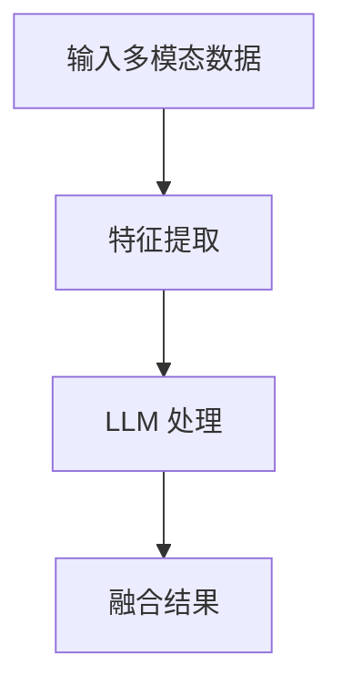
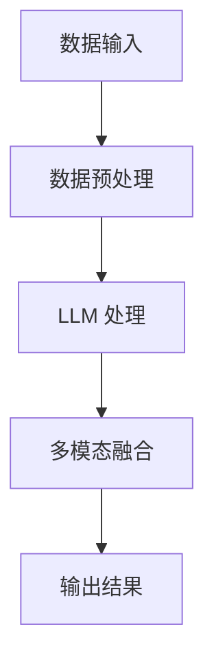
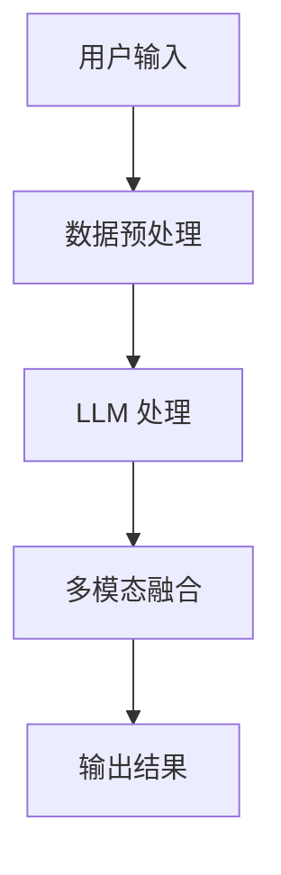
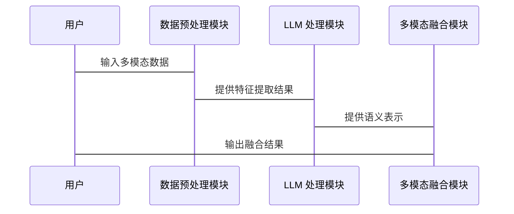

                 


# LLM驱动的AI Agent多模态融合处理

## 关键词
- 大语言模型（LLM）
- AI Agent
- 多模态数据融合
- 系统架构设计
- 项目实战

## 摘要
随着大语言模型（LLM）的快速发展，AI Agent 的功能和应用场景也在不断扩展。为了进一步提升 AI Agent 的智能性和实用性，多模态数据融合技术变得尤为重要。本文将详细探讨如何利用 LLM 驱动 AI Agent，实现多模态数据的高效融合，并通过具体案例分析，展示其实际应用和系统设计。文章内容涵盖从理论到实践的各个方面，帮助读者全面理解 LLM 驱动的多模态 AI Agent 的实现与应用。

---

# 第一部分: LLM驱动的AI Agent多模态融合处理概述

## 第1章: 引言

### 1.1 问题背景

#### 1.1.1 大语言模型（LLM）的发展与应用
大语言模型（LLM）如 GPT-3、GPT-4 和 ChatGPT 等，凭借其强大的自然语言处理能力，正在广泛应用于对话生成、文本摘要、机器翻译等领域。这些模型通过海量数据的训练，能够理解和生成人类语言，具备高度的语义理解和生成能力。

#### 1.1.2 AI Agent 的基本概念与功能
AI Agent 是一种智能体，能够通过感知环境、执行任务和与用户交互来完成特定目标。AI Agent 的功能包括信息获取、决策制定、任务执行和结果反馈等。传统的 AI Agent 通常基于规则或单一模态数据（如文本）进行处理，而随着多模态数据的引入，AI Agent 的能力得到了显著提升。

#### 1.1.3 多模态数据融合的重要性
多模态数据融合是指将多种数据类型（如文本、图像、语音、视频等）的信息进行整合，以提高系统的感知能力和决策能力。通过多模态数据融合，AI Agent 能够更好地理解复杂的环境信息，从而提供更智能、更精准的服务。

### 1.2 问题描述

#### 1.2.1 LLM 驱动 AI Agent 的核心问题
当前，AI Agent 的能力主要依赖于单一模态的数据处理，这限制了其在复杂场景中的应用。例如，在客服系统中，仅依赖文本信息难以准确理解用户的需求和情感状态。通过引入多模态数据融合，AI Agent 可以更好地理解用户意图，提供更个性化的服务。

#### 1.2.2 多模态数据融合的挑战
多模态数据融合面临数据异构性、信息冗余和计算复杂性等挑战。不同数据类型具有不同的特征和表达方式，如何有效整合这些数据是技术难点。此外，多模态数据的处理需要强大的计算能力和算法支持。

#### 1.2.3 当前技术的局限性与改进方向
当前的 LLM 主要专注于文本处理，缺乏对其他数据类型的直接支持。AI Agent 的功能受限于单一模态数据的处理能力。未来的发展方向包括优化多模态数据融合算法、提升 LLM 的跨模态处理能力，以及探索更高效的系统架构设计。

### 1.3 问题解决

#### 1.3.1 LLM 在多模态融合中的作用
LLM 具备强大的语言理解和生成能力，可以作为多模态数据融合的核心模块，负责处理和整合多种数据类型的信息。

#### 1.3.2 多模态数据融合的技术路径
通过将多模态数据进行特征提取、对齐和融合，利用 LLM 对融合后的信息进行语义理解和生成，从而实现多模态数据的高效利用。

#### 1.3.3 LLM 驱动 AI Agent 的实现方案
通过设计一个多模态数据融合模块，将文本、图像、语音等多种数据进行整合，利用 LLM 进行语义理解和生成，从而提升 AI Agent 的智能性和响应能力。

### 1.4 边界与外延

#### 1.4.1 LLM 驱动 AI Agent 的适用场景
LLM 驱动的 AI Agent 适用于需要多模态数据处理的场景，如智能客服、智能助手、自动驾驶等领域。

#### 1.4.2 多模态数据融合的边界条件
多模态数据融合需要考虑数据的实时性、准确性、完整性和安全性。同时，系统的计算能力和存储容量也会影响数据融合的范围和深度。

#### 1.4.3 相关技术的对比与区别
与传统的单一模态处理相比，多模态数据融合能够提供更全面的信息，但其复杂性和计算成本也更高。LLM 的引入提升了多模态数据处理的效率和准确性，但需要考虑模型的训练成本和计算资源。

### 1.5 概念结构与核心要素

#### 1.5.1 LLM 驱动 AI Agent 的系统架构
系统架构包括数据输入模块、数据处理模块、LLM 处理模块、多模态融合模块和输出模块。各模块协同工作，实现多模态数据的高效处理和融合。

#### 1.5.2 多模态数据融合的核心要素
核心要素包括数据采集、特征提取、数据对齐、融合算法和语义理解。这些要素共同作用，实现多模态数据的有效整合和利用。

#### 1.5.3 系统的核心功能模块
核心功能模块包括数据输入模块、数据预处理模块、LLM 处理模块、多模态融合模块和输出模块。每个模块负责特定的功能，确保系统的高效运行。

---

## 第2章: 核心概念与联系

### 2.1 核心概念原理

#### 2.1.1 LLM 的基本原理
LLM 是基于深度学习的自然语言处理模型，通过多层神经网络对文本数据进行编码和解码，实现语言理解和生成。

#### 2.1.2 AI Agent 的工作原理
AI Agent 通过感知环境、获取任务目标、执行任务和反馈结果，实现与用户的交互和任务完成。

#### 2.1.3 多模态数据融合的原理
多模态数据融合通过对不同数据类型的信息进行特征提取、对齐和融合，生成更全面的语义表示，提升系统的智能性和准确性。

### 2.2 概念属性特征对比

| 概念       | 特性                       |
|------------|---------------------------|
| LLM        | 处理文本数据，具备强大的语言理解和生成能力 |
| AI Agent    | 多模态数据处理，具备自主决策和执行能力     |
| 多模态数据融合 | 整合多种数据类型，提升系统的感知能力       |

### 2.3 ER实体关系图


---

## 第3章: 多模态数据融合的算法原理

### 3.1 多模态数据融合算法

#### 3.1.1 多模态数据融合的分类
多模态数据融合可以分为基于特征的融合、基于决策的融合和基于模型的融合。基于特征的融合直接对原始数据进行处理，基于决策的融合在高层进行信息整合，基于模型的融合则通过深度学习模型实现。

#### 3.1.2 基于 LLM 的多模态融合算法
基于 LLM 的多模态融合算法将多模态数据进行特征提取和对齐，利用 LLM 进行语义理解和生成，实现多模态数据的高效融合。

#### 3.1.3 基于 Transformer 的多模态融合算法
基于 Transformer 的多模态融合算法通过自注意力机制对多模态数据进行特征提取和融合，生成更全面的语义表示。

### 3.2 算法流程图


### 3.3 算法实现代码

```python
def multimodal_fusion(text, image):
    # 处理文本数据
    text_embedding = process_text(text)
    # 处理图像数据
    image_embedding = process_image(image)
    # 融合特征
    fused_embedding = fuse_features(text_embedding, image_embedding)
    return fused_embedding
```

---

## 第4章: 系统架构设计

### 4.1 问题场景介绍

#### 4.1.1 系统目标
系统旨在通过多模态数据融合提升 AI Agent 的智能性和响应能力，实现更精准的任务处理和用户交互。

#### 4.1.2 系统特点
系统具备多模态数据处理能力、高效的融合算法和强大的 LLM 支持，能够适应多种应用场景。

### 4.2 系统功能设计

#### 4.2.1 功能模块划分
系统功能模块包括数据输入模块、数据预处理模块、LLM 处理模块、多模态融合模块和输出模块。

#### 4.2.2 功能流程
数据输入模块接收多模态数据，预处理模块进行数据清洗和特征提取，LLM 处理模块进行语义理解和生成，融合模块整合多种数据类型的信息，输出模块生成最终的响应。

### 4.3 系统架构设计

#### 4.3.1 系统架构图


#### 4.3.2 模块交互图


### 4.4 系统接口设计

#### 4.4.1 输入接口
系统提供多种输入接口，包括文本输入、图像输入和语音输入，支持多种数据格式。

#### 4.4.2 输出接口
系统输出包括文本响应、图像生成和语音反馈，满足不同场景的需求。

### 4.5 系统交互设计

#### 4.5.1 交互流程
用户输入多模态数据，系统进行预处理和融合，生成响应结果并返回给用户。

#### 4.5.2 交互序列图


---

## 第5章: 项目实战

### 5.1 环境安装

#### 5.1.1 安装 Python
安装 Python 3.8 或更高版本。

#### 5.1.2 安装依赖库
安装所需的依赖库，如 transformers、numpy、pandas 等。

#### 5.1.3 安装 LLM 模型
选择合适的 LLM 模型并进行安装，如 Hugging Face 的 GPT-2 或 GPT-3。

### 5.2 系统核心实现

#### 5.2.1 数据预处理代码
```python
import numpy as np
import pandas as pd

def preprocess_data(data):
    # 数据清洗
    cleaned_data = data.dropna()
    # 特征提取
    features = cleaned_data[['text', 'image']]
    return features
```

#### 5.2.2 LLM 处理代码
```python
from transformers import GPT2Tokenizer, GPT2Model

def process_with_LLM(features):
    tokenizer = GPT2Tokenizer.from_pretrained('gpt2')
    model = GPT2Model.from_pretrained('gpt2')
    inputs = tokenizer(features['text'], return_tensors='np')
    outputs = model(**inputs)
    return outputs.last_hidden_state
```

#### 5.2.3 多模态融合代码
```python
def fuse_modalities(text_embeddings, image_embeddings):
    # 对齐特征
    aligned_embeddings = align_embeddings(text_embeddings, image_embeddings)
    # 融合特征
    fused_embeddings = aligned_embeddings.mean(axis=1)
    return fused_embeddings
```

### 5.3 代码应用解读与分析

#### 5.3.1 代码功能分析
代码实现数据预处理、LLM 处理和多模态融合功能，分别对文本和图像数据进行处理，最终生成融合的语义表示。

#### 5.3.2 代码实现细节
通过预处理模块对数据进行清洗和特征提取，利用 LLM 模型生成语义表示，最后对齐和融合多模态特征，生成最终的融合结果。

### 5.4 案例分析

#### 5.4.1 案例场景
以智能客服系统为例，用户输入文本和图像信息，系统通过多模态融合生成更准确的响应。

#### 5.4.2 案例实现
实现一个多模态智能客服系统，能够处理用户的文本和图像查询，提供更智能的服务。

### 5.5 项目小结

#### 5.5.1 项目总结
通过项目实战，验证了 LLM 驱动的多模态融合技术在实际应用中的可行性和有效性。

#### 5.5.2 经验与教训
在项目实施过程中，需要注意数据的多样性和模型的训练效率，同时要确保系统的可扩展性和可维护性。

---

## 第6章: 最佳实践与小结

### 6.1 最佳实践 tips

#### 6.1.1 性能优化建议
通过数据增强、模型压缩和分布式训练等技术，提升系统的性能和计算效率。

#### 6.1.2 安全性考虑
确保数据的安全性和模型的鲁棒性，防止数据泄露和攻击。

#### 6.1.3 可扩展性设计
设计灵活的系统架构，支持多种数据类型和应用场景的扩展。

### 6.2 小结

#### 6.2.1 全文回顾
本文详细探讨了 LLM 驱动的 AI Agent 多模态融合处理的技术原理、系统设计和实际应用。

#### 6.2.2 展望未来
未来，随着技术的不断发展，LLM 驱动的多模态 AI Agent 将在更多领域得到应用，推动人工智能技术的进一步发展。

---

# 结语

通过本文的详细阐述，读者可以全面了解 LLM 驱动的 AI Agent 多模态融合处理的核心技术、系统设计和实际应用。希望本文能够为相关领域的研究和实践提供有价值的参考和指导。

--- 

**（全文完）**

