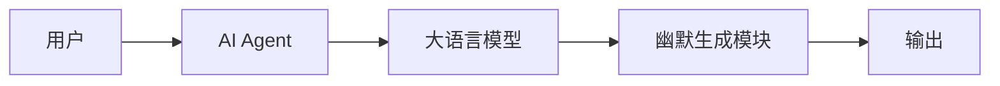
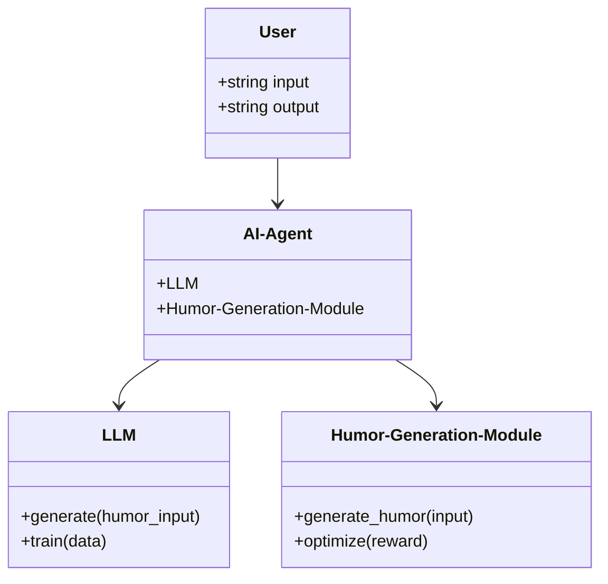

                 


# LLM驱动的AI Agent幽默感生成

> 关键词：LLM、AI Agent、幽默感生成、自然语言处理、大语言模型

> 摘要：本文探讨了如何利用大语言模型（LLM）驱动的AI Agent生成幽默感。通过分析幽默生成的机制、算法原理、系统架构设计以及实际案例，详细阐述了如何结合LLM和AI Agent实现幽默感生成的技术细节和实现方案。

---

## 第一部分: 背景与核心概念

### 第1章: 背景与问题定义

#### 1.1 幽默感的基本概念
幽默是人类语言交流中的一种高级情感表达方式，它通过语言的巧妙运用、情境的反差或出人意料的转折引发人们的笑声和愉悦感。幽默感的生成涉及对语言、语境、情感的理解和创造性思维。

- 幽默的类型包括双关语、夸张、讽刺、笑话等。
- 幽默的生成机制依赖于对语言规则的掌握、对语境的理解以及对情感的感知。
- 在人机交互中，幽默感的生成能够增强用户体验，使AI系统更具人性化和亲和力。

#### 1.2 LLM与AI Agent的背景
- **大语言模型（LLM）**：基于Transformer架构的大型神经网络模型，能够理解和生成自然语言文本，代表包括GPT-3、GPT-4等。
- **AI Agent**：智能体，能够在特定环境中感知、决策、执行任务的实体。AI Agent能够通过与用户的交互理解需求并提供相应的服务。
- **LLM驱动的AI Agent**：通过将LLM作为核心组件集成到AI Agent中，使其具备强大的语言理解和生成能力。

#### 1.3 幽默生成与LLM的结合
- **自动化幽默生成需求**：随着AI技术的发展，人们希望AI系统能够自动生成幽默内容，如笑话、幽默对话等。
- **LLM在幽默生成中的潜力**：LLM具备强大的语言生成能力，能够通过微调和特定的生成策略生成幽默文本。
- **AI Agent在幽默生成中的角色**：AI Agent通过理解用户需求、情境和情感，调用LLM生成合适的幽默内容。

---

### 第2章: 幽默生成的核心概念与联系

#### 2.1 幽默生成的机制分析
- **幽默的三要素模型**：由“预期违背”、“情感共鸣”和“认知反转”三个要素构成。
  - 预期违背：打破常规的逻辑或语义预期。
  - 情感共鸣：幽默内容需要引发用户的共鸣。
  - 认知反转：通过出人意料的方式改变用户的认知。

- **幽默的生成过程**：
  1. **输入理解**：理解用户的输入内容和需求。
  2. **情境分析**：分析当前对话的情境和语境。
  3. **幽默生成**：基于分析生成幽默内容。
  4. **反馈优化**：根据用户反馈不断优化生成策略。

- **幽默与上下文的关系**：幽默生成依赖于对话历史和当前语境，需要根据具体情境进行调整。

#### 2.2 LLM驱动的幽默生成模型
- **基于LLM的生成式幽默模型**：通过LLM生成符合幽默规则的文本。
- **基于AI Agent的幽默生成架构**：AI Agent作为整体框架，整合LLM和其他模块（如情感分析、意图识别）来生成幽默内容。
- **模型的核心要素**：
  - 输入模块：接收用户输入或对话历史。
  - LLM模块：生成幽默文本。
  - 调整模块：根据反馈优化生成结果。

#### 2.3 实体关系图


---

## 第三部分: 算法原理与数学模型

### 第3章: 幽默生成的算法原理

#### 3.1 基于LLM的幽默生成算法
- **基于概率的幽默生成模型**：通过概率分布生成符合幽默规则的文本。
  ```python
  import torch
  import torch.nn as nn
  import torch.optim as optim

  # 示例：简单的幽默生成模型
  class HumorGenerator(nn.Module):
      def __init__(self, vocab_size):
          super(HumorGenerator, self).__init__()
          self.embedding = nn.Embedding(vocab_size, 512)
          self.lstm = nn.LSTM(512, 256, 1)
          self.fc = nn.Linear(256, vocab_size)
      
      def forward(self, input, hidden):
          embedded = self.embedding(input)
          output, hidden = self.lstm(embedded, hidden)
          output = self.fc(output)
          return output, hidden
  ```

- **基于强化学习的幽默优化**：通过强化学习优化生成的幽默内容。
  ```python
  # 示例：强化学习优化
  def compute_reward(humor_output, reference):
      # 计算生成内容与参考内容的相似度
      reward = cosine_similarity(humor_output, reference)
      return reward

  optimizer.zero_grad()
  output, _ = model(input, None)
  reward = compute_reward(output, target)
  loss = -torch.mean(torch.log(reward))
  loss.backward()
  optimizer.step()
  ```

- **基于多模态的幽默增强**：结合视觉、音频等多模态信息增强幽默生成效果。
  ```python
  # 示例：多模态幽默生成
  import torchvision

  def generate_humor_with_image(input_text, image_embedding):
      combined_input = torch.cat((input_text, image_embedding), dim=1)
      output = model(combined_input)
      return output
  ```

#### 3.2 幽默生成的数学模型
- **概率分布模型**：
  $$ P(humor | input) = \prod_{i=1}^{n} P(word_i | history, humor) $$
  
- **基于损失函数的优化**：
  $$ L = -\sum_{i=1}^{n} \log P(y_i | x_i) $$

---

## 第四部分: 系统架构设计与实现

### 第4章: 系统架构设计

#### 4.1 问题场景介绍
幽默生成系统需要在实际应用中满足用户对幽默内容的需求，如智能助手、聊天机器人等场景。

#### 4.2 系统功能设计
- **领域模型**：通过领域模型明确系统功能模块。


#### 4.3 系统架构设计
- **系统架构图**：


#### 4.4 接口设计与交互流程
- **接口设计**：
  - 输入接口：接收用户的输入文本或对话历史。
  - 输出接口：返回生成的幽默内容。
- **交互流程**：
  1. 用户输入需求。
  2. AI Agent分析需求。
  3. LLM生成幽默内容。
  4. 输出结果并反馈优化。

---

## 第五部分: 项目实战

### 第5章: 项目实现

#### 5.1 环境安装
```bash
pip install torch transformers mermaid
```

#### 5.2 核心实现代码
```python
import torch
from transformers import GPT2LMHeadModel, GPT2Tokenizer

# 初始化模型和分词器
model_name = "gpt2"
tokenizer = GPT2Tokenizer.from_pretrained(model_name)
model = GPT2LMHeadModel.from_pretrained(model_name)

def generate_humor(input_text, max_length=100):
    inputs = tokenizer.encode(input_text, return_tensors="pt")
    outputs = model.generate(inputs, max_length=max_length, temperature=1.2, top_p=0.7)
    return tokenizer.decode(outputs[0], skip_special_tokens=True)
```

#### 5.3 案例分析与优化
- **案例分析**：
  - 输入：用户希望生成一个与“猫”的相关的笑话。
  - 输出：模型生成“为什么猫总是赢不了官司？因为它没有‘狗’前爪。”
  - 优化：根据用户反馈调整生成策略，增加双关语的使用。

#### 5.4 总结与优化建议
- **总结**：通过实验可以发现，调整温度和top_p参数能够有效提升幽默生成的效果。
- **优化建议**：
  - 数据选择：使用更多样化的幽默数据进行微调。
  - 模型优化：引入强化学习策略进一步优化生成效果。
  - 伦理问题：注意避免生成冒犯性或不适当的幽默内容。

---

## 第六部分: 总结与展望

### 6.1 总结
本文详细探讨了如何利用LLM驱动的AI Agent生成幽默感，从背景概念、算法原理到系统架构设计和项目实战，全面解析了幽默生成的技术实现。

### 6.2 未来展望
- **技术改进**：进一步优化模型生成效果，引入多模态信息增强幽默生成。
- **应用扩展**：将幽默生成技术应用于更多场景，如教育、医疗、娱乐等领域。
- **伦理问题**：加强伦理审查，确保生成的幽默内容符合社会规范和用户需求。

---

## 总结
通过本文的分析，我们能够清晰地看到，LLM驱动的AI Agent在幽默生成方面具备巨大的潜力。未来，随着技术的不断进步，幽默生成将更加智能化、个性化和多样化。

