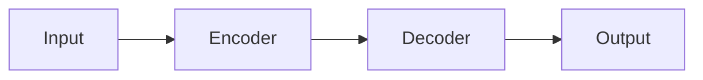
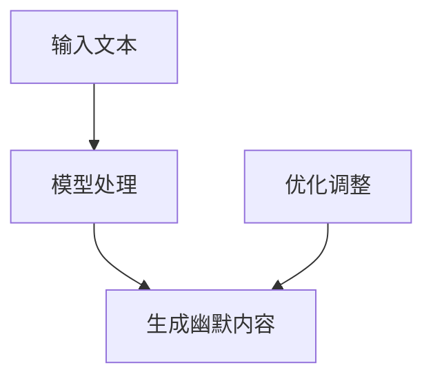
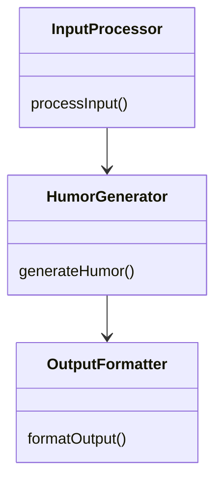

                 


# LLM驱动的AI Agent幽默感生成器

> 关键词：LLM, AI Agent, 幽默感生成, 自然语言处理, 大语言模型

> 摘要：本文探讨了利用大语言模型（LLM）驱动的AI代理生成幽默感的技术与方法。通过分析幽默感生成的背景、算法原理和系统架构，结合实际项目案例，详细讲解了如何实现一个高效的幽默感生成器。

---

## 第1章：背景介绍

### 1.1 问题背景

随着AI技术的快速发展，AI Agent（智能代理）在各个领域的应用日益广泛。幽默感作为人类交流中的一种高级情感表达，其生成需要结合语境理解、情感分析和创意生成等复杂能力。传统的幽默生成方法依赖于规则和模板，存在生成内容单一、缺乏灵活性的问题。而大语言模型的出现，为幽默感生成提供了新的可能性。

#### 1.1.1 AI Agent的基本概念
AI Agent是一种能够感知环境并采取行动以实现目标的智能实体。它可以是软件程序，也可以是物理设备，通过与用户的交互完成特定任务。

#### 1.1.2 大语言模型的崛起
大语言模型（LLM）如GPT-3、GPT-4等，凭借其强大的文本生成能力，成为幽默感生成的重要工具。这些模型通过深度学习训练，能够理解和生成复杂语言模式。

#### 1.1.3 幽默感生成的挑战与意义
幽默感生成需要考虑语言的双关、讽刺、夸张等多种表现形式，对模型的理解和生成能力提出了更高的要求。成功的幽默生成不仅能提升用户体验，还能增强AI Agent的智能性和互动性。

---

### 1.2 核心概念与联系

#### 1.2.1 AI Agent的定义与属性
AI Agent可以分为简单反射型、基于模型的反应型和目标驱动型。幽默感生成器属于反应型AI Agent，通过分析输入文本生成相应的幽默回应。

| 属性 | 描述 |
|------|------|
| 输入处理 | 分析用户的输入内容，提取关键信息 |
| 情感分析 | 理解用户的情感倾向 |
| 幽默生成 | 基于分析结果生成幽默回应 |

#### 1.2.2 大语言模型的特点与局限性
- **特点**：强大的文本生成能力、多语言支持、可微调适应特定任务。
- **局限性**：生成内容可能缺乏真实性和逻辑性，对特定领域数据的依赖性较高。

#### 1.2.3 幽默感生成的关键要素
- **语境理解**：准确理解对话背景和意图。
- **创意生成**：生成独特的表达方式。
- **情感共鸣**：与用户建立情感联系。

---

## 第2章：幽默感生成的算法原理

### 2.1 大语言模型的内部机制

#### 2.1.1 概率生成模型
大语言模型通过概率分布生成文本，每个词的概率由上下文决定。公式表示为：
$$ P(w_{n}|w_{1},...,w_{n-1}) $$

#### 2.1.2 变压器架构
Transformer模型由编码器和解码器组成，编码器将输入文本转换为向量表示，解码器生成输出序列。模型结构如下图所示：



#### 2.1.3 注意力机制
注意力机制帮助模型关注输入中的重要部分。计算公式为：
$$ \text{Attention}(Q, K, V) = \text{softmax}\left(\frac{QK^T}{\sqrt{d_k}}\right)V $$

### 2.2 幽默生成的数学模型

#### 2.2.1 概率分布模型
幽默生成可以看作是一个条件概率问题：
$$ P(\text{Humorous Output} | \text{Input}) $$

#### 2.2.2 基于相似度的生成模型
通过计算输入与幽默文本的相似度，生成与之相似的幽默内容。

#### 2.2.3 基于规则的生成模型
利用预定义的幽默规则生成回应，例如双关语生成规则。

### 2.3 算法流程图



---

## 第3章：系统架构设计方案

### 3.1 问题场景介绍

#### 3.1.1 用户需求分析
用户希望AI Agent能够生成符合特定情境的幽默回应。

#### 3.1.2 系统目标与范围
设计一个基于LLM的幽默生成器，支持多语言和多种幽默风格。

#### 3.1.3 约束条件与边界
- 响应时间限制
- 模型训练成本
- 数据隐私问题

### 3.2 系统功能设计

#### 3.2.1 领域模型（Mermaid类图）


#### 3.2.2 系统架构设计（Mermaid架构图）
```mermaid
C4Model
Component
Component1[Input Layer]
Component2[Processing Layer]
Component3[Output Layer]
Component1 --> Component2
Component2 --> Component3
```

---

## 第4章：幽默感生成器的实现

### 4.1 环境安装与配置

#### 4.1.1 Python环境搭建
安装Python 3.8或更高版本。

#### 4.1.2 必要库的安装
使用以下命令安装所需的库：
```bash
pip install transformers numpy
```

### 4.2 核心代码实现

#### 4.2.1 模型加载与初始化
```python
from transformers import GPT2LMHeadModel, GPT2Tokenizer

model = GPT2LMHeadModel.from_pretrained('gpt2')
tokenizer = GPT2Tokenizer.from_pretrained('gpt2')
```

#### 4.2.2 输入处理与特征提取
```python
def process_input(text):
    inputs = tokenizer.encode(text, return_tensors='np')
    return inputs
```

#### 4.2.3 输出生成与优化
```python
def generate_humor(input_ids):
    outputs = model.generate(input_ids=input_ids, max_length=50, temperature=1.2, top_p=0.7)
    return tokenizer.decode(outputs[0], skip_special_tokens=True)
```

### 4.3 代码解读与分析

#### 4.3.1 关键函数实现
- `process_input`：将输入文本编码为模型可处理的格式。
- `generate_humor`：使用模型生成幽默文本，调整温度和概率截断参数以优化生成效果。

#### 4.3.2 性能评估与测试
通过 BLEU、ROUGE 等指标评估生成文本的质量，进行多轮测试以确保生成内容的幽默性和流畅性。

---

## 第5章：总结与展望

### 5.1 项目小结

#### 5.1.1 核心知识点回顾
本文详细介绍了大语言模型在幽默感生成中的应用，包括算法原理、系统架构和实现细节。

#### 5.1.2 经验总结
- 模型选择和调参对生成效果至关重要。
- 需要考虑生成内容的多样性和灵活性。

### 5.2 展望与建议

#### 5.2.1 未来研究方向
- 提高生成内容的真实性。
- 开发多模态幽默生成器。
- 探索幽默生成的伦理问题。

#### 5.2.2 读者建议
建议读者深入学习大语言模型的内部机制，尝试在不同场景下优化幽默生成器的性能。

---

## 第6章：最佳实践

### 6.1 小结

通过本文的学习，读者可以掌握基于LLM的幽默感生成器的设计与实现方法。

### 6.2 注意事项

- 注意模型的训练成本和响应时间。
- 确保生成内容的合法性和道德性。

### 6.3 拓展阅读

推荐读者阅读以下书籍和论文：
- 《Deep Learning》
- 《生成式AI：算法与应用》

---

通过以上目录和内容的详细规划，我们可以系统地撰写一篇结构清晰、内容详实的技术博客文章，帮助读者深入理解LLM驱动的AI Agent幽默感生成器的设计与实现。

