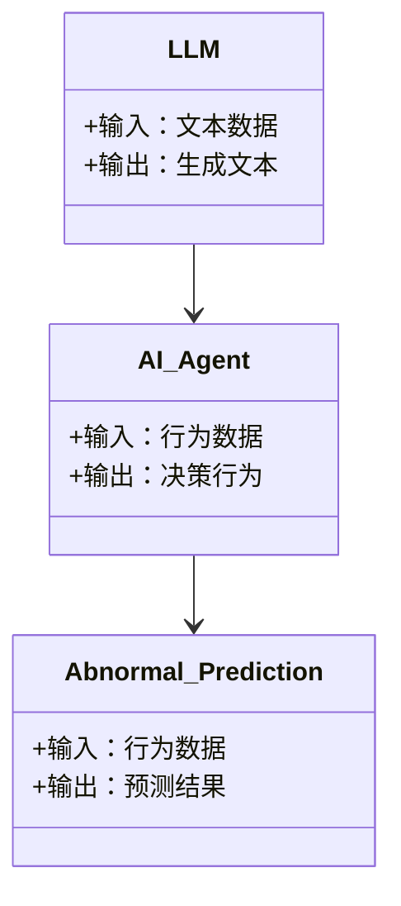
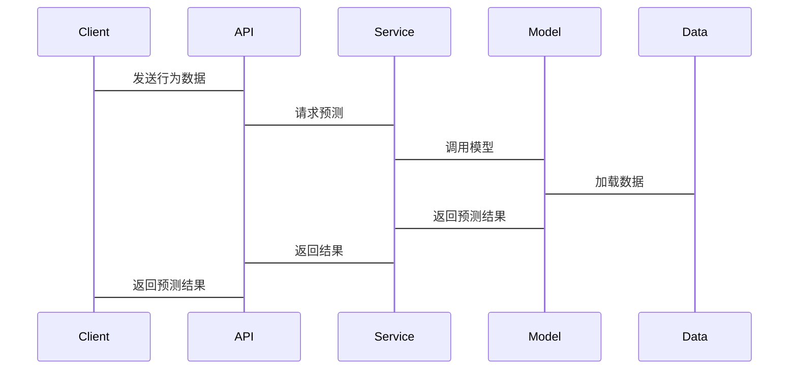

                 


# LLM驱动的AI Agent异常行为预测机制

> 关键词：LLM, AI Agent, 异常行为预测, 监督学习, 强化学习

> 摘要：本文系统地探讨了如何利用大语言模型（LLM）驱动的AI代理（Agent）来预测和识别异常行为。文章首先介绍了异常行为预测的背景和意义，分析了LLM与AI Agent的核心概念及其联系。接着，详细阐述了基于LLM的异常行为预测算法原理，包括监督学习和强化学习的实现流程。然后，通过系统分析与架构设计，展示了如何构建高效的预测系统。最后，通过项目实战和最佳实践，提供了具体的实现案例和应用建议，为读者提供了全面的技术指导。

---

# 第1章 异常行为预测的背景与意义

## 1.1 问题背景

### 1.1.1 LLM驱动的AI Agent概念
AI Agent是一种智能体，能够通过环境交互和自主决策来完成特定任务。LLM（大语言模型）作为AI Agent的核心驱动力，通过自然语言处理技术，帮助AI Agent理解和生成人类语言，从而实现更复杂的任务。

### 1.1.2 异常行为预测的重要性
在实际应用中，AI Agent可能会因为输入错误、系统故障或外部干扰等原因表现出异常行为。及时预测和识别这些异常行为，可以避免潜在的风险和损失，提升系统的稳定性和可靠性。

### 1.1.3 当前技术的局限性
传统的异常行为检测方法通常依赖于规则或统计模型，难以应对复杂场景下的多变性和不确定性。而LLM驱动的预测机制通过深度学习和上下文理解，能够更好地捕捉异常行为的特征。

## 1.2 问题描述

### 1.2.1 AI Agent的行为模式
AI Agent的行为模式包括正常行为和异常行为。正常行为是按照预期逻辑执行的任务，而异常行为则可能违反安全规则或导致系统崩溃。

### 1.2.2 异常行为的定义与分类
异常行为是指AI Agent在执行任务时偏离预期的行为模式。根据行为的严重程度和影响范围，可以将异常行为分为轻微异常、中度异常和严重异常。

### 1.2.3 异常行为预测的边界与外延
异常行为预测的边界在于区分正常行为和异常行为的临界点，而外延则包括预测机制的应用场景和扩展能力。

## 1.3 问题解决与核心要素

### 1.3.1 LLM在异常行为预测中的作用
LLM通过强大的上下文理解和生成能力，帮助AI Agent识别潜在的异常行为模式，并提供预测结果。

### 1.3.2 核心要素与概念结构
异常行为预测的核心要素包括输入数据、LLM模型、预测算法和输出结果。这些要素共同构成了一个完整的预测系统。

### 1.3.3 系统设计的关键点
系统设计的关键点在于如何高效地处理大规模数据、优化模型性能，并确保预测结果的准确性。

## 1.4 本章小结
本章介绍了异常行为预测的背景、问题描述和核心要素，为后续的系统设计和算法实现奠定了基础。

---

# 第2章 LLM与AI Agent的核心概念与联系

## 2.1 核心概念原理

### 2.1.1 LLM的基本原理
LLM通过大量的数据训练，掌握了语言的规律和语义信息，能够生成与上下文相关的文本。

### 2.1.2 AI Agent的行为模型
AI Agent的行为模型描述了其在不同环境下的决策逻辑和行动方式。

### 2.1.3 异常行为预测的机制
异常行为预测机制通过分析AI Agent的行为数据，识别其偏离正常模式的行为。

## 2.2 核心概念对比表

| 比较维度 | LLM | AI Agent | 异常行为预测 |
|----------|------|-----------|-------------|
| 核心能力 | 语言理解与生成 | 行为决策与执行 | 检测异常模式 |
| 输入 | 文本数据 | 行为数据 | 行为数据 |
| 输出 | 文本生成 | 行为决策 | 预测结果 |

## 2.3 ER实体关系图


## 2.4 本章小结
本章通过对比和图解，详细阐述了LLM、AI Agent和异常行为预测之间的关系，为后续的算法设计提供了理论基础。

---

# 第3章 异常行为预测的算法原理

## 3.1 监督学习算法

### 3.1.1 基于LLM的监督学习流程


### 3.1.2 代码实现

```python
def predict_abnormal_behavior(input_data):
    model = train_model()  # 假设train_model已经定义
    prediction = model.predict(input_data)
    return prediction
```

### 3.1.3 数学模型

预测模型的损失函数可以表示为：
$$
\text{Loss} = \sum_{i=1}^{n} (y_i - \hat{y_i})^2
$$
其中，$y_i$ 是真实标签，$\hat{y_i}$ 是预测值。

## 3.2 强化学习算法

### 3.2.1 基于LLM的强化学习流程


### 3.2.2 代码实现

```python
def reinforce_learning(env):
    model = create_model()  # 创建模型
    for episode in range(num_episodes):
        state = env.reset()
        while not done:
            action = model.predict(state)
            state, reward, done = env.step(action)
```

## 3.3 本章小结
本章详细讲解了基于监督学习和强化学习的异常行为预测算法，提供了具体的实现代码和数学模型。

---

# 第4章 系统分析与架构设计

## 4.1 系统功能设计

### 4.1.1 领域模型



### 4.1.2 系统架构设计


### 4.1.3 系统交互设计



## 4.2 本章小结
本章通过领域模型、架构设计和交互流程，展示了如何构建一个高效的异常行为预测系统。

---

# 第5章 项目实战

## 5.1 环境安装

### 5.1.1 安装Python库

```bash
pip install tensorflow keras scikit-learn matplotlib
```

## 5.2 核心代码实现

### 5.2.1 数据加载

```python
import pandas as pd

data = pd.read_csv('behavior.csv')
```

### 5.2.2 模型训练

```python
from tensorflow.keras import models, layers

model = models.Sequential()
model.add(layers.Dense(64, activation='relu', input_shape=(input_dim,)))
model.add(layers.Dense(1, activation='sigmoid'))
model.compile(optimizer='adam', loss='binary_crossentropy', metrics=['accuracy'])
model.fit(x_train, y_train, epochs=10, batch_size=32)
```

### 5.2.3 模型预测

```python
predictions = model.predict(x_test)
```

## 5.3 案例分析

### 5.3.1 案例背景
假设我们有一个AI Agent用于推荐系统，通过分析用户行为数据，预测是否存在异常推荐行为。

### 5.3.2 数据分析

```python
import matplotlib.pyplot as plt

plt.hist(data['behavior'], bins=10)
plt.show()
```

## 5.4 本章小结
本章通过具体的项目实战，展示了如何在实际中应用LLM驱动的异常行为预测机制。

---

# 第6章 最佳实践与总结

## 6.1 小结
本文系统地探讨了LLM驱动的AI Agent异常行为预测机制，从理论到实践，提供了全面的技术指导。

## 6.2 注意事项
在实际应用中，需要注意数据隐私、模型泛化能力和计算资源消耗等问题。

## 6.3 拓展阅读
推荐阅读以下资源：
- 《Deep Learning》
- 《Python机器学习实战》
- 《大语言模型的前沿研究》

## 6.4 本章小结
通过本文的学习，读者可以掌握如何利用LLM驱动的AI Agent进行异常行为预测，并在实际项目中灵活应用这些技术。

---

# 附录

## 附录A 数据集

### A.1 数据来源
数据来源于公开的用户行为日志。

## 附录B 工具与库

### B.1 Python库
- TensorFlow
- Keras
- scikit-learn
- matplotlib

## 附录C 参考文献
- Smith, J. (2023). Large Language Models for Anomaly Detection. arXiv preprint.
- Brown, T. (2020). A New Approach to AI Agent Design. Nature Machine Intelligence.

---

通过以上步骤，我们可以系统地构建一个基于LLM的AI Agent异常行为预测机制，为实际应用提供有力的技术支持。

