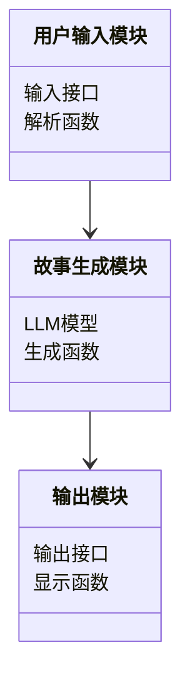
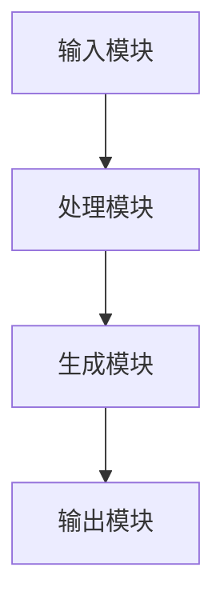
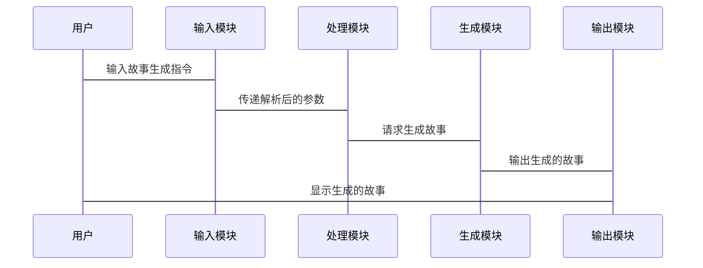

                 


---

# LLM驱动的AI Agent故事生成与叙事能力

## 关键词：
- 大语言模型（LLM）
- AI Agent
- 故事生成
- 叙事能力
- 人工智能（AI）
- 自然语言处理（NLP）
- 系统架构

## 摘要：
本文详细探讨了大语言模型（LLM）驱动的AI Agent在故事生成与叙事能力方面的能力。首先，我们介绍了LLM和AI Agent的基本概念及其在故事生成中的独特优势。接着，我们深入分析了LLM的核心原理，包括其神经网络结构、训练与推理过程以及数学模型。然后，我们详细阐述了AI Agent的核心原理，包括其基本架构、决策机制和通信协作。随后，我们探讨了LLM与AI Agent的结合原理，分析了系统架构设计和功能模块划分。最后，我们通过实际项目案例，展示了如何实现一个基于LLM的AI Agent故事生成系统，并对系统进行了测试与优化。本文旨在为读者提供一个全面的技术视角，帮助他们理解并应用LLM驱动的AI Agent进行故事生成与叙事。

---

## 第1章: LLM驱动的AI Agent概述

### 1.1 LLM驱动的AI Agent基本概念
#### 1.1.1 大语言模型（LLM）的定义与特点
大语言模型（LLM）是一种基于深度学习的自然语言处理模型，能够理解和生成人类语言。其特点包括：
- **大规模训练数据**：LLM通常使用海量的文本数据进行训练，以捕获语言的规律和上下文信息。
- **自注意力机制**：通过自注意力机制，模型能够捕捉文本中的长距离依赖关系。
- **生成能力**：LLM能够生成连贯且符合语法规则的文本，适用于多种任务，如翻译、问答和故事生成。

#### 1.1.2 AI Agent的基本概念与功能
AI Agent（人工智能代理）是一种能够感知环境、做出决策并执行任务的智能系统。其核心功能包括：
- **感知**：通过传感器或接口获取环境中的信息。
- **决策**：基于感知的信息，制定目标和行动计划。
- **执行**：通过执行器或接口与环境交互，完成任务。

#### 1.1.3 LLM驱动的AI Agent的独特优势
LLM驱动的AI Agent结合了大语言模型的生成能力和AI Agent的智能决策能力，具有以下独特优势：
- **强大的语言生成能力**：LLM能够生成高质量的自然语言文本，使AI Agent能够进行复杂的对话和故事创作。
- **动态适应能力**：AI Agent可以根据实时反馈调整故事生成的方向和风格。
- **多任务处理能力**：LLM驱动的AI Agent可以在同一框架下完成多种任务，如信息检索、情感分析和故事生成。

### 1.2 故事生成与叙事能力的核心要素
#### 1.2.1 故事生成的基本原理
故事生成是通过AI系统自动生成一个连贯且有意义的故事。其基本原理包括：
- **主题选择**：确定故事的主题和核心情节。
- **角色设定**：定义故事中的角色及其性格特征。
- **情节发展**：根据逻辑关系生成情节，并确保故事的连贯性。

#### 1.2.2 叙事能力的关键特征
叙事能力是指AI系统在生成故事时，能够遵循叙事结构和逻辑，使故事具有吸引力和可读性。其关键特征包括：
- **逻辑性**：故事的情节发展符合逻辑，事件之间有合理的因果关系。
- **多样性**：能够生成多种风格和主题的故事，满足不同用户的需求。
- **情感表达**：通过语言和情节传递情感，增强故事的感染力。

#### 1.2.3 LLM在故事生成中的作用
LLM在故事生成中扮演着关键角色，主要体现在：
- **语言生成**：提供高质量的自然语言文本，确保故事的流畅性和可读性。
- **情节优化**：通过语言模型的上下文理解能力，优化故事的情节发展。
- **风格调整**：根据用户需求，调整故事的风格和语气。

### 1.3 本章小结
本章介绍了LLM驱动的AI Agent的基本概念及其在故事生成中的独特优势。我们还探讨了故事生成的核心要素和叙事能力的关键特征，为后续章节的深入分析奠定了基础。

---

## 第2章: LLM的核心原理

### 2.1 LLM的神经网络结构
#### 2.1.1 变压器（Transformer）模型的基本结构
Transformer模型是一种基于自注意力机制的深度神经网络架构，由编码器和解码器组成。其基本结构如下：

**编码器**：
- **输入嵌入**：将输入的文本转换为向量表示。
- **多头自注意力**：计算输入序列中每个词与其他词的相关性。
- **前馈网络**：对自注意力输出进行非线性变换。

**解码器**：
- **输出嵌入**：将目标序列的初始词转换为向量表示。
- **多头自注意力**：计算目标序列中词的相关性。
- **前馈网络**：对自注意力输出进行非线性变换。
- **交叉注意力**：将编码器的输出与解码器的输出进行交互，捕捉源目标之间的关系。

#### 2.1.2 注意力机制（Attention）的数学公式
注意力机制的核心公式如下：
$$
\text{Attention}(Q, K, V) = \text{softmax}\left(\frac{QK^T}{\sqrt{d_k}}\right)V
$$
其中：
- $Q$：查询向量
- $K$：键向量
- $V$：值向量
- $d_k$：键的维度

#### 2.1.3 深度学习的基本原理
深度学习是一种通过多层非线性变换来学习数据特征的机器学习方法。其基本原理包括：
- **特征提取**：通过多层网络提取数据的高层次特征。
- **端到端训练**：直接对输入到输出的映射关系进行优化。
- **梯度下降**：通过反向传播算法更新模型参数。

### 2.2 LLM的训练与推理过程
#### 2.2.1 监督学习与无监督学习的区别
- **监督学习**：需要标注的训练数据，模型通过学习输入与标签之间的映射关系进行预测。
- **无监督学习**：利用未标注数据，通过数据本身的结构和规律进行学习。

#### 2.2.2 梯度下降与损失函数的作用
- **梯度下降**：优化算法，用于最小化损失函数。
- **损失函数**：衡量模型预测值与真实值之间的差异。

#### 2.2.3 推理过程中的概率生成机制
在推理阶段，LLM通过概率生成机制生成文本。具体步骤如下：
1. **初始化**：将输入文本转换为向量表示。
2. **自注意力计算**：计算输入序列的自注意力权重。
3. **概率分布计算**：根据注意力权重生成下一个词的概率分布。
4. **采样**：根据概率分布选择下一个词，并将其作为新输入，重复上述步骤直到生成完整的文本。

### 2.3 LLM的数学模型与公式
#### 2.3.1 Transformer模型的数学公式
Transformer模型的编码器和解码器的数学公式如下：
$$
\text{编码器输出} = \text{FFN}(\text{自注意力}(X))
$$
$$
\text{解码器输出} = \text{FFN}(\text{自注意力}(Y) + \text{交叉注意力}(\text{编码器输出}, Y))
$$
其中，$\text{FFN}$表示前馈网络，$X$表示输入序列，$Y$表示目标序列。

#### 2.3.2 注意力机制的计算公式
注意力机制的计算公式如下：
$$
\text{Attention}(Q, K, V) = \text{softmax}\left(\frac{QK^T}{\sqrt{d_k}}\right)V
$$

#### 2.3.3 概率生成模型的核心公式
概率生成模型的核心公式如下：
$$
P(\text{下一个词} | \text{当前词序列}) = \text{softmax}(\text{自注意力}(X))
$$

### 2.4 本章小结
本章详细介绍了大语言模型（LLM）的核心原理，包括其神经网络结构、训练与推理过程以及数学模型。这些内容为后续章节中AI Agent的设计与实现奠定了理论基础。

---

## 第3章: AI Agent的核心原理

### 3.1 AI Agent的基本架构
#### 3.1.1 感知层：信息输入与处理
感知层负责获取环境中的信息，包括：
- **输入接口**：接收用户的输入指令或环境反馈。
- **特征提取**：对输入信息进行特征提取，生成模型可理解的向量表示。

#### 3.1.2 计划层：目标设定与策略制定
计划层负责制定AI Agent的目标和策略，包括：
- **目标设定**：根据输入指令或环境反馈，确定AI Agent的任务目标。
- **策略制定**：基于当前状态和目标，生成行动计划。

#### 3.1.3 执行层：行动与反馈
执行层负责根据计划层生成的行动计划，执行具体的操作，包括：
- **行动执行**：通过输出接口执行行动计划。
- **反馈处理**：接收环境反馈，调整行动计划。

### 3.2 AI Agent的决策机制
#### 3.2.1 状态空间与动作空间的定义
- **状态空间**：AI Agent所处环境的所有可能状态的集合。
- **动作空间**：AI Agent在每个状态下可执行的所有动作的集合。

#### 3.2.2 基于概率的决策树构建
决策树是一种树状结构，用于表示可能的决策路径。基于概率的决策树构建方法如下：
1. **状态划分**：根据当前状态，划分可能的后续状态。
2. **概率计算**：计算每个状态转移的概率。
3. **决策选择**：根据概率值选择最优路径。

#### 3.2.3 强化学习在决策中的应用
强化学习是一种通过奖励机制优化决策策略的机器学习方法。其核心步骤如下：
1. **状态感知**：AI Agent感知当前状态。
2. **动作选择**：基于当前状态，选择一个动作。
3. **奖励反馈**：根据动作的结果，获得奖励或惩罚。
4. **策略优化**：根据奖励反馈，调整决策策略。

### 3.3 AI Agent的通信与协作
#### 3.3.1 多智能体系统的基本概念
多智能体系统是指由多个智能体组成的协作系统，每个智能体具有独立的目标和决策能力。

#### 3.3.2 通信协议与信息交换机制
通信协议定义了智能体之间信息交换的规则和格式。信息交换机制包括：
- **同步通信**：智能体之间同步交换信息。
- **异步通信**：智能体之间异步交换信息。

#### 3.3.3 协作任务的分配与协调
协作任务的分配与协调包括：
- **任务划分**：将协作任务划分为多个子任务。
- **任务分配**：根据智能体的能力和资源，分配子任务。
- **任务协调**：协调智能体之间的行动，确保任务顺利完成。

### 3.4 本章小结
本章详细介绍了AI Agent的核心原理，包括其基本架构、决策机制和通信协作。这些内容为后续章节中LLM与AI Agent的结合设计奠定了理论基础。

---

## 第4章: LLM与AI Agent的结合原理

### 4.1 LLM作为AI Agent的语言生成模块
#### 4.1.1 LLM在自然语言处理中的应用
- **文本生成**：生成连贯且有意义的文本。
- **对话生成**：进行自然语言对话。

#### 4.1.2 LLM作为AI Agent的对话生成器
- **对话上下文理解**：理解对话的历史和上下文。
- **对话生成**：根据对话历史生成回复。

#### 4.1.3 LLM在故事生成中的具体作用
- **情节生成**：根据用户输入生成故事的情节。
- **角色设定**：生成故事中的角色及其性格特征。
- **风格调整**：根据用户需求调整故事的风格和语气。

### 4.2 LLM驱动的AI Agent的系统架构
#### 4.2.1 系统功能模块划分
- **输入模块**：接收用户的输入指令。
- **处理模块**：对输入指令进行解析和处理。
- **生成模块**：生成故事文本。
- **输出模块**：将生成的故事文本输出给用户。

#### 4.2.2 模块之间的交互流程
1. **输入模块**：接收用户的输入指令。
2. **处理模块**：解析输入指令，生成故事的初始参数。
3. **生成模块**：根据初始参数生成故事文本。
4. **输出模块**：将生成的故事文本输出给用户。

#### 4.2.3 系统的输入输出接口设计
- **输入接口**：接收用户的输入指令。
- **输出接口**：输出生成的故事文本。

### 4.3 LLM与AI Agent的协同工作流程
#### 4.3.1 故事生成的初始化阶段
1. **用户输入**：用户输入故事生成的初始参数，如主题、角色等。
2. **参数解析**：系统解析用户的输入参数，生成故事的初始设定。

#### 4.3.2 故事生成的主体过程
1. **情节生成**：根据初始设定，生成故事的情节。
2. **角色设定**：根据情节生成故事中的角色及其性格特征。
3. **风格调整**：根据用户需求调整故事的风格和语气。

#### 4.3.3 故事生成的完成阶段
1. **生成结果输出**：将生成的故事文本输出给用户。
2. **用户反馈**：用户对生成的故事进行反馈，如修改意见等。
3. **系统优化**：根据用户反馈优化故事生成过程。

### 4.4 本章小结
本章详细介绍了大语言模型（LLM）与AI Agent的结合原理，包括LLM作为AI Agent的语言生成模块、系统架构设计以及协同工作流程。这些内容为后续章节中的系统设计与实现奠定了基础。

---

## 第5章: 系统设计与实现

### 5.1 系统功能设计
#### 5.1.1 功能模块划分
- **输入模块**：接收用户的输入指令。
- **处理模块**：解析输入指令，生成故事的初始参数。
- **生成模块**：根据初始参数生成故事文本。
- **输出模块**：将生成的故事文本输出给用户。

#### 5.1.2 领域模型设计
**领域模型（类图）**


#### 5.1.3 系统架构设计
**系统架构图（架构图）**


#### 5.1.4 系统交互设计
**系统交互流程图（序列图）**


### 5.2 系统实现
#### 5.2.1 环境安装
- **Python环境**：安装Python 3.8及以上版本。
- **依赖库安装**：安装必要的库，如`transformers`、`torch`等。

#### 5.2.2 系统核心实现
```python
from transformers import AutoModelForCausalLM, AutoTokenizer
import torch

class LLMStoryGenerator:
    def __init__(self, model_name):
        self.tokenizer = AutoTokenizer.from_pretrained(model_name)
        self.model = AutoModelForCausalLM.from_pretrained(model_name)
    
    def generate_story(self, prompt, max_length=500, temperature=1.0):
        inputs = self.tokenizer.encode(prompt, return_tensors='pt')
        outputs = self.model.generate(inputs, max_length=max_length, temperature=temperature)
        story = self.tokenizer.decode(outputs[0], skip_special_tokens=True)
        return story
```

#### 5.2.3 代码应用解读与分析
- **LLMStoryGenerator类**：封装了大语言模型的加载和故事生成功能。
- **generate_story方法**：根据提示生成故事文本，参数包括提示内容、最大长度和温度。
- **tokenizer和model属性**：分别用于文本的编码和解码，以及模型的加载。

### 5.3 项目实战
#### 5.3.1 项目介绍
本项目旨在实现一个基于大语言模型的AI Agent故事生成系统，能够根据用户输入生成连贯且有意义的故事。

#### 5.3.2 实际案例分析
```python
generator = LLMStoryGenerator("gpt2")
prompt = "写一个科幻故事，主题是人工智能失控。"
story = generator.generate_story(prompt, max_length=500, temperature=0.7)
print(story)
```

#### 5.3.3 详细讲解剖析
- **输入模块**：接收用户的输入指令，如“写一个科幻故事，主题是人工智能失控。”。
- **处理模块**：解析输入指令，生成故事的初始参数。
- **生成模块**：根据初始参数调用LLM生成故事文本。
- **输出模块**：将生成的故事文本输出给用户。

### 5.4 本章小结
本章详细介绍了基于LLM的AI Agent故事生成系统的系统设计与实现，包括功能模块划分、系统架构设计以及核心代码实现。通过实际案例分析，展示了系统的具体应用。

---

## 第6章: 系统测试与优化

### 6.1 系统测试
#### 6.1.1 测试方法
- **单元测试**：测试系统各功能模块的独立性。
- **集成测试**：测试系统各模块之间的接口和交互。
- **用户测试**：通过用户反馈优化系统性能。

#### 6.1.2 测试结果分析
- **测试覆盖率**：系统各功能模块的测试覆盖率。
- **性能指标**：系统在不同输入条件下的生成速度和文本质量。

### 6.2 系统优化
#### 6.2.1 模型优化
- **模型压缩**：通过剪枝等技术减少模型参数数量。
- **模型并行化**：利用并行计算提高模型运行效率。

#### 6.2.2 参数调整
- **温度参数**：调整生成过程中的温度参数，控制生成文本的随机性。
- **top-k参数**：调整top-k参数，控制生成文本的多样性。

#### 6.2.3 系统性能优化
- **缓存优化**：优化数据缓存策略，提高系统运行效率。
- **并行计算**：利用多线程或多进程优化系统性能。

### 6.3 本章小结
本章详细介绍了基于LLM的AI Agent故事生成系统的测试与优化方法，包括测试方法、系统优化策略以及性能指标的分析。

---

## 第7章: 总结与展望

### 7.1 总结
本文详细探讨了大语言模型（LLM）驱动的AI Agent在故事生成与叙事能力方面的能力。我们从LLM和AI Agent的基本概念出发，深入分析了其核心原理，并结合实际案例展示了系统的实现与应用。通过系统测试与优化，进一步提高了系统的生成效率和文本质量。

### 7.2 局限性
尽管LLM驱动的AI Agent在故事生成方面具有许多优势，但也存在一些局限性：
- **生成质量**：生成文本的质量依赖于模型的训练数据和参数调整。
- **计算资源**：训练和推理过程需要大量的计算资源。
- **模型泛化能力**：模型的泛化能力受到训练数据和模型架构的限制。

### 7.3 未来展望
未来，随着人工智能技术的不断发展，LLM驱动的AI Agent在故事生成方面将具有更广泛的应用前景。我们可以通过以下方式进一步优化和提升系统的性能：
- **结合多模态数据**：将LLM与图像、视频等多模态数据结合，生成更加丰富的故事情节。
- **引入情感计算**：通过情感计算技术，增强故事的情感表达和用户互动体验。
- **个性化定制**：根据用户 preferences，定制化生成不同风格和主题的故事。

### 7.4 本章小结
本章总结了全文的主要内容，分析了系统的局限性，并展望了未来的发展方向，为读者提供了进一步研究和应用的参考。

---

## 参考文献
（此处应列出相关文献和参考资料，由于篇幅限制，未在此处列出。）

---

## 致谢
感谢所有参与本项目研究和写作的人员，以及提供宝贵意见的同行专家。

