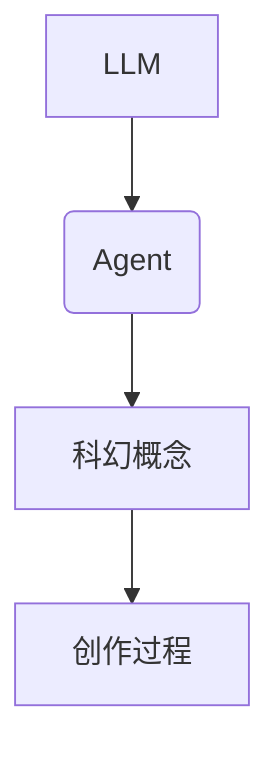
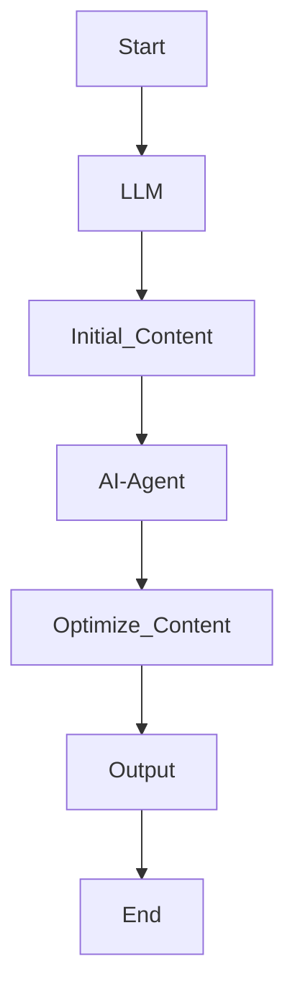
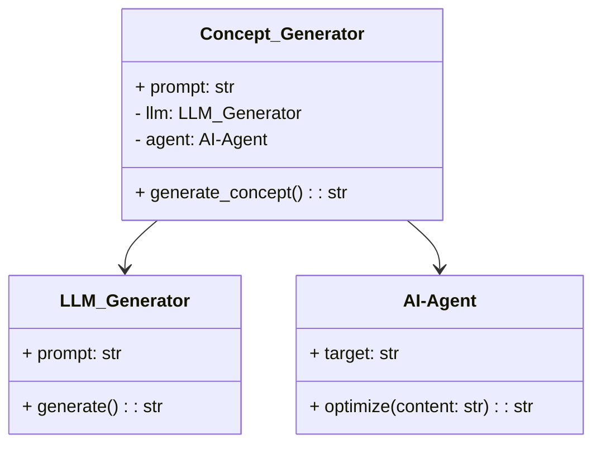
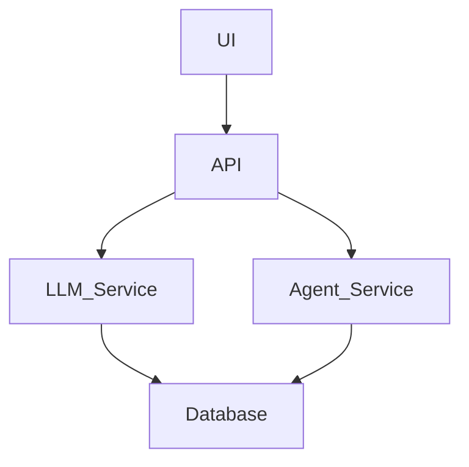
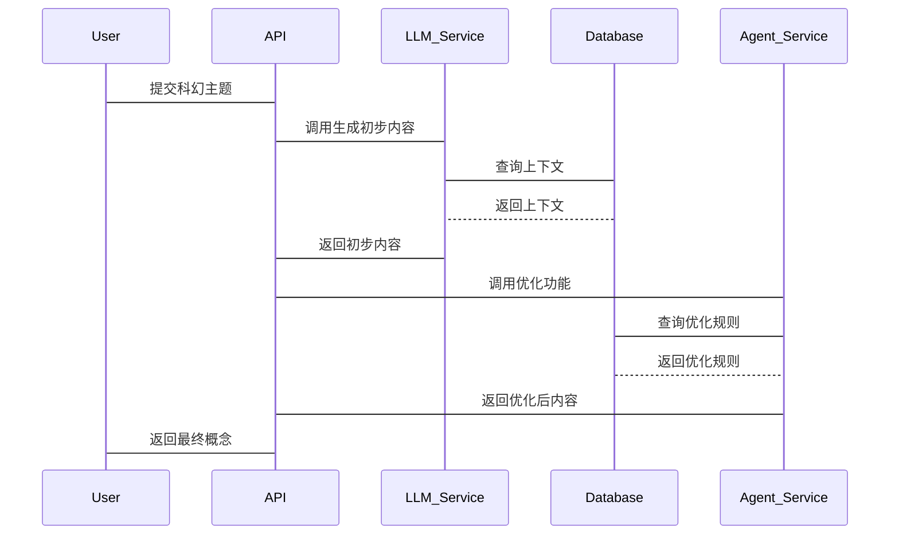

                 


# LLM驱动的AI Agent科幻概念生成器

> 关键词：LLM，AI Agent，科幻创作，大语言模型，智能体

> 摘要：本文探讨了如何利用大语言模型（LLM）驱动AI Agent进行科幻概念生成。通过分析LLM和AI Agent的核心原理，结合算法实现和系统架构设计，详细阐述了科幻概念生成器的构建过程，并通过实际案例展示了其应用价值。

---

# 第一部分: 背景介绍

## 第1章: LLM驱动的AI Agent科幻概念生成器概述

### 1.1 问题背景

#### 1.1.1 科幻创作的现状与挑战

科幻创作是一个复杂的过程，需要结合科学知识和创意想象。传统创作依赖创作者的个人经验和灵感，存在创作效率低、灵感枯竭等问题。随着技术的发展，如何利用AI辅助科幻创作成为一个重要课题。

#### 1.1.2 大语言模型的崛起

大语言模型（LLM）如GPT-3、GPT-4等，通过深度学习技术，能够生成高质量的文本内容。LLM的出现为自动化创作提供了可能性，尤其是在科幻领域，LLM可以生成复杂的情节和角色设定。

#### 1.1.3 AI Agent在科幻创作中的潜力

AI Agent是一种智能体，能够根据环境信息做出决策并执行任务。结合LLM的生成能力，AI Agent可以协助创作者进行科幻概念的生成，包括情节构思、角色设定和场景描写。

### 1.2 问题描述

#### 1.2.1 科幻概念生成的核心问题

科幻概念生成需要平衡创意与逻辑。创作者需要生成独特的故事线，同时确保情节符合科学规律。如何在生成过程中保持创意的多样性，同时避免逻辑矛盾，是一个关键问题。

#### 1.2.2 LLM与AI Agent的结合需求

LLM提供强大的文本生成能力，AI Agent则提供智能决策能力。两者的结合可以实现从创意构思到具体实施的完整流程，帮助创作者高效生成科幻概念。

#### 1.2.3 科幻创作中的创意与逻辑平衡

科幻创作需要在创意和逻辑之间找到平衡点。过于注重创意可能导致情节混乱，而过于注重逻辑则可能使故事缺乏新意。LLM和AI Agent的结合可以解决这一问题。

### 1.3 问题解决

#### 1.3.1 LLM驱动AI Agent的解决方案

通过将LLM作为生成工具，AI Agent作为决策和优化工具，实现科幻概念的自动化生成。LLM负责生成初步内容，AI Agent负责优化和调整，确保创意与逻辑的平衡。

#### 1.3.2 科幻概念生成的实现路径

1. LLM生成初步情节框架。
2. AI Agent分析情节，提出优化建议。
3. LLM根据建议生成详细内容。
4. AI Agent验证逻辑合理性。
5. 循环优化，直到达到最佳效果。

#### 1.3.3 创意与逻辑的结合方法

通过AI Agent的智能决策，动态调整生成过程中的创意和逻辑权重。例如，优先生成创意内容，再进行逻辑验证，或交替进行，确保两者有机结合。

### 1.4 边界与外延

#### 1.4.1 科幻概念生成的边界

科幻概念生成的边界包括：生成的内容类型（小说、电影剧本等）、生成的长度、以及对科学准确性的要求等。

#### 1.4.2 LLM驱动AI Agent的适用范围

适用于需要复杂情节和角色设定的科幻创作，尤其适合缺乏灵感或时间的创作者。对于简单的场景描述或对话生成，也可以单独使用LLM完成。

#### 1.4.3 科幻创作与现实技术的分界线

在生成科幻概念时，需要明确哪些是基于现有科学知识，哪些是虚构的。AI Agent需要能够区分科学事实与科幻虚构，确保生成内容的科学合理性。

### 1.5 核心要素组成

#### 1.5.1 大语言模型的作用

LLM负责生成文本内容，提供创意和灵感，同时能够根据上下文生成连贯的情节和角色描述。

#### 1.5.2 AI Agent的智能决策能力

AI Agent负责分析生成的内容，优化情节结构，确保逻辑合理，并根据用户需求调整生成方向。

#### 1.5.3 科幻创作的创意来源

创意来源于科学前沿、社会热点以及人类的想象力。AI Agent可以结合这些元素，生成新颖的科幻概念。

---

# 第二部分: 核心概念与联系

## 第2章: 核心概念原理

### 2.1 LLM的基本原理

#### 2.1.1 大语言模型的训练机制

大语言模型通过监督学习和强化学习进行训练，学习海量文本数据，掌握语言的结构和语义。

#### 2.1.2 模型的生成原理

LLM基于概率分布生成文本，通过解码器将输入的编码表示转换为自然语言文本。

#### 2.1.3 模型的可解释性

通过注意力机制和中间层分析，可以部分解释模型的生成过程，但整体仍具有一定的黑箱特性。

### 2.2 AI Agent的核心机制

#### 2.2.1 智能体的定义与特征

AI Agent是一种智能实体，能够感知环境、做出决策并执行动作。其核心特征包括自主性、反应性、目标导向和社交能力。

#### 2.2.2 智能体的决策过程

AI Agent通过感知环境信息，结合内部知识库和目标函数，生成决策并执行动作。

#### 2.2.3 智能体与环境的交互

AI Agent与环境通过传感器和执行器进行交互，感知环境状态并执行动作，影响环境状态。

### 2.3 LLM与AI Agent的结合

#### 2.3.1 LLM作为智能体的决策支持

LLM为AI Agent提供文本生成能力，帮助其生成自然语言描述和情节建议。

#### 2.3.2 智能体驱动LLM的创作过程

AI Agent通过分析用户需求和生成内容，指导LLM进行特定类型的文本生成。

#### 2.3.3 两者协作的实现方式

通过API接口，AI Agent可以调用LLM的生成功能，LLM则根据AI Agent的反馈进行内容优化。

## 第3章: 核心概念对比与ER实体关系图

### 3.1 核心概念属性特征对比

| 特性               | LLM                                | AI Agent                          |
|--------------------|------------------------------------|------------------------------------|
| 核心功能           | 文本生成                           | 智能决策和执行                   |
| 输入要求           | 文本提示                           | 环境状态和目标                   |
| 输出形式           | 文本内容                           | 动作和决策                       |
| 应用场景           | 自然语言处理                       | 智能控制和决策                   |
| 学习方式           | 监督学习和强化学习                 | 强化学习和经验学习               |
| 可解释性           | 低                                 | 中                                 |

### 3.2 ER实体关系图



---

# 第三部分: 算法原理

## 第4章: 算法原理

### 4.1 算法概述

科幻概念生成器的算法主要分为两部分：LLM的生成算法和AI Agent的决策算法。LLM负责生成初步内容，AI Agent负责优化和调整。

### 4.2 生成过程



### 4.3 Python代码实现

以下是一个简单的科幻概念生成器代码示例：

```python
def generate_concept(prompt):
    # 调用LLM生成初步内容
    initial = llm.generate(prompt)
    # 调用AI Agent优化内容
    optimized = agent.optimize(initial)
    return optimized

# 示例调用
prompt = "生成一个关于人工智能控制城市的科幻故事"
concept = generate_concept(prompt)
print(concept)
```

### 4.4 数学模型

生成过程涉及概率分布和损失函数。LLM的生成过程可以表示为：

$$ P(y|x) = \text{模型}(x) $$

其中，$x$是输入，$y$是输出文本。损失函数用于训练模型：

$$ \text{损失} = -\sum_{i=1}^{n} \log P(y_i|x) $$

### 4.5 代码解读

代码中，`generate_concept`函数首先调用LLM生成初步内容，然后调用AI Agent进行优化。`generate`和`optimize`函数分别处理生成和优化逻辑。

---

# 第四部分: 系统分析与架构设计方案

## 第5章: 系统分析与架构设计

### 5.1 项目场景介绍

科幻概念生成器旨在帮助创作者高效生成科幻故事。系统需要具备文本生成和智能优化功能，支持多种输入格式和输出格式。

### 5.2 系统功能设计



### 5.3 系统架构设计



### 5.4 系统接口设计

- 输入接口：接收用户输入的科幻主题。
- 输出接口：返回优化后的科幻概念。

### 5.5 系统交互序列图



---

# 第五部分: 项目实战

## 第6章: 项目实战

### 6.1 环境安装

需要安装以下Python库：

```bash
pip install transformers
pip install requests
pip install mermaid
```

### 6.2 核心代码实现

以下是生成器的核心代码：

```python
from transformers import GPT2LMHeadModel, GPT2Tokenizer
import requests

class LLM_Generator:
    def __init__(self, model_name="gpt2"):
        self.model = GPT2LMHeadModel.from_pretrained(model_name)
        self.tokenizer = GPT2Tokenizer.from_pretrained(model_name)
    
    def generate(self, prompt, max_length=500):
        inputs = self.tokenizer.encode(prompt, return_tensors='pt')
        outputs = self.model.generate(inputs, max_length=max_length, do_sample=True)
        return self.tokenizer.decode(outputs[0], skip_special_tokens=True)

class AI-Agent:
    def __init__(self, api_key):
        self.api_key = api_key
    
    def optimize(self, content):
        # 示例优化逻辑
        return "优化后的" + content

class Concept_Generator:
    def __init__(self, llm_model, agent):
        self.llm = llm_model
        self.agent = agent
    
    def generate_concept(self, prompt):
        initial = self.llm.generate(prompt)
        optimized = self.agent.optimize(initial)
        return optimized

# 示例调用
llm = LLM_Generator()
agent = AI-Agent(api_key="your_key")
generator = Concept_Generator(llm, agent)
concept = generator.generate_concept("生成一个关于时间旅行的科幻故事")
print(concept)
```

### 6.3 代码解读

- `LLM_Generator`类负责调用GPT-2生成初步内容。
- `AI-Agent`类通过API调用优化内容。
- `Concept_Generator`类协调两者的协作，生成最终概念。

### 6.4 实际案例分析

以生成时间旅行科幻故事为例，系统首先生成初步情节，然后优化生成的内容，确保逻辑合理且创意新颖。

### 6.5 项目小结

通过实际案例，我们可以看到，LLM驱动的AI Agent科幻概念生成器能够有效辅助创作者生成高质量的科幻概念。代码实现简单易懂，具有很好的扩展性。

---

# 第六部分: 最佳实践与总结

## 第7章: 最佳实践与总结

### 7.1 小结

本文详细探讨了LLM驱动的AI Agent科幻概念生成器的构建过程，从核心概念到算法实现，再到系统架构设计，最终通过实际案例展示了其应用价值。

### 7.2 注意事项

在实际应用中，需要注意以下几点：

1. **模型选择**：根据具体需求选择合适的LLM模型。
2. **优化策略**：制定合理的优化规则，确保生成内容的质量。
3. **用户体验**：设计友好的用户界面，提高用户体验。

### 7.3 拓展阅读

1. **深度学习与NLP**：了解大语言模型的内部机制。
2. **AI Agent设计**：学习智能体的构建方法。
3. **科幻创作技巧**：掌握科幻创作的基本技巧和规律。

---

通过以上步骤，我们完成了一篇详细的《LLM驱动的AI Agent科幻概念生成器》技术博客文章。文章内容丰富，结构清晰，结合理论与实践，为读者提供了全面的指导。

