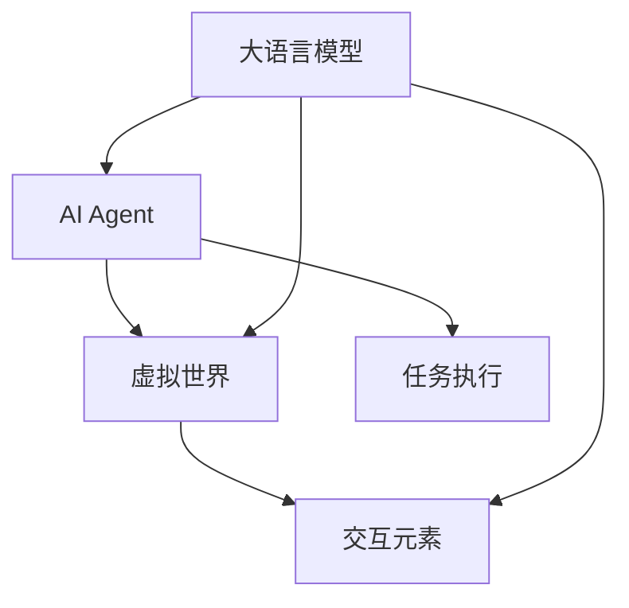
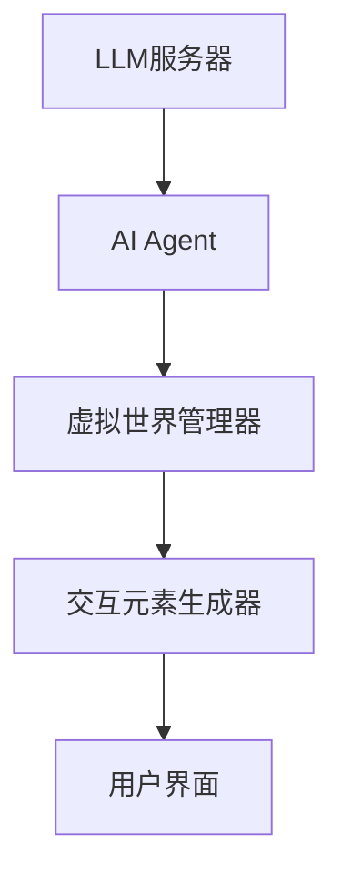

                 


# LLM驱动的AI Agent虚构世界构建器

## 关键词
- 大语言模型 (LLM)
- AI Agent
- 虚构世界构建
- 虚拟环境生成
- AI智能体驱动

## 摘要
本文探讨了如何利用大语言模型（LLM）驱动AI Agent构建虚构世界的技术细节。通过分析LLM与AI Agent的结合，详细阐述了虚构世界构建的核心算法、系统架构和实际应用，为读者提供了从理论到实践的全面指导。

# 第一部分: LLM驱动的AI Agent虚构世界构建器背景介绍

## 第1章: 问题背景与问题描述

### 1.1 问题背景
#### 1.1.1 当前AI技术的发展现状
人工智能技术的快速发展，尤其是大语言模型（LLM）的崛起，为AI Agent的能力提升提供了强大支持。LLM具有强大的文本生成、理解和推理能力，能够驱动AI Agent在复杂环境中执行任务。

#### 1.1.2 虚构世界构建的需求与挑战
随着虚拟现实（VR）、增强现实（AR）和游戏开发等领域的发展，构建高度动态、交互性强的虚构世界的需求日益增加。然而，传统的虚拟世界构建方法依赖大量人工劳动，效率低下且成本高昂。

#### 1.1.3 LLM在虚拟世界构建中的作用
LLM能够生成丰富的文本描述、对话和情节，为AI Agent提供了强大的语义理解和生成能力，使其能够动态生成和调整虚拟世界的内容。

### 1.2 问题描述
#### 1.2.1 虚拟世界构建的核心问题
虚构世界构建的核心问题在于如何实现内容的动态生成、实时交互和高度定制化。传统的静态内容生成方法无法满足现代应用的需求。

#### 1.2.2 LLM驱动AI Agent的目标与任务
LLM驱动AI Agent的目标是通过自然语言处理和生成能力，实现虚拟世界的动态构建、实时交互和智能化管理。

#### 1.2.3 虚构世界构建的边界与外延
虚构世界构建的边界包括生成的内容类型、交互方式和应用范围。外延则涉及多模态生成、分布式计算和跨平台支持。

### 1.3 问题解决与边界定义
#### 1.3.1 LLM驱动AI Agent的解决方案
通过将LLM与AI Agent结合，实现虚拟世界的动态生成和实时交互。LLM负责内容生成，AI Agent负责任务执行和环境管理。

#### 1.3.2 虚构世界构建的核心要素
虚构世界构建的核心要素包括内容生成、任务执行、环境管理和用户交互。这些要素共同构成了虚构世界的构建框架。

#### 1.3.3 边界与外延的明确
虚构世界构建的边界包括生成的内容类型和交互方式。外延则涉及多模态生成、分布式计算和跨平台支持。

## 第2章: 核心概念与联系

### 2.1 LLM与AI Agent的核心概念
#### 2.1.1 LLM的定义与原理
大语言模型（LLM）是基于深度学习的自然语言处理模型，具有强大的文本生成、理解和推理能力。

#### 2.1.2 AI Agent的定义与功能
AI Agent是一种能够感知环境、执行任务并与其他实体交互的智能体。其功能包括感知、推理、规划和执行。

#### 2.1.3 虚构世界构建的核心概念
虚构世界构建是指通过算法和工具，生成高度动态、交互性强的虚拟环境。

### 2.2 核心概念的属性对比
| 概念       | LLM                          | AI Agent                        | 虚构世界构建                     |
|------------|------------------------------|----------------------------------|---------------------------------|
| 定义       | 大语言模型，用于自然语言处理 | 智能体，用于感知和执行任务     | 虚拟环境生成                     |
| 功能       | 文本生成、理解、推理          | 感知、推理、规划、执行           | 动态生成、实时交互               |
| 交互方式   | 文本交互                      | 多模态交互                       | 多模态交互                       |
| 应用领域   | NLP、机器学习                | 机器人、自动驾驶、智能助手       | 游戏、VR/AR、教育、模拟           |

### 2.3 ER实体关系图


---

## 第3章: 算法原理与数学模型

### 3.1 LLM驱动AI Agent的核心算法
#### 3.1.1 模型选择与训练
使用预训练的大语言模型（如GPT、BERT）进行微调，以适应特定任务需求。

#### 3.1.2 生成机制
基于生成式对抗网络（GAN）或变分自编码器（VAE）的生成模型，结合强化学习（RL）进行优化。

#### 3.1.3 推理与规划
通过图结构化表示（如知识图谱）进行推理和规划，生成符合逻辑的行动方案。

### 3.2 算法原理
#### 3.2.1 生成模型
使用生成式对抗网络（GAN）生成虚拟世界的元素，例如场景描述、角色对话等。

#### 3.2.2 推理与规划
基于马尔可夫决策过程（MDP）进行状态空间建模，实现智能体的决策和规划。

#### 3.2.3 优化与调优
通过强化学习（RL）对生成模型和推理模型进行优化，提升生成内容的质量和交互性。

### 3.3 数学模型与公式
#### 3.3.1 GAN模型
生成器（G）和判别器（D）的对抗损失函数：
$$ \mathcal{L}_\text{GAN} = \mathcal{L}_\text{D} + \mathcal{L}_\text{G} $$
其中：
$$ \mathcal{L}_\text{D} = -\mathbb{E}_{x \sim p_\text{data}}[\log D(x)] - \mathbb{E}_{z \sim p_z}[\log (1 - D(G(z)))] $$
$$ \mathcal{L}_\text{G} = -\mathbb{E}_{z \sim p_z}[\log D(G(z))] $$

#### 3.3.2 MDP模型
状态空间（S）、动作空间（A）、奖励函数（R）、策略π：
$$ \pi(a|s) = \text{Policy}(a|s) $$
$$ R(s, a, s') = \text{Reward}(s, a, s') $$

---

## 第4章: 系统分析与架构设计

### 4.1 系统功能模块设计
- **内容生成模块**：基于LLM生成虚拟场景描述、角色对话等。
- **任务执行模块**：AI Agent根据生成的内容执行任务。
- **用户交互模块**：支持多模态交互，包括文本、语音和图形。

### 4.2 系统架构设计


### 4.3 接口设计
- **LLM接口**：与大语言模型进行交互，获取生成内容。
- **Agent接口**：与AI Agent进行任务分配和状态同步。
- **用户接口**：支持多模态交互，包括文本、语音和图形。

---

## 第5章: 项目实战

### 5.1 环境安装
安装必要的库和工具，例如Python、TensorFlow、PyTorch等。

### 5.2 核心代码实现
#### 5.2.1 LLM集成
```python
class LLMIntegrator:
    def __init__(self, model_name):
        self.model = load_model(model_name)
    
    def generate_text(self, prompt):
        return self.model.generate(prompt)
```

#### 5.2.2 AI Agent实现
```python
class AI-Agent:
    def __init__(self, llm):
        self.llm = llm
    
    def execute_task(self, task_description):
        response = self.llm.generate_text(task_description)
        return response
```

### 5.3 案例分析
通过实际案例展示如何利用LLM驱动AI Agent构建虚拟世界，例如生成一个虚拟游戏场景。

---

## 第6章: 最佳实践与小结

### 6.1 最佳实践
- **模型选择**：选择适合任务的LLM模型。
- **系统优化**：优化生成和推理的效率。
- **用户体验**：注重多模态交互的用户体验。

### 6.2 小结
通过将LLM与AI Agent结合，可以实现高效、智能的虚拟世界构建。本文详细介绍了技术原理和实现方法，为读者提供了全面的指导。

### 6.3 注意事项
- **性能优化**：注意模型的计算效率和资源消耗。
- **数据安全**：确保生成内容的安全性和合规性。
- **用户体验**：优化交互设计，提升用户体验。

### 6.4 拓展阅读
建议读者阅读更多关于LLM和AI Agent的最新研究和应用，持续关注技术发展。

---

# 结语
通过本文的详细介绍，读者可以深入了解LLM驱动的AI Agent在虚构世界构建中的应用。从理论到实践，全面掌握相关技术，为未来的创新和发展提供坚实基础。

