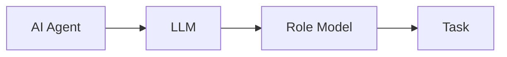
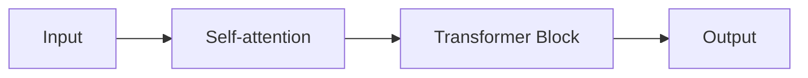
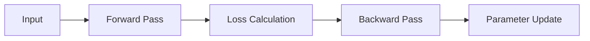

                 


# LLM驱动的AI Agent角色扮演能力增强

> **关键词：** 大语言模型、AI Agent、角色扮演、LLM、能力增强

> **摘要：**  
本文详细探讨了如何通过大语言模型（LLM）增强AI Agent的角色扮演能力。文章从背景与基础、LLM的原理与训练方法、AI Agent的能力模型、系统设计与架构、项目实战等多方面展开，结合数学公式、Mermaid流程图和代码示例，全面分析了如何通过LLM提升AI Agent的角色扮演能力。文章最后总结了关键技术点和未来发展方向，为读者提供了深入的技术见解和实践指南。

---

## 第一部分：引言

### 第1章：LLM驱动的AI Agent角色扮演能力增强概述

#### 1.1 问题背景与目标
AI Agent（智能体）是一种能够感知环境并采取行动以实现目标的智能系统。随着大语言模型（LLM）的快速发展，AI Agent的能力得到了显著提升，尤其是在语言理解和生成方面。然而，AI Agent在角色扮演任务中的表现仍有改进空间。角色扮演要求AI Agent能够准确理解并模仿特定角色的行为、语言风格和决策模式，这需要对LLM进行针对性的训练和优化。

#### 1.2 核心概念与联系
- **LLM与AI Agent的关系**：LLM为AI Agent提供了强大的语言理解和生成能力，而AI Agent则为LLM提供了一个动态的交互环境，使其能够在实际任务中应用。
- **角色扮演能力的定义与特征**：角色扮演能力是指AI Agent在特定场景中，能够根据任务需求，动态调整其行为、语言风格和决策模式的能力。
- **ER实体关系图架构（Mermaid流程图）**



---

## 第二部分：LLM与AI Agent的核心原理

### 第2章：LLM的原理与训练方法

#### 2.1 LLM的基本原理
- **定义与特点**：LLM是一种基于Transformer架构的大语言模型，具有强大的语言理解和生成能力。
- **LLM的训练目标与损失函数**：通过最大化生成的概率来优化模型，损失函数为：
  $$\text{Loss} = -\sum_{i=1}^{n} \log p(x_i)$$
- **生成机制**：基于自注意力机制，生成过程如图所示：



#### 2.2 LLM的训练与优化
- **基于Transformer的架构**：采用多层Transformer结构，每层包括自注意力机制和前馈网络。
- **注意力机制的数学模型**：$$\text{Attention}(Q,K,V) = \text{softmax}\left(\frac{QK^T}{\sqrt{d_k}}\right)V$$
- **梯度下降与优化算法**：使用Adam优化器进行训练，优化过程如图所示：



---

## 第三部分：AI Agent的能力模型

### 第3章：AI Agent的能力结构

#### 3.1 AI Agent的核心能力
- **知识表示与推理能力**：AI Agent需要能够理解和推理输入的信息，并生成合理的输出。
- **语言生成与对话能力**：基于LLM的生成能力，AI Agent可以进行自然语言对话。
- **角色扮演的实现路径**：通过LLM的微调和特定任务的训练，增强角色扮演能力。

#### 3.2 LLM对AI Agent能力的增强
- **知识表示的增强**：通过LLM的上下文理解和生成能力，提升知识表示的准确性。
- **对话生成的优化**：基于LLM的生成机制，优化对话的流畅性和自然性。
- **角色扮演的提升方法**：通过任务特定的微调和prompt设计，增强角色扮演的能力。

---

## 第四部分：系统设计与架构

### 第4章：系统分析与架构设计

#### 4.1 问题场景介绍
- **应用场景**：AI Agent在客服、教育、娱乐等多个领域的角色扮演任务中应用。
- **系统目标**：通过LLM增强AI Agent的角色扮演能力，使其能够更准确地模仿特定角色的行为和语言风格。
- **需求分析**：系统需要支持多种角色的切换，具备动态调整的能力，并能够实时与用户交互。

#### 4.2 系统功能设计
- **领域模型设计**：基于角色的特征和任务需求，设计相应的领域模型。
  ```mermaid
  graph LR
      A[User] --> B[AI Agent]
      B --> C[LLM]
      C --> D[Role Model]
  ```
- **系统架构设计**：采用分层架构，包括用户交互层、AI Agent层和LLM层。
  ```mermaid
  graph LR
      A[User] --> B[AI Agent]
      B --> C[LLM]
      C --> D[Database]
  ```
- **系统接口设计**：定义清晰的API接口，支持角色切换和任务动态调整。

#### 4.3 系统交互设计
- **交互流程**：用户与AI Agent交互，AI Agent通过LLM生成响应。
  ```mermaid
  graph LR
      A[User] --> B[AI Agent]
      B --> C[LLM]
      C --> D[Response]
      D --> A[User]
  ```
- **用户与AI Agent的交互**：通过自然语言对话，用户指导AI Agent完成任务。

---

## 第五部分：项目实战

### 第5章：项目实现与分析

#### 5.1 环境安装
- **Python版本**：Python 3.8+
- **依赖库安装**：使用pip安装必要的库，如transformers、mermaid等。

#### 5.2 核心代码实现
- **LLM加载与初始化**：使用Hugging Face的预训练模型。
  ```python
  from transformers import AutoTokenizer, AutoModelForCausalLM
  model_name = "gpt2-large"
  tokenizer = AutoTokenizer.from_pretrained(model_name)
  model = AutoModelForCausalLM.from_pretrained(model_name)
  ```
- **角色扮演任务的实现**：
  ```python
  def role_play(user_input, role):
      inputs = tokenizer(user_input, return_tensors="pt")
      outputs = model.generate(**inputs, max_length=50)
      response = tokenizer.decode(outputs[0], skip_special_tokens=True)
      return response
  ```

#### 5.3 实际案例分析
- **案例1**：客服场景下的角色扮演。
  ```python
  user_input = "Help me with my order."
  role = "Customer Service Representative"
  response = role_play(user_input, role)
  print(response)  # "Sure, please provide your order number."
  ```
- **案例2**：教育场景下的角色扮演。
  ```python
  user_input = "Explain quantum mechanics to me."
  role = "Tutor"
  response = role_play(user_input, role)
  print(response)  # "Quantum mechanics is the study of particles at a very small scale..."
  ```

---

## 第六部分：总结与展望

### 第6章：总结与展望

#### 6.1 核心技术点总结
- **LLM的原理与应用**：通过LLM的强大能力，显著提升AI Agent的角色扮演能力。
- **系统设计与优化**：通过合理的系统架构设计，确保系统的高效性和可扩展性。
- **项目实现与分析**：通过具体案例分析，验证技术方案的有效性和可行性。

#### 6.2 未来发展方向
- **多模态AI Agent**：结合视觉、听觉等多种模态信息，进一步提升角色扮演的沉浸感。
- **动态角色切换**：实现动态角色切换，支持更多样化的任务需求。
- **个性化角色定制**：根据用户的个性化需求，定制专属的角色模型。

#### 6.3 最佳实践 tips
- **模型选择**：根据具体任务需求，选择合适的LLM模型。
- **数据处理**：确保训练数据的质量和多样性，避免模型偏见。
- **系统优化**：通过合理的架构设计和优化，提升系统的性能和稳定性。

---

通过本文的详细分析和技术实现，我们可以看到，LLM驱动的AI Agent角色扮演能力增强是一个充满潜力的领域。未来，随着技术的不断发展，AI Agent的角色扮演能力将更加智能化和个性化，为人类社会带来更多的便利和创新。

