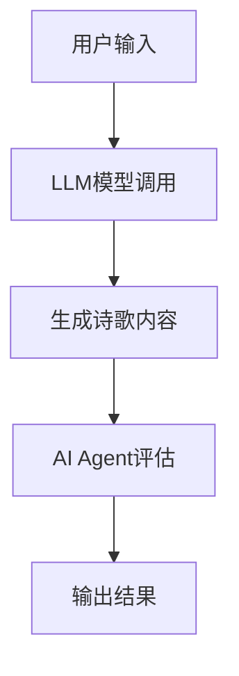
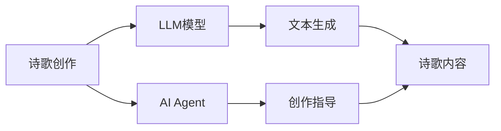
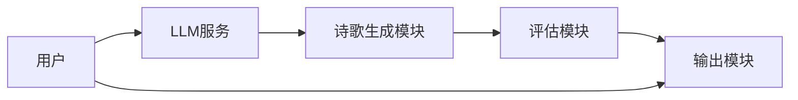
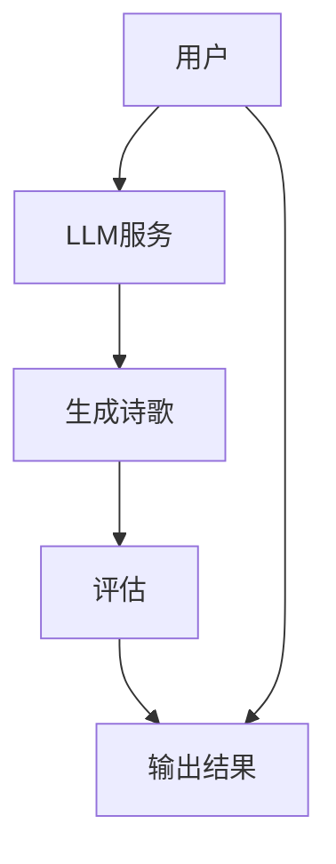

                 


# LLM驱动的AI Agent诗歌创作与鉴赏

## 关键词：LLM, AI Agent, 诗歌创作, 诗歌鉴赏, 自然语言处理, 深度学习

## 摘要：
随着大语言模型（LLM）和人工智能（AI）技术的快速发展，AI在诗歌创作与鉴赏领域的应用逐渐成为研究热点。本文系统探讨了如何利用LLM驱动AI Agent进行诗歌创作与鉴赏。通过分析核心概念、算法原理、系统架构，并结合实际项目案例，本文为读者提供了从理论到实践的全面指导。文章首先介绍了问题背景与核心概念，随后深入分析了LLM与AI Agent的核心原理及其在诗歌创作中的应用，最后通过系统架构设计、项目实战和最佳实践，帮助读者掌握LLM驱动的AI Agent在诗歌创作与鉴赏中的实际应用方法。

---

# 第一部分: LLM驱动的AI Agent诗歌创作与鉴赏背景介绍

## 第1章: 问题背景与核心概念

### 1.1 问题背景
#### 1.1.1 从传统诗歌创作到AI驱动的演变
传统诗歌创作依赖于人类的灵感和语言能力，而现代技术的发展使得AI能够辅助甚至独立完成诗歌创作。从诗歌创作的角度来看，AI的介入不仅提高了创作效率，还为诗歌注入了新的表达方式。

#### 1.1.2 当前诗歌创作中的技术挑战
尽管AI技术在文本生成方面取得了显著进展，但诗歌创作的复杂性仍然带来诸多挑战。例如，诗歌需要情感表达、语言韵律和意象构建，这些都需要模型具备高度的语义理解和创造力。

#### 1.1.3 LLM与AI Agent的结合潜力
LLM（Large Language Model）具有强大的文本生成能力，而AI Agent（智能体）能够通过与用户的交互提供个性化的创作支持。两者的结合为诗歌创作与鉴赏提供了更广阔的可能性。

### 1.2 问题描述
#### 1.2.1 传统诗歌创作的局限性
传统诗歌创作依赖于创作者的个人经验和灵感，创作过程较为孤立，且难以快速生成多样化的内容。

#### 1.2.2 现代技术对诗歌创作的赋能
通过LLM和AI Agent，诗歌创作可以实现自动化、个性化和高效化。例如，AI可以辅助创作者快速生成诗歌灵感，或者根据用户需求定制诗歌内容。

#### 1.2.3 LLM驱动AI Agent的核心问题
LLM驱动的AI Agent在诗歌创作中的核心问题是如何理解和模拟人类的情感、语言韵律以及诗歌的结构特点。

### 1.3 问题解决与边界
#### 1.3.1 LLM在诗歌创作中的应用价值
LLM能够生成高质量的诗歌文本，同时通过参数调优可以实现不同风格的诗歌创作。

#### 1.3.2 AI Agent在诗歌创作中的角色定位
AI Agent作为用户的助手，能够通过交互式对话提供创作建议、生成诗歌文本，并对诗歌进行初步的评估与优化。

#### 1.3.3 技术实现的边界与外延
技术实现的边界在于模型的生成能力，而外延则涉及诗歌的传播、教育和文化影响。

### 1.4 核心概念与结构
#### 1.4.1 LLM驱动AI Agent的系统构成
系统构成包括LLM模型、AI Agent交互界面、诗歌生成模块和诗歌评估模块。

#### 1.4.2 诗歌创作与鉴赏的关键要素
关键要素包括诗歌主题、语言风格、韵律结构和情感表达。

#### 1.4.3 系统功能与流程图（Mermaid）


---

# 第二部分: LLM与AI Agent的核心概念与联系

## 第2章: 核心概念原理

### 2.1 LLM的工作原理
#### 2.1.1 大语言模型的基本原理
LLM基于大量的训练数据，通过深度学习算法（如Transformer）生成与训练数据分布一致的文本。

#### 2.1.2 模型的训练与推理机制
模型通过监督学习进行预训练，然后通过微调（fine-tuning）针对特定任务进行优化。

#### 2.1.3 模型的文本生成能力
文本生成基于概率预测，模型通过解码过程生成连续的文本序列。

### 2.2 AI Agent的功能解析
#### 2.2.1 AI Agent的基本概念
AI Agent是一种智能实体，能够感知环境、理解用户需求，并通过执行动作来实现目标。

#### 2.2.2 Agent的核心功能与应用场景
核心功能包括感知、推理、决策和执行。应用场景包括对话交互、任务执行和内容生成。

#### 2.2.3 LLM驱动Agent的优势
LLM驱动的Agent能够实现自然语言理解与生成，具备强大的文本处理能力。

### 2.3 核心概念对比分析
#### 2.3.1 LLM与传统NLP模型的对比
LLM在模型规模、训练数据和生成能力上具有显著优势。

#### 2.3.2 AI Agent与传统自动化系统的对比
AI Agent具有更强的自主性和适应性，能够与人类进行自然交互。

#### 2.3.3 诗歌创作中的概念对比表
| 对比维度 | LLM | AI Agent |
|----------|------|-----------|
| 核心功能 | 文本生成 | 交互与决策 |
| 应用场景 | 内容生成 | 个性化服务 |
| 技术优势 | 高精度生成 | 自适应交互 |

### 2.4 实体关系图（ER图）


---

# 第三部分: 算法原理与数学模型

## 第3章: LLM驱动AI Agent的算法原理

### 3.1 算法流程图


### 3.2 算法实现代码
```python
def llm_generate_poetry(input_prompt):
    # 调用LLM API生成诗歌
    response = llm_api.generate(input_prompt)
    return response['choices'][0]['message']['content']

def ai_agent_interface():
    while True:
        user_input = input("请输入您的需求：")
        if user_input == '退出':
            break
        generated_poetry = llm_generate_poetry(user_input)
        print("生成的诗歌：")
        print(generated_poetry)
```

### 3.3 算法数学模型
LLM的核心算法基于Transformer模型，其数学公式如下：
$$
\text{Attention}(Q, K, V) = \text{softmax}\left(\frac{QK^T}{\sqrt{d_k}}\right)V
$$
其中，$Q$、$K$、$V$分别是查询、键和值向量，$d_k$是向量的维度。

---

# 第四部分: 系统分析与架构设计

## 第4章: 系统架构设计

### 4.1 问题场景介绍
系统旨在通过LLM驱动AI Agent，为用户提供个性化的诗歌创作与鉴赏服务。

### 4.2 系统功能设计
系统功能包括用户交互、诗歌生成、诗歌评估和结果输出。

### 4.3 系统架构图（Mermaid）


### 4.4 系统接口设计
主要接口包括用户输入接口、LLM API调用接口和结果输出接口。

### 4.5 系统交互流程图（Mermaid）


---

# 第五部分: 项目实战

## 第5章: 项目实战

### 5.1 环境安装
安装必要的Python库，如`transformers`和`openai`。

### 5.2 系统核心实现源代码
```python
from transformers import AutoTokenizer, AutoModelForCausalLM
import openai

tokenizer = AutoTokenizer.from_pretrained('gpt2')
model = AutoModelForCausalLM.from_pretrained('gpt2')

def generate_poetry(prompt):
    inputs = tokenizer(prompt, return_tensors='np')
    outputs = model.generate(**inputs, max_length=50)
    poem = tokenizer.decode(outputs[0], skip_special_tokens=True)
    return poem

def ai_agent():
    while True:
        prompt = input("请输入诗歌主题或灵感：")
        if prompt == '退出':
            break
        poem = generate_poetry(prompt)
        print("\n生成的诗歌：")
        print(poem)

if __name__ == "__main__":
    ai_agent()
```

### 5.3 代码应用解读与分析
代码实现了基于GPT-2模型的诗歌生成功能，用户可以通过输入主题生成诗歌内容。

### 5.4 实际案例分析
通过实际运行代码，用户可以生成不同风格的诗歌，展示LLM驱动AI Agent的实际应用效果。

### 5.5 项目总结
本项目展示了如何利用LLM驱动AI Agent进行诗歌创作，为后续研究提供了参考。

---

# 第六部分: 最佳实践

## 第6章: 最佳实践

### 6.1 小结
通过本文的介绍，读者可以系统地了解LLM驱动AI Agent在诗歌创作与鉴赏中的应用。

### 6.2 注意事项
在实际应用中，需要注意模型的训练数据质量和生成结果的评估。

### 6.3 拓展阅读
推荐阅读相关领域的最新论文和技术文档，深入理解LLM和AI Agent的核心技术。

---

# 结语
LLM驱动的AI Agent为诗歌创作与鉴赏带来了新的可能性，未来的研究可以进一步探索情感计算和艺术表达的结合，推动AI在文学领域的应用。

