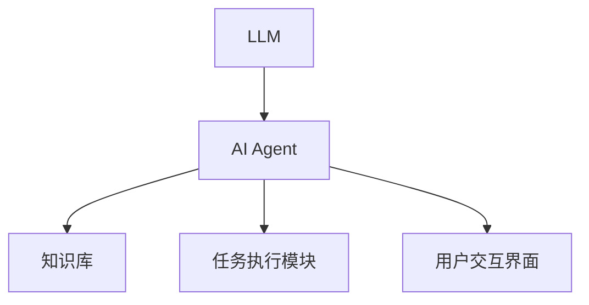
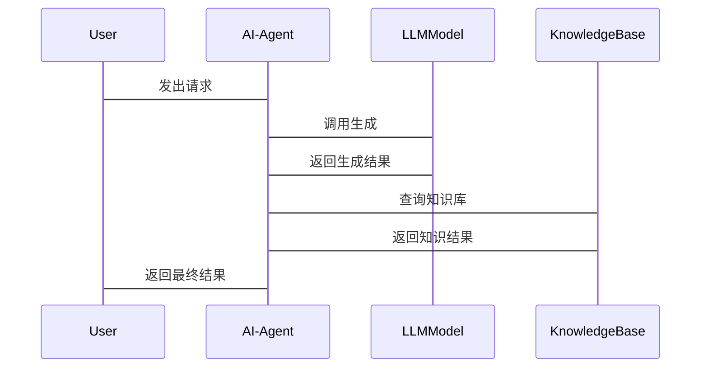

                 


# LLM驱动的AI Agent跨学科知识整合器

## 关键词：大语言模型（LLM）、人工智能（AI）、智能体（Agent）、跨学科知识整合、技术实现

## 摘要：
本文探讨了如何利用大语言模型（LLM）构建跨学科知识整合器，即LLM驱动的AI Agent。通过分析核心概念、算法原理、系统架构，并结合实际案例，展示LLM在AI Agent中的应用及其跨学科整合的能力。本文旨在为技术开发者和研究人员提供深度的技术见解和实践指导。

---

## 第一部分：背景介绍

### 第1章：LLM与AI Agent概述

#### 1.1 LLM驱动的AI Agent的背景与意义
- **背景**：随着AI技术的发展，大语言模型（LLM）如GPT-4在自然语言处理（NLP）领域取得突破，AI Agent作为智能体在自动化和决策支持系统中的应用日益广泛。
- **意义**：LLM驱动的AI Agent能够整合跨学科知识，提升智能体的决策能力和知识处理效率，适用于教育、医疗、金融等多个领域。

#### 1.2 跨学科知识整合的必要性
- **定义**：跨学科知识整合是指将不同学科的知识融合，以解决复杂问题。
- **挑战**：知识分散、术语差异、模型兼容性等问题增加了整合难度。
- **LLM的作用**：LLM作为强大的知识处理工具，能够理解和整合多学科信息，为AI Agent提供支持。

#### 1.3 本书的核心目标与结构
- **目标**：系统介绍LLM驱动的AI Agent的设计与实现，探讨其跨学科应用。
- **结构**：涵盖背景、核心概念、算法、架构、实战和总结，帮助读者从理论到实践全面掌握。

---

## 第二部分：核心概念与联系

### 第2章：LLM与AI Agent的核心概念

#### 2.1 大语言模型（LLM）的原理与特性
- **原理**：基于Transformer架构，通过大量数据训练，具备上下文理解和生成能力。
- **特性**：
  - 高效的自然语言处理能力
  - 多任务学习能力
  - 可解释性挑战

#### 2.2 AI Agent的定义与功能模块
- **定义**：AI Agent是具有感知、决策、执行能力的智能实体。
- **功能模块**：
  - 感知模块：接收输入信息
  - 决策模块：基于知识库做出决策
  - 执行模块：执行任务

#### 2.3 LLM驱动AI Agent的核心机制
- **知识库**：LLM作为知识库，提供跨学科的信息支持。
- **决策支持**：LLM辅助决策模块进行分析和推理。
- **交互方式**：自然语言交互，提升用户体验。

#### 2.4 核心概念对比
- **LLM与AI Agent对比**：
  | 特性 | LLM | AI Agent |
  |------|------|----------|
  | 功能 | 文本生成 | 任务执行 |
  | 输入 | 文本 | 多种数据 |
  | 输出 | 文本 | 行为 |

- **ER实体关系图**：


---

## 第三部分：算法原理讲解

### 第3章：大语言模型的训练与优化

#### 3.1 大语言模型的训练流程
- **数据预处理**：清洗和格式化数据。
- **模型选择**：选择适合任务的模型结构，如GPT-4。
- **训练优化**：使用Adam优化器，调整学习率和批量大小。

#### 3.2 大语言模型的数学模型
- **变量定义**：
  - $x$: 输入文本
  - $y$: 输出文本
  - $θ$: 模型参数
- **损失函数**：交叉熵损失
  $$ L = -\sum_{i=1}^{n} \log p(y_i|x_i, θ) $$
- **优化目标**：最小化损失函数，使用梯度下降：
  $$ θ = θ - \eta \frac{\partial L}{\partial θ} $$

#### 3.3 实现代码示例
```python
import torch
import torch.nn as nn
import torch.optim as optim

class LLMModel(nn.Module):
    def __init__(self, vocab_size):
        super(LLMModel, self).__init__()
        self.embedding = nn.Embedding(vocab_size, 512)
        self.lstm = nn.LSTM(512, 512, 2)
        self.fc = nn.Linear(512, vocab_size)
    
    def forward(self, x):
        embed = self.embedding(x)
        output, _ = self.lstm(embed)
        output = self.fc(output)
        return output

# 初始化模型和优化器
model = LLMModel(vocab_size)
optimizer = optim.Adam(model.parameters(), lr=0.001)
criterion = nn.CrossEntropyLoss()

# 训练循环
for epoch in range(num_epochs):
    for batch in batches:
        outputs = model(batch['input'])
        loss = criterion(outputs, batch['target'])
        optimizer.zero_grad()
        loss.backward()
        optimizer.step()
```

---

## 第四部分：系统分析与架构设计

### 第4章：LLM驱动的AI Agent系统架构

#### 4.1 项目介绍
- **目标**：构建一个能够处理跨学科任务的AI Agent。
- **范围**：涵盖数据处理、知识整合、任务执行等功能。

#### 4.2 系统功能设计
- **领域模型**：
  ```mermaid
  classDiagram
      class LLMModel {
          generate(text): string
      }
      class KnowledgeBase {
          query(question): string
      }
      class AI-Agent {
          <|- LLMModel
          <|- KnowledgeBase
          + executeTask(task): void
      }
  ```

#### 4.3 系统架构设计


#### 4.4 系统接口设计
- **输入接口**：用户输入指令。
- **输出接口**：执行结果输出。

#### 4.5 交互流程


---

## 第五部分：项目实战

### 第5章：LLM驱动的AI Agent实现

#### 5.1 环境安装
- **工具**：Python、PyTorch、Hugging Face库。
- **安装命令**：
  ```bash
  pip install torch transformers
  ```

#### 5.2 核心代码实现
```python
from transformers import GPT2LMHeadModel, GPT2Tokenizer

class AI-Agent:
    def __init__(self):
        self.tokenizer = GPT2Tokenizer.from_pretrained('gpt2')
        self.model = GPT2LMHeadModel.from_pretrained('gpt2')
    
    def process_request(self, input_text):
        inputs = self.tokenizer(input_text, return_tensors='pt')
        outputs = self.model.generate(inputs.input_ids, max_length=50)
        return self.tokenizer.decode(outputs[0], skip_special_tokens=True)
```

#### 5.3 代码解读与分析
- **初始化**：加载预训练模型和分词器。
- **处理请求**：将输入文本编码，生成响应，解码输出。

#### 5.4 实际案例分析
- **案例**：医疗咨询。
- **流程**：用户输入症状，AI Agent调用LLM生成可能的疾病，并查询知识库确认，返回结果。

#### 5.5 项目小结
- **总结**：实现了LLM驱动的AI Agent，具备跨学科知识整合能力。

---

## 第六部分：总结与展望

### 第6章：总结与未来展望

#### 6.1 核心内容回顾
- LLM驱动AI Agent的基本概念。
- 跨学科知识整合的关键技术。

#### 6.2 最佳实践Tips
- 数据质量至关重要。
- 模型调优提升性能。

#### 6.3 未来展望
- 更强的跨学科整合能力。
- 更自然的用户交互。

---

通过以上结构，文章详细介绍了LLM驱动的AI Agent的各个方面，从理论到实践，为读者提供了全面的技术指导。

