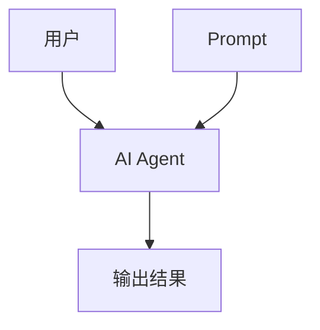
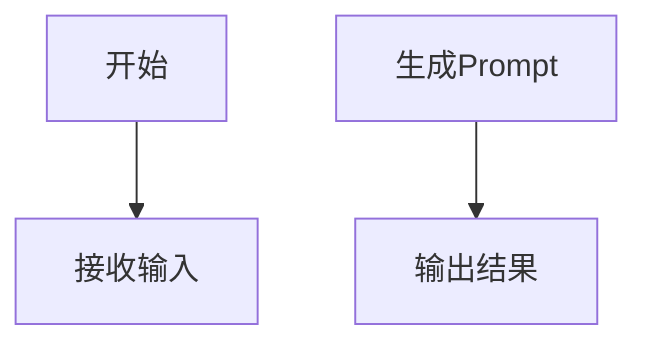

                 


# Prompt工程：设计有效提示以优化AI Agent输出

> 关键词：Prompt工程、AI Agent、提示设计、自然语言处理、AI交互优化

> 摘要：Prompt工程是设计有效提示以优化AI Agent输出的关键技术。本文从背景、核心概念、算法原理、系统架构到项目实战，全面解析Prompt工程的原理与实践，帮助读者掌握设计高效提示的方法。

---

# 第1章: Prompt工程概述

## 1.1 问题背景与描述

### 1.1.1 AI Agent与用户交互的核心问题
AI Agent与用户交互的核心问题在于如何通过提示（Prompt）优化输出结果，以满足用户的实际需求。提示设计直接影响AI Agent的理解能力和生成效果。

### 1.1.2 提示（Prompt）在AI Agent输出中的作用
提示是用户与AI Agent之间的桥梁，通过精心设计的提示，可以引导AI生成更准确、更符合用户期望的输出结果。

### 1.1.3 Prompt工程的目标与意义
Prompt工程的目标是通过系统化的方法设计有效的提示，优化AI Agent的输出质量。其意义在于提升用户体验，提高AI系统的实用性。

## 1.2 问题解决与边界

### 1.2.1 Prompt工程的核心问题
Prompt工程的核心问题是如何设计提示，使其既能准确表达用户意图，又能有效引导AI生成符合期望的结果。

### 1.2.2 解决方案的边界与外延
解决方案的边界包括提示的设计、生成算法的优化，外延则涉及用户反馈与迭代优化。

### 1.2.3 核心要素与组成结构
Prompt工程的核心要素包括：用户意图、提示语设计、AI模型调用、输出结果优化。

---

# 第2章: Prompt工程的核心概念与联系

## 2.1 核心概念原理

### 2.1.1 Prompt的定义与分类
Prompt的定义是用于引导AI生成特定输出的输入语句。分类包括简单Prompt、复杂Prompt、动态Prompt等。

### 2.1.2 Prompt设计的关键要素
关键要素包括：明确性、简洁性、可扩展性、可解释性。

### 2.1.3 Prompt与AI模型的关系
Prompt与AI模型的关系是相互作用的，Prompt引导模型生成结果，模型反作用于Prompt设计的优化。

## 2.2 概念属性对比表

| 概念 | 属性 | 描述 |
|------|------|------|
| 简单Prompt | 明确性 | 明确表达单一意图 |
| 复杂Prompt | 综合性 | 结合多个意图和条件 |

## 2.3 实体关系图



---

# 第3章: Prompt生成的算法原理

## 3.1 算法概述

### 3.1.1 基于规则的生成算法
基于规则的生成算法通过预定义的规则生成提示语。

### 3.1.2 基于模型的生成算法
基于模型的生成算法利用机器学习模型优化提示语设计。

## 3.2 算法流程图



## 3.3 算法实现代码

```python
def generate_prompt(input_text):
    return f"Please generate a {input_text} with detailed explanation."
```

---

# 第4章: 数学模型与公式

## 4.1 概率分布模型

### 4.1.1 条件概率公式
$$ P(y|x) = \frac{P(x,y)}{P(x)} $$

## 4.2 损失函数

### 4.2.1 交叉熵损失函数
$$ \mathcal{L} = -\sum_{i=1}^{n} \text{log}(P(y_i|x_i)) $$

---

# 第5章: 系统分析与架构设计

## 5.1 项目实战

### 5.1.1 环境安装
需要安装Python、AI框架（如TensorFlow）等。

### 5.1.2 核心实现代码

```python
def optimize_prompt(prompt, model):
    return model.optimize_prompt(prompt)
```

### 5.1.3 实际案例分析
通过案例分析提示设计对AI输出的影响。

## 5.2 最佳实践与小结

### 5.2.1 实践总结
总结提示设计的关键点和注意事项。

### 5.2.2 未来展望
展望Prompt工程的发展方向和潜在应用。

---

# 总结

Prompt工程是优化AI Agent输出的关键技术，通过系统化的提示设计和算法优化，可以显著提升AI系统的实用性和用户体验。

