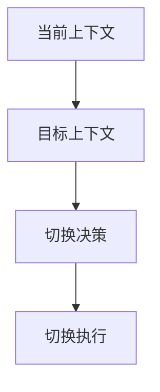
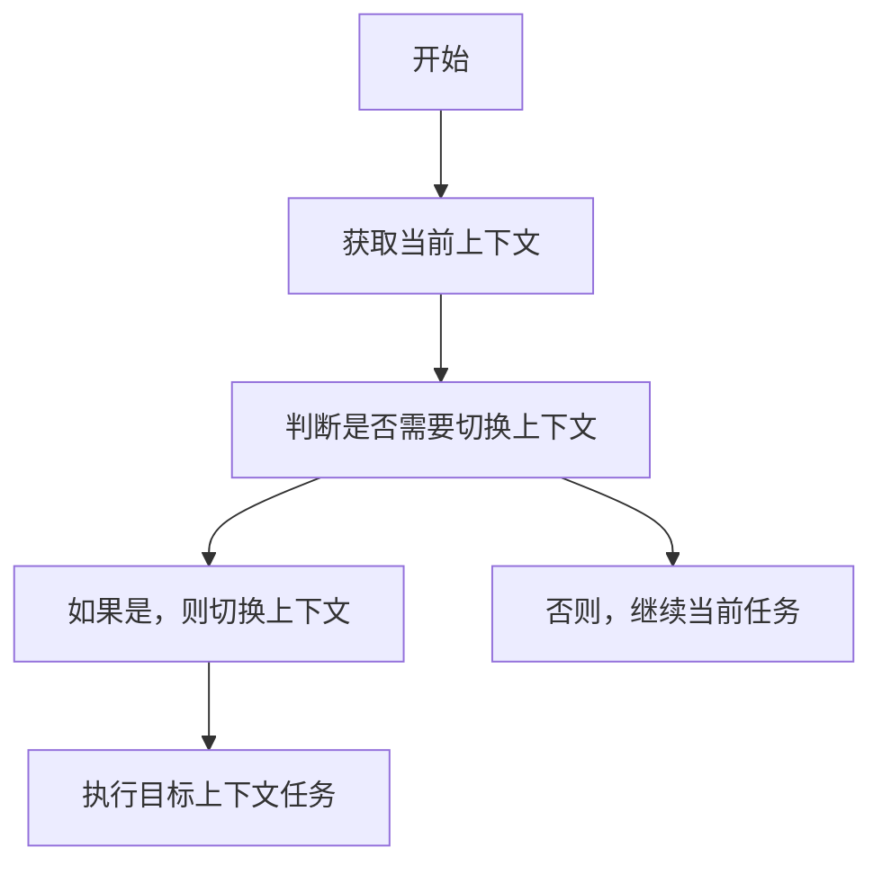
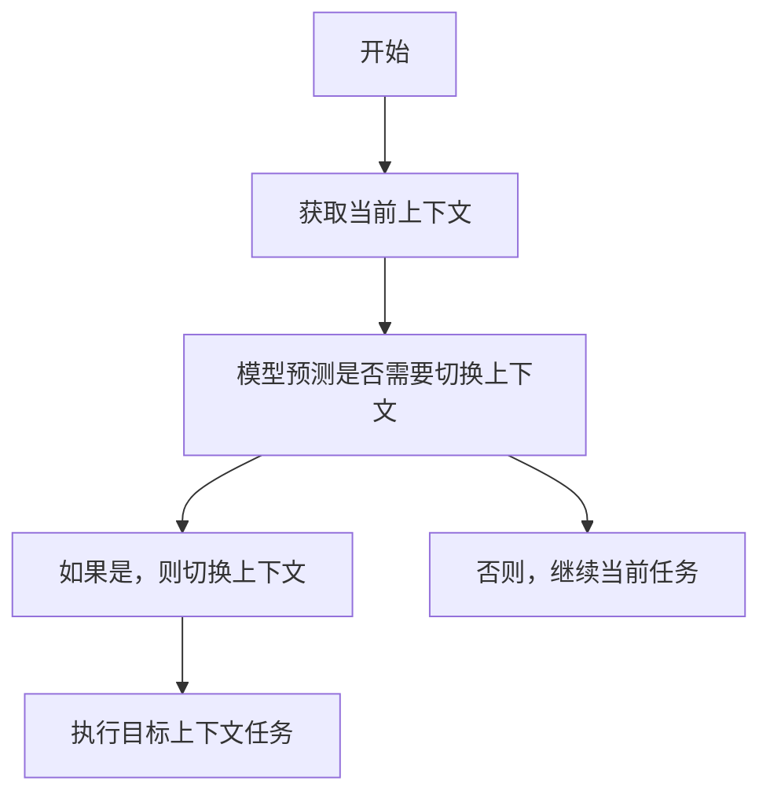
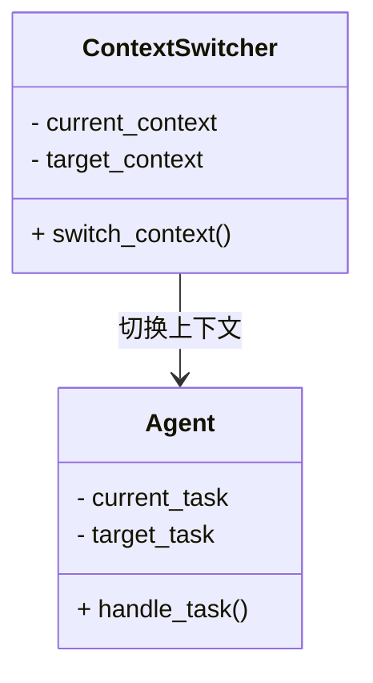
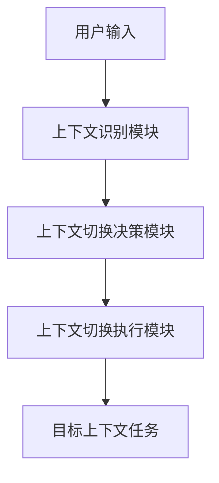

                 


# 上下文切换：让AI Agent更灵活地处理复杂场景

## 关键词：上下文切换, AI Agent, 灵活性, 复杂场景, 算法原理, 系统设计, 项目实战

## 摘要：  
上下文切换是AI Agent在处理复杂场景时的关键能力，它使AI Agent能够在不同的任务和环境中灵活切换，从而更高效地解决问题。本文将从上下文切换的核心概念、算法原理、系统设计到项目实战，全面分析如何通过上下文切换提升AI Agent的灵活性，帮助读者理解并掌握这一技术。

---

## 第一部分：上下文切换的背景与概念

### 第1章：上下文切换的背景与问题背景

#### 1.1 上下文切换的核心概念

上下文切换是指在不同的任务、场景或环境中，AI Agent能够快速调整其行为、目标或关注点的能力。这种能力使得AI Agent能够在复杂多变的环境中灵活应对各种任务，从而提高其整体性能和效率。

**1.1.1 上下文切换的定义与核心概念**  
上下文切换（Context Switching）是指AI Agent在执行任务时，根据当前环境的变化或任务需求的转变，动态调整其上下文信息，以适应新的任务或场景的过程。这里的“上下文”指的是与当前任务相关的所有信息，包括任务目标、环境状态、数据输入等。上下文切换的核心在于快速识别上下文的变化，并根据新的上下文信息重新配置AI Agent的行为。

**1.1.2 上下文切换的问题背景**  
在实际应用中，AI Agent往往需要处理的任务是多样且复杂的。例如，在智能客服系统中，AI Agent可能需要在处理客户咨询的同时，动态调整其对话策略以应对客户情绪的变化。如果没有有效的上下文切换机制，AI Agent可能会因为无法快速适应变化而导致效率低下或错误决策。

**1.1.3 上下文切换的必要性与应用场景**  
上下文切换的必要性主要体现在以下几点：  
1. **任务多样性**：AI Agent需要在不同任务之间快速切换，例如从问题解决切换到信息查询。  
2. **环境动态性**：环境的变化（如数据更新、用户需求变化）要求AI Agent能够快速调整其行为。  
3. **资源优化**：通过上下文切换，AI Agent可以更高效地分配资源，避免重复计算和资源浪费。  

**1.1.4 上下文切换的边界与外延**  
上下文切换的边界主要在于AI Agent能够处理的上下文范围。外延则包括与上下文切换相关的技术，如动态规划、多任务学习等。

**1.1.5 上下文切换的概念结构与核心要素组成**  
上下文切换的概念结构可以分解为以下核心要素：  
- **当前上下文**：AI Agent当前处理的任务或场景的上下文信息。  
- **目标上下文**：AI Agent需要切换到的目标任务或场景的上下文信息。  
- **切换机制**：实现上下文切换的具体方法，如基于规则的切换或基于学习的切换。  

---

### 第2章：上下文切换的核心概念与原理

#### 2.1 上下文切换的原理

**2.1.1 上下文切换的基本原理**  
上下文切换的核心在于快速识别上下文的变化，并根据新的上下文信息重新配置AI Agent的行为。这一过程通常包括以下步骤：  
1. **上下文识别**：AI Agent感知当前上下文的变化。  
2. **上下文切换决策**：基于当前上下文和目标上下文，决定是否需要切换上下文。  
3. **上下文切换执行**：根据决策结果，调整AI Agent的行为或资源配置。  

**2.1.2 上下文切换的关键步骤**  
1. **上下文识别**：通过传感器、输入数据或环境反馈，AI Agent获取当前上下文信息。  
2. **上下文切换决策**：基于预设规则或学习模型，AI Agent决定是否需要切换上下文。  
3. **上下文切换执行**：调整AI Agent的行为、目标或资源分配以适应新的上下文。  

**2.1.3 上下文切换的实现机制**  
上下文切换的实现机制包括基于规则的切换和基于学习的切换。  
- **基于规则的切换**：根据预设的规则和条件，AI Agent自动触发上下文切换。  
- **基于学习的切换**：通过机器学习模型，AI Agent能够根据历史数据和经验，动态调整上下文切换策略。  

---

#### 2.2 上下文切换的核心概念对比

**2.2.1 上下文切换与其他相关概念的对比（表格形式）**

| 概念         | 定义                                                                 | 特点                                                                 |
|--------------|----------------------------------------------------------------------|----------------------------------------------------------------------|
| 上下文切换   | AI Agent在不同任务或场景间快速调整行为的能力                                   | 快速性、动态性、适应性                                             |
| 多任务学习   | 同一模型在多个任务之间切换的能力                                               | 并行性、共享性、模型复用                                           |
| 动态规划     | 在动态环境中优化决策问题的方法                                                 | 状态转移、最优子结构性质                                           |
| 分布式计算   | 多个计算节点协作完成任务的技术                                                 | 并行性、资源分配、负载均衡                                         |

**2.2.2 上下文切换的ER实体关系图（Mermaid流程图）**  



---

## 第二部分：上下文切换的算法原理与实现

### 第3章：上下文切换的算法原理

#### 3.1 基于规则的上下文切换算法

**3.1.1 算法原理与流程（Mermaid流程图）**  



**3.1.2 算法实现的Python代码示例**  

```python
def context_switch(current_context, target_context):
    # 获取当前上下文
    current_context = current_context
    # 判断是否需要切换
    if current_context != target_context:
        # 切换上下文
        current_context = target_context
        print(f"切换到目标上下文：{current_context}")
    return current_context
```

**3.1.3 算法的数学模型与公式（Latex格式）**  

切换条件判断公式：  
$$ \text{切换} = \begin{cases} 
1 & \text{如果 } current\_context \neq target\_context \\
0 & \text{否则}
\end{cases} $$  

---

#### 3.2 基于学习的上下文切换算法

**3.2.1 算法原理与流程（Mermaid流程图）**  



**3.2.2 算法实现的Python代码示例**  

```python
import numpy as np

def context_switch_model(current_context, target_context, model):
    # 预测切换概率
    probability = model.predict([current_context])
    # 判断是否需要切换
    if probability > 0.5:
        current_context = target_context
        print(f"切换到目标上下文：{current_context}")
    return current_context
```

**3.2.3 算法的数学模型与公式（Latex格式）**  

切换概率公式：  
$$ P(\text{切换}) = \sigma(w \cdot current\_context + b) $$  
其中，$\sigma$ 是sigmoid函数，$w$ 是权重，$b$ 是偏置。

---

## 第三部分：上下文切换的系统分析与架构设计

### 第4章：系统分析与架构设计方案

#### 4.1 项目背景与目标

**4.1.1 项目背景介绍**  
本项目旨在通过上下文切换技术，提升AI Agent在复杂场景下的灵活性和效率。  

**4.1.2 项目目标与范围**  
- 提供一个可扩展的上下文切换框架，支持多种任务场景的切换。  
- 实现高效的上下文识别和切换决策机制。  
- 提供直观的可视化界面，方便用户监控和管理上下文切换过程。  

---

#### 4.2 系统功能设计

**4.2.1 领域模型设计（Mermaid类图）**  



---

#### 4.3 系统架构设计

**4.3.1 系统架构设计（Mermaid架构图）**  



---

## 第四部分：上下文切换的项目实战

### 第5章：项目实战与案例分析

#### 5.1 环境安装与配置

**5.1.1 开发环境的安装步骤**  
1. 安装Python 3.8或更高版本。  
2. 安装必要的库，如numpy、scikit-learn、mermaid等。  

**5.1.2 依赖库的安装与配置**  
```bash
pip install numpy scikit-learn mermaid
```

---

#### 5.2 核心代码实现

**5.2.1 上下文切换算法的Python实现**  

```python
class ContextSwitcher:
    def __init__(self, current_context, target_context):
        self.current_context = current_context
        self.target_context = target_context

    def switch_context(self):
        if self.current_context != self.target_context:
            self.current_context = self.target_context
            print(f"切换到目标上下文：{self.current_context}")
        return self.current_context
```

---

#### 5.3 实际案例分析

**5.3.1 案例背景与需求分析**  
假设我们正在开发一个智能客服系统，AI Agent需要在处理客户咨询的同时，动态调整其对话策略以应对客户情绪的变化。  

**5.3.2 案例实现过程**  
1. 识别客户情绪变化（当前上下文：客户情绪稳定；目标上下文：客户情绪不满）。  
2. 触发上下文切换，调整对话策略。  

**5.3.3 案例结果与优化建议**  
通过上下文切换，AI Agent能够更快地响应客户情绪变化，提高客户满意度。  

---

## 第五部分：上下文切换的最佳实践与总结

### 第6章：最佳实践与总结

#### 6.1 最佳实践Tips

1. **合理设计上下文切换规则**：确保切换规则简洁且有效，避免过于复杂的条件判断。  
2. **结合学习机制**：通过机器学习模型，动态优化上下文切换策略。  
3. **实时监控与反馈**：定期监控上下文切换的效果，及时调整策略。  

---

## 总结

上下文切换是AI Agent在复杂场景下灵活应对的关键能力。通过合理的算法设计、系统架构和项目实践，我们可以显著提升AI Agent的灵活性和效率。未来，随着技术的不断发展，上下文切换将在更多领域发挥重要作用。

--- 

**注意事项：**  
- 在实际应用中，应根据具体需求选择合适的上下文切换方法。  
- 定期优化上下文切换规则和模型，以应对环境的变化。  

**拓展阅读：**  
- 《Dynamic Context Switching in AI Systems》  
- 《Multi-Task Learning and Context Switching》

