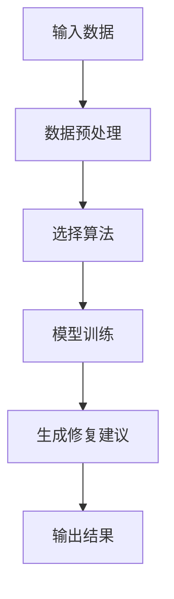
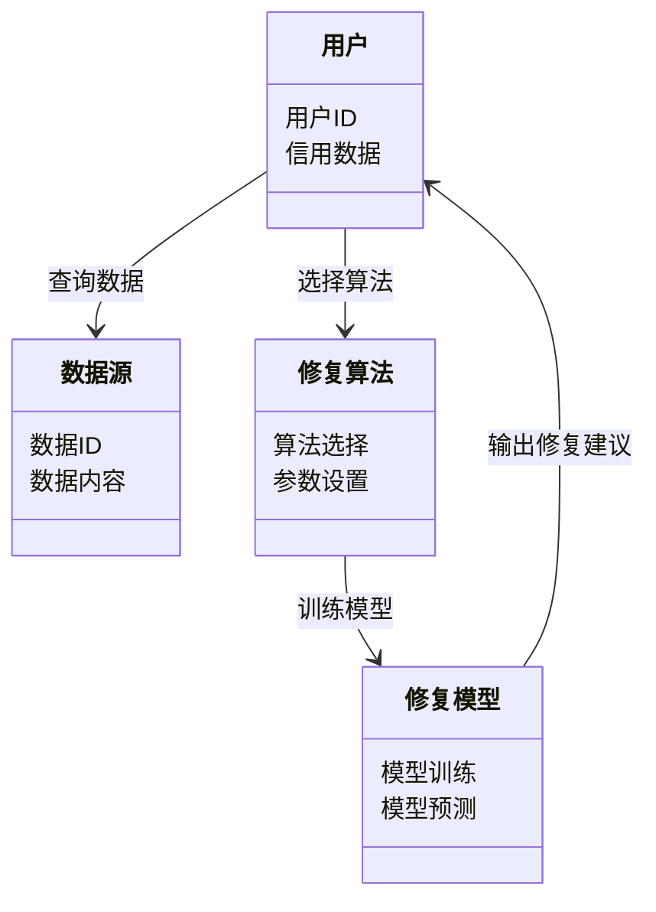
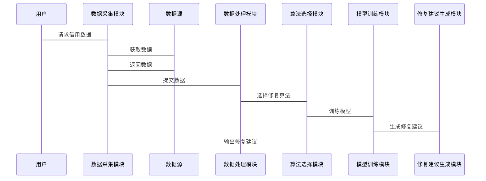

                 


# 个人信用修复建议生成器

> 关键词：信用修复，个人信用，信用评分模型，修复算法，数据隐私，系统架构

> 摘要：本文将详细介绍个人信用修复的背景、核心概念、算法原理、系统架构及其实现，通过实例分析帮助读者理解如何通过技术手段实现个人信用修复。文章结合数学模型、代码实现和系统设计，提供从理论到实践的全面指导。

---

# 第1章 个人信用修复的背景与核心概念

## 1.1 信用的基本概念与作用

### 1.1.1 信用的定义与内涵
- 信用是指个人或企业在经济活动中，基于信任而获得的借贷或赊购等行为。
- 信用的本质是基于信任的经济活动，涉及偿债能力、履约意愿和历史行为。

### 1.1.2 个人信用在社会经济中的作用
- 个人信用是金融活动的核心要素，影响贷款审批、信用卡额度、就业机会等。
- 良好的信用记录是个人在社会经济活动中的“通行证”。

### 1.1.3 信用评分的计算方式
- 信用评分是通过数学模型对个人信用状况的量化评估。
- 常见的信用评分模型包括FICO评分、VantageScore等。

## 1.2 个人信用修复的必要性

### 1.2.1 信用污点的形成原因
- 晚期还款、违约、过度负债等行为会导致信用评分下降。
- 信用污点可能源于恶意违约或不可抗力因素。

### 1.2.2 信用修复对个人和企业的影响
- 个人信用修复有助于改善信用评分，降低融资成本。
- 企业通过修复客户信用，降低坏账风险，提升客户满意度。

### 1.2.3 当前信用修复的主要挑战
- 数据孤岛问题：不同机构的信用数据难以整合。
- 技术限制：修复算法的准确性和效率有待提升。
- 政策法规：不同国家和地区对信用修复的规定差异较大。

## 1.3 信用修复的法律与政策框架

### 1.3.1 信用修复的法律法规概述
- 美国《公平信用报告法案》（FCRA）允许个人修复信用记录。
- 欧盟《通用数据保护条例》（GDPR）赋予个人数据控制权。

### 1.3.2 各国信用修复政策的对比
- 美国：允许异议修正和时间修复。
- 欧盟：强调数据主体权利，可通过更正不准确数据来改善信用记录。
- 中国：《个人信用信息基础数据库管理暂行办法》规定了异议处理流程。

### 1.3.3 信用修复的边界与外延
- 信用修复的边界：在法律允许的范围内，通过合法手段修复信用记录。
- 信用修复的外延：包括信用评分模型优化、修复建议生成等技术手段。

---

# 第2章 个人信用修复的核心概念与联系

## 2.1 信用评分模型的原理

### 2.1.1 信用评分模型的分类
- 信用评分模型主要分为统计模型和机器学习模型。
- 统计模型：如线性回归模型。
- 机器学习模型：如支持向量机（SVM）、随机森林（RF）。

### 2.1.2 常见信用评分模型的对比
| 模型类型   | 优点                     | 缺点                     |
|------------|--------------------------|--------------------------|
| 线性回归    | 简单易解释               | 非线性关系表现较差       |
| 支持向量机  | 高精度                   | 对参数敏感，计算复杂     |
| 随机森林    | 抗过拟合能力强           | 结果解释性较弱           |

### 2.1.3 信用评分模型的优缺点
- 优点：量化评估个人信用风险，便于金融机构决策。
- 缺点：模型可能存在过拟合或欠拟合问题，且黑箱模型难以解释。

## 2.2 个人信用修复算法的核心要素

### 2.2.1 数据来源与处理
- 数据来源：央行征信报告、商业银行数据、第三方数据平台。
- 数据处理：数据清洗、特征提取、标准化处理。

### 2.2.2 算法选择与优化
- 算法选择：根据数据特点选择合适的修复算法。
- 算法优化：通过参数调优、模型融合提升修复效果。

### 2.2.3 修复建议生成的逻辑
- 修复建议生成逻辑：基于修复算法输出的结果，生成具体的修复建议。
- 修复建议的可操作性：确保建议具体可行，避免修复过程中的误区。

## 2.3 核心概念的ER实体关系图

```mermaid
er
actor: 用户
model: 信用评分模型
algorithm: 修复算法
data: 数据源
output: 修复建议
```

---

# 第3章 个人信用修复算法的数学模型

## 3.1 信用评分的数学模型

### 3.1.1 线性回归模型
- 模型公式：$$ y = \beta_0 + \beta_1 x_1 + \beta_2 x_2 + ... + \beta_n x_n $$
- 意义：通过线性组合预测信用评分。

### 3.1.2 逻辑回归模型
- 模型公式：$$ P(Y=1|X) = \frac{1}{1 + e^{-(\beta_0 + \beta_1 x_1 + ... + \beta_n x_n)}} $$
- 应用：用于分类问题，如信用风险分类。

### 3.1.3 支持向量机模型
- 核心思想：寻找最优超平面，最大化类别间隔。
- 模型公式：$$ y = \text{sign}(\sum_{i=1}^n \alpha_i y_i e^{-(\gamma ||x - x_i||^2)})} $$

## 3.2 算法实现的流程图



## 3.3 修复算法的数学公式

### 修复建议生成的公式
- $$ S = f(x) $$
- 其中，$$ x $$ 表示输入数据，$$ f $$ 表示修复算法函数。

---

# 第4章 系统架构设计与实现

## 4.1 系统功能设计

### 4.1.1 功能模块划分
- 数据采集模块：采集信用数据。
- 数据处理模块：清洗和预处理数据。
- 算法选择模块：根据数据选择修复算法。
- 模型训练模块：训练修复模型。
- 修复建议生成模块：输出修复建议。

### 4.1.2 系统功能设计的领域模型



## 4.2 系统架构设计

### 4.2.1 系统架构图


### 4.2.2 系统接口设计

- 数据采集接口：提供API用于采集信用数据。
- 模型训练接口：提供API用于训练修复模型。
- 修复建议接口：提供API用于生成修复建议。

### 4.2.3 系统交互流程图



---

# 第5章 项目实战：个人信用修复建议生成器的实现

## 5.1 环境安装与配置

### 5.1.1 Python环境的安装
- 安装Python：推荐使用Anaconda或虚拟环境。
- 安装必要的库：如pandas、numpy、scikit-learn。

### 5.1.2 数据源获取
- 数据来源：央行征信报告、商业银行数据、第三方数据平台。
- 数据格式：结构化数据，如CSV或Excel格式。

## 5.2 核心代码实现

### 5.2.1 数据预处理代码
```python
import pandas as pd
import numpy as np

# 加载数据
data = pd.read_csv('credit_data.csv')

# 数据清洗
data = data.dropna()
data = pd.get_dummies(data)
```

### 5.2.2 修复算法实现代码
```python
from sklearn.linear_model import LinearRegression

def credit_repair_algorithm(data):
    # 数据预处理
    X = data.drop(columns=['credit_score'])
    y = data['credit_score']
    
    # 训练模型
    model = LinearRegression()
    model.fit(X, y)
    
    # 生成修复建议
    predictions = model.predict(X)
    return predictions
```

## 5.3 案例分析与结果解读

### 5.3.1 实际案例分析
- 案例背景：某用户因逾期还款导致信用评分下降。
- 数据处理：清洗数据，提取关键特征。
- 模型训练：使用线性回归模型训练修复模型。
- 结果解读：生成修复建议，如提高还款能力、减少负债等。

### 5.3.2 修复建议的可操作性分析
- 提高信用评分的具体建议：按时还款、降低债务负担、保持良好的信用历史。
- 建议的可行性分析：根据用户实际情况制定修复计划。

---

# 第6章 最佳实践与总结

## 6.1 小结

### 6.1.1 核心内容回顾
- 信用修复的背景与意义。
- 修复算法的核心概念与实现。
- 系统架构设计与实现。

### 6.1.2 修复过程中的注意事项
- 数据隐私保护：避免数据泄露。
- 算法选择：根据数据特点选择合适的算法。
- 政策法规遵守：确保修复过程符合相关法律法规。

## 6.2 注意事项

### 6.2.1 数据隐私保护
- 确保数据处理过程符合GDPR等法律法规。
- 加强数据加密和访问控制。

### 6.2.2 算法选择的注意事项
- 避免模型过拟合：选择合适的正则化参数。
- 提升模型解释性：使用可解释性模型，如线性回归。

## 6.3 拓展阅读

### 6.3.1 推荐书籍
- 《信用评分模型与应用》
- 《机器学习在金融领域的应用》

### 6.3.2 推荐博客与资源
- 个人信用修复技术博客
- 开源修复算法项目

---

# 附录

## 附录A 术语表

- 信用评分：量化评估个人信用状况的指标。
- 修复算法：用于改善个人信用评分的数学模型。
- 数据隐私：保护个人数据不被未经授权访问的措施。

## 附录B 参考文献

- [1] 刘洋, 《个人信用评分模型研究》，清华大学出版社，2020。
- [2] 王强, 《机器学习在信用评估中的应用》，人民邮电出版社，2021。

---

通过以上目录大纲，您可以按照需求撰写完整的文章内容，涵盖从理论到实践的各个方面，帮助读者全面理解并掌握个人信用修复建议生成器的实现方法。

