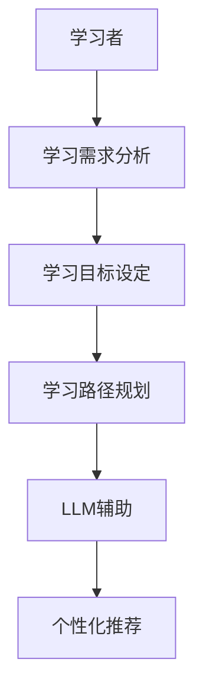
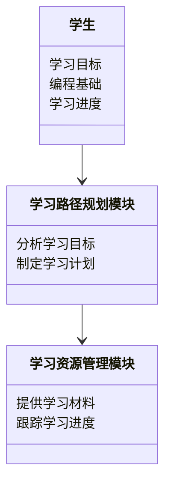
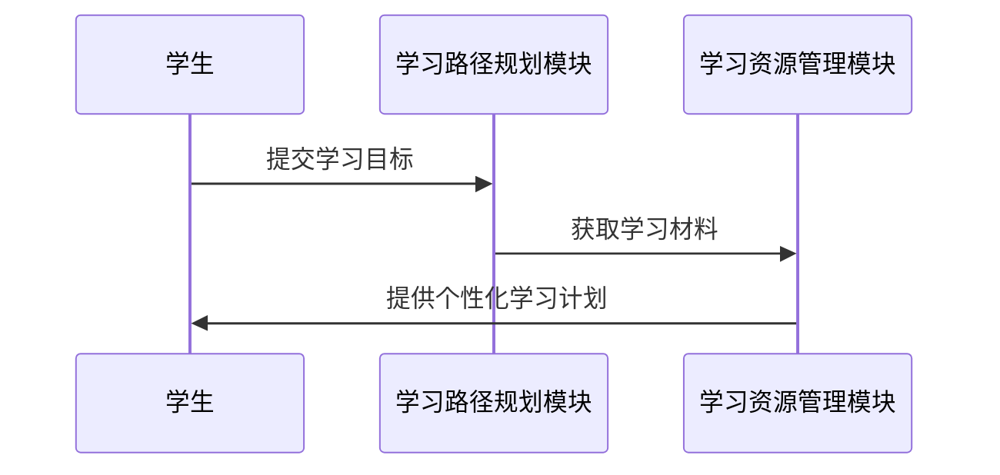

                 


# 个性化学习路径AI Agent：LLM辅助的自适应教育

---

## 关键词

个性化学习，AI Agent，LLM，自适应教育，教育技术

---

## 摘要

随着人工智能和大语言模型（LLM）的快速发展，个性化学习路径的构建已成为教育领域的热门话题。传统的教育模式难以满足学生的个性化需求，而AI Agent和LLM的结合为实现自适应教育提供了新的可能性。本文从背景介绍、核心概念、算法原理、系统架构到项目实战，详细探讨如何利用LLM构建个性化学习路径AI Agent，从而实现高效、个性化的教育体验。

---

# 第1章 个性化学习路径与AI Agent概述

## 1.1 教育领域的现状与挑战

### 1.1.1 传统教育模式的局限性

传统教育模式通常采用统一的教学计划和评估标准，忽视了学生的个性化需求。学生的学习能力、兴趣和背景差异很大，但传统模式难以灵活调整以适应每个学生的需求。这导致部分学生在学习过程中感到枯燥或压力过大，影响了学习效果。

### 1.1.2 学生个性化学习需求的崛起

随着教育目标的多样化和学生自我发展的需求增加，个性化学习成为教育领域的焦点。学生希望根据自身特点和目标，制定独特的学习计划。这种需求推动了教育技术的发展，尤其是人工智能技术的应用。

### 1.1.3 教育技术的发展与变革

人工智能、大数据和机器学习等技术的进步为教育领域带来了新的可能性。通过分析学生的行为数据和学习表现，教育技术能够为学生提供个性化的学习建议和资源推荐，从而提升学习效果。

---

## 1.2 AI Agent在教育中的应用

### 1.2.1 AI Agent的基本概念

AI Agent（智能代理）是指能够感知环境并采取行动以实现目标的智能系统。在教育领域，AI Agent可以用来帮助学生制定学习计划、推荐学习资源、提供反馈和指导。

### 1.2.2 LLM在教育中的作用

大语言模型（LLM）具有强大的自然语言处理能力，能够理解上下文、生成文本、回答问题等。在教育中，LLM可以用于个性化学习路径的构建、学习内容的生成和学习效果的评估。

### 1.2.3 自适应教育的核心理念

自适应教育是指根据学生的学习情况动态调整教学策略和内容。通过AI Agent和LLM的结合，自适应教育能够为每个学生提供量身定制的学习路径，从而提高学习效率和满意度。

---

## 1.3 个性化学习路径的构建

### 1.3.1 学习者特征分析

个性化学习路径的第一步是分析学习者的特征，包括学习目标、兴趣爱好、学习风格、认知水平等。这些特征可以通过问卷调查、学习数据和行为分析等方式获取。

### 1.3.2 学习目标的分解

将整体学习目标分解为具体的子目标，有助于制定详细的个性化学习计划。例如，学习一门编程语言可以分解为语法理解、代码编写、调试能力等子目标。

### 1.3.3 学习路径的动态调整

个性化学习路径不是一成不变的，需要根据学生的学习进展和反馈进行动态调整。例如，如果学生在某个子目标上表现不佳，AI Agent可以调整后续的学习内容和资源。

---

## 1.4 本章小结

本章介绍了个性化学习路径和AI Agent的基本概念，分析了传统教育模式的局限性和个性化学习需求的崛起。同时，阐述了AI Agent和LLM在教育中的作用，以及自适应教育的核心理念。通过学习者特征分析、学习目标分解和动态调整，个性化学习路径能够为学生提供更加高效和个性化的学习体验。

---

# 第2章 AI Agent与LLM的核心原理

## 2.1 AI Agent的基本原理

### 2.1.1 AI Agent的定义与分类

AI Agent可以分为简单反射型、基于模型的反应型和基于目标的类型。在教育中，目标驱动型AI Agent更为常用，因为它们能够根据学习目标调整行动。

### 2.1.2 LLM的工作机制

LLM通过大量的数据训练，掌握了语言的生成和理解能力。其核心在于 transformer 模型，能够处理长文本和上下文信息。LLM在教育中的应用包括内容生成、对话交互和问题解答。

### 2.1.3 LLM与传统NLP模型的区别

与传统NLP模型相比，LLM具有更强的泛化能力和上下文理解能力。传统模型通常针对特定任务进行优化，而LLM可以处理多种任务和领域。

---

## 2.2 自适应教育系统的架构

### 2.2.1 系统功能模块划分

自适应教育系统通常包括学习者特征分析、学习路径规划、学习资源管理、学习效果评估等功能模块。

### 2.2.2 LLM在系统中的角色

LLM在自适应教育系统中主要用于内容生成、学习推荐和反馈交互。例如，LLM可以生成个性化的学习材料或提供实时答疑。

### 2.2.3 系统的可扩展性与灵活性

通过模块化设计，自适应教育系统具有较强的可扩展性。例如，可以轻松添加新的学习目标或调整算法模型。

---

## 2.3 核心概念对比表

| **对比维度** | **传统教育工具** | **AI Agent** |
|--------------|-------------------|---------------|
| **功能**     | 固定教学计划     | 动态调整学习路径 |
| **响应速度** | 较慢             | 实时反馈       |
| **灵活性**    | 低               | 高             |

---

## 2.4 系统架构图



---

## 2.5 本章小结

本章详细讲解了AI Agent和LLM的核心原理，分析了它们在教育中的应用和区别。通过系统架构图，展示了自适应教育系统的整体框架。AI Agent和LLM的结合为个性化学习路径的构建提供了强大的技术支持。

---

# 第3章 LLM的算法原理

## 3.1 大模型的训练过程

### 3.1.1 数据预处理

数据预处理包括清洗、分词和格式转换等步骤。例如，将文本数据划分为训练集和验证集。

### 3.1.2 模型训练

使用 transformer 模型进行训练，通过自注意力机制和前馈网络捕捉文本的上下文信息。

### 3.1.3 参数优化

通过梯度下降和Adam优化器调整模型参数，以最小化损失函数。

---

## 3.2 推理过程

### 3.2.1 输入处理

将输入文本转换为模型可处理的格式，例如 tokenization。

### 3.2.2 解码过程

通过解码器生成输出文本，采用贪心搜索或 beam search 等策略优化生成结果。

### 3.2.3 输出生成

生成的文本经过后处理（如格式调整和语法修正）后返回给用户。

---

## 3.3 数学模型与公式

### 3.3.1 概率分布公式

$$P(y|x) = \frac{P(x,y)}{P(x)}$$

### 3.3.2 损失函数

$$L = -\sum_{i=1}^n \log P(y_i|x)$$

---

## 3.4 本章小结

本章详细介绍了LLM的训练和推理过程，分析了其数学模型和公式。通过mermaid图和公式推导，读者可以更好地理解LLM的工作原理。

---

# 第4章 系统分析与架构设计方案

## 4.1 问题场景介绍

学生需要一个个性化的学习计划，帮助他们高效地掌握编程知识。系统需要根据学生的学习情况动态调整学习内容和资源。

---

## 4.2 系统功能设计

### 4.2.1 学习者特征分析

通过问卷调查和学习数据，分析学生的编程基础、学习目标和兴趣领域。

### 4.2.2 学习路径规划

根据分析结果，制定个性化的学习计划，包括学习内容和时间安排。

---

## 4.3 系统架构设计

### 4.3.1 领域模型（Mermaid类图）



---

## 4.4 系统交互设计（Mermaid序列图）



---

## 4.5 本章小结

本章分析了系统的需求和功能设计，通过类图和序列图展示了系统的架构。通过领域模型和交互设计，读者可以清晰地理解系统的工作流程。

---

# 第5章 项目实战

## 5.1 环境安装

安装Python、TensorFlow和Hugging Face库：

```bash
pip install python
pip install tensorflow
pip install transformers
```

---

## 5.2 系统核心实现源代码

### 5.2.1 学习路径规划模块

```python
from transformers import LlamaForCausalInference, AutoTokenizer

model = LlamaForCausalInference.from_pretrained('facebook/llama')
tokenizer = AutoTokenizer.from_pretrained('facebook/llama')

def generate_learning_plan(prompt):
    inputs = tokenizer.encode(prompt, return_tensors='np')
    outputs = model.generate(inputs, max_length=500, temperature=0.7)
    return tokenizer.decode(outputs[0])
```

### 5.2.2 学习资源管理模块

```python
def track_progress(student_id):
    # 获取学生的学习数据
    # 根据数据调整学习计划
    return new_plan
```

---

## 5.3 代码应用解读与分析

通过上述代码，我们可以看到LLM在学习路径规划和资源管理中的应用。generate_learning_plan函数用于根据学生的需求生成个性化学习计划，而track_progress函数则用于跟踪学习进度并动态调整计划。

---

## 5.4 实际案例分析

以一个学习编程的学生为例，AI Agent可以根据其学习目标生成相应的学习材料和计划。例如，学生选择学习Python，系统会推荐相关的学习资源和练习任务。

---

## 5.5 本章小结

本章通过项目实战展示了如何利用Python和LLM实现个性化学习路径的构建。通过代码示例和案例分析，读者可以更好地理解理论知识的应用。

---

# 第6章 最佳实践与小结

## 6.1 最佳实践 tips

- 定期更新模型以保持其性能
- 收集用户反馈以优化系统
- 结合多种技术（如图像识别和语音识别）提升用户体验

---

## 6.2 小结

通过本文的详细讲解，读者可以理解个性化学习路径AI Agent的构建过程。从背景介绍到系统设计，再到项目实战，我们全面探讨了如何利用AI Agent和LLM实现自适应教育。

---

## 6.3 注意事项

- 确保数据隐私和安全
- 定期维护和更新系统
- 考虑不同学习者的特殊需求

---

## 6.4 拓展阅读

- 探索更多AI技术在教育中的应用
- 研究最新的LLM模型和算法
- 学习系统架构设计的最佳实践

---

# 结语

个性化学习路径AI Agent的构建是一个复杂但充满潜力的领域。通过AI Agent和LLM的结合，我们可以为每个学生提供量身定制的学习体验。未来，随着技术的进步，个性化学习将变得更加高效和普及。

--- 

希望这篇文章能够为读者提供清晰的思路和实用的指导，帮助他们更好地理解和应用AI Agent和LLM在教育中的潜力。

