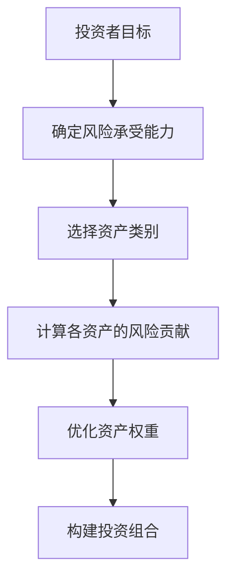
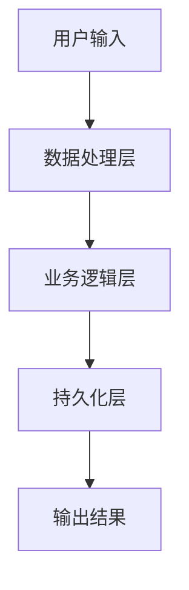
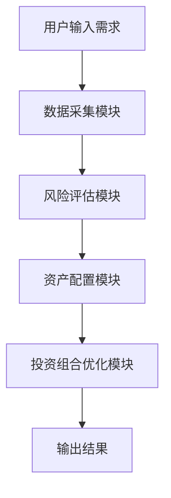

                 


# 个性化投资策略

> 关键词：个性化投资，资产配置，风险管理，投资者行为，现代投资组合理论

> 摘要：个性化投资策略是一种根据投资者的个人需求、风险承受能力和财务目标来定制投资计划的方法。本文从理论基础、数据分析、系统设计到实际应用，详细探讨了如何构建和优化个性化投资策略，通过数学模型和算法实现精准的投资决策。

---

# 第一部分: 个性化投资策略的背景与基础

# 第1章: 个性化投资策略概述

## 1.1 投资的基本概念

### 1.1.1 投资的定义与分类
投资是指将资金投入某个项目或资产，以期在未来获得收益的行为。根据投资对象的不同，可以将投资分为股票、债券、房地产、基金等多种类型。

### 1.1.2 个性化投资的内涵
个性化投资强调根据投资者的特定需求和情况制定投资策略。与传统投资相比，个性化投资更加注重灵活性和定制化。

### 1.1.3 个性化投资与传统投资的区别
- **传统投资**：基于通用的市场分析和固定策略，适用于大多数投资者。
- **个性化投资**：根据投资者的财务状况、风险偏好和投资目标进行定制。

## 1.2 个性化投资的背景与意义

### 1.2.1 当前金融市场的特点
- 资产种类繁多
- 市场波动频繁
- 信息获取便捷

### 1.2.2 个性化投资的必要性
- 满足不同投资者的需求
- 提高投资效率和收益
- 降低投资风险

## 1.3 个性化投资的核心要素

### 1.3.1 投资目标的设定
明确投资目标是制定个性化投资策略的第一步，包括财务自由、资产保值增值等。

### 1.3.2 风险承受能力的评估
通过问卷调查和数据分析，评估投资者对风险的承受能力，分为保守型、稳健型和进取型。

### 1.3.3 投资期限的确定
根据投资目标，确定投资的短期或长期性质，影响资产配置和风险管理策略。

## 1.4 个性化投资的实现路径

### 1.4.1 数据驱动的投资决策
利用大数据分析技术，获取市场趋势和投资者行为数据，辅助投资决策。

### 1.4.2 技术支持的个性化分析
借助人工智能和机器学习算法，进行个性化资产配置和风险评估。

### 1.4.3 专业顾问的角色
专业顾问提供定制化建议，帮助投资者制定和调整个性化投资策略。

## 1.5 本章小结
个性化投资策略是基于投资者的特定需求和市场环境，通过定制化资产配置和风险管理，实现投资目标的重要方法。下一章节将深入分析投资者行为对个性化投资的影响。

---

# 第2章: 投资者行为分析

## 2.1 投资者行为的核心模型

### 2.1.1 凯恩斯式的投资者心理分析
凯恩斯的行为理论认为，投资者决策受到心理因素的影响，容易出现非理性行为，如过度自信和从众心理。

### 2.1.2 理性与非理性决策的对比
- **理性决策**：基于充分的信息和逻辑分析。
- **非理性决策**：受情绪和心理影响，可能导致错误判断。

### 2.1.3 投资者行为与市场波动的关系
投资者的集体行为会引发市场波动，如羊群效应导致资产价格的异常波动。

## 2.2 投资者行为与市场波动的关系

### 2.2.1 市场情绪对资产价格的影响
投资者情绪通过影响供需关系，进而影响资产价格。例如，乐观情绪会导致股价上涨。

### 2.2.2 群体性决策的羊群效应
投资者容易受到市场情绪的影响，出现跟风行为，导致资产价格的过度波动。

## 2.3 个性化投资中的行为矫正策略

### 2.3.1 避免情绪化投资的技巧
- 设定明确的投资目标和策略
- 建立严格的投资纪律，避免随市场波动频繁调整

### 2.3.2 建立长期投资纪律的方法
- 分散投资，降低风险
- 定期审视和调整投资组合

## 2.4 本章小结
投资者行为对个性化投资策略的制定和实施有重要影响，理解并纠正非理性行为是制定有效策略的关键。

---

# 第3章: 资产配置与风险管理

## 3.1 资产配置的数学模型

### 3.1.1 现代投资组合理论（MPT）的公式推导
MPT通过优化资产配置，最小化投资组合的风险。数学公式如下：
$$ \text{风险} = \sqrt{w^T \Sigma w} $$
其中，\( w \) 是投资组合权重向量，\( \Sigma \) 是资产间的协方差矩阵。

### 3.1.2 资产配置的步骤
1. 确定投资目标和风险承受能力
2. 选择合适的资产类别
3. 计算各资产的风险贡献
4. 优化资产权重，构建投资组合

## 3.2 风险管理的核心算法

### 3.2.1 风险调整后的资产配置流程图


### 3.2.2 风险管理工具
- **VaR（在险价值）**：衡量投资组合在特定置信水平下的潜在损失。
- **CVaR（条件在险价值）**：VaR的延伸，考虑极端情况下的损失。

## 3.3 资产配置的动态调整策略

### 3.3.1 定期再平衡的数学模型
$$ \text{再平衡权重} = \frac{\text{当前权重}}{\sum \text{当前权重}} $$

### 3.3.2 再平衡的频率
- 定期（如每年一次）再平衡，保持投资组合与初始目标一致。

## 3.4 本章小结
资产配置和风险管理是个性化投资策略的核心，通过数学模型和算法优化投资组合，降低风险，提高收益。

---

# 第四部分: 个性化投资策略的系统设计与实现

# 第4章: 个性化投资策略的系统架构

## 4.1 系统功能模块设计

### 4.1.1 数据采集模块
- 采集市场数据和投资者信息
- 数据清洗和预处理

### 4.1.2 风险评估模块
- 使用MPT模型评估投资组合风险
- 计算VaR和CVaR

### 4.1.3 资产配置模块
- 根据投资者需求和市场数据，优化资产配置
- 输出投资组合建议

### 4.1.4 投资组合优化模块
- 定期再平衡投资组合
- 调整资产权重

## 4.2 系统架构设计

### 4.2.1 分层架构的 Mermaid 图


### 4.2.2 系统架构的优缺点
- **优点**：模块化设计，便于扩展和维护
- **缺点**：可能需要较高的开发和维护成本

## 4.3 系统接口设计

### 4.3.1 接口定义
- 输入：投资者信息和市场数据
- 输出：优化后的投资组合

### 4.3.2 接口实现
- 使用RESTful API进行数据交互
- 使用JSON格式传递数据

## 4.4 系统交互流程图



## 4.5 本章小结
通过系统架构设计，可以实现个性化投资策略的自动化和高效管理，为投资者提供定制化的投资建议。

---

# 第五部分: 个性化投资策略的项目实战

# 第5章: 个性化投资策略的实战应用

## 5.1 项目环境安装

### 5.1.1 安装Python和相关库
```bash
pip install numpy pandas matplotlib
```

## 5.2 核心代码实现

### 5.2.1 数据处理代码
```python
import numpy as np
import pandas as pd

# 假设data是一个包含资产收益的数据框
cov_matrix = data.cov()
weights = np.array([0.3, 0.2, 0.5])  # 示例权重
risk = np.sqrt(weights.T @ cov_matrix @ weights)
```

### 5.2.2 资产配置代码
```python
def optimize_portfolio(risk_free_rate, returns, cov_matrix):
    # 使用凸优化方法求解最优权重
    # 这里简化为等权重分配
    n_assets = len(weights)
    return np.array([1/n_assets] * n_assets)
```

## 5.3 项目案例分析

### 5.3.1 案例背景
假设投资者A有100万元，风险承受能力为中等，投资期限为5年，目标是资产保值增值。

### 5.3.2 数据分析与结果
- 资产配置：股票40%，债券30%，房地产30%
- 预期年收益：7%
- 风险：5%

## 5.4 本章小结
通过实战项目，可以验证个性化投资策略的有效性和实用性，帮助投资者实现投资目标。

---

# 第六部分: 总结与展望

# 第6章: 总结与展望

## 6.1 个性化投资策略的总结

### 6.1.1 核心内容回顾
- 个性化投资策略的核心是根据投资者的需求和市场环境，制定定制化的投资计划
- 通过数据分析和算法优化，实现资产配置和风险管理

### 6.1.2 实践中的注意事项
- 定期审视和调整投资组合
- 保持对市场变化的敏感性

## 6.2 未来展望

### 6.2.1 技术进步对个性化投资的影响
- 人工智能和大数据技术的应用将更加广泛
- 自动化投资工具将更加智能化

### 6.2.2 个性化投资策略的拓展
- 更加精细化的资产配置
- 更加智能化的风险管理

## 6.3 本章小结
个性化投资策略是金融领域的重要方法，随着技术的进步，其应用将更加广泛和深入。

---

# 附录: 工具与资源

## 附录A: Python库安装指南
- **NumPy**：用于数组和矩阵运算
- **Pandas**：用于数据分析和处理
- **Matplotlib**：用于数据可视化

## 附录B: 术语表
- **VaR**：在险价值（Value at Risk）
- **CVaR**：条件在险价值（Conditional Value at Risk）
- **MPT**：现代投资组合理论（Modern Portfolio Theory）

---

# 结束语
个性化投资策略是一个复杂而精细的过程，需要结合理论知识和实际操作。通过本文的详细讲解和实战案例，读者可以更好地理解和应用个性化投资策略，实现投资目标。

--- 

# 本文完成

