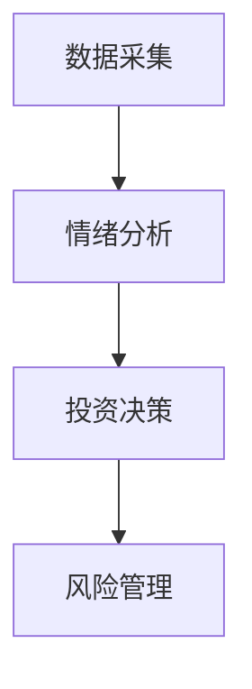
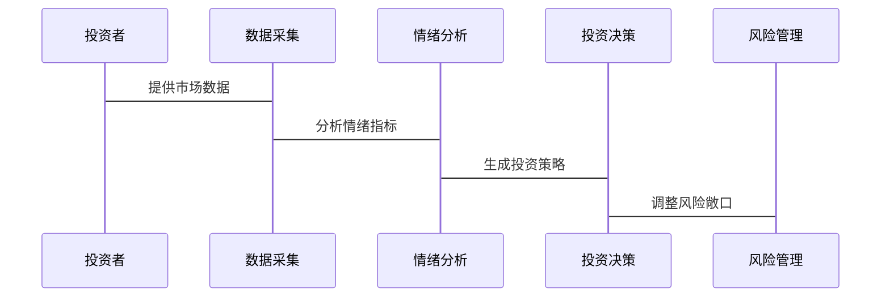

                 


# 丹尼尔·卡尼曼的行为经济学在价值投资中的应用

## 关键词
- 行为经济学
- 认知偏差
- 价值投资
- 心理账户
- 情绪管理

## 摘要
本文深入探讨了丹尼尔·卡尼曼的行为经济学理论在价值投资中的应用。通过分析认知偏差、情绪管理和心理账户等核心概念，结合实际案例和数学模型，揭示了行为经济学如何帮助投资者做出更理性的决策，避免常见错误，优化投资策略。文章结构清晰，内容详实，涵盖理论基础、算法原理、系统架构和项目实战，为价值投资者提供了实用的指导。

---

## 第一章：引言

### 1.1 问题背景
投资领域长期依赖传统经济学假设，认为市场参与者是理性的。然而，2008年金融危机暴露了这一假设的缺陷，促使行为经济学兴起。丹尼尔·卡尼曼因其对认知偏差的研究荣获诺贝尔奖，其理论为价值投资提供了新的视角。

### 1.2 问题描述
投资者常受认知偏差影响，导致非理性决策，如过度自信和从众心理。本文探讨如何利用行为经济学原理，识别并修正这些偏差，提升投资决策的质量。

### 1.3 问题解决
通过分析认知偏差、情绪管理和心理账户，结合数学模型和系统设计，构建行为经济学指导下的价值投资框架。

### 1.4 边界与外延
本文聚焦认知偏差对投资决策的影响，不涉及技术分析或市场预测，重点在心理层面的优化。

### 1.5 核心要素
- 认知偏差
- 情绪管理
- 心理账户
- 价值投资策略

---

## 第二章：行为经济学的核心理论

### 2.1 认知偏差的定义与分类
认知偏差是人们在信息处理中的系统性错误，常见类型包括代表性偏差、可得性偏差和锚定效应。

### 2.2 代表性偏差
#### 2.2.1 定义
代表性偏差指投资者基于样本与典型案例的相似性，过度概括结论。

#### 2.2.2 投资中的表现
投资者常误将小盘股表现归因于行业趋势，而非公司特性。

### 2.3 可得性偏差
#### 2.3.1 定义
可得性偏差指人们根据容易获取的信息做出决策，忽视全面分析。

#### 2.3.2 投资中的表现
市场波动后，投资者可能过度依赖近期信息，忽视长期趋势。

### 2.4 锚定效应
#### 2.4.1 定义
锚定效应指人们在决策中过度依赖第一个信息点，影响判断。

#### 2.4.2 投资中的表现
投资者常以买入价为基准，导致高位买入低位卖出。

---

## 第三章：价值投资中的行为偏差

### 3.1 投资者的心理特征
#### 3.1.1 过度自信
投资者常高估自己的判断能力，忽视市场不确定性。

#### 3.1.2 从众心理
投资者易受市场情绪影响，盲目跟随市场趋势。

### 3.2 价值投资者的心理稳定性
#### 3.2.1 心理韧性
价值投资者需具备较强的心理承受能力，面对市场波动保持冷静。

#### 3.2.2 长期思维
价值投资者注重长期收益，忽略短期波动。

### 3.3 情绪管理策略
#### 3.3.1 情绪监控
通过日志记录和自我反思，识别并调整情绪影响的决策。

#### 3.3.2 情绪调节技巧
如冥想、运动等，帮助投资者保持理性的决策能力。

---

## 第四章：算法与数学模型

### 4.1 情绪指数模型
#### 4.1.1 模型概述
将市场情绪量化为指数，帮助投资者识别过度情绪化的机会。

#### 4.1.2 模型公式
$$
\text{情绪指数} = \alpha \times \text{市场波动} + \beta \times \text{交易量}
$$

### 4.2 风险管理模型
#### 4.2.1 风险评估
通过认知偏差分析，调整投资组合的风险敞口。

#### 4.2.2 模型公式
$$
\text{风险调整收益} = \text{预期收益} - \gamma \times \text{风险敞口}
$$

---

## 第五章：系统架构设计

### 5.1 系统功能模块
- 数据采集：收集市场数据和投资者情绪指标。
- 情绪分析：识别市场情绪偏差。
- 投资决策：基于行为经济学原理生成策略。

### 5.2 架构图


### 5.3 交互流程图


---

## 第六章：项目实战

### 6.1 环境安装
安装Python和相关库，如Pandas和Scikit-learn。

### 6.2 核心代码实现
```python
import pandas as pd
from sklearn.metrics import accuracy_score

# 数据预处理
data = pd.read_csv('market_data.csv')
X = data[['volatility', 'volume']]
y = data['price_change']

# 训练情绪分析模型
model = SomeModel()
model.fit(X, y)

# 预测情绪指数
y_pred = model.predict(X)
print("准确率:", accuracy_score(y, y_pred))
```

### 6.3 实际案例分析
分析某公司的历史数据，识别其被低估的情况，制定投资策略。

---

## 第七章：总结与展望

### 7.1 核心观点总结
行为经济学揭示了投资者的非理性行为，帮助识别认知偏差，优化投资决策。

### 7.2 未来研究方向
结合大数据和AI，进一步优化情绪分析和风险管理模型。

### 7.3 最佳实践Tips
- 定期回顾投资决策，识别情绪影响。
- 保持学习，更新投资策略。

### 7.4 小结
本文展示了行为经济学在价值投资中的应用，帮助投资者提升决策质量，实现长期收益。

---

## 附录
提供相关数据集和代码的详细说明，供读者参考。

