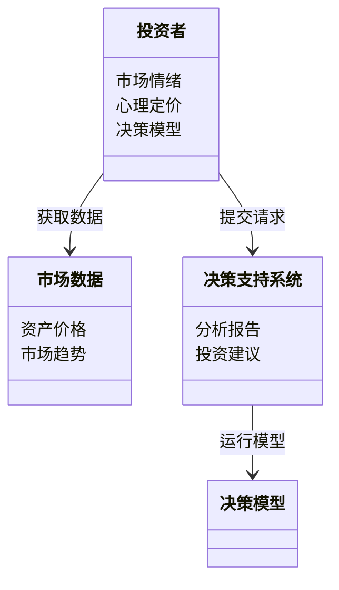
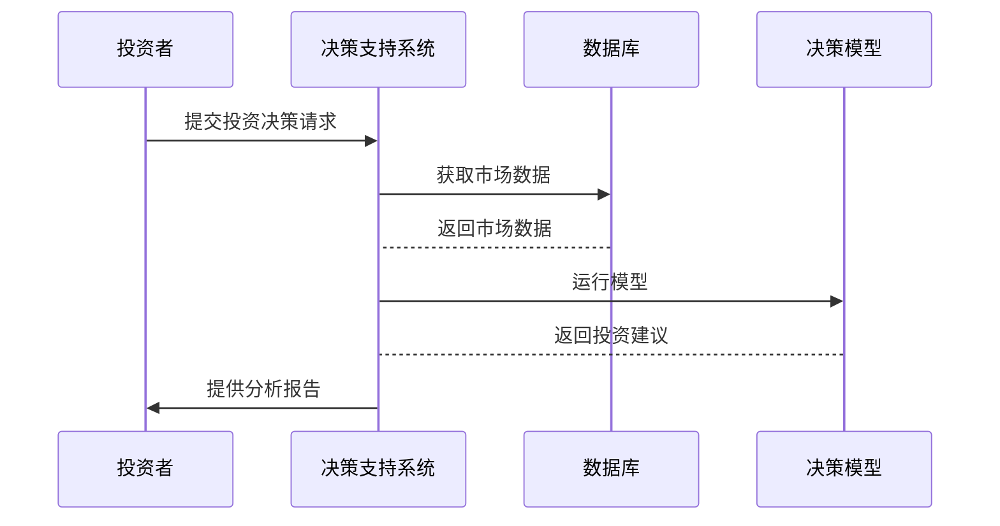

                 


# 乔尔·提林加斯特的价值投资心理学

> 关键词：价值投资心理学、投资者心态、市场周期、心理定价、投资决策模型、乔尔·提林加斯特、投资哲学

> 摘要：本文深入探讨了乔尔·提林加斯特的价值投资心理学，分析了价值投资中的心理定价机制、投资者心态与市场周期的关系，以及投资决策模型中的心理因素。文章从背景介绍、核心概念与联系、算法原理、系统分析与架构设计方案、项目实战等多方面展开，结合实例和数学模型，全面解析了价值投资中的心理学因素。本文旨在为投资者提供心理层面的洞察，帮助他们在复杂多变的市场中做出更明智的投资决策。

---

## 第1章: 价值投资的起源与发展

### 1.1 价值投资的核心理念

#### 1.1.1 价值投资的定义与核心要素
- **价值投资**：一种以基本面分析为基础的投资策略，旨在以低于内在价值的价格购买优质资产。
- **核心要素**：
  - **内在价值**：资产的真实价值，不依赖于市场波动。
  - **安全边际**：买入价格与内在价值的差距，提供保护以避免损失。
  - **长期视角**：关注长期收益，而非短期市场波动。

#### 1.1.2 价值投资与其他投资策略的对比
- **对比维度**：
  - **技术分析**：基于价格和成交量的短期波动，与价值投资的长期视角形成对比。
  - **指数投资**：通过分散投资降低风险，但价值投资更注重个股选择。
  - **成长投资**：关注高增长公司，而价值投资更关注低估值的稳定公司。

#### 1.1.3 价值投资在现代金融中的地位
- 价值投资是金融市场的基石之一，尤其在市场波动加剧时，其长期稳定的特性更加凸显。

---

### 1.2 乔尔·提林加斯特的贡献

#### 1.2.1 乔尔·提林加斯特的生平简介
- **乔尔·提林加斯特**：价值投资领域的权威，以其独特的投资哲学和心理学视角闻名。

#### 1.2.2 他的投资哲学与方法
- **哲学**：强调安全边际和长期持有，避免情绪化决策。
- **方法**：通过基本面分析寻找被市场低估的优质资产。

#### 1.2.3 他对价值投资心理学的独特见解
- 提出**心理定价机制**，即市场情绪和心理偏差会影响资产定价，投资者可以通过理解这些因素捕捉低估机会。

---

### 1.3 投资心理学的背景介绍

#### 1.3.1 投资心理学的基本概念
- **投资心理学**：研究投资者行为、情绪和决策的心理学分支。

#### 1.3.2 投资者行为中的心理偏差
- **常见偏差**：
  - 过度自信偏差
  - 沉没成本偏差
  - 从众心理

#### 1.3.3 心理因素对投资决策的影响
- 心理因素可能导致投资者做出非理性决策，例如在牛市中过度乐观，在熊市中过度悲观。

---

### 1.4 价值投资与心理学的结合

#### 1.4.1 价值投资中的心理定价机制
- **心理定价**：市场参与者基于心理预期而非实际价值进行定价。
- **机制**：心理定价导致资产价格偏离内在价值，为价值投资者提供机会。

#### 1.4.2 投资者心态与市场周期的关系
- **市场周期**：牛市、熊市、震荡市中，投资者心态不同，影响市场走势。

#### 1.4.3 心理因素对投资组合的影响
- 心理因素可能导致投资组合偏离长期策略，增加短期波动风险。

---

## 第2章: 价值投资中的心理定价机制

### 2.1 心理定价的基本原理

#### 2.1.1 心理定价的定义与特征
- **定义**：基于市场参与者心理预期的价格，而非实际价值。
- **特征**：
  - 易受情绪影响
  - 具有波动性
  - 受市场参与者的认知偏差影响

#### 2.1.2 心理定价在价值投资中的应用
- 价值投资者通过识别心理定价低于内在价值的机会进行投资。

#### 2.1.3 心理定价与市场均衡的关系
- 市场均衡是心理定价与实际价值的动态平衡过程。

---

### 2.2 价值投资中的心理偏差

#### 2.2.1 过度自信偏差
- **表现**：投资者过度自信于自己的判断，可能导致错误决策。

#### 2.2.2 沉没成本偏差
- **表现**：投资者因过去的投入而继续持有亏损资产。

#### 2.2.3 从众心理与反从众心理
- **从众心理**：跟随市场趋势，可能导致羊群效应。
- **反从众心理**：逆市场趋势而动，可能捕捉低估机会。

---

### 2.3 心理定价与市场情绪的关系

#### 2.3.1 市场情绪的周期性波动
- 市场情绪在乐观与悲观之间波动，影响心理定价。

#### 2.3.2 心理定价与市场情绪的互动
- 市场情绪通过心理定价影响资产价格，心理定价反过来影响市场情绪。

#### 2.3.3 投资者如何利用心理定价
- 识别市场情绪变化，捕捉价格偏离内在价值的机会。

---

### 2.4 本章小结

---

## 第3章: 投资者心态与市场周期

### 3.1 投资者心态的分类

#### 3.1.1 乐观型投资者
- 特点：相信市场会继续上涨，倾向于高风险投资。

#### 3.1.2 悲观型投资者
- 特点：对市场持谨慎态度，倾向于保守投资。

#### 3.1.3 理性型投资者
- 特点：基于基本面分析做出决策，较少受情绪影响。

---

### 3.2 市场周期与投资者心态的关系

#### 3.2.1 牛市中的投资者心态
- **表现**：乐观、冒险，倾向于高杠杆和高风险投资。

#### 3.2.2 熊市中的投资者心态
- **表现**：悲观、保守，倾向于规避风险。

#### 3.2.3 震荡市中的投资者心态
- **表现**：摇摆不定，容易受到市场波动影响。

---

### 3.3 心理因素对市场周期的影响

#### 3.3.1 心理预期与市场波动
- 心理预期通过影响投资者行为，推动市场波动。

#### 3.3.2 投资者行为对市场趋势的推动
- 大量投资者的相同心理预期可能导致市场趋势的形成或反转。

#### 3.3.3 心理定价与市场周期的互动
- 心理定价在市场周期中起着放大波动的作用。

---

### 3.4 本章小结

---

## 第4章: 价值投资中的决策模型

### 4.1 投资决策模型的分类

#### 4.1.1 基于理性的决策模型
- **特点**：基于数学模型和数据分析，忽略情绪因素。

#### 4.1.2 基于情感的决策模型
- **特点**：考虑投资者情绪和心理因素。

#### 4.1.3 综合型决策模型
- **特点**：结合理性与情感因素，更贴近实际。

---

### 4.2 价值投资中的决策模型

#### 4.2.1 乔尔·提林加斯特的决策模型
- **模型输入**：资产的内在价值、市场情绪、心理定价。
- **模型输出**：投资建议，包括买入、持有或卖出。

#### 4.2.2 模型的优缺点分析
- **优点**：结合了心理因素，更贴近实际市场。
- **缺点**：复杂性较高，难以量化。

---

### 4.3 决策模型中的心理因素

#### 4.3.1 心理定价在模型中的作用
- 心理定价作为模型输入，影响投资建议。

#### 4.3.2 心理预期对模型的影响
- 心理预期通过影响市场情绪，间接影响模型输出。

#### 4.3.3 情感因素在模型中的作用
- 情感因素影响投资者的决策，但模型需要平衡理性与情感。

---

### 4.4 本章小结

---

## 第5章: 价值投资中的系统分析与架构设计方案

### 5.1 系统功能设计
- **目标**：构建一个基于心理定价的价值投资决策支持系统。

#### 5.1.1 领域模型（Mermaid类图）


---

### 5.2 系统架构设计


---

### 5.3 系统接口设计
- **API接口**：
  - 获取市场数据
  - 提交投资决策请求
  - 获取分析报告

---

### 5.4 系统交互设计


---

## 第6章: 价值投资中的项目实战

### 6.1 环境安装
- **工具**：Python、数据分析库（Pandas、NumPy）、可视化库（Matplotlib、Seaborn）。

---

### 6.2 核心代码实现

#### 6.2.1 心理定价计算
```python
import pandas as pd
import numpy as np

def calculate心理定价(price_data, sentiment_data):
   心理定价 = price_data * (1 + sentiment_data/100)
    return心理定价

# 示例数据
price_data = pd.Series([100, 200, 300])
sentiment_data = pd.Series([10, -5, 20])

心理定价 = calculate心理定价(price_data, sentiment_data)
print(心理定价)
```

---

#### 6.2.2 决策模型实现
```python
def investment_decision(price, intrinsic_value):
    if price < intrinsic_value * 0.9:
        return "买入"
    elif price > intrinsic_value * 1.1:
        return "卖出"
    else:
        return "持有"

# 示例数据
price = 100
intrinsic_value = 120
decision = investment_decision(price, intrinsic_value)
print(decision)
```

---

### 6.3 案例分析
- **案例**：某股票市场价格为100，内在价值为120，市场情绪为乐观。
- **分析**：心理定价为110，低于内在价值，建议买入。

---

### 6.4 项目总结
- 通过心理定价和决策模型的结合，投资者可以更理性地做出投资决策。

---

## 第7章: 最佳实践、小结与注意事项

### 7.1 最佳实践
- **保持冷静**：避免情绪化决策。
- **长期视角**：关注内在价值而非短期波动。
- **持续学习**：不断提升自己的投资知识和心理素质。

### 7.2 小结
- 价值投资心理学是理解市场行为和投资者决策的关键。
- 通过心理定价和决策模型，投资者可以更好地捕捉市场机会。

### 7.3 注意事项
- **风险控制**：心理定价可能受情绪影响，需结合严格的风险管理。
- **持续监控**：市场情绪和心理定价会随时间变化，需持续监控。

---

## 附录: 扩展阅读

- 建议阅读乔尔·提林加斯特的经典著作，深入理解价值投资心理学的核心思想。

---

**本文通过详细分析乔尔·提林加斯特的价值投资心理学，结合实际案例和数学模型，为投资者提供了心理层面的洞察和实践指导，帮助他们在复杂多变的市场中做出更明智的投资决策。**

