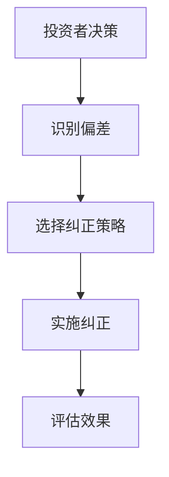
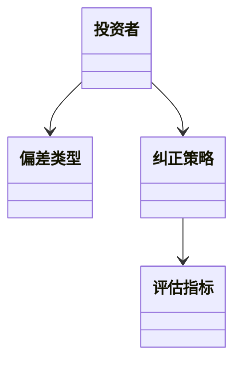

                 


# 乔尔·提林加斯特的投资决策偏差纠正

> 关键词：投资决策偏差、乔尔·提林加斯特、行为金融学、认知偏差纠正、投资策略优化

> 摘要：本文详细探讨了乔尔·提林加斯特在投资决策中的偏差纠正方法，分析了常见投资决策偏差的成因、分类及影响，结合行为金融学理论，提出了纠正偏差的核心概念与策略，构建了数学模型与算法框架，并通过系统架构设计与项目实战案例，展示了如何在实际投资中应用这些方法，最后总结了最佳实践与注意事项。

---

## 第一部分: 投资决策偏差概述

### 第1章: 投资决策偏差的背景与影响

#### 1.1 投资决策中的常见偏差

##### 1.1.1 过度自信偏差
过度自信偏差是指投资者对自己判断的过度信任，导致他们在决策时忽视了市场的不确定性。例如，投资者可能高估自己对市场的预测能力，从而做出冒险性投资。

##### 1.1.2 从众心理偏差
从众心理偏差是指投资者为了符合群体决策而忽视自己的判断。例如，在市场情绪高涨时，投资者可能跟随市场趋势，导致羊群效应。

##### 1.1.3 沉没成本偏差
沉没成本偏差是指投资者在已经投入资金的情况下，继续投资以避免损失的心理。例如，投资者可能在亏损后继续加仓，试图扭亏为盈。

##### 1.1.4 确认偏差
确认偏差是指投资者倾向于寻找支持自己观点的信息，忽视相反证据。例如，投资者可能只关注支持自己投资决策的信息，忽视风险提示。

##### 1.1.5 锚定效应
锚定效应是指投资者在决策时过于依赖第一个信息点，导致判断失误。例如，投资者可能在买入价附近设定止损，而忽视市场整体走势。

#### 1.2 投资决策偏差的分类与特征

##### 1.2.1 认知性偏差
认知性偏差源于投资者的信息处理方式，如选择性信息处理和记忆偏差。例如，投资者可能只记住市场的上涨，忘记下跌。

##### 1.2.2 情感性偏差
情感性偏差源于投资者的情绪波动，如贪婪和恐惧。例如，市场上涨时投资者贪婪，市场下跌时投资者恐惧。

##### 1.2.3 行为性偏差
行为性偏差是指投资者在决策过程中表现出的非理性行为。例如，投资者可能在市场下跌时恐慌性抛售，导致错失反弹机会。

#### 1.3 投资决策偏差对投资者的影响

##### 1.3.1 对投资决策质量的影响
偏差导致投资者做出错误决策，如高估资产价值、低估风险，影响投资组合的优化。

##### 1.3.2 对投资组合绩效的影响
偏差影响投资组合的表现，如过度分散或集中投资，导致收益不稳定。

##### 1.3.3 对风险管理的影响
偏差可能导致投资者忽视风险，如不及时止损或过度杠杆，增加投资组合的风险敞口。

---

### 第2章: 投资决策偏差纠正的核心概念

#### 2.1 投资决策偏差纠正的定义与目标

##### 2.1.1 纠正偏差的定义
纠正偏差是指通过认知调整、行为干预和系统优化，减少投资决策中的偏差，提高决策质量。

##### 2.1.2 纠正偏差的目标
目标是优化投资决策，提升投资绩效，降低风险。

##### 2.1.3 纠正偏差的必要性
必要性在于减少偏差对投资结果的负面影响，提高投资者的长期收益。

#### 2.2 投资决策偏差纠正的原理

##### 2.2.1 行为金融学基础
行为金融学研究投资者心理和行为，揭示偏差的成因和表现形式。

##### 2.2.2 认知偏差纠正的理论框架
理论框架包括 prospect theory 和后悔理论，帮助解释投资者的决策偏差。

##### 2.2.3 纠正偏差的策略与方法
策略包括认知调整、行为干预和系统优化。

---

## 第二部分: 投资决策偏差纠正的核心概念与联系

### 第3章: 核心概念与联系

#### 3.1 核心概念原理

##### 3.1.1 行为金融学的理论基础
行为金融学基于投资者心理，分析偏差对决策的影响。

##### 3.1.2 认知偏差纠正的数学模型
模型包括 prospect theory 和 regret theory，帮助量化偏差的影响。

##### 3.1.3 投资决策偏差纠正的系统架构
系统架构包括数据采集、分析和优化模块，帮助纠正偏差。

#### 3.2 核心概念属性特征对比表格

##### 3.2.1 常见投资决策偏差对比表
| 偏差类型 | 定义 | 影响 | 纠正策略 |
|----------|------|------|----------|
| 过度自信 | 过度信任自己判断 | 高风险决策 | 多样化投资、分散风险 |
| 从众心理 | 跟随群体决策 | 羊群效应 | 独立思考、逆向投资 |
| 沉没成本 | 忽略沉没成本 | 继续亏损 | 坚持止损、理性决策 |
| 确认偏差 | 寻找支持证据 | 信息片面 | 平衡信息、多角度分析 |
| 锚定效应 | 过度依赖锚点 | 错误估值 | 动态评估、灵活调整 |

#### 3.3 ER实体关系图架构

##### 3.3.1 投资者行为模型
- 投资者：主体，具有决策偏差。
- 投资行为：投资者的决策行为，包括买卖、持有等。
- 偏差类型：投资者的决策偏差类型，如过度自信。
- 纠正策略：用于纠正偏差的策略，如分散投资。

##### 3.3.2 偏差纠正策略模型
- 纠正方法：策略，如认知调整、行为干预。
- 实施步骤：纠正偏差的具体步骤。
- 效果评估：评估纠正效果的指标。

##### 3.3.3 纠正效果评估模型
- 评估指标：收益、风险、稳定性等。
- 数据来源：投资者行为数据、市场数据。
- 评估结果：纠正偏差后的效果。

---

## 第三部分: 投资决策偏差纠正的算法原理

### 第4章: 算法原理

#### 4.1 行为金融学算法

##### 4.1.1 基于 prospect theory 的投资决策模型
prospect theory 解释了投资者对收益和损失的非线性反应，帮助识别偏差。

##### 4.1.2 偏差纠正算法流程图


##### 4.1.3 算法实现
```python
def correct_bias(decision, bias_type):
    if bias_type == 'overconfidence':
        return diversify_investment(decision)
    elif bias_type == 'herd mentality':
        return independent_thinking(decision)
    # 更多偏差纠正策略
    return decision
```

#### 4.2 数学模型与公式

##### 4.2.1 偏差纠正模型公式
$$预期收益 = \sum_{i=1}^{n} p_i r_i$$

##### 4.2.2 风险调整公式
$$风险调整收益 = r_i - \lambda \times 风险溢价$$

##### 4.2.3 投资组合优化公式
$$max \mu - \lambda \sigma^2$$

---

## 第四部分: 系统分析与架构设计

### 第5章: 系统分析与架构设计

#### 5.1 系统功能设计

##### 5.1.1 领域模型


##### 5.1.2 系统架构设计


##### 5.1.3 接口设计
- 输入接口：投资者行为数据、市场数据。
- 输出接口：纠正策略、评估结果。

##### 5.1.4 交互流程
```mermaid
sequenceDiagram
    投资者 --> 提交决策
    --> 投资者行为分析模块
    投资者行为分析模块 --> 识别偏差
    --> 纠正策略模块
    纠正策略模块 --> 提出纠正策略
    --> 评估模块
    评估模块 --> 生成评估报告
    --> 投资者
```

---

## 第五部分: 项目实战

### 第6章: 项目实战

#### 6.1 项目背景

##### 6.1.1 项目介绍
构建一个投资决策支持系统，帮助投资者识别和纠正决策偏差。

##### 6.1.2 项目目标
优化投资决策，提升投资绩效，降低风险。

#### 6.2 核心实现

##### 6.2.1 偏差识别算法
```python
def identify_bias(data):
    if data['行为'] == '从众':
        return 'herd mentality'
    elif data['行为'] == '过度自信':
        return 'overconfidence'
    # 更多偏差识别逻辑
    return '其他'
```

##### 6.2.2 纠正策略实现
```python
def correct_bias(strategy):
    if strategy == '过度分散':
        return 'diversification'
    elif strategy == '独立思考':
        return 'independent thinking'
    # 更多纠正策略
    return '其他'
```

#### 6.3 案例分析

##### 6.3.1 案例介绍
某投资者在市场上涨时盲目跟风，导致亏损。

##### 6.3.2 数据分析
投资者行为数据：从众心理明显，缺乏独立判断。

##### 6.3.3 纠正策略
应用独立思考策略，分散投资，避免过度集中。

##### 6.3.4 结果分析
应用策略后，投资者收益提高，风险降低。

---

## 第六部分: 最佳实践与总结

### 第7章: 最佳实践与总结

#### 7.1 小结

##### 7.1.1 核心要点回顾
纠正偏差需要认知调整、行为干预和系统优化。

##### 7.1.2 关键成功因素
系统的纠正策略和持续的评估优化。

#### 7.2 注意事项

##### 7.2.1 纠正偏差的复杂性
偏差纠正需要时间和实践。

##### 7.2.2 风险提示
过度纠正可能导致新的偏差。

##### 7.2.3 持续优化
定期评估和优化纠正策略。

#### 7.3 拓展阅读

##### 7.3.1 推荐书籍
- 《行为金融学》
- 《投资决策偏差与纠正》

##### 7.3.2 相关研究
- 基于 prospect theory 的投资决策模型。
- 投资者行为与市场波动的关系。

---

## 结语

通过系统地分析和实践，投资者可以有效纠正决策偏差，优化投资策略，提升投资绩效。乔尔·提林加斯特的投资决策偏差纠正方法为投资者提供了理论和实践指导，帮助他们在复杂市场中做出更明智的决策。

