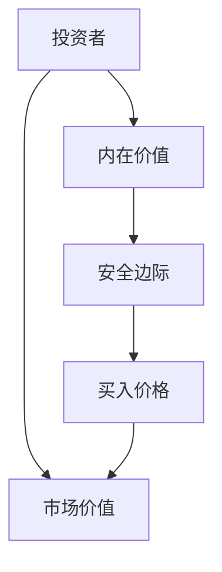
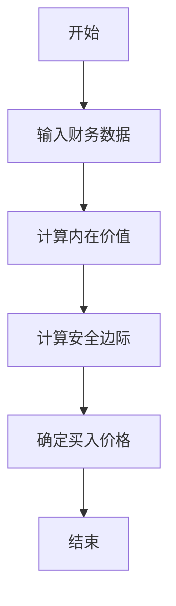

                 


# 乔尔·格林布拉特的价值投资学术研究

> 关键词：价值投资，格林布拉特，投资策略，数学模型，系统架构，投资组合管理

> 摘要：本文系统地探讨了乔尔·格林布拉特的价值投资理论，从核心概念到数学模型，再到系统架构和实战案例，深入剖析了其投资哲学和方法。通过理论分析和实际操作的结合，为投资者提供了全面的指导。

---

## 第一部分：价值投资的背景与核心概念

### 第1章：价值投资的定义与背景

#### 1.1 价值投资的起源与发展
- 1.1.1 价值投资的起源
  - 价值投资的起源可以追溯到20世纪初，本杰明·格雷厄姆和戴维·多德是这一领域的先驱。
  - 格雷厄姆提出了“安全边际”的概念，强调以低于内在价值的价格买入股票。
  
- 1.1.2 格林布拉特在价值投资中的地位
  - 乔尔·格林布拉特是将价值投资理论应用于实践的重要人物之一。
  - 他通过量化方法，将价值投资的理念进一步系统化和科学化。

- 1.1.3 价值投资的核心理念与目标
  - 核心理念：寻找市场低估的股票，长期持有，等待其价值回归。
  - 目标：通过买入优质资产，实现长期稳定的超额收益。

#### 1.2 格林布拉特的价值投资理论
- 1.2.1 投资的本质与目标
  - 投资的本质是通过购买资产，以低于其内在价值的价格买入，长期持有。
  - 格林布拉特的目标是通过价值投资实现稳定的投资回报。

- 1.2.2 格林布拉特的价值投资三要素
  - **内在价值**：资产的真实价值，独立于市场波动。
  - **安全边际**：买入价格低于内在价值，提供保护。
  - **时间**：通过长期持有，等待价值回归。

- 1.2.3 投资中的安全边际概念
  - 安全边际是价值投资的核心要素。
  - 它通过提供缓冲，降低市场波动带来的风险。

---

### 第2章：价值投资的核心概念与联系

#### 2.1 核心概念原理
- **内在价值**：通过基本面分析，计算出资产的真正价值。
  - 计算公式：$$ V = \frac{E}{(r - g)} $$
  - 其中，$V$ 是内在价值，$E$ 是企业未来现金流的现值，$r$ 是折现率，$g$ 是增长率。

- **安全边际**：买入价格与内在价值之间的差额。
  - 计算公式：$$ \text{安全边际} = \text{内在价值} \times (1 - \text{安全边际比例}) $$

- **市场情绪与价格波动**：市场情绪影响短期价格，但不影响长期价值。

#### 2.2 核心概念对比表格
| 概念             | 描述                                                                 |
|------------------|----------------------------------------------------------------------|
| 内在价值         | 资产的真实价值，独立于市场波动。                                       |
| 市场价值         | 资产在市场上的价格，受市场情绪影响。                                   |
| 安全边际         | 买入价格低于内在价值的部分，提供保护。                                 |
| 投资回报         | 通过价值回归实现的收益，包括资本增值和分红。                          |

#### 2.3 实体关系图


---

## 第三部分：价值投资的数学模型与系统架构

### 第3章：格林布拉特投资模型的数学分析

#### 3.1 核心算法原理


- **内在价值计算**：通过基本面分析，计算公司未来现金流的现值。
  - 公式：$$ V = \frac{E}{(r - g)} $$
  - 例如：假设公司未来现金流为 $100，折现率为10%，增长率5%，则 $$ V = \frac{100}{(0.1 - 0.05)} = 2000 $$。

- **安全边际计算**：买入价格应低于内在价值，例如，$$ P = V \times (1 - 0.2) = 2000 \times 0.8 = 1600 $$。

#### 3.2 系统架构设计


- **数据获取**：从财务报表中提取关键数据，如收入、利润、现金流。
- **数据分析**：使用数学模型计算内在价值和安全边际。
- **决策模块**：根据计算结果，决定是否买入、卖出或持有。

---

## 第四部分：价值投资的实战应用

### 第4章：项目实战与案例分析

#### 4.1 环境安装
- 安装必要的工具：Python、Pandas、Matplotlib。
- 数据来源：Yahoo Finance API。

#### 4.2 核心实现代码
```python
import pandas as pd
import yfinance as yf

# 下载数据
msft = yf.download('MSFT', start='2020-01-01', end='2023-01-01')

# 计算内在价值（简化模型）
def calculate_intrinsic_value(eps, growth_rate, required_return):
    return eps / (required_return - growth_rate)

# 示例计算
eps = msft['EPS'].mean()
required_return = 0.1
growth_rate = 0.05
intrinsic_value = calculate_intrinsic_value(eps, growth_rate, required_return)
print(f"微软的内在价值：{intrinsic_value}")
```

#### 4.3 案例分析
- 分析微软公司（MSFT）的财务数据，计算其内在价值和安全边际。
- 通过图表展示价值回归的过程。

---

## 第五部分：总结与展望

### 第5章：总结与未来展望

- **总结**
  - 乔尔·格林布拉特的价值投资理论通过数学模型和系统架构，提供了科学的投资方法。
  - 安全边际和内在价值是投资的核心要素。

- **未来展望**
  - 结合人工智能技术，优化价值投资模型。
  - 探索更多投资策略的结合，提升投资收益。

---

通过以上分析，我们可以看到，乔尔·格林布拉特的价值投资理论不仅是一种投资策略，更是一种系统化的科学方法。结合数学模型和系统架构，投资者可以更有效地进行价值投资，实现长期稳定的收益。

