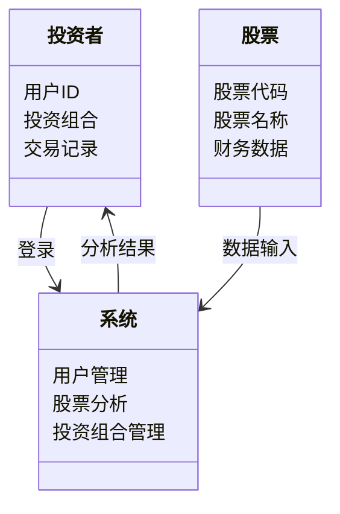
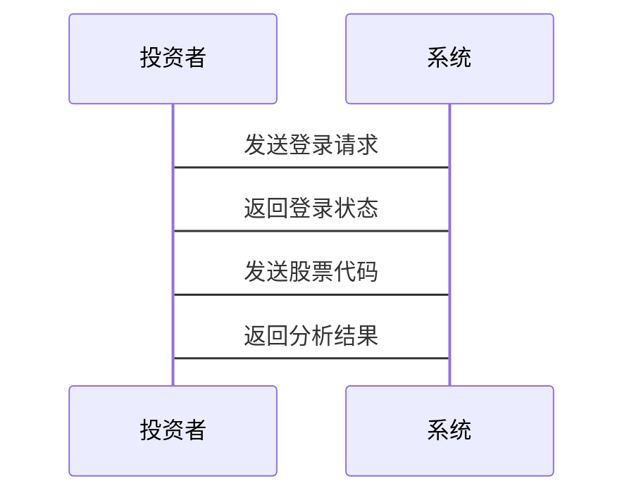

                 


# 乔尔·格林布拉特的价值投资实践指南

## 关键词：价值投资，乔尔·格林布拉特，投资策略，多因素模型，套利定价模型，投资分析，系统设计

## 摘要：
本文详细探讨了乔尔·格林布拉特的价值投资方法，从其核心理念到实际应用，结合数学模型和系统设计，为读者提供全面的实践指南。文章通过背景介绍、策略分析、算法原理、系统架构和项目实战，帮助读者理解并应用格林布拉特的投资方法，实现有效的价值投资。

---

## 第1章: 价值投资的背景与核心理念

### 1.1 价值投资的基本概念

#### 1.1.1 投资的基本定义
投资是指将资金投入某一项目或资产，期望在未来获得收益或资本增值的行为。投资的核心在于识别具有潜在增值能力的资产，并通过合理的策略进行配置。

#### 1.1.2 价值投资的起源与发展
价值投资起源于20世纪初，本杰明·格雷厄姆和戴维·多德是该领域的先驱。他们强调以低于内在价值的价格买入优质股票，以获得长期收益。格林布拉特继承并发展了这一理念，结合现代金融工具和模型，使其更加科学化和系统化。

#### 1.1.3 格林布拉特投资理念的核心要素
- **安全边际**：买入价格低于内在价值，确保投资的安全性。
- **基本面分析**：通过财务报表分析企业的真实价值。
- **长期视角**：关注企业的长期盈利能力，而非短期市场波动。

### 1.2 乔尔·格林布拉特的背景介绍

#### 1.2.1 格林布拉特的个人经历
乔尔·格林布拉特是一位知名的定量投资专家，他的投资策略结合了定量分析和基本面分析。他的投资方法在业界得到了广泛应用，并被写入多本投资书籍中。

#### 1.2.2 格林布拉特在投资领域的贡献
格林布拉特通过开发多因素模型和套利定价模型，为价值投资提供了更精确的评估方法。他的方法强调对企业内在价值的量化分析，帮助投资者做出更明智的投资决策。

#### 1.2.3 格林布拉特的价值投资方法论
格林布拉特的方法论基于以下几点：
- 通过多因素模型评估股票的内在价值。
- 利用套利定价模型调整风险溢价，确定合理的价格区间。
- 结合市场情绪和估值分析，寻找被市场低估的投资机会。

### 1.3 价值投资的核心理念

#### 1.3.1 价值投资的基本原则
价值投资的核心原则包括：
- 购买价格低于内在价值。
- 关注企业的长期盈利能力。
- 保持投资的分散性，降低风险。

#### 1.3.2 企业的内在价值评估
内在价值是企业未来现金流的现值，可以通过贴现现金流模型（DCF）进行计算。格林布拉特强调，内在价值是投资决策的基础，必须通过详细的财务分析和市场研究来确定。

#### 1.3.3 安全边际的概念与应用
安全边际是指买入价格与内在价值之间的差距。通过保持安全边际，投资者可以在市场波动中保护本金，同时抓住价值回归带来的收益。

---

## 第2章: 价值投资的核心策略与方法

### 2.1 格林布拉特的投资策略

#### 2.1.1 股票筛选标准
格林布拉特的股票筛选标准包括：
- 低市盈率（P/E）和低市净率（P/B）。
- 高股息率和稳定的股息增长。
- 强健的财务状况，包括低债务和健康的利润率。

#### 2.1.2 财务指标分析
关键的财务指标包括：
- 净利润：反映企业的盈利能力。
- 负债率：评估企业的财务健康状况。
- 现金流：衡量企业的流动性。

#### 2.1.3 市场情绪与估值分析
市场情绪可以通过分析市场的波动率和投资者情绪来判断。估值分析则通过比较当前股价与内在价值，确定是否存在低估或高估的情况。

### 2.2 格林布拉特的多因素模型

#### 2.2.1 市盈率与市净率分析
市盈率（P/E）= 股价 / 每股收益。
市净率（P/B）= 股价 / 每股净资产。
通过比较P/E和P/B与行业平均水平，可以判断股票是否被低估。

#### 2.2.2 股息率与股息增长分析
股息率 = 每股股息 / 股价。
股息增长分析通过历史股息增长率和未来股息预测，评估股息的可持续性。

#### 2.2.3 财务健康状况评估
财务健康状况评估包括：
- 净利润增长率。
- 资产负债表结构。
- 现金流量情况。

### 2.3 格林布拉特的套利定价模型

#### 2.3.1 套利定价模型的基本原理
套利定价模型（APT）认为，资产的预期收益可以通过一组因素来解释。套利定价模型的公式为：
$$ E(r_i) = r_f + \sum \beta_i (R_p - r_f) $$

其中：
- \( E(r_i) \) 是资产 \( i \) 的预期收益率。
- \( r_f \) 是无风险利率。
- \( R_p \) 是市场组合的预期收益率。
- \( \beta_i \) 是资产 \( i \) 的贝塔系数。

#### 2.3.2 市场风险溢价的计算
市场风险溢价 \( R_p - r_f \) 反映了市场整体的风险补偿。通过历史数据和市场状况，可以估算市场风险溢价。

#### 2.3.3 无风险利率与风险溢价的应用
无风险利率通常以国债收益率为基准。风险溢价用于调整资产的预期收益率，帮助投资者确定合理的价格区间。

---

## 第3章: 价值投资的数学模型与算法

### 3.1 格林布拉特投资模型的数学表达

#### 3.1.1 投资价值的公式化表达
内在价值的计算公式为：
$$ V = \sum_{t=1}^{n} \frac{CF_t}{(1 + r)^t} $$
其中：
- \( V \) 是内在价值。
- \( CF_t \) 是第 \( t \) 年的现金流。
- \( r \) 是折现率。

#### 3.1.2 市场价值与内在价值的比较
市场价值 \( P \) 与内在价值 \( V \) 的比较决定了股票是否被低估或高估。

#### 3.1.3 安全边际的数学计算
安全边际 \( M \) 计算公式：
$$ M = V - P $$

---

## 第4章: 系统分析与架构设计方案

### 4.1 问题场景介绍
构建一个基于格林布拉特模型的投资分析系统，帮助投资者快速筛选和评估股票。

### 4.2 系统功能设计

#### 4.2.1 领域模型（Mermaid类图）


### 4.3 系统架构设计（Mermaid架构图）


### 4.4 系统接口设计

#### 4.4.1 登录接口
```http
POST /login
Content-Type: application/json

{
    "username": "user",
    "password": "pass"
}
```

#### 4.4.2 股票分析接口
```http
POST /analyze
Content-Type: application/json

{
    "stock_code": "AAPL"
}
```

### 4.5 系统交互流程（Mermaid序列图）


---

## 第5章: 项目实战

### 5.1 环境安装
安装Python和必要的库：
```bash
pip install numpy pandas matplotlib
```

### 5.2 系统核心实现源代码

#### 5.2.1 数据预处理
```python
import pandas as pd
import numpy as np

# 加载数据
data = pd.read_csv('stocks.csv')

# 数据清洗
data.dropna(inplace=True)
data = data[~data['PE'].isinf()]
```

#### 5.2.2 特征选择
```python
features = ['PE', 'PB', 'ROE', 'DEBT_RATIO']
target = 'PRICE'

X = data[features].values
y = data[target].values
```

#### 5.2.3 模型训练
```python
from sklearn.linear_model import LinearRegression

model = LinearRegression()
model.fit(X, y)

# 预测
predictions = model.predict(X)
```

#### 5.2.4 模型调优
```python
from sklearn.metrics import mean_squared_error

mse = mean_squared_error(y, predictions)
print(f"均方误差: {mse}")
```

### 5.3 代码应用解读与分析
通过代码实现格林布拉特的多因素模型，对股票进行评分和排序，筛选出具有投资价值的股票。

### 5.4 实际案例分析
以苹果公司为例，分析其财务数据，计算其内在价值和市场价值，判断其是否被低估。

### 5.5 项目小结
通过项目实战，读者可以掌握如何将理论应用于实际投资决策，提升投资分析能力。

---

## 第6章: 总结与扩展阅读

### 6.1 最佳实践 Tips
- 定期复盘和调整投资组合。
- 结合市场变化及时调整投资策略。

### 6.2 小结
本文详细介绍了乔尔·格林布拉特的价值投资方法，从理论到实践，帮助读者掌握这一投资策略。

### 6.3 注意事项
- 投资有风险，需谨慎评估。
- 长期投资需保持耐心和纪律。

### 6.4 拓展阅读
- 《价值投资实战策略》
- 《投资学原理》

---

通过本文的系统讲解，读者可以全面理解并掌握乔尔·格林布拉特的价值投资方法，应用于实际投资中，实现稳健的投资收益。

