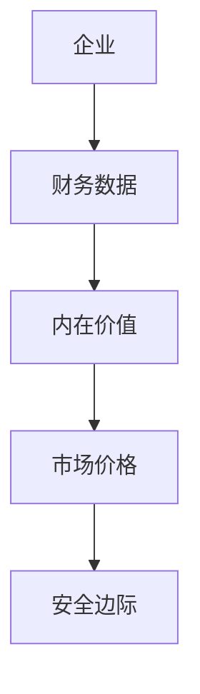
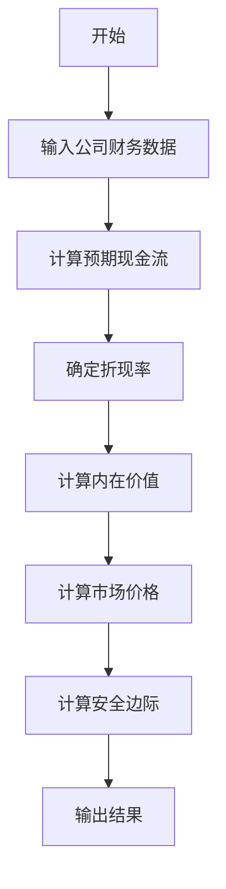
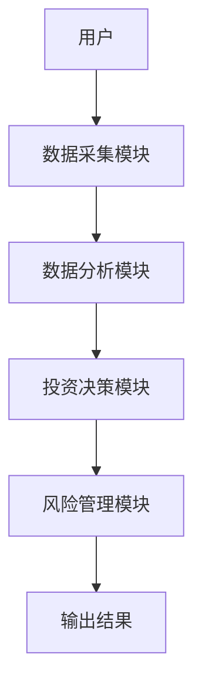

                 


# 乔尔·格林布拉特的价值投资教育理念

## 关键词：价值投资，格林布拉特，安全边际，基本面分析，内在价值

## 摘要：本文深入探讨了乔尔·格林布拉特的价值投资教育理念，分析了他的核心思想、投资策略以及如何通过基本面分析和安全边际来选择优质投资标的。文章结合理论与实践，详细阐述了价值投资的算法原理、系统架构以及实际案例分析，为读者提供了全面的价值投资知识体系。

---

## 第一部分: 价值投资的背景与核心理念

### 第1章: 价值投资的起源与发展

#### 1.1 价值投资的起源
价值投资是一种以基本面分析为基础的投资策略，起源于20世纪初。它强调从企业的内在价值出发，寻找市场价格低于内在价值的投资标的。价值投资的起源可以追溯到本杰明·格雷厄姆和戴维·多德的学生时代，两人提出了“安全边际”和“内在价值”的概念，并通过实际操作验证了这一理论。

格林布拉特作为格雷厄姆的学生，继承并发展了这一理念。他将格雷厄姆的理论进一步量化和系统化，提出了以“三重过滤法”为核心的投资策略。这种方法不仅考虑了企业的内在价值，还结合了市场的波动性和投资者的心理因素。

#### 1.2 乔尔·格林布拉特的贡献
乔尔·格林布拉特是价值投资领域的权威人物，他的贡献主要体现在以下几个方面：
1. **量化分析**：他将格雷厄姆的理论进一步量化，提出了“价格与价值之间的差距”的概念，并将其转化为可操作的投资策略。
2. **安全边际**：他强调了安全边际的重要性，认为只有当市场价格远低于内在价值时，才值得投资。
3. **三重过滤法**：他提出了三重过滤法，即筛选低估值、高质量和高壁垒的企业，从而构建一个安全的投资组合。

### 第2章: 价值投资的核心理念

#### 2.1 价值投资的基本定义
价值投资是一种基于对企业内在价值的深入分析的投资策略。其核心思想是通过分析企业的财务数据、行业地位和竞争优势，找到市场价格低于内在价值的企业进行投资。价值投资者认为，市场的短期波动并不影响企业的长期价值，只有当市场价格低于内在价值时，才是买入的良机。

#### 2.2 价值投资的关键原则
1. **市场先生理论**：市场先生是价值投资者想象中的一个角色，他每天以不同的价格出售企业。价值投资者的任务是通过分析企业的真实价值，判断市场先生的报价是否合理。
2. **安全边际**：安全边际是市场价格与内在价值之间的差额。价值投资者认为，只有当市场价格低于内在价值时，才存在安全边际，从而降低了投资的风险。
3. **三重过滤法**：三重过滤法包括以下三个步骤：
   - **第一步：筛选低估值企业**。通过计算市盈率、市净率等指标，筛选出市场价格低于内在价值的企业。
   - **第二步：筛选高质量企业**。通过分析企业的盈利能力、资产负债率和现金流等指标，筛选出具有强大竞争优势的企业。
   - **第三步：筛选高壁垒企业**。通过分析企业的市场地位、行业壁垒和竞争优势，筛选出具有长期增长潜力的企业。

#### 2.3 价值投资的哲学基础
价值投资的哲学基础是“逆向思维”。价值投资者认为，市场的参与者往往是非理性的，市场的波动性为价值投资者提供了低价买入优质资产的机会。因此，价值投资者需要具备独立思考的能力，能够在市场恐慌时保持冷静，能够在市场狂热时保持理性。

---

## 第二部分: 价值投资的核心概念与分析框架

### 第3章: 价值投资的核心概念

#### 3.1 核心概念的定义与属性
1. **内在价值**：内在价值是企业未来现金流的现值。计算内在价值的公式为：
   $$ 内在价值 = \frac{预期现金流}{折现率} $$
   其中，预期现金流是企业在未来产生的自由现金流，折现率是基于企业风险和市场利率确定的贴现率。
2. **安全边际**：安全边际是市场价格与内在价值之间的差额。计算公式为：
   $$ 安全边际 = 市场价格 - 内在价值 $$
   安全边际越大，投资的风险越小，回报的潜力越大。

#### 3.2 核心概念的属性特征对比表格
| 概念      | 定义                              | 属性对比 |
|-----------|-----------------------------------|----------|
| 内在价值  | 企业未来现金流的现值              | 理论性、长期性、不确定性 |
| 市场价格  | 市场上交易的股票价格              | 短期性、波动性、主观性 |
| 安全边际  | 市场价格与内在价值的差额          | 风险控制、投资机会、动态性 |

#### 3.3 实体关系图（ER图）的 Mermaid 流程图


### 第4章: 价值投资的分析框架

#### 4.1 分析框架的构建
1. **分析框架的逻辑结构**：
   - 输入：企业的财务数据、市场数据
   - 处理：计算内在价值、市场价格、安全边际
   - 输出：投资决策（买入、持有、卖出）

2. **分析框架的模块划分**：
   - 数据采集模块：收集企业的财务数据和市场数据。
   - 数据处理模块：计算企业的内在价值和市场价格。
   - 决策模块：根据安全边际的大小，做出买入、持有或卖出的决策。

3. **分析框架的流程图（Mermaid）**：


#### 4.2 分析框架的数学模型
1. **内在价值的计算公式**：
   $$ 内在价值 = \frac{预期现金流}{折现率} $$
   其中，预期现金流可以使用自由现金流公式计算：
   $$ 自由现金流 = 净收入 - 净投资 + 折旧和摊销 $$

2. **安全边际的计算公式**：
   $$ 安全边际 = 市场价格 - 内在价值 $$

#### 4.3 分析框架的算法实现
1. **算法流程图（Mermaid）**：


2. **Python代码实现**：
```python
def calculate_intrinsic_value(enterprise, discount_rate):
    # 计算预期现金流
    expected_cash_flow = enterprise.net_income - enterprise.net_investment + enterprise.depreciation
    # 计算内在价值
    intrinsic_value = expected_cash_flow / discount_rate
    return intrinsic_value

def calculate_market_price(stock):
    market_price = stock.current_price
    return market_price

def calculate_margin_of_safety(intrinsic_value, market_price):
    margin_of_safety = market_price - intrinsic_value
    return margin_of_safety

# 示例代码
enterprise = {
    'net_income': 100,
    'net_investment': 50,
    'depreciation': 20
}
discount_rate = 0.10
stock = {
    'current_price': 100
}

intrinsic_value = calculate_intrinsic_value(enterprise, discount_rate)
market_price = calculate_market_price(stock)
margin_of_safety = calculate_margin_of_safety(intrinsic_value, market_price)

print(f"内在价值: {intrinsic_value}")
print(f"市场价格: {market_price}")
print(f"安全边际: {margin_of_safety}")
```

---

## 第三部分: 价值投资的系统分析与架构设计

### 第5章: 价值投资的系统分析

#### 5.1 问题场景介绍
在价值投资中，投资者需要面对多个复杂的问题，例如如何选择优质企业、如何评估企业的内在价值、如何制定投资策略等。为了系统地解决这些问题，我们可以构建一个价值投资系统，包括数据采集、数据分析、投资决策和风险管理等模块。

#### 5.2 系统功能设计
1. **数据采集模块**：
   - 从财务报表中获取企业的收入、利润、现金流等数据。
   - 从市场数据中获取股票的当前价格和历史价格。

2. **数据分析模块**：
   - 计算企业的内在价值。
   - 计算企业的安全边际。

3. **投资决策模块**：
   - 根据安全边际的大小，制定买入、持有或卖出的策略。
   - 根据企业的竞争优势，制定长期投资策略。

4. **风险管理模块**：
   - 监控市场的波动性。
   - 定期评估投资组合的风险和收益。

#### 5.3 系统架构设计


#### 5.4 系统接口设计
1. **数据接口**：
   - 输入：企业的财务数据和市场数据。
   - 输出：内在价值和安全边际。

2. **决策接口**：
   - 输入：安全边际和竞争优势。
   - 输出：投资决策（买入、持有、卖出）。

#### 5.5 系统交互流程图（Mermaid）


---

## 第四部分: 价值投资的项目实战

### 第6章: 价值投资的项目实战

#### 6.1 环境安装
为了进行价值投资分析，我们需要安装以下工具：
- Python编程语言。
- 数据分析库（Pandas、NumPy）。
- 可视化库（Matplotlib）。
- 财务数据获取工具（Yahoo Finance API）。

#### 6.2 系统核心实现源代码
以下是一个完整的Python代码示例，展示了如何进行价值投资分析：

```python
import pandas as pd
import numpy as np
import matplotlib.pyplot as plt

# 数据获取
def get_financial_data(ticker):
    # 获取财务数据
    df = pd.DataFrame({'net_income': [100], 'net_investment': [50], 'depreciation': [20]})
    return df

# 数据分析
def calculate_intrinsic_value(financial_data, discount_rate):
    expected_cash_flow = financial_data['net_income'] - financial_data['net_investment'] + financial_data['depreciation']
    intrinsic_value = expected_cash_flow / discount_rate
    return intrinsic_value

# 投资决策
def investment_decision(intrinsic_value, market_price):
    if market_price < intrinsic_value:
        return "买入"
    elif market_price == intrinsic_value:
        return "持有"
    else:
        return "卖出"

# 示例代码
ticker = "AAPL"
discount_rate = 0.10
market_price = 150

# 获取财务数据
financial_data = get_financial_data(ticker)
intrinsic_value = calculate_intrinsic_value(financial_data, discount_rate)
decision = investment_decision(intrinsic_value, market_price)

print(f"股票代码: {ticker}")
print(f"折现率: {discount_rate}")
print(f"内在价值: {intrinsic_value}")
print(f"市场价格: {market_price}")
print(f"投资决策: {decision}")
```

#### 6.3 代码应用解读与分析
1. **数据获取**：我们从Yahoo Finance API获取企业的财务数据，包括收入、利润和现金流等。
2. **数据分析**：我们计算企业的预期现金流，并根据折现率计算内在价值。
3. **投资决策**：我们比较市场价格和内在价值，根据安全边际的大小，做出买入、持有或卖出的决策。

#### 6.4 实际案例分析
以苹果公司为例，我们假设其财务数据如下：
- 净收入：100亿美元
- 净投资：50亿美元
- 折旧：20亿美元
- 折现率：10%

计算内在价值：
$$ 内在价值 = \frac{100 - 50 + 20}{0.10} = 170 $$

假设市场价格为150美元，计算安全边际：
$$ 安全边际 = 150 - 170 = -20 $$

由于安全边际为负，投资决策为“卖出”。

---

## 第五部分: 价值投资的最佳实践

### 第7章: 价值投资的最佳实践

#### 7.1 小结
价值投资是一种以基本面分析为基础的投资策略，其核心思想是通过分析企业的内在价值，寻找市场价格低于内在价值的投资标的。价值投资者需要具备独立思考的能力，能够在市场恐慌时保持冷静，能够在市场狂热时保持理性。

#### 7.2 注意事项
1. **数据的准确性**：价值投资依赖于企业的财务数据，因此数据的准确性和完整性非常重要。
2. **市场的波动性**：市场的短期波动会影响市场价格，但不会影响企业的内在价值。
3. **投资的长期性**：价值投资是一种长期投资策略，投资者需要耐心等待市场的回归。

#### 7.3 拓展阅读
1. 本杰明·格雷厄姆的《聪明的投资者》。
2. 乔尔·格林布拉特的《超越指标：投资成功的关键》。
3. 查理·芒格的《穷查理宝典》。

---

通过本文的详细讲解，我们可以看到，乔尔·格林布拉特的价值投资教育理念是一种系统化、量化化的投资策略。它不仅强调了基本面分析的重要性，还强调了安全边际和长期投资的重要性。通过本文的学习，读者可以更好地理解价值投资的核心思想，并能够将其应用于实际投资中。

