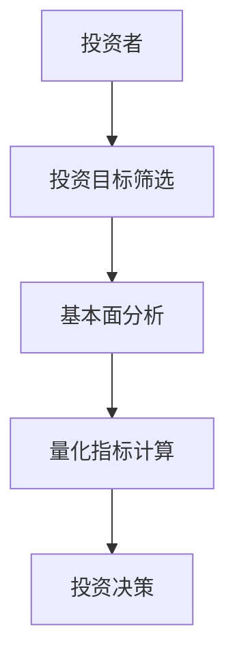
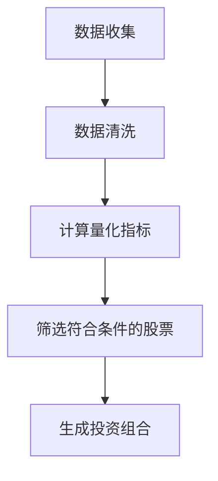
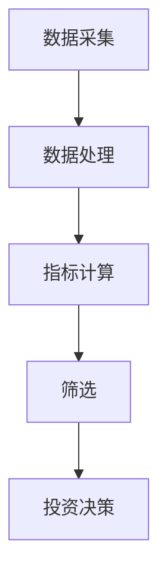

                 


# 《乔尔·格林布拉特的价值投资量化模型》

## 关键词：价值投资、量化模型、格林布拉特、投资策略、金融分析、Python代码

## 摘要：  
本文深入剖析了乔尔·格林布拉特的价值投资量化模型，从其背景、核心概念到算法原理、系统架构，再到项目实战，全面解读了该模型的理论基础和实际应用。文章通过详细的分析和丰富的案例，揭示了如何将价值投资的理念与量化方法相结合，为投资者提供了一套科学的投资决策工具。

---

## 第一部分: 背景介绍

### 第1章: 价值投资的基本概念

#### 1.1 价值投资的定义与核心思想
价值投资是一种以基本面分析为基础的投资策略，强调以低于内在价值的价格购买优质资产。其核心思想是通过分析公司的财务状况、行业地位和竞争优势，寻找被市场低估的投资标的。

#### 1.2 量化模型的基本概念
量化模型是通过数学公式和算法，将复杂的投资策略转化为可执行的计算机程序。量化模型的优势在于其高效性、可重复性和可扩展性，能够帮助投资者快速捕捉市场机会。

---

### 第2章: 乔尔·格林布拉特投资模型的背景

#### 2.1 乔尔·格林布拉特的生平与投资理念
乔尔·格林布拉特是美国著名投资家，他的投资理念以“基本面分析”和“量化筛选”为核心。他认为，市场波动性为投资者提供了以折扣价买入优质资产的机会。

#### 2.2 价值投资量化模型的发展历程
传统的价值投资依赖人工分析，耗时且主观性强。格林布拉特将价值投资的理念量化，通过筛选指标和数学模型，帮助投资者快速识别低估资产。

---

## 第二部分: 核心概念与模型构建

### 第3章: 核心概念与属性对比

#### 3.1 核心概念的定义与特征
格林布拉特模型的核心概念包括：
- **市盈率（P/E）**：衡量股价与盈利的关系。
- **市净率（P/B）**：衡量股价与资产价值的关系。
- **股息率**：衡量股票的分红能力。

#### 3.2 核心概念的对比分析（表格形式）
| 指标名称 | 定义 | 作用 | 示例 |
|----------|------|------|------|
| 市盈率   | 价格/每股收益 | 评估股票的估值水平 | P/E < 市场平均值，表示低估 |
| 市净率   | 价格/每股净资产 | 评估资产的重估价值 | P/B < 1，表示资产被低估 |
| 股息率   | 每股股息/股价 | 评估分红能力 | 高股息率，提供稳定的现金流 |

#### 3.3 实体关系图（Mermaid流程图）


---

### 第4章: 模型的数学基础

#### 4.1 核心公式与数学模型
格林布拉特模型的核心公式包括：
$$
\text{目标价} = \text{每股收益} \times \text{合理市盈率}
$$
$$
\text{安全边际} = \text{目标价} - \text{当前股价}
$$

#### 4.2 公式推导与解释
- **目标价计算**：基于公司的盈利能力和市场合理的市盈率倍数，计算出股票的理论价值。
- **安全边际计算**：通过比较目标价与当前股价，判断投资的安全性。

#### 4.3 实际应用案例
假设某公司每股收益为2元，市场合理市盈率为15倍，则目标价为：
$$
\text{目标价} = 2 \times 15 = 30 \text{元}
$$
如果当前股价为25元，则安全边际为：
$$
\text{安全边际} = 30 - 25 = 5 \text{元}
$$
这表明该股票具有5元的安全边际，值得买入。

---

## 第三部分: 算法原理与系统架构

### 第5章: 算法原理

#### 5.1 算法流程与步骤


#### 5.2 算法实现的Python代码
```python
import pandas as pd

# 数据清洗
data = pd.read_csv('stock_data.csv')
data = data.dropna()

# 计算量化指标
data['pe'] = data['price'] / data['eps']
data['pb'] = data['price'] / data['book_value']

# 筛选符合条件的股票
data = data[(data['pe'] < data['pe'].mean()) & 
            (data['pb'] < data['pb'].mean())]
```

#### 5.3 算法的数学模型与公式
- **市盈率计算**：$$\text{pe} = \frac{\text{price}}{\text{eps}}$$
- **市净率计算**：$$\text{pb} = \frac{\text{price}}{\text{book\_value}}$$
- **筛选条件**：$$\text{pe} < \text{pe\_mean} \quad \text{且} \quad \text{pb} < \text{pb\_mean}$$

---

### 第6章: 系统架构设计

#### 6.1 系统功能设计
- **数据采集模块**：从数据库或API获取股票数据。
- **数据处理模块**：清洗和计算量化指标。
- **筛选模块**：根据指标筛选出符合条件的股票。
- **决策模块**：生成投资组合并输出结果。

#### 6.2 系统架构图（Mermaid架构图）


#### 6.3 系统接口设计
- **输入接口**：股票数据文件或API接口。
- **输出接口**：符合条件的股票列表和投资组合建议。

---

## 第四部分: 项目实战与案例分析

### 第7章: 项目实战

#### 7.1 环境安装与配置
安装必要的Python库：
```bash
pip install pandas numpy matplotlib
```

#### 7.2 核心代码实现
```python
import pandas as pd
import numpy as np

# 数据加载
data = pd.read_csv('stocks.csv')

# 市盈率计算
data['pe'] = data['price'] / data['eps']

# 市净率计算
data['pb'] = data['price'] / data['book_value']

# 筛选符合条件的股票
selected_stocks = data[(data['pe'] < data['pe'].mean()) & 
                        (data['pb'] < data['pb'].mean())]

# 输出结果
print(selected_stocks)
```

#### 7.3 案例分析
假设我们有以下数据：
| 公司名称 | 价格 | EPS | PB |
|----------|------|-----|----|
| A公司    | 20   | 2   | 2.5|
| B公司    | 25   | 3   | 1.5|

计算后：
- A公司：$$\text{pe} = 10, \text{pb} = 2.5$$
- B公司：$$\text{pe} = 8.33, \text{pb} = 0.83$$

假设市场平均pe为15，平均pb为2，则：
- A公司：pe < 15，pb < 2 → 符合条件。
- B公司：pe < 15，pb < 2 → 符合条件。

最终筛选出A公司和B公司作为投资标的。

---

## 第五部分: 总结与展望

### 第8章: 总结与展望

#### 8.1 模型优缺点
- **优点**：量化筛选提高了效率，减少了人为干扰。
- **缺点**：模型依赖历史数据，无法预测黑天鹅事件。

#### 8.2 改进建议
- 引入更多的量化指标，如ROE（净资产收益率）。
- 结合机器学习算法，提升模型的预测能力。

#### 8.3 小结
通过格林布拉特模型，投资者可以更科学地进行价值投资，但需要结合市场实际情况不断优化模型。

---

## 第六部分: 最佳实践与注意事项

### 第9章: 最佳实践 tips

#### 9.1 小结
- 价值投资量化模型是一种有效的投资工具。
- 投资者需要结合市场变化不断优化模型。

#### 9.2 注意事项
- 数据质量是模型的关键，需确保数据的准确性和完整性。
- 模型仅提供参考，投资需谨慎。

---

## 参考文献与拓展阅读
1. 《The New Bernstein Book on Investing》
2. Python官方文档
3. Pandas官方文档

---

通过以上结构，文章详细讲解了乔尔·格林布拉特的价值投资量化模型，从理论到实践，帮助读者全面理解并应用该模型。

